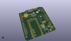
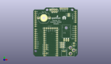
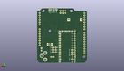
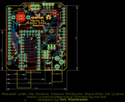
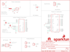

Contents
========

* [PRS13288 > Sparkfun](#prs13288--sparkfun)
	* [Images](#images)
	* [Tags](#tags)
  
![][im]
# PRS13288 > Sparkfun

- ID: PROJ-SPAR-13288-STAN-01
- Hex ID: PRS13288
- Name: Sparkfun
- Description: Sparkfun

## Images
  
  

|kicadPcb3d|kicadPcb3dFront|kicadPcb3dBack|eagleImage|eagleSchemImage|
| :---: | :---: | :---: | :---: | :---: |
||||||

## Tags

- hexID: PRS13288
- oompType: PROJ
- oompSize: SPAR
- oompColor: 13288
- oompDesc: STAN
- oompIndex: 01
- oompName: Teensy Arduino Shield Adapter
- sources: All source files from https://github.com/sparkfun/Teensy_Arduino_Shield_Adapter (source licence details in srcLicense.md)
- linkBuyPage: https://www.sparkfun.com/products/13288
- oompID: PROJ-SPAR-13288-STAN-01
- oompParts: BAT1,UNMATCHED-UNMATCHED-UNMATCHED-UNMATCHED-UNMATCHED
- oompParts: C1,UNMATCHED-UNMATCHED-UNMATCHED-UNMATCHED-UNMATCHED
- oompParts: FRAME1,UNMATCHED-UNMATCHED-UNMATCHED-UNMATCHED-UNMATCHED
- oompParts: JP1,UNMATCHED-UNMATCHED-UNMATCHED-UNMATCHED-UNMATCHED
- oompParts: JP2,UNMATCHED-UNMATCHED-UNMATCHED-UNMATCHED-UNMATCHED
- oompParts: JP3,UNMATCHED-UNMATCHED-UNMATCHED-UNMATCHED-UNMATCHED
- oompParts: JP4,UNMATCHED-UNMATCHED-UNMATCHED-UNMATCHED-UNMATCHED
- oompParts: JP6,UNMATCHED-UNMATCHED-UNMATCHED-UNMATCHED-UNMATCHED
- oompParts: JP7,UNMATCHED-UNMATCHED-UNMATCHED-UNMATCHED-UNMATCHED
- oompParts: JP8,UNMATCHED-UNMATCHED-UNMATCHED-UNMATCHED-UNMATCHED
- oompParts: JP9,UNMATCHED-UNMATCHED-UNMATCHED-UNMATCHED-UNMATCHED
- oompParts: JP10,UNMATCHED-UNMATCHED-UNMATCHED-UNMATCHED-UNMATCHED
- oompParts: JP11,UNMATCHED-UNMATCHED-UNMATCHED-UNMATCHED-UNMATCHED
- oompParts: LOGO1,UNMATCHED-UNMATCHED-UNMATCHED-UNMATCHED-UNMATCHED
- oompParts: LOGO2,UNMATCHED-UNMATCHED-UNMATCHED-UNMATCHED-UNMATCHED
- oompParts: SJ1,UNMATCHED-UNMATCHED-UNMATCHED-UNMATCHED-UNMATCHED
- oompParts: SJ2,UNMATCHED-UNMATCHED-UNMATCHED-UNMATCHED-UNMATCHED
- oompParts: U1,UNMATCHED-UNMATCHED-UNMATCHED-UNMATCHED-UNMATCHED
- rawParts: BAT1,CoinCell,BATTERY12PTH,BATTCON_12MM_PTH,Battery Holders,,BATT-08315,,,,
- rawParts: C1,10uF,10UF-25V-20%(PTH),CPOL-RADIAL-10UF-25V,CAP-08440,,CAP-08440,,,,
- rawParts: FRAME1,FRAME-LETTER,FRAME-LETTER,CREATIVE_COMMONS,Schematic Frame - Letter,,,,,,
- rawParts: JP1,,M02PTH,1X02,Standard 2-pin 0.1 header. Use with,,,,,,
- rawParts: JP2,POWER_JACKPTH_LOCK,POWER_JACKPTH_LOCK,POWER_JACK_PTH_LOCK,Power Jack,,CONN-08197,,PRT-00119,,
- rawParts: JP3,JST2,M02JST-PTH-2,JST-2-PTH,Standard 2-pin 0.1 header. Use with,,CONN-09863,,,PRT-09914,
- rawParts: JP4,,JUMPER-SMT_2_NO_SILK,SMT-JUMPER_2_NO_SILK,Normally open jumper,,,,,,
- rawParts: JP6,,M02PTH,1X02,Standard 2-pin 0.1 header. Use with,,,,,,
- rawParts: JP7,,M02PTH,1X02,Standard 2-pin 0.1 header. Use with,,,,,,
- rawParts: JP8,,M04PTH,1X04,Header 4,,,,,,
- rawParts: JP9,AVR_SPI_PRG_6PTH,AVR_SPI_PRG_6PTH,2X3,AVR ISP 6 Pin,,,,,,
- rawParts: JP10,ARDUINO_R3_SHIELDUNO_R3_SHIELD_HOLES,ARDUINO_R3_SHIELDUNO_R3_SHIELD_HOLES,UNO_R3_SHIELD_HOLES,Shield form compatible with the Arduino Uno R3.,,,,,,
- rawParts: JP11,TEENSY-3.1SILK,TEENSY-3.1SILK,TEENSY-3.1,,,,,DEV-12646,,
- rawParts: LOGO1,SFE_LOGO_NAME_FLAME.1_INCH,SFE_LOGO_NAME_FLAME.1_INCH,SFE_LOGO_NAME_FLAME_.1,SFE Logo, name and flame,,,,,,
- rawParts: LOGO2,OSHW-LOGOM,OSHW-LOGOM,OSHW-LOGO-M,Open Source Hardware Logo,,,,,,
- rawParts: SJ1,JUMPER-PAD-3-2OF3_NC_BY_TRACE_SMALL,JUMPER-PAD-3-2OF3_NC_BY_TRACE_SMALL,PAD-JUMPER-3-2OF3_NC_BY_TRACE_YES_SILK_FULL_BOX,,,,,,,
- rawParts: SJ2,JUMPER-PAD-3-2OF3_NC_BY_TRACE_SMALL,JUMPER-PAD-3-2OF3_NC_BY_TRACE_SMALL,PAD-JUMPER-3-2OF3_NC_BY_TRACE_YES_SILK_FULL_BOX,,,,,,,
- rawParts: U1,5V,V_REG_78XX-TO-220,TO-220-ALT,Voltage Regulator,,VREG-08450,,COM-00107,,

[im]: kicadPcb3d_450.png
