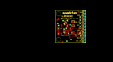
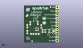
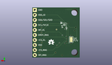
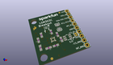

Contents
========

* [PROJ-SPAR-13303-STAN-01>LSM303C 6 DOF IMU Breakout](#proj-spar-13303-stan-01lsm303c-6-dof-imu-breakout)
	* [Images](#images)
	* [Interactive BOM](#interactive-bom)
	* [OOMP Parts](#oomp-parts)
	* [Tags](#tags)
  
![][im]
# PROJ-SPAR-13303-STAN-01>LSM303C 6 DOF IMU Breakout

- ID: PROJ-SPAR-13303-STAN-01
- Hex ID: PRS13303
- Name: LSM303C 6 DOF IMU Breakout
- Description: 

## Images
  
  

|eagleImage|kicadPcb3dFront|kicadPcb3dBack|kicadPcb3d|
| :---: | :---: | :---: | :---: |
|||||

## Interactive BOM

- Interactive BOM page: [ibom.html](kicad/bom/ibom.html)

## OOMP Parts
  

|OOMP Parts|
| :---: |
|CAPE-UNMATCHED-X-UNMATCHED-01, C1, 13.843, 14.985999999999999, 270,C1, 10uF, EIA3216, SparkFun, (0.545, 0.59), R270|
|CAPE-0603-X-NF100-01, C2, 11.811, 11.049, 90,C2, 0.1uF, 0603-CAP, SparkFun-Capacitors, (0.465, 0.435), R90|
|CAPE-0603-X-NF100-01, C3, 9.398, 13.462, 90,C3, 0.1uF, 0603-CAP, SparkFun-Capacitors, (0.37, 0.53), R90|
|CAPE-0603-X-NF100-01, C4, 9.143999999999998, 5.842, 180,C4, 0.1uF, 0603-CAP, SparkFun-Capacitors, (0.36, 0.23), R180|
|UNMATCHED-UNMATCHED-X-UNMATCHED-01, JP1, 22.605999999999998, 24.13, 270,JP1, 1X04, SparkFun-Connectors, (0.89, 0.95), R270|
|UNMATCHED-UNMATCHED-X-UNMATCHED-01, JP2, 22.605999999999998, 13.97, 270,JP2, 1X06, SparkFun-Connectors, (0.89, 0.55), R270|
|RESE-0603-X-UNMATCHED-01, R1, 12.649199999999999, 7.874, 90,R1, 68, 0603-RES, SparkFun-Passives, (0.498, 0.31), R90|
|RESE-0603-X-UNMATCHED-01, R2, 4.3180000000000005, 13.334999999999999, 270,R2, 4.7K, 0603-RES, SparkFun-Resistors, (0.17, 0.525), R270|
|<table><tr><td></td><td> R3</td><td>[RESE-0603-X-O103-01 SMD (0603) 10k Ohm Resistor](https://github.com/oomlout/oomlout_OOMP_parts/tree/main/RESE-0603-X-O103-01/)</td><td>[R6103](https://github.com/oomlout/oomlout_OOMP_parts/tree/main/RESE-0603-X-O103-01/)</td></tr></table>|
|<table><tr><td></td><td> R4</td><td>[RESE-0603-X-O103-01 SMD (0603) 10k Ohm Resistor](https://github.com/oomlout/oomlout_OOMP_parts/tree/main/RESE-0603-X-O103-01/)</td><td>[R6103](https://github.com/oomlout/oomlout_OOMP_parts/tree/main/RESE-0603-X-O103-01/)</td></tr></table>|
|RESE-0603-X-UNMATCHED-01, R5, 5.715, 5.842, 180,R5, 4.7K, 0603-RES, SparkFun-Resistors, (0.225, 0.23), R180|
|UNMATCHED-UNMATCHED-X-UNMATCHED-01, SJ1, 4.3180000000000005, 9.143999999999998, M90,SJ1, PAD-JUMPER-3-3OF3_NC_BY_TRACE_YES_SILK_FULL_BOX, SparkFun-Passives, (0.17, 0.36), MR90|
|UNMATCHED-UNMATCHED-X-UNMATCHED-01, SJ2, 20.4216, 8.001, 270,SJ2, JUMPER-PAD-2-NC_BY_TRACE, PAD-JUMPER-2-NC_BY_TRACE_YES_SILK, SparkFun-Passives, (0.804, 0.315), R270|
|UNMATCHED-UNMATCHED-X-UNMATCHED-01, TP1, 11.684, 14.224, 0,TP1, VDD_TP, TP_15TH, SparkFun-Passives, (0.46, 0.56), R0|
|UNMATCHED-UNMATCHED-X-UNMATCHED-01, U1, 8.889999999999999, 9.143999999999998, 0,U1, LSM303C, LGA-12, SparkFun-DigitalIC, (0.35, 0.36), R0|
|UNMATCHED-UNMATCHED-X-UNMATCHED-01, U2, 15.875, 7.874, 90,U2, LM3880, SOT23-6, SparkFun-DigitalIC, (0.625, 0.31), R90|

## Tags

- hexID: PRS13303
- oompType: PROJ
- oompSize: SPAR
- oompColor: 13303
- oompDesc: STAN
- oompIndex: 01
- oompName: LSM303C 6 DOF IMU Breakout
- sources: All source files from https://github.com/sparkfun/LSM303C_6_DOF_IMU_Breakout (source licence details in srcLicense.md)
- linkBuyPage: https://www.sparkfun.com/products/13303
- oompPart: CAPE-UNMATCHED-X-UNMATCHED-01, C1, 13.843, 14.985999999999999, 270
- oompPart: CAPE-0603-X-NF100-01, C2, 11.811, 11.049, 90
- oompPart: CAPE-0603-X-NF100-01, C3, 9.398, 13.462, 90
- oompPart: CAPE-0603-X-NF100-01, C4, 9.143999999999998, 5.842, 180
- oompPart: SKIP-UNMATCHED-X-UNMATCHED-01, FID1, 18.034, 24.383999999999997, 0
- oompPart: SKIP-UNMATCHED-X-UNMATCHED-01, FID2, 5.588, 0.8636, 0
- oompPart: UNMATCHED-UNMATCHED-X-UNMATCHED-01, JP1, 22.605999999999998, 24.13, 270
- oompPart: UNMATCHED-UNMATCHED-X-UNMATCHED-01, JP2, 22.605999999999998, 13.97, 270
- oompPart: RESE-0603-X-UNMATCHED-01, R1, 12.649199999999999, 7.874, 90
- oompPart: RESE-0603-X-UNMATCHED-01, R2, 4.3180000000000005, 13.334999999999999, 270
- oompPart: RESE-0603-X-O103-01, R3, 2.2859999999999996, 11.176, 90
- oompPart: RESE-0603-X-O103-01, R4, 2.2859999999999996, 7.112, 270
- oompPart: RESE-0603-X-UNMATCHED-01, R5, 5.715, 5.842, 180
- oompPart: UNMATCHED-UNMATCHED-X-UNMATCHED-01, SJ1, 4.3180000000000005, 9.143999999999998, M90
- oompPart: UNMATCHED-UNMATCHED-X-UNMATCHED-01, SJ2, 20.4216, 8.001, 270
- oompPart: UNMATCHED-UNMATCHED-X-UNMATCHED-01, TP1, 11.684, 14.224, 0
- oompPart: UNMATCHED-UNMATCHED-X-UNMATCHED-01, U1, 8.889999999999999, 9.143999999999998, 0
- oompPart: UNMATCHED-UNMATCHED-X-UNMATCHED-01, U2, 15.875, 7.874, 90
- rawPart: C1, 10uF, EIA3216, SparkFun, (0.545, 0.59), R270
- rawPart: C2, 0.1uF, 0603-CAP, SparkFun-Capacitors, (0.465, 0.435), R90
- rawPart: C3, 0.1uF, 0603-CAP, SparkFun-Capacitors, (0.37, 0.53), R90
- rawPart: C4, 0.1uF, 0603-CAP, SparkFun-Capacitors, (0.36, 0.23), R180
- rawPart: FID1, FIDUCIAL1X2, FIDUCIAL-1X2, SparkFun, (0.71, 0.96), R0
- rawPart: FID2, FIDUCIAL1X2, FIDUCIAL-1X2, SparkFun, (0.22, 0.034), R0
- rawPart: JP1, 1X04, SparkFun-Connectors, (0.89, 0.95), R270
- rawPart: JP2, 1X06, SparkFun-Connectors, (0.89, 0.55), R270
- rawPart: R1, 68, 0603-RES, SparkFun-Passives, (0.498, 0.31), R90
- rawPart: R2, 4.7K, 0603-RES, SparkFun-Resistors, (0.17, 0.525), R270
- rawPart: R3, 10K, 0603-RES, SparkFun-Resistors, (0.09, 0.44), R90
- rawPart: R4, 10K, 0603-RES, SparkFun-Resistors, (0.09, 0.28), R270
- rawPart: R5, 4.7K, 0603-RES, SparkFun-Resistors, (0.225, 0.23), R180
- rawPart: SJ1, PAD-JUMPER-3-3OF3_NC_BY_TRACE_YES_SILK_FULL_BOX, SparkFun-Passives, (0.17, 0.36), MR90
- rawPart: SJ2, JUMPER-PAD-2-NC_BY_TRACE, PAD-JUMPER-2-NC_BY_TRACE_YES_SILK, SparkFun-Passives, (0.804, 0.315), R270
- rawPart: TP1, VDD_TP, TP_15TH, SparkFun-Passives, (0.46, 0.56), R0
- rawPart: U1, LSM303C, LGA-12, SparkFun-DigitalIC, (0.35, 0.36), R0
- rawPart: U2, LM3880, SOT23-6, SparkFun-DigitalIC, (0.625, 0.31), R90

[im]: kicadPcb3d_450.png
