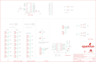

Contents
========

* [PRS13310 > Sparkfun](#prs13310--sparkfun)
	* [Schematic](#schematic)
	* [Interactive BOM](#interactive-bom)
	* [OOMP Parts](#oomp-parts)
	* [Images](#images)
	* [Tags](#tags)
  
![][im]
# PRS13310 > Sparkfun

- ID: PROJ-SPAR-13310-STAN-01
- Hex ID: PRS13310
- Name: Sparkfun
- Description: Sparkfun
- Long Link: [http://oom.lt/PROJ-SPAR-13310-STAN-01](http://oom.lt/PROJ-SPAR-13310-STAN-01)
- Short Link: [http://oom.lt/PRS13310](http://oom.lt/PRS13310)

## Schematic
  

## Interactive BOM

- Interactive BOM page: [ibom.html](https://htmlpreview.github.io/?https://github.com/oomlout/oomlout_OOMP_projects/blob/main/PROJ-SPAR-13310-STAN-01/kicad/bom/ibom.html)

## OOMP Parts
  

|OOMP Parts|
| :---: |
|C1,CAPC-0603-X-NF100-V50,C1,0.1uF,0.1UF-25V-5%(0603),0603-CAP,CAP-08604,CAP-08604,0.1uF,|
|C2,CAPC-0603-X-NF100-V50,C2,0.1uF,0.1UF-25V-5%(0603),0603-CAP,CAP-08604,CAP-08604,0.1uF,|
|C4,CAPX-UNMATCHED-X-UNMATCHED-01,C4,10uf , 20V,10UF-20V-10%(TANT),EIA3528,CAP-08063,CAP-08063,10uF,|
|F1,UNMATCHED-1206-X-UNMATCHED-01,F1,,PTCSMD,PTC-1206,Resettable Fuse PTC,RES-11150,,|
|F2,UNMATCHED-1206-X-UNMATCHED-01,F2,,PTCSMD,PTC-1206,Resettable Fuse PTC,RES-11150,,|
|JP0,HEAD-I01-X-PI03-01,FID1,FIDUCIAL1X2,FIDUCIAL1X2,FIDUCIAL-1X2,Fiducial Alignment Points,,,|
|JP1,HEAD-I01-X-PI03-01,FID2,FIDUCIAL1X2,FIDUCIAL1X2,FIDUCIAL-1X2,Fiducial Alignment Points,,,|
|JP2,HEAD-I01-X-PI03-01,FRAME2,FRAME-LEDGER,FRAME-LEDGER,CREATIVE_COMMONS,Schematic Frame,,,|
|JP3,HEAD-I01-X-PI03-01,JP0,D0,M03LOCK,1X03_LOCK,Header 3,,,|
|JP4,HEAD-I01-X-PI03-01,JP1,D1,M03LOCK,1X03_LOCK,Header 3,,,|
|JP5,HEAD-I01-X-PI03-01,JP2,D2,M03LOCK,1X03_LOCK,Header 3,,,|
|JP6,HEAD-I01-X-PI03-01,JP3,D3,M03LOCK,1X03_LOCK,Header 3,,,|
|JP7,HEAD-I01-X-PI03-01,JP4,D4,M03LOCK,1X03_LOCK,Header 3,,,|
|JP8,HEAD-I01-X-PI03-01,JP5,D5,M03LOCK,1X03_LOCK,Header 3,,,|
|JP9,HEAD-I01-X-PI03-01,JP6,D6,M03LOCK,1X03_LOCK,Header 3,,,|
|JP10,HEAD-I01-X-PI03-01,JP7,D7,M03LOCK,1X03_LOCK,Header 3,,,|
|JP11,HEAD-I01-X-PI03-01,JP8,D8,M03LOCK,1X03_LOCK,Header 3,,,|
|JP12,HEAD-I01-X-PI03-01,JP9,D9,M03LOCK,1X03_LOCK,Header 3,,,|
|JP13,HEAD-I01-X-PI03-01,JP10,D10,M03LOCK,1X03_LOCK,Header 3,,,|
|JP14,HEAD-I01-X-PI03-01,JP11,D11,M03LOCK,1X03_LOCK,Header 3,,,|
|JP15,HEAD-I01-X-PI03-01,JP12,D12,M03LOCK,1X03_LOCK,Header 3,,,|
|JP16,HEAD-I01-X-PI03-01,JP13,D13,M03LOCK,1X03_LOCK,Header 3,,,|
|JP17,HEAD-I01-X-PI03-01,JP14,A0,M03LOCK,1X03_LOCK,Header 3,,,|
|JP18,HEAD-I01-X-PI03-01,JP15,A1,M03LOCK,1X03_LOCK,Header 3,,,|
|JP19,HEAD-I01-X-PI03-01,JP16,A2,M03LOCK,1X03_LOCK,Header 3,,,|
|JP20,HEAD-I01-X-PI04-01,JP17,A3,M03LOCK,1X03_LOCK,Header 3,,,|
|JP21,HEAD-I01-X-PI04-01,JP18,A4,M03LOCK,1X03_LOCK,Header 3,,,|
|JP22,HEAD-I01-X-PI04-01,JP19,A5,M03LOCK,1X03_LOCK,Header 3,,,|
|JP23,HEAD-I01-X-PI04-01,JP20,,M04PTH,1X04,Header 4,,,|
|LED1,LEDS-0603-G-STAN-01,JP21,,M04PTH,1X04,Header 4,,,|
|LED2,LEDS-0603-G-STAN-01,JP22,,M04LOCK,1X04_LOCK,Header 4,,,|
|LED3,LEDS-0603-G-STAN-01,JP23,,M04LOCK,1X04_LOCK,Header 4,,,|
|LED4,LEDS-0603-G-STAN-01,LED1,Yellow,LED-YELLOW0603,LED-0603,Yellow SMD LEDs,DIO-09003,Yellow,|
|LED5,LEDS-0603-G-STAN-01,LED2,Yellow,LED-YELLOW0603,LED-0603,Yellow SMD LEDs,DIO-09003,Yellow,|
|R1,RESE-0603-X-O102-01,LED3,BLUE,LED-BLUE0603,LED-0603,Blue LEDs for production use,DIO-08575,BLUE,|
|R2,RESE-0603-X-O102-01,LED4,BLUE,LED-BLUE0603,LED-0603,Blue LEDs for production use,DIO-08575,BLUE,|
|R3,RESE-0603-X-O102-01,LED5,BLUE,LED-BLUE0603,LED-0603,Blue LEDs for production use,DIO-08575,BLUE,|
|R4,RESE-0603-X-O102-01,LOGO1,OSHW-LOGOM,OSHW-LOGOM,OSHW-LOGO-M,Open Source Hardware Logo,,,|
|R5,RESE-0603-X-O331-01,LOGO2,SFE_LOGO_NAME_FLAME.1_INCH,SFE_LOGO_NAME_FLAME.1_INCH,SFE_LOGO_NAME_FLAME_.1,SFE Logo, name and flame,,,|
|S1,UNMATCHED-UNMATCHED-X-UNMATCHED-01,LOGO3,SFE_LOGO_FLAME.2COP,SFE_LOGO_FLAME.2COP,SFE_LOGO_FLAME_COPPER_.2,SFE Logo, flame only,,,|
|S2,UNMATCHED-UNMATCHED-X-UNMATCHED-01,LOGO4,SFE_LOGO_NAME_FLAME.1_INCH,SFE_LOGO_NAME_FLAME.1_INCH,SFE_LOGO_NAME_FLAME_.1,SFE Logo, name and flame,,,|
|S4,UNMATCHED-UNMATCHED-X-UNMATCHED-01,R1,1K,1KOHM-1/10W-1%(0603),0603-RES,RES-07856,RES-07856,1K,|
|TP1,UNMATCHED-UNMATCHED-X-UNMATCHED-01,R2,1K,1KOHM-1/10W-1%(0603),0603-RES,RES-07856,RES-07856,1K,|
|TP2,UNMATCHED-UNMATCHED-X-UNMATCHED-01,R3,1K,1KOHM-1/10W-1%(0603),0603-RES,RES-07856,RES-07856,1K,|
|TP3,UNMATCHED-UNMATCHED-X-UNMATCHED-01,R4,1K,1KOHM-1/10W-1%(0603),0603-RES,RES-07856,RES-07856,1K,|
|TP4,UNMATCHED-UNMATCHED-X-UNMATCHED-01,R5,330,330OHM1/10W1%(0603),0603-RES,RES-00818,RES-00818,330,|
|TP5,UNMATCHED-UNMATCHED-X-UNMATCHED-01,S1,,SWITCH-SPDTSMD,AYZ0202,SPDT Switch,SWCH-08179,,|
|TP6,UNMATCHED-UNMATCHED-X-UNMATCHED-01,S2,,SWITCH-SPDTSMD,AYZ0202,SPDT Switch,SWCH-08179,,|
|TP7,UNMATCHED-UNMATCHED-X-UNMATCHED-01,S4,RESET,TAC_SWITCHSMD,TACTILE-SWITCH-SMD,Momentary Switch,SWCH-08247,TAC_SWITCHSMD,|
|TP8,UNMATCHED-UNMATCHED-X-UNMATCHED-01,SJ3,,JUMPER-PAD-3-NC_BY_TRACE,PAD-JUMPER-3-3OF3_NC_BY_TRACE_YES_SILK_FULL_BOX,,,,|
|TP9,UNMATCHED-UNMATCHED-X-UNMATCHED-01,SJ4,,JUMPER-PAD-3-NC_BY_TRACE,PAD-JUMPER-3-3OF3_NC_BY_TRACE_YES_SILK_FULL_BOX,,,,|
|TP10,UNMATCHED-UNMATCHED-X-UNMATCHED-01,TP1,,TEST-POINT3X5,PAD.03X.05,Bare copper test points for troubleshooting or ICT,,,|
|TP11,UNMATCHED-UNMATCHED-X-UNMATCHED-01,TP2,,TEST-POINT3X5,PAD.03X.05,Bare copper test points for troubleshooting or ICT,,,|
|U$1,UNMATCHED-UNMATCHED-X-UNMATCHED-01,TP3,,TEST-POINT3X5,PAD.03X.05,Bare copper test points for troubleshooting or ICT,,,|
|U1,UNMATCHED-UNMATCHED-X-UNMATCHED-01,TP4,,TEST-POINT3X5,PAD.03X.05,Bare copper test points for troubleshooting or ICT,,,|
|U2,UNMATCHED-UNMATCHED-X-UNMATCHED-01,TP5,,TEST-POINT3X5,PAD.03X.05,Bare copper test points for troubleshooting or ICT,,,|

## Images
  
  

|kicadPcb3d|kicadPcb3dFront|kicadPcb3dBack|eagleImage|eagleSchemImage|
| :---: | :---: | :---: | :---: | :---: |
||||||

## Tags

- hexID: PRS13310
- oompType: PROJ
- oompSize: SPAR
- oompColor: 13310
- oompDesc: STAN
- oompIndex: 01
- oompName: Ludus ProtoShield
- sources: All source files from https://github.com/sparkfun/Ludus_ProtoShield (source licence details in srcLicense.md)
- linkBuyPage: https://www.sparkfun.com/products/13310
- oompID: PROJ-SPAR-13310-STAN-01
- oompParts: C1,CAPC-0603-X-NF100-V50
- oompParts: C2,CAPC-0603-X-NF100-V50
- oompParts: C4,CAPX-UNMATCHED-X-UNMATCHED-01
- oompParts: F1,UNMATCHED-1206-X-UNMATCHED-01
- oompParts: F2,UNMATCHED-1206-X-UNMATCHED-01
- oompParts: JP0,HEAD-I01-X-PI03-01
- oompParts: JP1,HEAD-I01-X-PI03-01
- oompParts: JP2,HEAD-I01-X-PI03-01
- oompParts: JP3,HEAD-I01-X-PI03-01
- oompParts: JP4,HEAD-I01-X-PI03-01
- oompParts: JP5,HEAD-I01-X-PI03-01
- oompParts: JP6,HEAD-I01-X-PI03-01
- oompParts: JP7,HEAD-I01-X-PI03-01
- oompParts: JP8,HEAD-I01-X-PI03-01
- oompParts: JP9,HEAD-I01-X-PI03-01
- oompParts: JP10,HEAD-I01-X-PI03-01
- oompParts: JP11,HEAD-I01-X-PI03-01
- oompParts: JP12,HEAD-I01-X-PI03-01
- oompParts: JP13,HEAD-I01-X-PI03-01
- oompParts: JP14,HEAD-I01-X-PI03-01
- oompParts: JP15,HEAD-I01-X-PI03-01
- oompParts: JP16,HEAD-I01-X-PI03-01
- oompParts: JP17,HEAD-I01-X-PI03-01
- oompParts: JP18,HEAD-I01-X-PI03-01
- oompParts: JP19,HEAD-I01-X-PI03-01
- oompParts: JP20,HEAD-I01-X-PI04-01
- oompParts: JP21,HEAD-I01-X-PI04-01
- oompParts: JP22,HEAD-I01-X-PI04-01
- oompParts: JP23,HEAD-I01-X-PI04-01
- oompParts: LED1,LEDS-0603-G-STAN-01
- oompParts: LED2,LEDS-0603-G-STAN-01
- oompParts: LED3,LEDS-0603-G-STAN-01
- oompParts: LED4,LEDS-0603-G-STAN-01
- oompParts: LED5,LEDS-0603-G-STAN-01
- oompParts: R1,RESE-0603-X-O102-01
- oompParts: R2,RESE-0603-X-O102-01
- oompParts: R3,RESE-0603-X-O102-01
- oompParts: R4,RESE-0603-X-O102-01
- oompParts: R5,RESE-0603-X-O331-01
- oompParts: S1,UNMATCHED-UNMATCHED-X-UNMATCHED-01
- oompParts: S2,UNMATCHED-UNMATCHED-X-UNMATCHED-01
- oompParts: S4,UNMATCHED-UNMATCHED-X-UNMATCHED-01
- oompParts: TP1,UNMATCHED-UNMATCHED-X-UNMATCHED-01
- oompParts: TP2,UNMATCHED-UNMATCHED-X-UNMATCHED-01
- oompParts: TP3,UNMATCHED-UNMATCHED-X-UNMATCHED-01
- oompParts: TP4,UNMATCHED-UNMATCHED-X-UNMATCHED-01
- oompParts: TP5,UNMATCHED-UNMATCHED-X-UNMATCHED-01
- oompParts: TP6,UNMATCHED-UNMATCHED-X-UNMATCHED-01
- oompParts: TP7,UNMATCHED-UNMATCHED-X-UNMATCHED-01
- oompParts: TP8,UNMATCHED-UNMATCHED-X-UNMATCHED-01
- oompParts: TP9,UNMATCHED-UNMATCHED-X-UNMATCHED-01
- oompParts: TP10,UNMATCHED-UNMATCHED-X-UNMATCHED-01
- oompParts: TP11,UNMATCHED-UNMATCHED-X-UNMATCHED-01
- oompParts: U$1,UNMATCHED-UNMATCHED-X-UNMATCHED-01
- oompParts: U1,UNMATCHED-UNMATCHED-X-UNMATCHED-01
- oompParts: U2,UNMATCHED-UNMATCHED-X-UNMATCHED-01
- rawParts: C1,0.1uF,0.1UF-25V-5%(0603),0603-CAP,CAP-08604,CAP-08604,0.1uF,
- rawParts: C2,0.1uF,0.1UF-25V-5%(0603),0603-CAP,CAP-08604,CAP-08604,0.1uF,
- rawParts: C4,10uf , 20V,10UF-20V-10%(TANT),EIA3528,CAP-08063,CAP-08063,10uF,
- rawParts: F1,,PTCSMD,PTC-1206,Resettable Fuse PTC,RES-11150,,
- rawParts: F2,,PTCSMD,PTC-1206,Resettable Fuse PTC,RES-11150,,
- rawParts: FID1,FIDUCIAL1X2,FIDUCIAL1X2,FIDUCIAL-1X2,Fiducial Alignment Points,,,
- rawParts: FID2,FIDUCIAL1X2,FIDUCIAL1X2,FIDUCIAL-1X2,Fiducial Alignment Points,,,
- rawParts: FRAME2,FRAME-LEDGER,FRAME-LEDGER,CREATIVE_COMMONS,Schematic Frame,,,
- rawParts: JP0,D0,M03LOCK,1X03_LOCK,Header 3,,,
- rawParts: JP1,D1,M03LOCK,1X03_LOCK,Header 3,,,
- rawParts: JP2,D2,M03LOCK,1X03_LOCK,Header 3,,,
- rawParts: JP3,D3,M03LOCK,1X03_LOCK,Header 3,,,
- rawParts: JP4,D4,M03LOCK,1X03_LOCK,Header 3,,,
- rawParts: JP5,D5,M03LOCK,1X03_LOCK,Header 3,,,
- rawParts: JP6,D6,M03LOCK,1X03_LOCK,Header 3,,,
- rawParts: JP7,D7,M03LOCK,1X03_LOCK,Header 3,,,
- rawParts: JP8,D8,M03LOCK,1X03_LOCK,Header 3,,,
- rawParts: JP9,D9,M03LOCK,1X03_LOCK,Header 3,,,
- rawParts: JP10,D10,M03LOCK,1X03_LOCK,Header 3,,,
- rawParts: JP11,D11,M03LOCK,1X03_LOCK,Header 3,,,
- rawParts: JP12,D12,M03LOCK,1X03_LOCK,Header 3,,,
- rawParts: JP13,D13,M03LOCK,1X03_LOCK,Header 3,,,
- rawParts: JP14,A0,M03LOCK,1X03_LOCK,Header 3,,,
- rawParts: JP15,A1,M03LOCK,1X03_LOCK,Header 3,,,
- rawParts: JP16,A2,M03LOCK,1X03_LOCK,Header 3,,,
- rawParts: JP17,A3,M03LOCK,1X03_LOCK,Header 3,,,
- rawParts: JP18,A4,M03LOCK,1X03_LOCK,Header 3,,,
- rawParts: JP19,A5,M03LOCK,1X03_LOCK,Header 3,,,
- rawParts: JP20,,M04PTH,1X04,Header 4,,,
- rawParts: JP21,,M04PTH,1X04,Header 4,,,
- rawParts: JP22,,M04LOCK,1X04_LOCK,Header 4,,,
- rawParts: JP23,,M04LOCK,1X04_LOCK,Header 4,,,
- rawParts: LED1,Yellow,LED-YELLOW0603,LED-0603,Yellow SMD LEDs,DIO-09003,Yellow,
- rawParts: LED2,Yellow,LED-YELLOW0603,LED-0603,Yellow SMD LEDs,DIO-09003,Yellow,
- rawParts: LED3,BLUE,LED-BLUE0603,LED-0603,Blue LEDs for production use,DIO-08575,BLUE,
- rawParts: LED4,BLUE,LED-BLUE0603,LED-0603,Blue LEDs for production use,DIO-08575,BLUE,
- rawParts: LED5,BLUE,LED-BLUE0603,LED-0603,Blue LEDs for production use,DIO-08575,BLUE,
- rawParts: LOGO1,OSHW-LOGOM,OSHW-LOGOM,OSHW-LOGO-M,Open Source Hardware Logo,,,
- rawParts: LOGO2,SFE_LOGO_NAME_FLAME.1_INCH,SFE_LOGO_NAME_FLAME.1_INCH,SFE_LOGO_NAME_FLAME_.1,SFE Logo, name and flame,,,
- rawParts: LOGO3,SFE_LOGO_FLAME.2COP,SFE_LOGO_FLAME.2COP,SFE_LOGO_FLAME_COPPER_.2,SFE Logo, flame only,,,
- rawParts: LOGO4,SFE_LOGO_NAME_FLAME.1_INCH,SFE_LOGO_NAME_FLAME.1_INCH,SFE_LOGO_NAME_FLAME_.1,SFE Logo, name and flame,,,
- rawParts: R1,1K,1KOHM-1/10W-1%(0603),0603-RES,RES-07856,RES-07856,1K,
- rawParts: R2,1K,1KOHM-1/10W-1%(0603),0603-RES,RES-07856,RES-07856,1K,
- rawParts: R3,1K,1KOHM-1/10W-1%(0603),0603-RES,RES-07856,RES-07856,1K,
- rawParts: R4,1K,1KOHM-1/10W-1%(0603),0603-RES,RES-07856,RES-07856,1K,
- rawParts: R5,330,330OHM1/10W1%(0603),0603-RES,RES-00818,RES-00818,330,
- rawParts: S1,,SWITCH-SPDTSMD,AYZ0202,SPDT Switch,SWCH-08179,,
- rawParts: S2,,SWITCH-SPDTSMD,AYZ0202,SPDT Switch,SWCH-08179,,
- rawParts: S4,RESET,TAC_SWITCHSMD,TACTILE-SWITCH-SMD,Momentary Switch,SWCH-08247,TAC_SWITCHSMD,
- rawParts: SJ3,,JUMPER-PAD-3-NC_BY_TRACE,PAD-JUMPER-3-3OF3_NC_BY_TRACE_YES_SILK_FULL_BOX,,,,
- rawParts: SJ4,,JUMPER-PAD-3-NC_BY_TRACE,PAD-JUMPER-3-3OF3_NC_BY_TRACE_YES_SILK_FULL_BOX,,,,
- rawParts: TP1,,TEST-POINT3X5,PAD.03X.05,Bare copper test points for troubleshooting or ICT,,,
- rawParts: TP2,,TEST-POINT3X5,PAD.03X.05,Bare copper test points for troubleshooting or ICT,,,
- rawParts: TP3,,TEST-POINT3X5,PAD.03X.05,Bare copper test points for troubleshooting or ICT,,,
- rawParts: TP4,,TEST-POINT3X5,PAD.03X.05,Bare copper test points for troubleshooting or ICT,,,
- rawParts: TP5,,TEST-POINT3X5,PAD.03X.05,Bare copper test points for troubleshooting or ICT,,,
- rawParts: TP6,,TEST-POINT3X5,PAD.03X.05,Bare copper test points for troubleshooting or ICT,,,
- rawParts: TP7,,TEST-POINT3X5,PAD.03X.05,Bare copper test points for troubleshooting or ICT,,,
- rawParts: TP8,,TEST-POINT3X5,PAD.03X.05,Bare copper test points for troubleshooting or ICT,,,
- rawParts: TP9,,TEST-POINT3X5,PAD.03X.05,Bare copper test points for troubleshooting or ICT,,,
- rawParts: TP10,,TEST-POINT3X5,PAD.03X.05,Bare copper test points for troubleshooting or ICT,,,
- rawParts: TP11,,TEST-POINT3X5,PAD.03X.05,Bare copper test points for troubleshooting or ICT,,,
- rawParts: U$1,SFE_LUDUSSFE_LUDUS-M,SFE_LUDUSSFE_LUDUS-M,SFE_LUDUS-M,,,,
- rawParts: U1,ARDUINO,ARDUINO_R3_SHIELDUNO_R3_SHIELD_NOLABELS_LOCK,UNO_R3_SHIELD_NOLABELS_LOCK,Shield form compatible with the Arduino Uno R3.,,,
- rawParts: U2,TB6612FNG,TB6612FNG,SSOP24,Toshiba 1A dual motor driver,IC-09363,TB6612FNG,

[im]: kicadPcb3d_450.png
