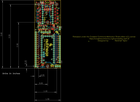
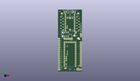
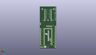
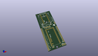

Contents
========

* [PROJ-SPAR-13311-STAN-01>Teensy 3 1 XBee Adapter](#proj-spar-13311-stan-01teensy-3-1-xbee-adapter)
	* [Images](#images)
	* [Interactive BOM](#interactive-bom)
	* [OOMP Parts](#oomp-parts)
	* [Tags](#tags)
  
![][im]
# PROJ-SPAR-13311-STAN-01>Teensy 3 1 XBee Adapter

- ID: PROJ-SPAR-13311-STAN-01
- Hex ID: PRS13311
- Name: Teensy 3 1 XBee Adapter
- Description: 

## Images
  
  

|eagleImage|kicadPcb3dFront|kicadPcb3dBack|kicadPcb3d|
| :---: | :---: | :---: | :---: |
|||||

## Interactive BOM

- Interactive BOM page: [ibom.html](kicad/bom/ibom.html)

## OOMP Parts
  

|OOMP Parts|
| :---: |
|UNMATCHED-UNMATCHED-X-UNMATCHED-01, JP1, 7.619999999999999, 6.35, 0,JP1, TEENSY-3.1NOSILK, TEENSY-3.1_NOSILK, Testing, (0.3, 0.25), R0|
|<table><tr><td></td><td> JP2</td><td>[HEAD-I01-X-PI10-01 2.54 mm 10 Pin Header](https://github.com/oomlout/oomlout_OOMP_parts/tree/main/HEAD-I01-X-PI10-01/)</td><td>[H10](https://github.com/oomlout/oomlout_OOMP_parts/tree/main/HEAD-I01-X-PI10-01/)</td></tr></table>|
|<table><tr><td></td><td> JP3</td><td>[HEAD-I01-X-PI10-01 2.54 mm 10 Pin Header](https://github.com/oomlout/oomlout_OOMP_parts/tree/main/HEAD-I01-X-PI10-01/)</td><td>[H10](https://github.com/oomlout/oomlout_OOMP_parts/tree/main/HEAD-I01-X-PI10-01/)</td></tr></table>|
|<table><tr><td></td><td> JP4</td><td>[HEAD-I01-X-PI14-01 2.54 mm 14 Pin Header](https://github.com/oomlout/oomlout_OOMP_parts/tree/main/HEAD-I01-X-PI14-01/)</td><td>[H14](https://github.com/oomlout/oomlout_OOMP_parts/tree/main/HEAD-I01-X-PI14-01/)</td></tr></table>|
|<table><tr><td></td><td> JP5</td><td>[HEAD-I01-X-PI05-01 2.54 mm 5 Pin Header](https://github.com/oomlout/oomlout_OOMP_parts/tree/main/HEAD-I01-X-PI05-01/)</td><td>[H05](https://github.com/oomlout/oomlout_OOMP_parts/tree/main/HEAD-I01-X-PI05-01/)</td></tr></table>|
|<table><tr><td></td><td> JP6</td><td>[HEAD-I01-X-PI03-01 2.54 mm 3 Pin Header](https://github.com/oomlout/oomlout_OOMP_parts/tree/main/HEAD-I01-X-PI03-01/)</td><td>[H03](https://github.com/oomlout/oomlout_OOMP_parts/tree/main/HEAD-I01-X-PI03-01/)</td></tr></table>|
|<table><tr><td></td><td> JP7</td><td>[HEAD-I01-X-PI18-01 2.54 mm 18 Pin Header](https://github.com/oomlout/oomlout_OOMP_parts/tree/main/HEAD-I01-X-PI18-01/)</td><td>[H18](https://github.com/oomlout/oomlout_OOMP_parts/tree/main/HEAD-I01-X-PI18-01/)</td></tr></table>|
|<table><tr><td></td><td> JP8</td><td>[HEAD-I01-X-PI02-01 2.54 mm 2 Pin Header](https://github.com/oomlout/oomlout_OOMP_parts/tree/main/HEAD-I01-X-PI02-01/)</td><td>[H02](https://github.com/oomlout/oomlout_OOMP_parts/tree/main/HEAD-I01-X-PI02-01/)</td></tr></table>|
|UNMATCHED-UNMATCHED-X-UNMATCHED-01, JP9, 16.509999999999998, 55.88, 0,JP9, CONN-09042, XBEE-SMD, SparkFun-RF, (0.65, 2.2), R0|
|UNMATCHED-0603-X-UNMATCHED-01, LED1, 25.0825, 54.292500000000004, 0,LED1, Red, LED-0603, SparkFun-LED, (0.9875, 2.1375), R0|
|UNMATCHED-0603-X-UNMATCHED-01, LED2, 11.112499999999999, 83.18499999999999, 0,LED2, Red, LED-0603, SparkFun-LED, (0.4375, 3.275), R0|
|UNMATCHED-0603-X-UNMATCHED-01, LED3, 8.5725, 83.18499999999999, 0,LED3, Green, LED-0603, SparkFun-LED, (0.3375, 3.275), R0|
|UNMATCHED-0603-X-UNMATCHED-01, LED4, 20.955, 83.18499999999999, 0,LED4, Green, LED-0603, SparkFun-LED, (0.825, 3.275), R0|
|UNMATCHED-0603-X-UNMATCHED-01, LED5, 23.495, 83.18499999999999, 0,LED5, Green, LED-0603, SparkFun-LED, (0.925, 3.275), R0|
|RESE-0603-X-UNMATCHED-01, R1, 15.239999999999998, 74.93, 90,R1, 1k, 0603-RES, SparkFun-Resistors, (0.6, 2.95), R90|
|RESE-0603-X-UNMATCHED-01, R2, 20.32, 74.93, 270,R2, 1k, 0603-RES, SparkFun-Resistors, (0.8, 2.95), R270|
|RESE-0603-X-UNMATCHED-01, R3, 12.7, 74.93, 90,R3, 1k, 0603-RES, SparkFun-Resistors, (0.5, 2.95), R90|
|RESE-0603-X-UNMATCHED-01, R4, 17.779999999999998, 74.93, 270,R4, 1k, 0603-RES, SparkFun-Resistors, (0.7, 2.95), R270|
|RESE-0603-X-UNMATCHED-01, R11, 23.495, 54.292500000000004, 90,R11, 1k, 0603-RES, SparkFun-Resistors, (0.925, 2.1375), R90|
|UNMATCHED-UNMATCHED-X-UNMATCHED-01, S2, 11.43, 51.7525, 180,S2, DPDT, AYZ0202, SparkFun-Electromechanical, (0.45, 2.0375), R180|
|UNMATCHED-UNMATCHED-X-UNMATCHED-01, S3, 16.509999999999998, 83.5025, 180,S3, Reset, TACTILE-SWITCH-SMD, SparkFun-Electromechanical, (0.65, 3.2875), R180|

## Tags

- hexID: PRS13311
- oompType: PROJ
- oompSize: SPAR
- oompColor: 13311
- oompDesc: STAN
- oompIndex: 01
- oompName: Teensy 3 1 XBee Adapter
- sources: All source files from https://github.com/sparkfun/Teensy_3_1_XBee_Adapter (source licence details in srcLicense.md)
- linkBuyPage: https://www.sparkfun.com/products/13311
- oompPart: SKIP-UNMATCHED-X-UNMATCHED-01, FID1, 22.86, 2.54, 0
- oompPart: SKIP-UNMATCHED-X-UNMATCHED-01, FID2, 2.54, 83.82, 0
- oompPart: UNMATCHED-UNMATCHED-X-UNMATCHED-01, JP1, 7.619999999999999, 6.35, 0
- oompPart: HEAD-I01-X-PI10-01, JP2, 10.16, 57.15, 90
- oompPart: HEAD-I01-X-PI10-01, JP3, 22.86, 57.15, 90
- oompPart: HEAD-I01-X-PI14-01, JP4, 31.75, 7.619999999999999, 90
- oompPart: HEAD-I01-X-PI05-01, JP5, 19.049999999999997, 45.72, 180
- oompPart: HEAD-I01-X-PI03-01, JP6, 26.669999999999998, 2.54, 0
- oompPart: HEAD-I01-X-PI18-01, JP7, 1.27, 2.54, 90
- oompPart: HEAD-I01-X-PI02-01, JP8, 31.75, 52.06999999999999, 270
- oompPart: UNMATCHED-UNMATCHED-X-UNMATCHED-01, JP9, 16.509999999999998, 55.88, 0
- oompPart: UNMATCHED-0603-X-UNMATCHED-01, LED1, 25.0825, 54.292500000000004, 0
- oompPart: UNMATCHED-0603-X-UNMATCHED-01, LED2, 11.112499999999999, 83.18499999999999, 0
- oompPart: UNMATCHED-0603-X-UNMATCHED-01, LED3, 8.5725, 83.18499999999999, 0
- oompPart: UNMATCHED-0603-X-UNMATCHED-01, LED4, 20.955, 83.18499999999999, 0
- oompPart: UNMATCHED-0603-X-UNMATCHED-01, LED5, 23.495, 83.18499999999999, 0
- oompPart: RESE-0603-X-UNMATCHED-01, R1, 15.239999999999998, 74.93, 90
- oompPart: RESE-0603-X-UNMATCHED-01, R2, 20.32, 74.93, 270
- oompPart: RESE-0603-X-UNMATCHED-01, R3, 12.7, 74.93, 90
- oompPart: RESE-0603-X-UNMATCHED-01, R4, 17.779999999999998, 74.93, 270
- oompPart: RESE-0603-X-UNMATCHED-01, R11, 23.495, 54.292500000000004, 90
- oompPart: UNMATCHED-UNMATCHED-X-UNMATCHED-01, S2, 11.43, 51.7525, 180
- oompPart: UNMATCHED-UNMATCHED-X-UNMATCHED-01, S3, 16.509999999999998, 83.5025, 180
- oompPart: SKIP-UNMATCHED-X-UNMATCHED-01, SJ1, 6.35, 54.292500000000004, 0
- oompPart: SKIP-UNMATCHED-X-UNMATCHED-01, SJ3, 6.35, 49.2125, 0
- oompPart: SKIP-UNMATCHED-X-UNMATCHED-01, SJ4, 22.86, 49.8475, 180
- oompPart: SKIP-UNMATCHED-X-UNMATCHED-01, SJ5, 10.16, 4.444999999999999, 0
- rawPart: FID1, FIDUCIAL1X2, FIDUCIAL-1X2, SparkFun-Aesthetics, (0.9, 0.1), R0
- rawPart: FID2, FIDUCIAL1X2, FIDUCIAL-1X2, SparkFun-Aesthetics, (0.1, 3.3), R0
- rawPart: JP1, TEENSY-3.1NOSILK, TEENSY-3.1_NOSILK, Testing, (0.3, 0.25), R0
- rawPart: JP2, 1X10_NO_SILK, SparkFun-Connectors, (0.4, 2.25), R90
- rawPart: JP3, 1X10_NO_SILK, SparkFun-Connectors, (0.9, 2.25), R90
- rawPart: JP4, DNP, 1X14, SparkFun-Connectors, (1.25, 0.3), R90
- rawPart: JP5, DNP, 1X05, SparkFun-Connectors, (0.75, 1.8), R180
- rawPart: JP6, DNP, 1X03, SparkFun-Connectors, (1.05, 0.1), R0
- rawPart: JP7, DNP\, 1X18, SparkFun-Connectors, (0.05, 0.1), R90
- rawPart: JP8, DNP, 1X02, SparkFun-Connectors, (1.25, 2.05), R270
- rawPart: JP9, CONN-09042, XBEE-SMD, SparkFun-RF, (0.65, 2.2), R0
- rawPart: LED1, Red, LED-0603, SparkFun-LED, (0.9875, 2.1375), R0
- rawPart: LED2, Red, LED-0603, SparkFun-LED, (0.4375, 3.275), R0
- rawPart: LED3, Green, LED-0603, SparkFun-LED, (0.3375, 3.275), R0
- rawPart: LED4, Green, LED-0603, SparkFun-LED, (0.825, 3.275), R0
- rawPart: LED5, Green, LED-0603, SparkFun-LED, (0.925, 3.275), R0
- rawPart: R1, 1k, 0603-RES, SparkFun-Resistors, (0.6, 2.95), R90
- rawPart: R2, 1k, 0603-RES, SparkFun-Resistors, (0.8, 2.95), R270
- rawPart: R3, 1k, 0603-RES, SparkFun-Resistors, (0.5, 2.95), R90
- rawPart: R4, 1k, 0603-RES, SparkFun-Resistors, (0.7, 2.95), R270
- rawPart: R11, 1k, 0603-RES, SparkFun-Resistors, (0.925, 2.1375), R90
- rawPart: S2, DPDT, AYZ0202, SparkFun-Electromechanical, (0.45, 2.0375), R180
- rawPart: S3, Reset, TACTILE-SWITCH-SMD, SparkFun-Electromechanical, (0.65, 3.2875), R180
- rawPart: SJ1, D_TX, PAD-JUMPER-2-NC_BY_PASTE_YES_SILK, SparkFun-Passives, (0.25, 2.1375), R0
- rawPart: SJ3, D_RX, PAD-JUMPER-2-NC_BY_PASTE_YES_SILK, SparkFun-Passives, (0.25, 1.9375), R0
- rawPart: SJ4, JUMPER-PAD-3-2OF3_NC_BY_PASTE, PAD-JUMPER-3-2OF3_NC_BY_PASTE_YES_SILK_FULL_BOX, SparkFun-Passives, (0.9, 1.9625), R180
- rawPart: SJ5, EXT_JPR, PAD-JUMPER-2-NO_YES_SILK, SparkFun-Passives, (0.4, 0.175), R0
- oompID: PROJ-SPAR-13311-STAN-01

[im]: kicadPcb3d_450.png
