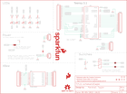

Contents
========

* [PRS13311 > Teensy 3 1 XBee Adapter](#prs13311--teensy-3-1-xbee-adapter)
	* [Schematic](#schematic)
	* [PCB](#pcb)
	* [Interactive BOM](#interactive-bom)
	* [Images](#images)
	* [Tags](#tags)
  
![][im]
# PRS13311 > Teensy 3 1 XBee Adapter

- ID: PROJ-SPAR-13311-STAN-01
- Hex ID: PRS13311
- Name: Sparkfun
- Description: Sparkfun
- Long Link: [http://oom.lt/PROJ-SPAR-13311-STAN-01](http://oom.lt/PROJ-SPAR-13311-STAN-01)
- Short Link: [http://oom.lt/PRS13311](http://oom.lt/PRS13311)

## Schematic
  

## PCB
  

## Interactive BOM

- Interactive BOM page: [ibom.html](https://htmlpreview.github.io/?https://github.com/oomlout/oomlout_OOMP_projects/blob/main/PROJ-SPAR-13311-STAN-01/kicad/bom/ibom.html)

## Images
  
  

|bominteractivefront|bominteractiveback|kicadPcb3d|kicadPcb3dFront|kicadPcb3dBack|eagleImage|eagleSchemImage|pcbdraw|pcbdrawback|
| :---: | :---: | :---: | :---: | :---: | :---: | :---: | :---: | :---: |
||||||||||

## Tags

- hexID: PRS13311
- oompType: PROJ
- oompSize: SPAR
- oompColor: 13311
- oompDesc: STAN
- oompIndex: 01
- oompName: Teensy 3 1 XBee Adapter
- sources: All source files from https://github.com/sparkfun/Teensy_3_1_XBee_Adapter (source licence details in srcLicense.md)
- linkBuyPage: https://www.sparkfun.com/products/13311
- oompID: PROJ-SPAR-13311-STAN-01
- rawParts: FID1,FIDUCIAL1X2,FIDUCIAL1X2,FIDUCIAL-1X2,Fiducial Alignment Points,,,,,
- rawParts: FID2,FIDUCIAL1X2,FIDUCIAL1X2,FIDUCIAL-1X2,Fiducial Alignment Points,,,,,
- rawParts: FRAME1,,FRAME-LETTER,CREATIVE_COMMONS,Schematic Frame,Marshall Taylor,,,v10,
- rawParts: JP1,TEENSY-3.1NOSILK,TEENSY-3.1NOSILK,TEENSY-3.1_NOSILK,,,,,,
- rawParts: JP2,,M10NO_SILK_PTH_FEMALE,1X10_NO_SILK,Header 10,,CONN-11563,,,
- rawParts: JP3,,M10NO_SILK_PTH_FEMALE,1X10_NO_SILK,Header 10,,CONN-11563,,,
- rawParts: JP4,DNP,M14,1X14,Header 14,,,,,
- rawParts: JP5,DNP,M05PTH,1X05,Header 5,,,,,
- rawParts: JP6,DNP,M03PTH,1X03,Header 3,,,,,
- rawParts: JP7,DNP\,M18_,1X18,1x18 .1 header,,,,,
- rawParts: JP8,DNP,M02PTH,1X02,Standard 2-pin 0.1 header. Use with,,,,,
- rawParts: JP9,CONN-09042,XBEE-1B3,XBEE-SMD,Xbee module footprints,,CONN-09042,,,
- rawParts: LED1,Red,LED-RED0603,LED-0603,Assorted Red LEDs,,DIO-00819,RED,,
- rawParts: LED2,Red,LED-RED0603,LED-0603,Assorted Red LEDs,,DIO-00819,RED,,
- rawParts: LED3,Green,LED-GREEN0603,LED-0603,Various green LEDs,,DIO-00821,GREEN,,
- rawParts: LED4,Green,LED-GREEN0603,LED-0603,Various green LEDs,,DIO-00821,GREEN,,
- rawParts: LED5,Green,LED-GREEN0603,LED-0603,Various green LEDs,,DIO-00821,GREEN,,
- rawParts: LOGO1,SFE_LOGO_FLAME.2_INCH,SFE_LOGO_FLAME.2_INCH,SFE_LOGO_FLAME_.2,SFE Logo, flame only,,,,,
- rawParts: LOGO2,OSHW-LOGOM,OSHW-LOGOM,OSHW-LOGO-M,Open Source Hardware Logo,,,,,
- rawParts: LOGO3,SFE_LOGO_NAME_FLAME.2_INCH,SFE_LOGO_NAME_FLAME.2_INCH,SFE_LOGO_NAME_FLAME_.2,SFE Logo, name and flame,,,,,
- rawParts: R1,1k,1KOHM1/10W1%(0603),0603-RES,RES-07856,,RES-07856,1K,,
- rawParts: R2,1k,1KOHM1/10W1%(0603),0603-RES,RES-07856,,RES-07856,1K,,
- rawParts: R3,1k,1KOHM1/10W1%(0603),0603-RES,RES-07856,,RES-07856,1K,,
- rawParts: R4,1k,1KOHM1/10W1%(0603),0603-RES,RES-07856,,RES-07856,1K,,
- rawParts: R11,1k,1KOHM1/10W1%(0603),0603-RES,RES-07856,,RES-07856,1K,,
- rawParts: S2,DPDT,SWITCH-DPDTAYZ0202,AYZ0202,DPDT Version of the COM-00597,,SWCH-08179,DPDT,,
- rawParts: S3,Reset,SWITCH-MOMENTARY-2SMD,TACTILE-SWITCH-SMD,Various NO switches- pushbuttons, reed, etc,,SWCH-08247,,,
- rawParts: SJ1,D_TX,JUMPER-PAD-2-NC_BY_PASTE,PAD-JUMPER-2-NC_BY_PASTE_YES_SILK,,,,,,
- rawParts: SJ3,D_RX,JUMPER-PAD-2-NC_BY_PASTE,PAD-JUMPER-2-NC_BY_PASTE_YES_SILK,,,,,,
- rawParts: SJ4,JUMPER-PAD-3-2OF3_NC_BY_PASTE,JUMPER-PAD-3-2OF3_NC_BY_PASTE,PAD-JUMPER-3-2OF3_NC_BY_PASTE_YES_SILK_FULL_BOX,,,,,,
- rawParts: SJ5,EXT_JPR,JUMPER-PAD-2-NOYES_SILK,PAD-JUMPER-2-NO_YES_SILK,,,,,,
- rawParts: STANDOFF1,STAND-OFF,STAND-OFF,STAND-OFF,#4 Stand Off,,,,,
- rawParts: STANDOFF2,STAND-OFF,STAND-OFF,STAND-OFF,#4 Stand Off,,,,,
- rawParts: STANDOFF3,STAND-OFF,STAND-OFF,STAND-OFF,#4 Stand Off,,,,,
- rawParts: STANDOFF4,STAND-OFF,STAND-OFF,STAND-OFF,#4 Stand Off,,,,,

[im]: kicadPcb3d_450.png
