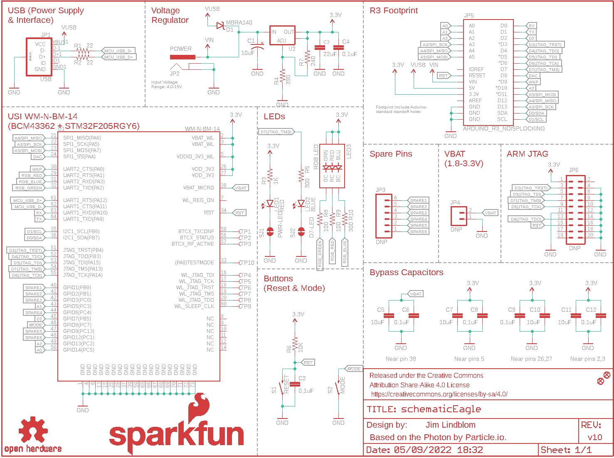
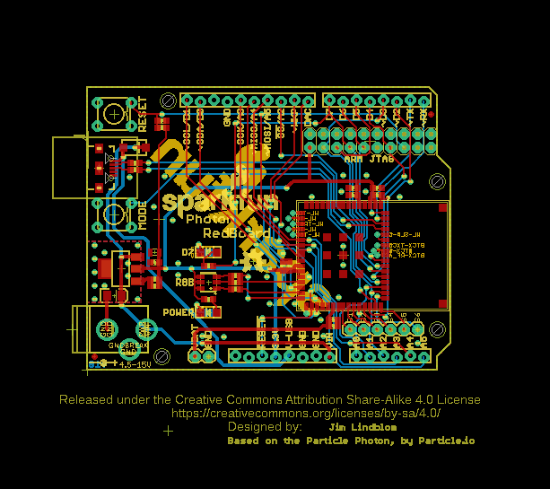
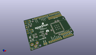
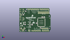
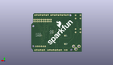
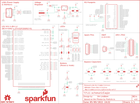

Contents
========

* [PRS13321 > Photon RedBoard](#prs13321--photon-redboard)
	* [Schematic](#schematic)
	* [PCB](#pcb)
	* [Interactive BOM](#interactive-bom)
	* [OOMP Parts](#oomp-parts)
	* [Images](#images)
	* [Tags](#tags)
  
![][im]
# PRS13321 > Photon RedBoard

- ID: PROJ-SPAR-13321-STAN-01
- Hex ID: PRS13321
- Name: Sparkfun
- Description: Sparkfun
- Long Link: [http://oom.lt/PROJ-SPAR-13321-STAN-01](http://oom.lt/PROJ-SPAR-13321-STAN-01)
- Short Link: [http://oom.lt/PRS13321](http://oom.lt/PRS13321)

## Schematic
  

## PCB
  

## Interactive BOM

- Interactive BOM page: [ibom.html](https://htmlpreview.github.io/?https://github.com/oomlout/oomlout_OOMP_projects/blob/main/PROJ-SPAR-13321-STAN-01/kicad/bom/ibom.html)

## OOMP Parts
  

|OOMP Parts|
| :---: |
|C1 C1,CAPX-UNMATCHED-X-UF10-01|
|C2 C2,CAPC-0603-X-UF1D-01|
|C3 C3,CAPC-0805-X-UF22-01|
|C4 C4,CAPC-0603-X-UF1D-01|
|C5 C5,CAPC-0603-X-UF10-01|
|C6 C6,CAPC-0603-X-UF1D-01|
|C7 C7,CAPC-0603-X-UF10-01|
|C8 C8,CAPC-0603-X-UF1D-01|
|C9 C9,CAPC-0603-X-UF1D-01|
|C10 C10,CAPC-0603-X-UF10-01|
|C11 C11,CAPC-0603-X-UF10-01|
|C12 C12,CAPC-0603-X-UF1D-01|
|D1 D1,DIOD-UNMATCHED-X-UNMATCHED-01|
|FRAME1 FRAME1,UNMATCHED-UNMATCHED-X-UNMATCHED-01|
|JP1 JP1,UNMATCHED-UNMATCHED-X-UNMATCHED-01|
|JP2 JP2,UNMATCHED-UNMATCHED-X-UNMATCHED-01|
|JP5 JP5,UNMATCHED-UNMATCHED-X-UNMATCHED-01|
|LED1 LED1,LEDS-1206-G-STAN-01|
|LED2 LED2,LEDS-1206-G-STAN-01|
|LED3 LED3,LEDS-UNMATCHED-RGB-STAN-01|
|[R1 RESE-0603-X-O220-01 SMD (0603) 22 Ohm Resistor](https://github.com/oomlout/oomlout_OOMP_parts/tree/main/RESE-0603-X-O220-01/)|
|[R2 RESE-0603-X-O220-01 SMD (0603) 22 Ohm Resistor](https://github.com/oomlout/oomlout_OOMP_parts/tree/main/RESE-0603-X-O220-01/)|
|[R3 RESE-0603-X-O102-01 SMD (0603) 1k Ohm Resistor](https://github.com/oomlout/oomlout_OOMP_parts/tree/main/RESE-0603-X-O102-01/)|
|[R4 RESE-0603-X-O391-01 SMD (0603) 390 Ohm Resistor](https://github.com/oomlout/oomlout_OOMP_parts/tree/main/RESE-0603-X-O391-01/)|
|[R5 RESE-0603-X-O301-01 SMD (0603) 300 Ohm Resistor](https://github.com/oomlout/oomlout_OOMP_parts/tree/main/RESE-0603-X-O301-01/)|
|[R6 RESE-0603-X-O103-01 SMD (0603) 10k Ohm Resistor](https://github.com/oomlout/oomlout_OOMP_parts/tree/main/RESE-0603-X-O103-01/)|
|[R7 RESE-0603-X-O241-01 SMD (0603) 240 Ohm Resistor](https://github.com/oomlout/oomlout_OOMP_parts/tree/main/RESE-0603-X-O241-01/)|
|[R8 RESE-0603-X-O101-01 SMD (0603) 100 Ohm Resistor](https://github.com/oomlout/oomlout_OOMP_parts/tree/main/RESE-0603-X-O101-01/)|
|[R9 RESE-0603-X-O101-01 SMD (0603) 100 Ohm Resistor](https://github.com/oomlout/oomlout_OOMP_parts/tree/main/RESE-0603-X-O101-01/)|
|[R10 RESE-0603-X-O301-01 SMD (0603) 300 Ohm Resistor](https://github.com/oomlout/oomlout_OOMP_parts/tree/main/RESE-0603-X-O301-01/)|
|S1 S1,UNMATCHED-UNMATCHED-X-UNMATCHED-01|
|S2 S2,UNMATCHED-UNMATCHED-X-UNMATCHED-01|
|U1 U1,UNMATCHED-UNMATCHED-X-UNMATCHED-01|
|U2 U2,UNMATCHED-UNMATCHED-X-UNMATCHED-01|

## Images
  
  

|kicadPcb3d|kicadPcb3dFront|kicadPcb3dBack|eagleImage|eagleSchemImage|
| :---: | :---: | :---: | :---: | :---: |
||||||

## Tags

- hexID: PRS13321
- oompType: PROJ
- oompSize: SPAR
- oompColor: 13321
- oompDesc: STAN
- oompIndex: 01
- oompName: Photon RedBoard
- sources: All source files from https://github.com/sparkfun/Photon_RedBoard (source licence details in srcLicense.md)
- linkBuyPage: https://www.sparkfun.com/products/13321
- oompID: PROJ-SPAR-13321-STAN-01
- oompParts: C1,CAPX-UNMATCHED-X-UF10-01
- oompParts: C2,CAPC-0603-X-UF1D-01
- oompParts: C3,CAPC-0805-X-UF22-01
- oompParts: C4,CAPC-0603-X-UF1D-01
- oompParts: C5,CAPC-0603-X-UF10-01
- oompParts: C6,CAPC-0603-X-UF1D-01
- oompParts: C7,CAPC-0603-X-UF10-01
- oompParts: C8,CAPC-0603-X-UF1D-01
- oompParts: C9,CAPC-0603-X-UF1D-01
- oompParts: C10,CAPC-0603-X-UF10-01
- oompParts: C11,CAPC-0603-X-UF10-01
- oompParts: C12,CAPC-0603-X-UF1D-01
- oompParts: D1,DIOD-UNMATCHED-X-UNMATCHED-01
- oompParts: FRAME1,UNMATCHED-UNMATCHED-X-UNMATCHED-01
- oompParts: JP1,UNMATCHED-UNMATCHED-X-UNMATCHED-01
- oompParts: JP2,UNMATCHED-UNMATCHED-X-UNMATCHED-01
- oompParts: JP5,UNMATCHED-UNMATCHED-X-UNMATCHED-01
- oompParts: LED1,LEDS-1206-G-STAN-01
- oompParts: LED2,LEDS-1206-G-STAN-01
- oompParts: LED3,LEDS-UNMATCHED-RGB-STAN-01
- oompParts: R1,RESE-0603-X-O220-01
- oompParts: R2,RESE-0603-X-O220-01
- oompParts: R3,RESE-0603-X-O102-01
- oompParts: R4,RESE-0603-X-O391-01
- oompParts: R5,RESE-0603-X-O301-01
- oompParts: R6,RESE-0603-X-O103-01
- oompParts: R7,RESE-0603-X-O241-01
- oompParts: R8,RESE-0603-X-O101-01
- oompParts: R9,RESE-0603-X-O101-01
- oompParts: R10,RESE-0603-X-O301-01
- oompParts: S1,UNMATCHED-UNMATCHED-X-UNMATCHED-01
- oompParts: S2,UNMATCHED-UNMATCHED-X-UNMATCHED-01
- oompParts: U1,UNMATCHED-UNMATCHED-X-UNMATCHED-01
- oompParts: U2,UNMATCHED-UNMATCHED-X-UNMATCHED-01
- rawParts: C1,10uF,10UF-16V-10%(TANT),EIA3216,CAP-00811,,CAP-00811,,10uF,,
- rawParts: C2,0.1uF,0.1UF-25V(+80/-20%)(0603),0603-CAP,CAP-00810,,CAP-00810,,0.1uF,,
- rawParts: C3,22uF,22UF-6.3V-20%(0805),0805,CAP-08402,,CAP-08402,,22uF,,
- rawParts: C4,0.1uF,0.1UF-25V(+80/-20%)(0603),0603-CAP,CAP-00810,,CAP-00810,,0.1uF,,
- rawParts: C5,10uF,10UF-6.3V-20%(0603),0603-CAP,CAP-11015,,CAP-11015,,10uF,,
- rawParts: C6,0.1uF,0.1UF-25V(+80/-20%)(0603),0603-CAP,CAP-00810,,CAP-00810,,0.1uF,,
- rawParts: C7,10uF,10UF-6.3V-20%(0603),0603-CAP,CAP-11015,,CAP-11015,,10uF,,
- rawParts: C8,0.1uF,0.1UF-25V(+80/-20%)(0603),0603-CAP,CAP-00810,,CAP-00810,,0.1uF,,
- rawParts: C9,0.1uF,0.1UF-25V(+80/-20%)(0603),0603-CAP,CAP-00810,,CAP-00810,,0.1uF,,
- rawParts: C10,10uF,10UF-6.3V-20%(0603),0603-CAP,CAP-11015,,CAP-11015,,10uF,,
- rawParts: C11,10uF,10UF-6.3V-20%(0603),0603-CAP,CAP-11015,,CAP-11015,,10uF,,
- rawParts: C12,0.1uF,0.1UF-25V(+80/-20%)(0603),0603-CAP,CAP-00810,,CAP-00810,,0.1uF,,
- rawParts: D1,MBRA140,DIODE-SCHOTTKY-MBRA140,SMA-DIODE,Schottky diodes in SFEs production catalog,,DIO-08053,,MBRA140,,
- rawParts: FID1,FIDUCIAL1X2,FIDUCIAL1X2,FIDUCIAL-1X2,Fiducial Alignment Points,,,,,,
- rawParts: FID2,FIDUCIAL1X2,FIDUCIAL1X2,FIDUCIAL-1X2,Fiducial Alignment Points,,,,,,
- rawParts: FRAME1,,FRAME-LETTER,CREATIVE_COMMONS,Schematic Frame,Jim Lindblom,,,,v01,
- rawParts: JP1,USB,USB_MICROB_PLUGCONN-11752,USB-B-MICRO-SMD_V03,USB Micro-B connectors,,CONN-11752,,,,
- rawParts: JP2,POWER,POWER_JACKPTH_LOCK,POWER_JACK_PTH_LOCK,Power Jack,,CONN-08197,PRT-00119,,,
- rawParts: JP3,DNP,M06SILK_FEMALE_PTH,1X06,Header 6,,CONN-08437,,,,
- rawParts: JP4,DNP,M02PTH,1X02,Standard 2-pin 0.1 header. Use with,,,,,,
- rawParts: JP5,ARDUINO_R3_NOISPLOCKING,ARDUINO_R3_NOISPLOCKING,ARDUINO_R3_NOISP_LOCKING,,,,,,,
- rawParts: JP6,DNP,M10X2,2X10,This was SPECIALLY designed to be used with our Graphic LCD Backpack.  Be sure you want to use this!  It is not only staggered on each line of header holes, but IT IS ALSO offset of the center point of the top and bottom lines by 5 mil.  This causes the headers to lock into place on the standard footprint on the LCD screen.  The extra squares on the tdocu layer are there simply to reference other pins (if you were to actually populate a longer header than ten long - this is what we do with the backpacks).,,,,,,
- rawParts: LED1,RED,LED-RED1206,LED-1206,Assorted Red LEDs,,DIO-00809,,RED,,
- rawParts: LED2,BLUE,LED-BLUE1206,LED-1206,Blue LEDs for production use,,DIO-09911,,BLUE,,
- rawParts: LED3,RGB LED,LED-TRICOLOR-NO-COMPLCC-6-SMD,PLCC-6-LED,,,DIO-12113,,,,
- rawParts: LOGO1,OSHW-LOGOM,OSHW-LOGOM,OSHW-LOGO-M,Open Source Hardware Logo,,,,,,
- rawParts: LOGO2,SFE_LOGO_NAME_FLAME.2_INCH,SFE_LOGO_NAME_FLAME.2_INCH,SFE_LOGO_NAME_FLAME_.2,SFE Logo, name and flame,,,,,,
- rawParts: LOGO3,SFE_LOGO_NAME_FLAME.4_INCH,SFE_LOGO_NAME_FLAME.4_INCH,SFE_LOGO_NAME_FLAME_.4,SFE Logo, name and flame,,,,,,
- rawParts: R1,22,22OHM1/10W1%(0603),0603-RES,RES-08698,,RES-08698,,22,,
- rawParts: R2,22,22OHM1/10W1%(0603),0603-RES,RES-08698,,RES-08698,,22,,
- rawParts: R3,1K,1KOHM-1/10W-1%(0603),0603-RES,RES-07856,,RES-07856,,1K,,
- rawParts: R4,390,390OHM1/10W1%(0603),0603-RES,RES-07864,,RES-07864,,390,,
- rawParts: R5,300,300OHM-1/10W-1%(0603),0603-RES,RES-10328,,RES_10328,,300,,
- rawParts: R6,10K,10KOHM-1/10W-1%(0603)0603,0603-RES,RES-00824,,RES-00824,,10K,,
- rawParts: R7,240,240OHM1/10W1%(0603),0603-RES,RES-07849,,RES-07849,,240,,
- rawParts: R8,100,100OHM-1/10W-1%(0603),0603-RES,RES-07863,,RES-07863,,100,,
- rawParts: R9,100,100OHM-1/10W-1%(0603),0603-RES,RES-07863,,RES-07863,,100,,
- rawParts: R10,300,300OHM-1/10W-1%(0603),0603-RES,RES-10328,,RES_10328,,300,,
- rawParts: S1,RESET,SWITCH-MOMENTARY-2PTH,TACTILE-PTH,Various NO switches- pushbuttons, reed, etc,, SWCH-08441,,,,
- rawParts: S2,MODE,SWITCH-MOMENTARY-2PTH,TACTILE-PTH,Various NO switches- pushbuttons, reed, etc,, SWCH-08441,,,,
- rawParts: SJ1,PWR-LED,JUMPER-PAD-2-NC_BY_TRACE,PAD-JUMPER-2-NC_BY_TRACE_YES_SILK,,,,,,,
- rawParts: SJ2,D7-LED,JUMPER-PAD-2-NC_BY_TRACE,PAD-JUMPER-2-NC_BY_TRACE_YES_SILK,,,,,,,
- rawParts: TP1,TEST-POINTTP_15TH_THRU,TEST-POINTTP_15TH_THRU,TP_15TH,Bare copper test points for troubleshooting or ICT,,,,,,
- rawParts: TP2,TEST-POINTTP_15TH_THRU,TEST-POINTTP_15TH_THRU,TP_15TH,Bare copper test points for troubleshooting or ICT,,,,,,
- rawParts: TP3,TEST-POINTTP_15TH_THRU,TEST-POINTTP_15TH_THRU,TP_15TH,Bare copper test points for troubleshooting or ICT,,,,,,
- rawParts: TP4,TEST-POINTTP_15TH_THRU,TEST-POINTTP_15TH_THRU,TP_15TH,Bare copper test points for troubleshooting or ICT,,,,,,
- rawParts: TP5,TEST-POINTTP_15TH_THRU,TEST-POINTTP_15TH_THRU,TP_15TH,Bare copper test points for troubleshooting or ICT,,,,,,
- rawParts: TP6,TEST-POINTTP_15TH_THRU,TEST-POINTTP_15TH_THRU,TP_15TH,Bare copper test points for troubleshooting or ICT,,,,,,
- rawParts: TP7,TEST-POINTTP_15TH_THRU,TEST-POINTTP_15TH_THRU,TP_15TH,Bare copper test points for troubleshooting or ICT,,,,,,
- rawParts: TP8,TEST-POINTTP_15TH_THRU,TEST-POINTTP_15TH_THRU,TP_15TH,Bare copper test points for troubleshooting or ICT,,,,,,
- rawParts: TP9,TEST-POINTTP_15TH_THRU,TEST-POINTTP_15TH_THRU,TP_15TH,Bare copper test points for troubleshooting or ICT,,,,,,
- rawParts: TP10,TEST-POINTTP_15TH_THRU,TEST-POINTTP_15TH_THRU,TP_15TH,Bare copper test points for troubleshooting or ICT,,,,,,
- rawParts: U1,WM-N-BM-14,WM-N-BM-14,WM-N-BM-14,,,IC-12589,,,,
- rawParts: U2,,V_REG_LM1117SOT223,SOT223,Voltage Regulator LM1117,,VREG-08170,,,,

[im]: kicadPcb3d_450.png
