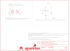

Contents
========

* [PRS13322 > Soil Moisture Sensor](#prs13322--soil-moisture-sensor)
	* [Schematic](#schematic)
	* [PCB](#pcb)
	* [Interactive BOM](#interactive-bom)
	* [OOMP Parts](#oomp-parts)
	* [Images](#images)
	* [Tags](#tags)
  
![][im]
# PRS13322 > Soil Moisture Sensor

- ID: PROJ-SPAR-13322-STAN-01
- Hex ID: PRS13322
- Name: Sparkfun
- Description: Sparkfun
- Long Link: [http://oom.lt/PROJ-SPAR-13322-STAN-01](http://oom.lt/PROJ-SPAR-13322-STAN-01)
- Short Link: [http://oom.lt/PRS13322](http://oom.lt/PRS13322)

## Schematic
  

## PCB
  

## Interactive BOM

- Interactive BOM page: [ibom.html](https://htmlpreview.github.io/?https://github.com/oomlout/oomlout_OOMP_projects/blob/main/PROJ-SPAR-13322-STAN-01/kicad/bom/ibom.html)

## OOMP Parts
  

|OOMP ID|Name|Identifier|
| :---: | :---: | :---: |
|UNMATCHED-UNMATCHED-X-UNMATCHED-01||FRAME1|
|[TERS-35D-L-PI03-01](https://github.com/oomlout/oomlout_OOMP_parts/tree/main/TERS-35D-L-PI03-01/)|[3.5 mm 3 Pin Blue Screw Terminal](https://github.com/oomlout/oomlout_OOMP_parts/tree/main/TERS-35D-L-PI03-01/)|[JP2](https://github.com/oomlout/oomlout_OOMP_parts/tree/main/TERS-35D-L-PI03-01/)|
|UNMATCHED-SO23-X-UNMATCHED-01||Q1|
|[RESE-0603-X-O103-01](https://github.com/oomlout/oomlout_OOMP_parts/tree/main/RESE-0603-X-O103-01/)|[SMD (0603) 10k Ohm Resistor](https://github.com/oomlout/oomlout_OOMP_parts/tree/main/RESE-0603-X-O103-01/)|[R1](https://github.com/oomlout/oomlout_OOMP_parts/tree/main/RESE-0603-X-O103-01/)|
|[RESE-0603-X-O101-01](https://github.com/oomlout/oomlout_OOMP_parts/tree/main/RESE-0603-X-O101-01/)|[SMD (0603) 100 Ohm Resistor](https://github.com/oomlout/oomlout_OOMP_parts/tree/main/RESE-0603-X-O101-01/)|[R2](https://github.com/oomlout/oomlout_OOMP_parts/tree/main/RESE-0603-X-O101-01/)|

## Images
  
  

|bominteractivefront|bominteractiveback|kicadPcb3d|kicadPcb3dFront|kicadPcb3dBack|eagleImage|eagleSchemImage|pcbdraw|pcbdrawback|
| :---: | :---: | :---: | :---: | :---: | :---: | :---: | :---: | :---: |
||||||||||

## Tags

- hexID: PRS13322
- oompType: PROJ
- oompSize: SPAR
- oompColor: 13322
- oompDesc: STAN
- oompIndex: 01
- oompName: Soil Moisture Sensor
- sources: All source files from https://github.com/sparkfun/Soil_Moisture_Sensor (source licence details in srcLicense.md)
- linkBuyPage: https://www.sparkfun.com/products/13322
- oompID: PROJ-SPAR-13322-STAN-01
- oompParts: FRAME1,UNMATCHED-UNMATCHED-X-UNMATCHED-01
- oompParts: JP2,TERS-35D-L-PI03-01
- oompParts: Q1,UNMATCHED-SO23-X-UNMATCHED-01
- oompParts: R1,RESE-0603-X-O103-01
- oompParts: R2,RESE-0603-X-O101-01
- rawParts: FID1,FIDUCIAL1X2,FIDUCIAL1X2,FIDUCIAL-1X2,Fiducial Alignment Points,,,,,
- rawParts: FID2,FIDUCIAL1X2,FIDUCIAL1X2,FIDUCIAL-1X2,Fiducial Alignment Points,,,,,
- rawParts: FRAME1,,FRAME-LETTER,CREATIVE_COMMONS,Schematic Frame,Joel Bartlett,,,v10,
- rawParts: JP1,DNP,M03POLAR,MOLEX-1X3,Header 3,,,,,
- rawParts: JP2,,M03SCREW_LOCK,SCREWTERMINAL-3.5MM-3_LOCK.007S,Header 3,,CONN-08288,,,
- rawParts: LOGO1,SFE_LOGO_NAME_FLAME.1_INCH,SFE_LOGO_NAME_FLAME.1_INCH,SFE_LOGO_NAME_FLAME_.1,SFE Logo, name and flame,,,,,
- rawParts: LOGO2,OSHW-LOGOS,OSHW-LOGOS,OSHW-LOGO-S,Open Source Hardware Logo,,,,,
- rawParts: Q1,2N3904,TRANSISTOR_NPNMMBT2222A,SOT23-3,Generic NPN BJT,,TRANS-08049,MMBT2222A,,
- rawParts: R1,10k,100OHM-1/4W-5%(0603),0603-RES,,,RES-12438,100/.25W,,
- rawParts: R2,100,100OHM-1/4W-5%(0603),0603-RES,,,RES-12438,100/.25W,,
- rawParts: STANDOFF1,STAND-OFF,STAND-OFF,STAND-OFF,#4 Stand Off,,,,,
- rawParts: STANDOFF2,STAND-OFF,STAND-OFF,STAND-OFF,#4 Stand Off,,,,,

[im]: kicadPcb3d_450.png
