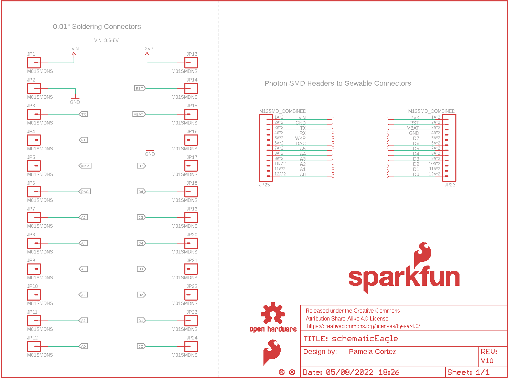
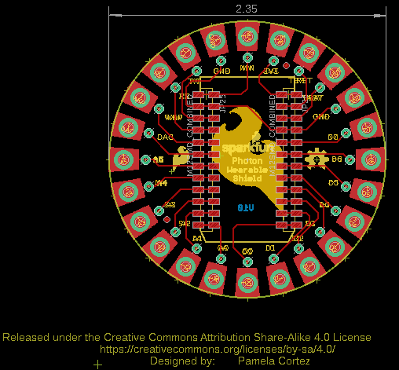
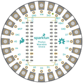
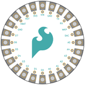
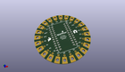
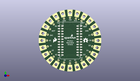
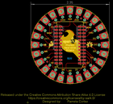

Contents
========

* [PRS13328 > Photon Wearable Shield](#prs13328--photon-wearable-shield)
	* [Schematic](#schematic)
	* [PCB](#pcb)
	* [Interactive BOM](#interactive-bom)
	* [OOMP Parts](#oomp-parts)
	* [Images](#images)
	* [Tags](#tags)
  
![][im]
# PRS13328 > Photon Wearable Shield

- ID: PROJ-SPAR-13328-STAN-01
- Hex ID: PRS13328
- Name: Sparkfun
- Description: Sparkfun
- Long Link: [http://oom.lt/PROJ-SPAR-13328-STAN-01](http://oom.lt/PROJ-SPAR-13328-STAN-01)
- Short Link: [http://oom.lt/PRS13328](http://oom.lt/PRS13328)

## Schematic
  

## PCB
  

## Interactive BOM

- Interactive BOM page: [ibom.html](https://htmlpreview.github.io/?https://github.com/oomlout/oomlout_OOMP_projects/blob/main/PROJ-SPAR-13328-STAN-01/kicad/bom/ibom.html)

## OOMP Parts
  

|OOMP ID|Name|Identifier|
| :---: | :---: | :---: |
|UNMATCHED-UNMATCHED-X-UNMATCHED-01||FRAME1|
|HEAD-I01-X-PI01-01||JP1, JP2, JP3, JP4, JP5, JP6, JP7, JP8, JP9, JP10, JP11, JP12, JP13, JP14, JP15, JP16, JP17, JP18, JP19, JP20, JP21, JP22, JP23, JP24|
|[HEAD-I01-X-PI12-01](https://github.com/oomlout/oomlout_OOMP_parts/tree/main/HEAD-I01-X-PI12-01/)|[2.54 mm 12 Pin Header](https://github.com/oomlout/oomlout_OOMP_parts/tree/main/HEAD-I01-X-PI12-01/)|[JP25, JP26](https://github.com/oomlout/oomlout_OOMP_parts/tree/main/HEAD-I01-X-PI12-01/)|

## Images
  
  

|bominteractivefront|bominteractiveback|kicadPcb3d|kicadPcb3dFront|kicadPcb3dBack|eagleImage|eagleSchemImage|
| :---: | :---: | :---: | :---: | :---: | :---: | :---: |
||||||||

## Tags

- hexID: PRS13328
- oompType: PROJ
- oompSize: SPAR
- oompColor: 13328
- oompDesc: STAN
- oompIndex: 01
- oompName: Photon Wearable Shield
- sources: All source files from https://github.com/sparkfun/Photon_Wearable_Shield (source licence details in srcLicense.md)
- linkBuyPage: https://www.sparkfun.com/products/13328
- oompID: PROJ-SPAR-13328-STAN-01
- oompParts: FRAME1,UNMATCHED-UNMATCHED-X-UNMATCHED-01
- oompParts: JP1,HEAD-I01-X-PI01-01
- oompParts: JP2,HEAD-I01-X-PI01-01
- oompParts: JP3,HEAD-I01-X-PI01-01
- oompParts: JP4,HEAD-I01-X-PI01-01
- oompParts: JP5,HEAD-I01-X-PI01-01
- oompParts: JP6,HEAD-I01-X-PI01-01
- oompParts: JP7,HEAD-I01-X-PI01-01
- oompParts: JP8,HEAD-I01-X-PI01-01
- oompParts: JP9,HEAD-I01-X-PI01-01
- oompParts: JP10,HEAD-I01-X-PI01-01
- oompParts: JP11,HEAD-I01-X-PI01-01
- oompParts: JP12,HEAD-I01-X-PI01-01
- oompParts: JP13,HEAD-I01-X-PI01-01
- oompParts: JP14,HEAD-I01-X-PI01-01
- oompParts: JP15,HEAD-I01-X-PI01-01
- oompParts: JP16,HEAD-I01-X-PI01-01
- oompParts: JP17,HEAD-I01-X-PI01-01
- oompParts: JP18,HEAD-I01-X-PI01-01
- oompParts: JP19,HEAD-I01-X-PI01-01
- oompParts: JP20,HEAD-I01-X-PI01-01
- oompParts: JP21,HEAD-I01-X-PI01-01
- oompParts: JP22,HEAD-I01-X-PI01-01
- oompParts: JP23,HEAD-I01-X-PI01-01
- oompParts: JP24,HEAD-I01-X-PI01-01
- oompParts: JP25,HEAD-I01-X-PI12-01
- oompParts: JP26,HEAD-I01-X-PI12-01
- rawParts: FID1,FIDUCIAL1X2,FIDUCIAL1X2,FIDUCIAL-1X2,Fiducial Alignment Points,,,,
- rawParts: FID2,FIDUCIAL1X2,FIDUCIAL1X2,FIDUCIAL-1X2,Fiducial Alignment Points,,,,
- rawParts: FRAME1,,FRAME-LETTER,CREATIVE_COMMONS,Schematic Frame,NAME,,v01,
- rawParts: J1,PAD,PAD,PAD-LONG-2-SIDED,,,,,
- rawParts: J2,PAD,PAD,PAD-LONG-2-SIDED,,,,,
- rawParts: J3,PAD,PAD,PAD-LONG-2-SIDED,,,,,
- rawParts: J4,PAD,PAD,PAD-LONG-2-SIDED,,,,,
- rawParts: J5,PAD,PAD,PAD-LONG-2-SIDED,,,,,
- rawParts: J6,PAD,PAD,PAD-LONG-2-SIDED,,,,,
- rawParts: J7,PAD,PAD,PAD-LONG-2-SIDED,,,,,
- rawParts: J8,PAD,PAD,PAD-LONG-2-SIDED,,,,,
- rawParts: J9,PAD,PAD,PAD-LONG-2-SIDED,,,,,
- rawParts: J10,PAD,PAD,PAD-LONG-2-SIDED,,,,,
- rawParts: J11,PAD,PAD,PAD-LONG-2-SIDED,,,,,
- rawParts: J12,PAD,PAD,PAD-LONG-2-SIDED,,,,,
- rawParts: J13,PAD,PAD,PAD-LONG-2-SIDED,,,,,
- rawParts: J14,PAD,PAD,PAD-LONG-2-SIDED,,,,,
- rawParts: J15,PAD,PAD,PAD-LONG-2-SIDED,,,,,
- rawParts: J16,PAD,PAD,PAD-LONG-2-SIDED,,,,,
- rawParts: J17,PAD,PAD,PAD-LONG-2-SIDED,,,,,
- rawParts: J18,PAD,PAD,PAD-LONG-2-SIDED,,,,,
- rawParts: J19,PAD,PAD,PAD-LONG-2-SIDED,,,,,
- rawParts: J20,PAD,PAD,PAD-LONG-2-SIDED,,,,,
- rawParts: J21,PAD,PAD,PAD-LONG-2-SIDED,,,,,
- rawParts: J22,PAD,PAD,PAD-LONG-2-SIDED,,,,,
- rawParts: J23,PAD,PAD,PAD-LONG-2-SIDED,,,,,
- rawParts: J24,PAD,PAD,PAD-LONG-2-SIDED,,,,,
- rawParts: JP1,M01SMDNS,M01SMDNS,1X01NS,Header 1,,,,
- rawParts: JP2,M01SMDNS,M01SMDNS,1X01NS,Header 1,,,,
- rawParts: JP3,M01SMDNS,M01SMDNS,1X01NS,Header 1,,,,
- rawParts: JP4,M01SMDNS,M01SMDNS,1X01NS,Header 1,,,,
- rawParts: JP5,M01SMDNS,M01SMDNS,1X01NS,Header 1,,,,
- rawParts: JP6,M01SMDNS,M01SMDNS,1X01NS,Header 1,,,,
- rawParts: JP7,M01SMDNS,M01SMDNS,1X01NS,Header 1,,,,
- rawParts: JP8,M01SMDNS,M01SMDNS,1X01NS,Header 1,,,,
- rawParts: JP9,M01SMDNS,M01SMDNS,1X01NS,Header 1,,,,
- rawParts: JP10,M01SMDNS,M01SMDNS,1X01NS,Header 1,,,,
- rawParts: JP11,M01SMDNS,M01SMDNS,1X01NS,Header 1,,,,
- rawParts: JP12,M01SMDNS,M01SMDNS,1X01NS,Header 1,,,,
- rawParts: JP13,M01SMDNS,M01SMDNS,1X01NS,Header 1,,,,
- rawParts: JP14,M01SMDNS,M01SMDNS,1X01NS,Header 1,,,,
- rawParts: JP15,M01SMDNS,M01SMDNS,1X01NS,Header 1,,,,
- rawParts: JP16,M01SMDNS,M01SMDNS,1X01NS,Header 1,,,,
- rawParts: JP17,M01SMDNS,M01SMDNS,1X01NS,Header 1,,,,
- rawParts: JP18,M01SMDNS,M01SMDNS,1X01NS,Header 1,,,,
- rawParts: JP19,M01SMDNS,M01SMDNS,1X01NS,Header 1,,,,
- rawParts: JP20,M01SMDNS,M01SMDNS,1X01NS,Header 1,,,,
- rawParts: JP21,M01SMDNS,M01SMDNS,1X01NS,Header 1,,,,
- rawParts: JP22,M01SMDNS,M01SMDNS,1X01NS,Header 1,,,,
- rawParts: JP23,M01SMDNS,M01SMDNS,1X01NS,Header 1,,,,
- rawParts: JP24,M01SMDNS,M01SMDNS,1X01NS,Header 1,,,,
- rawParts: JP25,M12SMD_COMBINED,M12SMD_COMBINED,1X12_SMD_COMBINED,Header 12,,CONN-12614,,
- rawParts: JP26,M12SMD_COMBINED,M12SMD_COMBINED,1X12_SMD_COMBINED,Header 12,,CONN-12614,,
- rawParts: LOGO1,SFE_LOGO_FLAME.2_INCH,SFE_LOGO_FLAME.2_INCH,SFE_LOGO_FLAME_.2,SFE Logo, flame only,,,,
- rawParts: LOGO2,OSHW-LOGOM,OSHW-LOGOM,OSHW-LOGO-M,Open Source Hardware Logo,,,,
- rawParts: LOGO3,SFE_LOGO_NAME_FLAME.1_INCH,SFE_LOGO_NAME_FLAME.1_INCH,SFE_LOGO_NAME_FLAME_.1,SFE Logo, name and flame,,,,

[im]: kicadPcb3d_450.png
