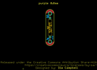
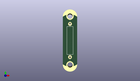
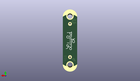
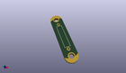

Contents
========

* [PROJ-SPAR-13343-STAN-01>LilyPad Reed Switch](#proj-spar-13343-stan-01lilypad-reed-switch)
	* [Images](#images)
	* [Interactive BOM](#interactive-bom)
	* [OOMP Parts](#oomp-parts)
	* [Tags](#tags)
  
![][im]
# PROJ-SPAR-13343-STAN-01>LilyPad Reed Switch

- ID: PROJ-SPAR-13343-STAN-01
- Hex ID: PRS13343
- Name: LilyPad Reed Switch
- Description: 

## Images
  
  

|eagleImage|kicadPcb3dFront|kicadPcb3dBack|kicadPcb3d|
| :---: | :---: | :---: | :---: |
|||||

## Interactive BOM

- Interactive BOM page: [ibom.html](kicad/bom/ibom.html)

## OOMP Parts
  

|OOMP Parts|
| :---: |
|UNMATCHED-UNMATCHED-X-UNMATCHED-01, S1, 0.0, 0.0, 270,S1, REED, REED_SWITCH_PLASTIC, SparkFun-Electromechanical, (0, 0), R270|
|UNMATCHED-UNMATCHED-X-UNMATCHED-01, SLIDEOFF, 0.0, -12.827, 0,SLIDEOFF, SEWTAP8, PETAL-MEDIUM-2SIDE, LilyPad-Wearables, (0, -0.505), R0|
|UNMATCHED-UNMATCHED-X-UNMATCHED-01, SLIDEON, 0.0, 12.827, 180,SLIDEON, SEWTAP8, PETAL-MEDIUM-2SIDE, LilyPad-Wearables, (0, 0.505), R180|

## Tags

- hexID: PRS13343
- oompType: PROJ
- oompSize: SPAR
- oompColor: 13343
- oompDesc: STAN
- oompIndex: 01
- oompName: LilyPad Reed Switch
- sources: All source files from https://github.com/sparkfun/LilyPad_Reed_Switch (source licence details in srcLicense.md)
- linkBuyPage: https://www.sparkfun.com/products/13343
- oompPart: UNMATCHED-UNMATCHED-X-UNMATCHED-01, S1, 0.0, 0.0, 270
- oompPart: UNMATCHED-UNMATCHED-X-UNMATCHED-01, SLIDEOFF, 0.0, -12.827, 0
- oompPart: UNMATCHED-UNMATCHED-X-UNMATCHED-01, SLIDEON, 0.0, 12.827, 180
- rawPart: S1, REED, REED_SWITCH_PLASTIC, SparkFun-Electromechanical, (0, 0), R270
- rawPart: SLIDEOFF, SEWTAP8, PETAL-MEDIUM-2SIDE, LilyPad-Wearables, (0, -0.505), R0
- rawPart: SLIDEON, SEWTAP8, PETAL-MEDIUM-2SIDE, LilyPad-Wearables, (0, 0.505), R180
- oompID: PROJ-SPAR-13343-STAN-01

[im]: kicadPcb3d_450.png
