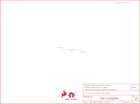

Contents
========

* [PRS13343 > Sparkfun](#prs13343--sparkfun)
	* [Schematic](#schematic)
	* [Interactive BOM](#interactive-bom)
	* [OOMP Parts](#oomp-parts)
	* [Images](#images)
	* [Tags](#tags)
  
![][im]
# PRS13343 > Sparkfun

- ID: PROJ-SPAR-13343-STAN-01
- Hex ID: PRS13343
- Name: Sparkfun
- Description: Sparkfun
- Long Link: [http://oom.lt/PROJ-SPAR-13343-STAN-01](http://oom.lt/PROJ-SPAR-13343-STAN-01)
- Long Link: [http://oom.lt/PRS13343](http://oom.lt/PRS13343)

## Schematic
  
![][schem]
## Interactive BOM

- Interactive BOM page: [ibom.html](https://htmlpreview.github.io/?https://github.com/oomlout/oomlout_OOMP_projects/blob/main/PROJ-SPAR-13343-STAN-01/kicad/bom/ibom.html)

## OOMP Parts
  

|OOMP Parts|
| :---: |
|FRAME1,UNMATCHED-UNMATCHED-UNMATCHED-UNMATCHED-UNMATCHED,FRAME1,,FRAME-LETTER,CREATIVE_COMMONS,Schematic Frame,NAME,,v01,|
|LOGO1,UNMATCHED-UNMATCHED-UNMATCHED-UNMATCHED-UNMATCHED,LOGO1,OSHW-LOGOS-COPPER,OSHW-LOGOS-COPPER,OSHW-LOGO-S_COPPER,Open Source Hardware Logo,,,,|
|LOGO2,UNMATCHED-UNMATCHED-UNMATCHED-UNMATCHED-UNMATCHED,LOGO2,SFE_LOGO_FLAME.1COP,SFE_LOGO_FLAME.1COP,SFE_LOGO_FLAME_COPPER_.1,SFE Logo, flame only,,,,|
|S1,UNMATCHED-UNMATCHED-UNMATCHED-UNMATCHED-UNMATCHED,S1,REED,SWITCH-MOMENTARY-2PTH_REED2,REED_SWITCH_PLASTIC,Various NO switches- pushbuttons, reed, etc,,SWCH-10467,,|
|SLIDEOFF,UNMATCHED-UNMATCHED-UNMATCHED-UNMATCHED-UNMATCHED,SLIDEOFF,SEWTAP8,SEWTAP8,PETAL-MEDIUM-2SIDE,Sew Taps for LilyPad Boards.,,,,|
|SLIDEON,UNMATCHED-UNMATCHED-UNMATCHED-UNMATCHED-UNMATCHED,SLIDEON,SEWTAP8,SEWTAP8,PETAL-MEDIUM-2SIDE,Sew Taps for LilyPad Boards.,,,,|
|U$1,UNMATCHED-UNMATCHED-UNMATCHED-UNMATCHED-UNMATCHED,U$1,LOGO-LPLP,LOGO-LPLP,LOGO-LILYPAD,,,,,|

## Images
  
  

|kicadPcb3d|kicadPcb3dFront|kicadPcb3dBack|eagleImage|eagleSchemImage|
| :---: | :---: | :---: | :---: | :---: |
||||||

## Tags

- hexID: PRS13343
- oompType: PROJ
- oompSize: SPAR
- oompColor: 13343
- oompDesc: STAN
- oompIndex: 01
- oompName: LilyPad Reed Switch
- sources: All source files from https://github.com/sparkfun/LilyPad_Reed_Switch (source licence details in srcLicense.md)
- linkBuyPage: https://www.sparkfun.com/products/13343
- oompID: PROJ-SPAR-13343-STAN-01
- oompParts: FRAME1,UNMATCHED-UNMATCHED-UNMATCHED-UNMATCHED-UNMATCHED
- oompParts: LOGO1,UNMATCHED-UNMATCHED-UNMATCHED-UNMATCHED-UNMATCHED
- oompParts: LOGO2,UNMATCHED-UNMATCHED-UNMATCHED-UNMATCHED-UNMATCHED
- oompParts: S1,UNMATCHED-UNMATCHED-UNMATCHED-UNMATCHED-UNMATCHED
- oompParts: SLIDEOFF,UNMATCHED-UNMATCHED-UNMATCHED-UNMATCHED-UNMATCHED
- oompParts: SLIDEON,UNMATCHED-UNMATCHED-UNMATCHED-UNMATCHED-UNMATCHED
- oompParts: U$1,UNMATCHED-UNMATCHED-UNMATCHED-UNMATCHED-UNMATCHED
- rawParts: FRAME1,,FRAME-LETTER,CREATIVE_COMMONS,Schematic Frame,NAME,,v01,
- rawParts: LOGO1,OSHW-LOGOS-COPPER,OSHW-LOGOS-COPPER,OSHW-LOGO-S_COPPER,Open Source Hardware Logo,,,,
- rawParts: LOGO2,SFE_LOGO_FLAME.1COP,SFE_LOGO_FLAME.1COP,SFE_LOGO_FLAME_COPPER_.1,SFE Logo, flame only,,,,
- rawParts: S1,REED,SWITCH-MOMENTARY-2PTH_REED2,REED_SWITCH_PLASTIC,Various NO switches- pushbuttons, reed, etc,,SWCH-10467,,
- rawParts: SLIDEOFF,SEWTAP8,SEWTAP8,PETAL-MEDIUM-2SIDE,Sew Taps for LilyPad Boards.,,,,
- rawParts: SLIDEON,SEWTAP8,SEWTAP8,PETAL-MEDIUM-2SIDE,Sew Taps for LilyPad Boards.,,,,
- rawParts: U$1,LOGO-LPLP,LOGO-LPLP,LOGO-LILYPAD,,,,,

[im]: kicadPcb3d_450.png
[schem]: eagleSchemImage.png
