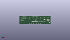
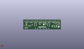
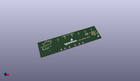

Contents
========

* [PROJ-SPAR-13582-STAN-01>Line Follower Array](#proj-spar-13582-stan-01line-follower-array)
	* [Images](#images)
	* [Interactive BOM](#interactive-bom)
	* [OOMP Parts](#oomp-parts)
	* [Tags](#tags)
  
![][im]
# PROJ-SPAR-13582-STAN-01>Line Follower Array

- ID: PROJ-SPAR-13582-STAN-01
- Hex ID: PRS13582
- Name: Line Follower Array
- Description: 

## Images
  
  

|eagleImage|kicadPcb3dFront|kicadPcb3dBack|kicadPcb3d|
| :---: | :---: | :---: | :---: |
|||||

## Interactive BOM

- Interactive BOM page: [ibom.html](kicad/bom/ibom.html)

## OOMP Parts
  

|OOMP Parts|
| :---: |
|CAPC-0603-X-UNMATCHED-01, C1, 12.382499999999999, 7.46125, M0,C1, 1.0uF, 0603-CAP, SparkFun-Capacitors, (0.4875, 0.29375), MR0|
|CAPC-0603-X-UNMATCHED-01, C2, 12.382499999999999, 9.04875, M0,C2, 1.0uF, 0603-CAP, SparkFun-Capacitors, (0.4875, 0.35625), MR0|
|CAPC-0603-X-UNMATCHED-01, C3, 45.72, 17.4625, M180,C3, 1.0uF, 0603-CAP, SparkFun-Capacitors, (1.8, 0.6875), MR180|
|CAPC-0603-X-UF22D-01, C4, 90.16999999999999, 10.795, M270,C4, 2.2uF, 0603-CAP, SparkFun-Capacitors, (3.55, 0.425), MR270|
|CAPE-0603-X-UNMATCHED-01, C5, 85.09, 10.16, M270,C5, 470pF, 0603-CAP, SparkFun-Capacitors, (3.35, 0.4), MR270|
|CAPE-0603-X-UNMATCHED-01, C6, 54.9275, 18.0975, M180,C6, 470pF, 0603-CAP, SparkFun-Capacitors, (2.1625, 0.7125), MR180|
|CAPC-0603-X-UF22D-01, C7, 91.44, 10.795, M270,C7, 2.2uF, 0603-CAP, SparkFun-Capacitors, (3.6, 0.425), MR270|
|CAPC-UNMATCHED-X-UNMATCHED-01, C8, 11.7475, 10.95375, M180,C8, 10uF, EIA3216, SparkFun-Capacitors, (0.4625, 0.43125), MR180|
|UNMATCHED-UNMATCHED-X-UNMATCHED-01, D1, 97.78999999999999, 20.32, M180,D1, Green, LED-1206-BOTTOM, SparkFun-LED, (3.85, 0.8), MR180|
|UNMATCHED-UNMATCHED-X-UNMATCHED-01, D2, 85.09, 20.32, M180,D2, Green, LED-1206-BOTTOM, SparkFun-LED, (3.35, 0.8), MR180|
|UNMATCHED-UNMATCHED-X-UNMATCHED-01, D3, 72.39, 20.32, M180,D3, Green, LED-1206-BOTTOM, SparkFun-LED, (2.85, 0.8), MR180|
|UNMATCHED-UNMATCHED-X-UNMATCHED-01, D4, 59.69, 20.32, M180,D4, Green, LED-1206-BOTTOM, SparkFun-LED, (2.35, 0.8), MR180|
|UNMATCHED-UNMATCHED-X-UNMATCHED-01, D5, 46.99, 20.32, M180,D5, Green, LED-1206-BOTTOM, SparkFun-LED, (1.85, 0.8), MR180|
|UNMATCHED-UNMATCHED-X-UNMATCHED-01, D6, 34.29, 20.32, M180,D6, Green, LED-1206-BOTTOM, SparkFun-LED, (1.35, 0.8), MR180|
|UNMATCHED-UNMATCHED-X-UNMATCHED-01, D7, 21.59, 20.32, M180,D7, Green, LED-1206-BOTTOM, SparkFun-LED, (0.85, 0.8), MR180|
|UNMATCHED-UNMATCHED-X-UNMATCHED-01, D8, 8.889999999999999, 20.32, M180,D8, Green, LED-1206-BOTTOM, SparkFun-LED, (0.35, 0.8), MR180|
|UNMATCHED-UNMATCHED-X-UNMATCHED-01, D9, 6.35, 15.239999999999998, M180,D9, Green, LED-1206-BOTTOM, SparkFun-LED, (0.25, 0.6), MR180|
|ERROR, JP1 FEMALE 2x3, 0, 0, 0,JP1, FEMALE, 2x3, 2X3, SparkFun-Connectors, (3.9, 0.45), R90|
|HEAD-I01-X-PI01-01, JP2, 104.13999999999999, 11.43, 0,JP2, INT, 1X01, SparkFun-Connectors, (4.1, 0.45), R0|
|UNMATCHED-UNMATCHED-X-UNMATCHED-01, Q1, 12.7, 14.76375, M0,Q1, MOSFET-NCHANNEL2N7002PW, SOT323, SparkFun-DiscreteSemi, (0.5, 0.58125), MR0|
|RESE-0603-X-UNMATCHED-01, R1, 13.97, 5.87375, M180,R1, 4.7K, 0603-RES, SparkFun-Resistors, (0.55, 0.23125), MR180|
|<table><tr><td></td><td> R2</td><td>[RESE-0603-X-O331-01 SMD (0603) 330 Ohm Resistor](https://github.com/oomlout/oomlout_OOMP_parts/tree/main/RESE-0603-X-O331-01/)</td><td>[R6331](https://github.com/oomlout/oomlout_OOMP_parts/tree/main/RESE-0603-X-O331-01/)</td></tr></table>|
|RESE-0603-X-UNMATCHED-01, R3, 92.71, 25.4, M180,R3, 100, 0603-RES, SparkFun-Resistors, (3.65, 1), MR180|
|RESE-0603-X-UNMATCHED-01, R4, 102.86999999999999, 22.86, M180,R4, 68.1k, 0603-RES, SparkFun-Resistors, (4.05, 0.9), MR180|
|RESE-0603-X-UNMATCHED-01, R5, 92.71, 20.32, M180,R5, 1K, 0603-RES, SparkFun-Resistors, (3.65, 0.8), MR180|
|RESE-0603-X-UNMATCHED-01, R6, 80.00999999999999, 20.32, M180,R6, 1K, 0603-RES, SparkFun-Resistors, (3.15, 0.8), MR180|
|RESE-0603-X-UNMATCHED-01, R7, 67.30999999999999, 20.32, M180,R7, 1K, 0603-RES, SparkFun-Resistors, (2.65, 0.8), MR180|
|RESE-0603-X-UNMATCHED-01, R8, 54.60999999999999, 20.32, M180,R8, 1K, 0603-RES, SparkFun-Resistors, (2.15, 0.8), MR180|
|RESE-0603-X-UNMATCHED-01, R9, 80.00999999999999, 25.4, M180,R9, 100, 0603-RES, SparkFun-Resistors, (3.15, 1), MR180|
|RESE-0603-X-UNMATCHED-01, R10, 90.16999999999999, 22.86, M180,R10, 68.1k, 0603-RES, SparkFun-Resistors, (3.55, 0.9), MR180|
|RESE-0603-X-UNMATCHED-01, R11, 67.30999999999999, 25.4, M180,R11, 100, 0603-RES, SparkFun-Resistors, (2.65, 1), MR180|
|RESE-0603-X-UNMATCHED-01, R12, 77.46999999999998, 22.86, M180,R12, 68.1k, 0603-RES, SparkFun-Resistors, (3.05, 0.9), MR180|
|RESE-0603-X-UNMATCHED-01, R13, 54.60999999999999, 25.4, M180,R13, 100, 0603-RES, SparkFun-Resistors, (2.15, 1), MR180|
|RESE-0603-X-UNMATCHED-01, R14, 64.77, 22.86, M180,R14, 68.1k, 0603-RES, SparkFun-Resistors, (2.55, 0.9), MR180|
|RESE-UNMATCHED-X-UNMATCHED-01, R16, 15.239999999999998, 18.0975, 0,R16, TSR-3386, 3386U, SparkFun-Electromechanical, (0.6, 0.7125), R0|
|RESE-0603-X-UNMATCHED-01, R17, 41.91, 20.32, M180,R17, 1K, 0603-RES, SparkFun-Resistors, (1.65, 0.8), MR180|
|RESE-0603-X-UNMATCHED-01, R18, 29.209999999999997, 20.32, M180,R18, 1K, 0603-RES, SparkFun-Resistors, (1.15, 0.8), MR180|
|RESE-0603-X-UNMATCHED-01, R19, 16.509999999999998, 21.2725, M180,R19, 1K, 0603-RES, SparkFun-Resistors, (0.65, 0.8375), MR180|
|RESE-0603-X-UNMATCHED-01, R20, 3.8099999999999996, 20.32, M180,R20, 1K, 0603-RES, SparkFun-Resistors, (0.15, 0.8), MR180|
|RESE-0603-X-UNMATCHED-01, R21, 41.91, 25.4, M180,R21, 100, 0603-RES, SparkFun-Resistors, (1.65, 1), MR180|
|RESE-0603-X-UNMATCHED-01, R22, 52.06999999999999, 22.86, M180,R22, 68.1k, 0603-RES, SparkFun-Resistors, (2.05, 0.9), MR180|
|RESE-0603-X-UNMATCHED-01, R23, 29.209999999999997, 25.4, M180,R23, 100, 0603-RES, SparkFun-Resistors, (1.15, 1), MR180|
|RESE-0603-X-UNMATCHED-01, R24, 16.509999999999998, 25.4, M180,R24, 100, 0603-RES, SparkFun-Resistors, (0.65, 1), MR180|
|RESE-0603-X-UNMATCHED-01, R25, 3.8099999999999996, 25.4, M180,R25, 100, 0603-RES, SparkFun-Resistors, (0.15, 1), MR180|
|RESE-0603-X-UNMATCHED-01, R26, 39.37, 22.86, M180,R26, 68.1k, 0603-RES, SparkFun-Resistors, (1.55, 0.9), MR180|
|RESE-0603-X-UNMATCHED-01, R27, 26.669999999999998, 22.86, M180,R27, 68.1k, 0603-RES, SparkFun-Resistors, (1.05, 0.9), MR180|
|RESE-0603-X-UNMATCHED-01, R28, 13.97, 22.86, M180,R28, 68.1k, 0603-RES, SparkFun-Resistors, (0.55, 0.9), MR180|
|RESE-0603-X-UNMATCHED-01, R30, 80.645, 13.652499999999998, M90,R30, 4.7K, 0603-RES, SparkFun-Resistors, (3.175, 0.5375), MR90|
|RESE-0603-X-UNMATCHED-01, R31, 50.4825, 18.0975, M180,R31, 100, 0603-RES, SparkFun-Resistors, (1.9875, 0.7125), MR180|
|RESE-0603-X-UNMATCHED-01, R32, 82.23249999999999, 13.652499999999998, M90,R32, 4.7K, 0603-RES, SparkFun-Resistors, (3.2375, 0.5375), MR90|
|RESE-0603-X-UNMATCHED-01, R33, 61.912499999999994, 16.509999999999998, M0,R33, 4.7K, 0603-RES, SparkFun-Resistors, (2.4375, 0.65), MR0|
|RESE-0603-X-UNMATCHED-01, R34, 41.91, 18.256249999999998, M0,R34, 4.7K, 0603-RES, SparkFun-Resistors, (1.65, 0.71875), MR0|
|UNMATCHED-UNMATCHED-X-UNMATCHED-01, U1, 48.26, 13.97, M90,U1, SX1509, QFN-28, SparkFun-DigitalIC, (1.9, 0.55), MR90|
|UNMATCHED-UNMATCHED-X-UNMATCHED-01, U2, 72.39, 13.334999999999999, M270,U2, 74AC125, SO14, SparkFun-DigitalIC, (2.85, 0.525), MR270|
|UNMATCHED-UNMATCHED-X-UNMATCHED-01, U3, 87.63, 10.16, M0,U3, 3.3V/150mA, SOT23-5, SparkFun-PowerIC, (3.45, 0.4), MR0|
|UNMATCHED-UNMATCHED-X-UNMATCHED-01, U5, 21.43125, 9.36625, M90,U5, LM1117, SOT223, SparkFun-PowerIC, (0.84375, 0.36875), MR90|
|UNMATCHED-UNMATCHED-X-UNMATCHED-01, U6, 34.29, 13.334999999999999, M270,U6, 74AC125, SO14, SparkFun-DigitalIC, (1.35, 0.525), MR270|
|UNMATCHED-UNMATCHED-X-UNMATCHED-01, U101, 97.78999999999999, 24.13, M180,U101, QRE1113, QRE1113, SparkFun-Sensors, (3.85, 0.95), MR180|
|UNMATCHED-UNMATCHED-X-UNMATCHED-01, U102, 85.09, 24.13, M180,U102, QRE1113, QRE1113, SparkFun-Sensors, (3.35, 0.95), MR180|
|UNMATCHED-UNMATCHED-X-UNMATCHED-01, U103, 72.39, 24.13, M180,U103, QRE1113, QRE1113, SparkFun-Sensors, (2.85, 0.95), MR180|
|UNMATCHED-UNMATCHED-X-UNMATCHED-01, U104, 59.69, 24.13, M180,U104, QRE1113, QRE1113, SparkFun-Sensors, (2.35, 0.95), MR180|
|UNMATCHED-UNMATCHED-X-UNMATCHED-01, U105, 46.99, 24.13, M180,U105, QRE1113, QRE1113, SparkFun-Sensors, (1.85, 0.95), MR180|
|UNMATCHED-UNMATCHED-X-UNMATCHED-01, U106, 34.29, 24.13, M180,U106, QRE1113, QRE1113, SparkFun-Sensors, (1.35, 0.95), MR180|
|UNMATCHED-UNMATCHED-X-UNMATCHED-01, U107, 21.59, 24.13, M180,U107, QRE1113, QRE1113, SparkFun-Sensors, (0.85, 0.95), MR180|
|UNMATCHED-UNMATCHED-X-UNMATCHED-01, U108, 8.889999999999999, 24.13, M180,U108, QRE1113, QRE1113, SparkFun-Sensors, (0.35, 0.95), MR180|

## Tags

- hexID: PRS13582
- oompType: PROJ
- oompSize: SPAR
- oompColor: 13582
- oompDesc: STAN
- oompIndex: 01
- oompName: Line Follower Array
- sources: All source files from https://github.com/sparkfun/Line_Follower_Array (source licence details in srcLicense.md)
- linkBuyPage: https://www.sparkfun.com/products/13582
- oompPart: CAPC-0603-X-UNMATCHED-01, C1, 12.382499999999999, 7.46125, M0
- oompPart: CAPC-0603-X-UNMATCHED-01, C2, 12.382499999999999, 9.04875, M0
- oompPart: CAPC-0603-X-UNMATCHED-01, C3, 45.72, 17.4625, M180
- oompPart: CAPC-0603-X-UF22D-01, C4, 90.16999999999999, 10.795, M270
- oompPart: CAPE-0603-X-UNMATCHED-01, C5, 85.09, 10.16, M270
- oompPart: CAPE-0603-X-UNMATCHED-01, C6, 54.9275, 18.0975, M180
- oompPart: CAPC-0603-X-UF22D-01, C7, 91.44, 10.795, M270
- oompPart: CAPC-UNMATCHED-X-UNMATCHED-01, C8, 11.7475, 10.95375, M180
- oompPart: UNMATCHED-UNMATCHED-X-UNMATCHED-01, D1, 97.78999999999999, 20.32, M180
- oompPart: UNMATCHED-UNMATCHED-X-UNMATCHED-01, D2, 85.09, 20.32, M180
- oompPart: UNMATCHED-UNMATCHED-X-UNMATCHED-01, D3, 72.39, 20.32, M180
- oompPart: UNMATCHED-UNMATCHED-X-UNMATCHED-01, D4, 59.69, 20.32, M180
- oompPart: UNMATCHED-UNMATCHED-X-UNMATCHED-01, D5, 46.99, 20.32, M180
- oompPart: UNMATCHED-UNMATCHED-X-UNMATCHED-01, D6, 34.29, 20.32, M180
- oompPart: UNMATCHED-UNMATCHED-X-UNMATCHED-01, D7, 21.59, 20.32, M180
- oompPart: UNMATCHED-UNMATCHED-X-UNMATCHED-01, D8, 8.889999999999999, 20.32, M180
- oompPart: UNMATCHED-UNMATCHED-X-UNMATCHED-01, D9, 6.35, 15.239999999999998, M180
- oompPart: SKIP-UNMATCHED-X-UNMATCHED-01, FID1, 2.54, 2.54, M0
- oompPart: SKIP-UNMATCHED-X-UNMATCHED-01, FID2, 104.13999999999999, 20.32, M0
- oompPart: ERROR, JP1 FEMALE 2x3, 0, 0, 0
- oompPart: HEAD-I01-X-PI01-01, JP2, 104.13999999999999, 11.43, 0
- oompPart: UNMATCHED-UNMATCHED-X-UNMATCHED-01, Q1, 12.7, 14.76375, M0
- oompPart: RESE-0603-X-UNMATCHED-01, R1, 13.97, 5.87375, M180
- oompPart: RESE-0603-X-O331-01, R2, 3.8099999999999996, 17.4625, M0
- oompPart: RESE-0603-X-UNMATCHED-01, R3, 92.71, 25.4, M180
- oompPart: RESE-0603-X-UNMATCHED-01, R4, 102.86999999999999, 22.86, M180
- oompPart: RESE-0603-X-UNMATCHED-01, R5, 92.71, 20.32, M180
- oompPart: RESE-0603-X-UNMATCHED-01, R6, 80.00999999999999, 20.32, M180
- oompPart: RESE-0603-X-UNMATCHED-01, R7, 67.30999999999999, 20.32, M180
- oompPart: RESE-0603-X-UNMATCHED-01, R8, 54.60999999999999, 20.32, M180
- oompPart: RESE-0603-X-UNMATCHED-01, R9, 80.00999999999999, 25.4, M180
- oompPart: RESE-0603-X-UNMATCHED-01, R10, 90.16999999999999, 22.86, M180
- oompPart: RESE-0603-X-UNMATCHED-01, R11, 67.30999999999999, 25.4, M180
- oompPart: RESE-0603-X-UNMATCHED-01, R12, 77.46999999999998, 22.86, M180
- oompPart: RESE-0603-X-UNMATCHED-01, R13, 54.60999999999999, 25.4, M180
- oompPart: RESE-0603-X-UNMATCHED-01, R14, 64.77, 22.86, M180
- oompPart: RESE-UNMATCHED-X-UNMATCHED-01, R16, 15.239999999999998, 18.0975, 0
- oompPart: RESE-0603-X-UNMATCHED-01, R17, 41.91, 20.32, M180
- oompPart: RESE-0603-X-UNMATCHED-01, R18, 29.209999999999997, 20.32, M180
- oompPart: RESE-0603-X-UNMATCHED-01, R19, 16.509999999999998, 21.2725, M180
- oompPart: RESE-0603-X-UNMATCHED-01, R20, 3.8099999999999996, 20.32, M180
- oompPart: RESE-0603-X-UNMATCHED-01, R21, 41.91, 25.4, M180
- oompPart: RESE-0603-X-UNMATCHED-01, R22, 52.06999999999999, 22.86, M180
- oompPart: RESE-0603-X-UNMATCHED-01, R23, 29.209999999999997, 25.4, M180
- oompPart: RESE-0603-X-UNMATCHED-01, R24, 16.509999999999998, 25.4, M180
- oompPart: RESE-0603-X-UNMATCHED-01, R25, 3.8099999999999996, 25.4, M180
- oompPart: RESE-0603-X-UNMATCHED-01, R26, 39.37, 22.86, M180
- oompPart: RESE-0603-X-UNMATCHED-01, R27, 26.669999999999998, 22.86, M180
- oompPart: RESE-0603-X-UNMATCHED-01, R28, 13.97, 22.86, M180
- oompPart: RESE-0603-X-UNMATCHED-01, R30, 80.645, 13.652499999999998, M90
- oompPart: RESE-0603-X-UNMATCHED-01, R31, 50.4825, 18.0975, M180
- oompPart: RESE-0603-X-UNMATCHED-01, R32, 82.23249999999999, 13.652499999999998, M90
- oompPart: RESE-0603-X-UNMATCHED-01, R33, 61.912499999999994, 16.509999999999998, M0
- oompPart: RESE-0603-X-UNMATCHED-01, R34, 41.91, 18.256249999999998, M0
- oompPart: SKIP-UNMATCHED-X-UNMATCHED-01, SJ1, 59.055, 15.239999999999998, M270
- oompPart: SKIP-UNMATCHED-X-UNMATCHED-01, SJ2, 42.2275, 15.239999999999998, M270
- oompPart: SKIP-UNMATCHED-X-UNMATCHED-01, SJ3, 84.61375, 15.71625, 90
- oompPart: SKIP-UNMATCHED-X-UNMATCHED-01, SJ5, 87.15374999999999, 15.71625, 90
- oompPart: UNMATCHED-UNMATCHED-X-UNMATCHED-01, U1, 48.26, 13.97, M90
- oompPart: UNMATCHED-UNMATCHED-X-UNMATCHED-01, U2, 72.39, 13.334999999999999, M270
- oompPart: UNMATCHED-UNMATCHED-X-UNMATCHED-01, U3, 87.63, 10.16, M0
- oompPart: UNMATCHED-UNMATCHED-X-UNMATCHED-01, U5, 21.43125, 9.36625, M90
- oompPart: UNMATCHED-UNMATCHED-X-UNMATCHED-01, U6, 34.29, 13.334999999999999, M270
- oompPart: UNMATCHED-UNMATCHED-X-UNMATCHED-01, U101, 97.78999999999999, 24.13, M180
- oompPart: UNMATCHED-UNMATCHED-X-UNMATCHED-01, U102, 85.09, 24.13, M180
- oompPart: UNMATCHED-UNMATCHED-X-UNMATCHED-01, U103, 72.39, 24.13, M180
- oompPart: UNMATCHED-UNMATCHED-X-UNMATCHED-01, U104, 59.69, 24.13, M180
- oompPart: UNMATCHED-UNMATCHED-X-UNMATCHED-01, U105, 46.99, 24.13, M180
- oompPart: UNMATCHED-UNMATCHED-X-UNMATCHED-01, U106, 34.29, 24.13, M180
- oompPart: UNMATCHED-UNMATCHED-X-UNMATCHED-01, U107, 21.59, 24.13, M180
- oompPart: UNMATCHED-UNMATCHED-X-UNMATCHED-01, U108, 8.889999999999999, 24.13, M180
- rawPart: C1, 1.0uF, 0603-CAP, SparkFun-Capacitors, (0.4875, 0.29375), MR0
- rawPart: C2, 1.0uF, 0603-CAP, SparkFun-Capacitors, (0.4875, 0.35625), MR0
- rawPart: C3, 1.0uF, 0603-CAP, SparkFun-Capacitors, (1.8, 0.6875), MR180
- rawPart: C4, 2.2uF, 0603-CAP, SparkFun-Capacitors, (3.55, 0.425), MR270
- rawPart: C5, 470pF, 0603-CAP, SparkFun-Capacitors, (3.35, 0.4), MR270
- rawPart: C6, 470pF, 0603-CAP, SparkFun-Capacitors, (2.1625, 0.7125), MR180
- rawPart: C7, 2.2uF, 0603-CAP, SparkFun-Capacitors, (3.6, 0.425), MR270
- rawPart: C8, 10uF, EIA3216, SparkFun-Capacitors, (0.4625, 0.43125), MR180
- rawPart: D1, Green, LED-1206-BOTTOM, SparkFun-LED, (3.85, 0.8), MR180
- rawPart: D2, Green, LED-1206-BOTTOM, SparkFun-LED, (3.35, 0.8), MR180
- rawPart: D3, Green, LED-1206-BOTTOM, SparkFun-LED, (2.85, 0.8), MR180
- rawPart: D4, Green, LED-1206-BOTTOM, SparkFun-LED, (2.35, 0.8), MR180
- rawPart: D5, Green, LED-1206-BOTTOM, SparkFun-LED, (1.85, 0.8), MR180
- rawPart: D6, Green, LED-1206-BOTTOM, SparkFun-LED, (1.35, 0.8), MR180
- rawPart: D7, Green, LED-1206-BOTTOM, SparkFun-LED, (0.85, 0.8), MR180
- rawPart: D8, Green, LED-1206-BOTTOM, SparkFun-LED, (0.35, 0.8), MR180
- rawPart: D9, Green, LED-1206-BOTTOM, SparkFun-LED, (0.25, 0.6), MR180
- rawPart: FID1, FIDUCIALUFIDUCIAL, MICRO-FIDUCIAL, SparkFun-Aesthetics, (0.1, 0.1), MR0
- rawPart: FID2, FIDUCIALUFIDUCIAL, MICRO-FIDUCIAL, SparkFun-Aesthetics, (4.1, 0.8), MR0
- rawPart: JP1, FEMALE, 2x3, 2X3, SparkFun-Connectors, (3.9, 0.45), R90
- rawPart: JP2, INT, 1X01, SparkFun-Connectors, (4.1, 0.45), R0
- rawPart: Q1, MOSFET-NCHANNEL2N7002PW, SOT323, SparkFun-DiscreteSemi, (0.5, 0.58125), MR0
- rawPart: R1, 4.7K, 0603-RES, SparkFun-Resistors, (0.55, 0.23125), MR180
- rawPart: R2, 330, 0603-RES, SparkFun-Resistors, (0.15, 0.6875), MR0
- rawPart: R3, 100, 0603-RES, SparkFun-Resistors, (3.65, 1), MR180
- rawPart: R4, 68.1k, 0603-RES, SparkFun-Resistors, (4.05, 0.9), MR180
- rawPart: R5, 1K, 0603-RES, SparkFun-Resistors, (3.65, 0.8), MR180
- rawPart: R6, 1K, 0603-RES, SparkFun-Resistors, (3.15, 0.8), MR180
- rawPart: R7, 1K, 0603-RES, SparkFun-Resistors, (2.65, 0.8), MR180
- rawPart: R8, 1K, 0603-RES, SparkFun-Resistors, (2.15, 0.8), MR180
- rawPart: R9, 100, 0603-RES, SparkFun-Resistors, (3.15, 1), MR180
- rawPart: R10, 68.1k, 0603-RES, SparkFun-Resistors, (3.55, 0.9), MR180
- rawPart: R11, 100, 0603-RES, SparkFun-Resistors, (2.65, 1), MR180
- rawPart: R12, 68.1k, 0603-RES, SparkFun-Resistors, (3.05, 0.9), MR180
- rawPart: R13, 100, 0603-RES, SparkFun-Resistors, (2.15, 1), MR180
- rawPart: R14, 68.1k, 0603-RES, SparkFun-Resistors, (2.55, 0.9), MR180
- rawPart: R16, TSR-3386, 3386U, SparkFun-Electromechanical, (0.6, 0.7125), R0
- rawPart: R17, 1K, 0603-RES, SparkFun-Resistors, (1.65, 0.8), MR180
- rawPart: R18, 1K, 0603-RES, SparkFun-Resistors, (1.15, 0.8), MR180
- rawPart: R19, 1K, 0603-RES, SparkFun-Resistors, (0.65, 0.8375), MR180
- rawPart: R20, 1K, 0603-RES, SparkFun-Resistors, (0.15, 0.8), MR180
- rawPart: R21, 100, 0603-RES, SparkFun-Resistors, (1.65, 1), MR180
- rawPart: R22, 68.1k, 0603-RES, SparkFun-Resistors, (2.05, 0.9), MR180
- rawPart: R23, 100, 0603-RES, SparkFun-Resistors, (1.15, 1), MR180
- rawPart: R24, 100, 0603-RES, SparkFun-Resistors, (0.65, 1), MR180
- rawPart: R25, 100, 0603-RES, SparkFun-Resistors, (0.15, 1), MR180
- rawPart: R26, 68.1k, 0603-RES, SparkFun-Resistors, (1.55, 0.9), MR180
- rawPart: R27, 68.1k, 0603-RES, SparkFun-Resistors, (1.05, 0.9), MR180
- rawPart: R28, 68.1k, 0603-RES, SparkFun-Resistors, (0.55, 0.9), MR180
- rawPart: R30, 4.7K, 0603-RES, SparkFun-Resistors, (3.175, 0.5375), MR90
- rawPart: R31, 100, 0603-RES, SparkFun-Resistors, (1.9875, 0.7125), MR180
- rawPart: R32, 4.7K, 0603-RES, SparkFun-Resistors, (3.2375, 0.5375), MR90
- rawPart: R33, 4.7K, 0603-RES, SparkFun-Resistors, (2.4375, 0.65), MR0
- rawPart: R34, 4.7K, 0603-RES, SparkFun-Resistors, (1.65, 0.71875), MR0
- rawPart: SJ1, A0, PAD-JUMPER-3-2OF3_NC_BY_PASTE_YES_SILK_FULL_BOX, SparkFun-Passives, (2.325, 0.6), MR270
- rawPart: SJ2, A1, PAD-JUMPER-3-2OF3_NC_BY_PASTE_YES_SILK_FULL_BOX, SparkFun-Passives, (1.6625, 0.6), MR270
- rawPart: SJ3, A1, PAD-JUMPER-3-3OF3_NC_BY_TRACE_YES_SILK_FULL_BOX, SparkFun-Passives, (3.33125, 0.61875), R90
- rawPart: SJ5, JUMPER-PAD-3-2OF3_NC_BY_TRACE_SMALL, PAD-JUMPER-3-2OF3_NC_BY_TRACE_YES_SILK_FULL_BOX, SparkFun-Passives, (3.43125, 0.61875), R90
- rawPart: U1, SX1509, QFN-28, SparkFun-DigitalIC, (1.9, 0.55), MR90
- rawPart: U2, 74AC125, SO14, SparkFun-DigitalIC, (2.85, 0.525), MR270
- rawPart: U3, 3.3V/150mA, SOT23-5, SparkFun-PowerIC, (3.45, 0.4), MR0
- rawPart: U5, LM1117, SOT223, SparkFun-PowerIC, (0.84375, 0.36875), MR90
- rawPart: U6, 74AC125, SO14, SparkFun-DigitalIC, (1.35, 0.525), MR270
- rawPart: U101, QRE1113, QRE1113, SparkFun-Sensors, (3.85, 0.95), MR180
- rawPart: U102, QRE1113, QRE1113, SparkFun-Sensors, (3.35, 0.95), MR180
- rawPart: U103, QRE1113, QRE1113, SparkFun-Sensors, (2.85, 0.95), MR180
- rawPart: U104, QRE1113, QRE1113, SparkFun-Sensors, (2.35, 0.95), MR180
- rawPart: U105, QRE1113, QRE1113, SparkFun-Sensors, (1.85, 0.95), MR180
- rawPart: U106, QRE1113, QRE1113, SparkFun-Sensors, (1.35, 0.95), MR180
- rawPart: U107, QRE1113, QRE1113, SparkFun-Sensors, (0.85, 0.95), MR180
- rawPart: U108, QRE1113, QRE1113, SparkFun-Sensors, (0.35, 0.95), MR180
- oompID: PROJ-SPAR-13582-STAN-01

[im]: kicadPcb3d_450.png
