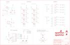

Contents
========

* [PRS13582 > Sparkfun](#prs13582--sparkfun)
	* [Schematic](#schematic)
	* [Interactive BOM](#interactive-bom)
	* [OOMP Parts](#oomp-parts)
	* [Images](#images)
	* [Tags](#tags)
  
![][im]
# PRS13582 > Sparkfun

- ID: PROJ-SPAR-13582-STAN-01
- Hex ID: PRS13582
- Name: Sparkfun
- Description: Sparkfun
- Long Link: [http://oom.lt/PROJ-SPAR-13582-STAN-01](http://oom.lt/PROJ-SPAR-13582-STAN-01)
- Short Link: [http://oom.lt/PRS13582](http://oom.lt/PRS13582)

## Schematic
  

## Interactive BOM

- Interactive BOM page: [ibom.html](https://htmlpreview.github.io/?https://github.com/oomlout/oomlout_OOMP_projects/blob/main/PROJ-SPAR-13582-STAN-01/kicad/bom/ibom.html)

## OOMP Parts
  

|OOMP Parts|
| :---: |
|C1,UNMATCHED-UNMATCHED-UNMATCHED-UNMATCHED-UNMATCHED,C1,1.0uF,1.0UF-16V-10%(0603),0603-CAP,CAP-00868,CAP-00868,1.0uF,|
|C2,UNMATCHED-UNMATCHED-UNMATCHED-UNMATCHED-UNMATCHED,C2,1.0uF,1.0UF-16V-10%(0603),0603-CAP,CAP-00868,CAP-00868,1.0uF,|
|C3,UNMATCHED-UNMATCHED-UNMATCHED-UNMATCHED-UNMATCHED,C3,1.0uF,1.0UF-16V-10%(0603),0603-CAP,CAP-00868,CAP-00868,1.0uF,|
|C4,UNMATCHED-UNMATCHED-UNMATCHED-UNMATCHED-UNMATCHED,C4,2.2uF,2.2UF-10V-20%(0603),0603-CAP,CAP-07888,CAP-07888,2.2uF,|
|C5,UNMATCHED-UNMATCHED-UNMATCHED-UNMATCHED-UNMATCHED,C5,470pF,470PF-50V-5%(0603)SMD,0603-CAP,CAP-07884,CAP-07884,470pF,|
|C6,UNMATCHED-UNMATCHED-UNMATCHED-UNMATCHED-UNMATCHED,C6,470pF,470PF-50V-5%(0603)SMD,0603-CAP,CAP-07884,CAP-07884,470pF,|
|C7,UNMATCHED-UNMATCHED-UNMATCHED-UNMATCHED-UNMATCHED,C7,2.2uF,2.2UF-10V-20%(0603),0603-CAP,CAP-07888,CAP-07888,2.2uF,|
|C8,UNMATCHED-UNMATCHED-UNMATCHED-UNMATCHED-UNMATCHED,C8,10uF,10UF-16V-10%(TANT),EIA3216,CAP-00811,CAP-00811,10uF,|
|D1,UNMATCHED-UNMATCHED-UNMATCHED-UNMATCHED-UNMATCHED,D1,Green,LED-GREEN1206-BOTTOM,LED-1206-BOTTOM,Various green LEDs,DIO-11076,Green,|
|D2,UNMATCHED-UNMATCHED-UNMATCHED-UNMATCHED-UNMATCHED,D2,Green,LED-GREEN1206-BOTTOM,LED-1206-BOTTOM,Various green LEDs,DIO-11076,Green,|
|D3,UNMATCHED-UNMATCHED-UNMATCHED-UNMATCHED-UNMATCHED,D3,Green,LED-GREEN1206-BOTTOM,LED-1206-BOTTOM,Various green LEDs,DIO-11076,Green,|
|D4,UNMATCHED-UNMATCHED-UNMATCHED-UNMATCHED-UNMATCHED,D4,Green,LED-GREEN1206-BOTTOM,LED-1206-BOTTOM,Various green LEDs,DIO-11076,Green,|
|D5,UNMATCHED-UNMATCHED-UNMATCHED-UNMATCHED-UNMATCHED,D5,Green,LED-GREEN1206-BOTTOM,LED-1206-BOTTOM,Various green LEDs,DIO-11076,Green,|
|D6,UNMATCHED-UNMATCHED-UNMATCHED-UNMATCHED-UNMATCHED,D6,Green,LED-GREEN1206-BOTTOM,LED-1206-BOTTOM,Various green LEDs,DIO-11076,Green,|
|D7,UNMATCHED-UNMATCHED-UNMATCHED-UNMATCHED-UNMATCHED,D7,Green,LED-GREEN1206-BOTTOM,LED-1206-BOTTOM,Various green LEDs,DIO-11076,Green,|
|D8,UNMATCHED-UNMATCHED-UNMATCHED-UNMATCHED-UNMATCHED,D8,Green,LED-GREEN1206-BOTTOM,LED-1206-BOTTOM,Various green LEDs,DIO-11076,Green,|
|D9,UNMATCHED-UNMATCHED-UNMATCHED-UNMATCHED-UNMATCHED,D9,Green,LED-GREEN1206-BOTTOM,LED-1206-BOTTOM,Various green LEDs,DIO-11076,Green,|
|FRAME2,UNMATCHED-UNMATCHED-UNMATCHED-UNMATCHED-UNMATCHED,FID1,FIDUCIALUFIDUCIAL,FIDUCIALUFIDUCIAL,MICRO-FIDUCIAL,Fiducial Alignment Points,,,|
|JP1,UNMATCHED-UNMATCHED-UNMATCHED-UNMATCHED-UNMATCHED,FID2,FIDUCIALUFIDUCIAL,FIDUCIALUFIDUCIAL,MICRO-FIDUCIAL,Fiducial Alignment Points,,,|
|JP2,UNMATCHED-UNMATCHED-UNMATCHED-UNMATCHED-UNMATCHED,FRAME2,FRAME-LEDGER,FRAME-LEDGER,CREATIVE_COMMONS,Schematic Frame,,,|
|LOGO1,UNMATCHED-UNMATCHED-UNMATCHED-UNMATCHED-UNMATCHED,JP1,FEMALE 2x3,M03X2FEMALE,2X3,2x3 .1 header.,CONN-11566,FEMALE 2x3,|
|LOGO2,UNMATCHED-UNMATCHED-UNMATCHED-UNMATCHED-UNMATCHED,JP2,INT,M01PTH,1X01,Header 1,,,|
|LOGO5,UNMATCHED-UNMATCHED-UNMATCHED-UNMATCHED-UNMATCHED,LOGO1,SFE_LOGO_NAME_FLAME.2_INCH,SFE_LOGO_NAME_FLAME.2_INCH,SFE_LOGO_NAME_FLAME_.2,SFE Logo, name and flame,,,|
|LOGO6,UNMATCHED-UNMATCHED-UNMATCHED-UNMATCHED-UNMATCHED,LOGO2,SFE_LOGO_NAME.2_INCH,SFE_LOGO_NAME.2_INCH,SFE_LOGO_NAME_.2,SFE Logo, name only,,,|
|Q1,UNMATCHED-UNMATCHED-UNMATCHED-UNMATCHED-UNMATCHED,LOGO5,SFE_LOGO_FLAME.3_INCH,SFE_LOGO_FLAME.3_INCH,SFE_LOGO_FLAME_.3,SFE Logo, flame only,,,|
|R1,UNMATCHED-UNMATCHED-UNMATCHED-UNMATCHED-UNMATCHED,LOGO6,OSHW-LOGOS,OSHW-LOGOS,OSHW-LOGO-S,Open Source Hardware Logo,,,|
|R2,UNMATCHED-UNMATCHED-UNMATCHED-UNMATCHED-UNMATCHED,Q1,MOSFET-NCHANNEL2N7002PW,MOSFET-NCHANNEL2N7002PW,SOT323,Common NMOSFET Parts,TRANS-11151,,|
|R3,UNMATCHED-UNMATCHED-UNMATCHED-UNMATCHED-UNMATCHED,R1,4.7K,4.7KOHM-1/10W-1%(0603),0603-RES,RES-07857,RES-07857,4.7K,|
|R4,UNMATCHED-UNMATCHED-UNMATCHED-UNMATCHED-UNMATCHED,R2,330,330OHM1/10W1%(0603),0603-RES,RES-00818,RES-00818,330,|
|R5,UNMATCHED-UNMATCHED-UNMATCHED-UNMATCHED-UNMATCHED,R3,100,100OHM-1/10W-1%(0603),0603-RES,RES-07863,RES-07863,100,|
|R6,UNMATCHED-UNMATCHED-UNMATCHED-UNMATCHED-UNMATCHED,R4,68.1k,68.1KOHM1/10W1%(0603),0603-RES,RES-09380,RES-09380,68.1k,|
|R7,UNMATCHED-UNMATCHED-UNMATCHED-UNMATCHED-UNMATCHED,R5,1K,1KOHM-1/10W-1%(0603),0603-RES,RES-07856,RES-07856,1K,|
|R8,UNMATCHED-UNMATCHED-UNMATCHED-UNMATCHED-UNMATCHED,R6,1K,1KOHM-1/10W-1%(0603),0603-RES,RES-07856,RES-07856,1K,|
|R9,UNMATCHED-UNMATCHED-UNMATCHED-UNMATCHED-UNMATCHED,R7,1K,1KOHM-1/10W-1%(0603),0603-RES,RES-07856,RES-07856,1K,|
|R10,UNMATCHED-UNMATCHED-UNMATCHED-UNMATCHED-UNMATCHED,R8,1K,1KOHM-1/10W-1%(0603),0603-RES,RES-07856,RES-07856,1K,|
|R11,UNMATCHED-UNMATCHED-UNMATCHED-UNMATCHED-UNMATCHED,R9,100,100OHM-1/10W-1%(0603),0603-RES,RES-07863,RES-07863,100,|
|R12,UNMATCHED-UNMATCHED-UNMATCHED-UNMATCHED-UNMATCHED,R10,68.1k,68.1KOHM1/10W1%(0603),0603-RES,RES-09380,RES-09380,68.1k,|
|R13,UNMATCHED-UNMATCHED-UNMATCHED-UNMATCHED-UNMATCHED,R11,100,100OHM-1/10W-1%(0603),0603-RES,RES-07863,RES-07863,100,|
|R14,UNMATCHED-UNMATCHED-UNMATCHED-UNMATCHED-UNMATCHED,R12,68.1k,68.1KOHM1/10W1%(0603),0603-RES,RES-09380,RES-09380,68.1k,|
|R16,UNMATCHED-UNMATCHED-UNMATCHED-UNMATCHED-UNMATCHED,R13,100,100OHM-1/10W-1%(0603),0603-RES,RES-07863,RES-07863,100,|
|R17,UNMATCHED-UNMATCHED-UNMATCHED-UNMATCHED-UNMATCHED,R14,68.1k,68.1KOHM1/10W1%(0603),0603-RES,RES-09380,RES-09380,68.1k,|
|R18,UNMATCHED-UNMATCHED-UNMATCHED-UNMATCHED-UNMATCHED,R16,TSR-3386,TRIMPOT-PTH-KNOB,3386U,Various small potentiometers for set-and-forget applications,RES-09730,TSR-3386,|
|R19,UNMATCHED-UNMATCHED-UNMATCHED-UNMATCHED-UNMATCHED,R17,1K,1KOHM-1/10W-1%(0603),0603-RES,RES-07856,RES-07856,1K,|
|R20,UNMATCHED-UNMATCHED-UNMATCHED-UNMATCHED-UNMATCHED,R18,1K,1KOHM-1/10W-1%(0603),0603-RES,RES-07856,RES-07856,1K,|
|R21,UNMATCHED-UNMATCHED-UNMATCHED-UNMATCHED-UNMATCHED,R19,1K,1KOHM-1/10W-1%(0603),0603-RES,RES-07856,RES-07856,1K,|
|R22,UNMATCHED-UNMATCHED-UNMATCHED-UNMATCHED-UNMATCHED,R20,1K,1KOHM-1/10W-1%(0603),0603-RES,RES-07856,RES-07856,1K,|
|R23,UNMATCHED-UNMATCHED-UNMATCHED-UNMATCHED-UNMATCHED,R21,100,100OHM-1/10W-1%(0603),0603-RES,RES-07863,RES-07863,100,|
|R24,UNMATCHED-UNMATCHED-UNMATCHED-UNMATCHED-UNMATCHED,R22,68.1k,68.1KOHM1/10W1%(0603),0603-RES,RES-09380,RES-09380,68.1k,|
|R25,UNMATCHED-UNMATCHED-UNMATCHED-UNMATCHED-UNMATCHED,R23,100,100OHM-1/10W-1%(0603),0603-RES,RES-07863,RES-07863,100,|
|R26,UNMATCHED-UNMATCHED-UNMATCHED-UNMATCHED-UNMATCHED,R24,100,100OHM-1/10W-1%(0603),0603-RES,RES-07863,RES-07863,100,|
|R27,UNMATCHED-UNMATCHED-UNMATCHED-UNMATCHED-UNMATCHED,R25,100,100OHM-1/10W-1%(0603),0603-RES,RES-07863,RES-07863,100,|
|R28,UNMATCHED-UNMATCHED-UNMATCHED-UNMATCHED-UNMATCHED,R26,68.1k,68.1KOHM1/10W1%(0603),0603-RES,RES-09380,RES-09380,68.1k,|
|R30,UNMATCHED-UNMATCHED-UNMATCHED-UNMATCHED-UNMATCHED,R27,68.1k,68.1KOHM1/10W1%(0603),0603-RES,RES-09380,RES-09380,68.1k,|
|R31,UNMATCHED-UNMATCHED-UNMATCHED-UNMATCHED-UNMATCHED,R28,68.1k,68.1KOHM1/10W1%(0603),0603-RES,RES-09380,RES-09380,68.1k,|
|R32,UNMATCHED-UNMATCHED-UNMATCHED-UNMATCHED-UNMATCHED,R30,4.7K,4.7KOHM-1/10W-1%(0603),0603-RES,RES-07857,RES-07857,4.7K,|
|R33,UNMATCHED-UNMATCHED-UNMATCHED-UNMATCHED-UNMATCHED,R31,100,100OHM-1/10W-1%(0603),0603-RES,RES-07863,RES-07863,100,|
|R34,UNMATCHED-UNMATCHED-UNMATCHED-UNMATCHED-UNMATCHED,R32,4.7K,4.7KOHM-1/10W-1%(0603),0603-RES,RES-07857,RES-07857,4.7K,|
|SJ1,UNMATCHED-UNMATCHED-UNMATCHED-UNMATCHED-UNMATCHED,R33,4.7K,4.7KOHM-1/10W-1%(0603),0603-RES,RES-07857,RES-07857,4.7K,|
|SJ2,UNMATCHED-UNMATCHED-UNMATCHED-UNMATCHED-UNMATCHED,R34,4.7K,4.7KOHM-1/10W-1%(0603),0603-RES,RES-07857,RES-07857,4.7K,|
|SJ3,UNMATCHED-UNMATCHED-UNMATCHED-UNMATCHED-UNMATCHED,SJ1,A0,JUMPER-PAD-3-2OF3_NC_BY_PASTE,PAD-JUMPER-3-2OF3_NC_BY_PASTE_YES_SILK_FULL_BOX,,,,|
|SJ5,UNMATCHED-UNMATCHED-UNMATCHED-UNMATCHED-UNMATCHED,SJ2,A1,JUMPER-PAD-3-2OF3_NC_BY_PASTE,PAD-JUMPER-3-2OF3_NC_BY_PASTE_YES_SILK_FULL_BOX,,,,|
|STANDOFF1,UNMATCHED-UNMATCHED-UNMATCHED-UNMATCHED-UNMATCHED,SJ3,A1,JUMPER-PAD-3-NC_BY_TRACE,PAD-JUMPER-3-3OF3_NC_BY_TRACE_YES_SILK_FULL_BOX,,,,|
|STANDOFF2,UNMATCHED-UNMATCHED-UNMATCHED-UNMATCHED-UNMATCHED,SJ5,JUMPER-PAD-3-2OF3_NC_BY_TRACE_SMALL,JUMPER-PAD-3-2OF3_NC_BY_TRACE_SMALL,PAD-JUMPER-3-2OF3_NC_BY_TRACE_YES_SILK_FULL_BOX,,,,|
|STANDOFF3,UNMATCHED-UNMATCHED-UNMATCHED-UNMATCHED-UNMATCHED,STANDOFF1,STAND-OFF,STAND-OFF,STAND-OFF,#4 Stand Off,,,|
|STANDOFF4,UNMATCHED-UNMATCHED-UNMATCHED-UNMATCHED-UNMATCHED,STANDOFF2,STAND-OFF,STAND-OFF,STAND-OFF,#4 Stand Off,,,|
|STANDOFF5,UNMATCHED-UNMATCHED-UNMATCHED-UNMATCHED-UNMATCHED,STANDOFF3,STAND-OFF,STAND-OFF,STAND-OFF,#4 Stand Off,,,|
|STANDOFF6,UNMATCHED-UNMATCHED-UNMATCHED-UNMATCHED-UNMATCHED,STANDOFF4,STAND-OFF,STAND-OFF,STAND-OFF,#4 Stand Off,,,|
|U1,UNMATCHED-UNMATCHED-UNMATCHED-UNMATCHED-UNMATCHED,STANDOFF5,STAND-OFF,STAND-OFF,STAND-OFF,#4 Stand Off,,,|
|U2,UNMATCHED-UNMATCHED-UNMATCHED-UNMATCHED-UNMATCHED,STANDOFF6,STAND-OFF,STAND-OFF,STAND-OFF,#4 Stand Off,,,|
|U3,UNMATCHED-UNMATCHED-UNMATCHED-UNMATCHED-UNMATCHED,U1,SX1509,SX1509,QFN-28,Semtech SX1509,IC-11311,SX1509,|
|U5,UNMATCHED-UNMATCHED-UNMATCHED-UNMATCHED-UNMATCHED,U2,74AC125,74AC125DG125,SO14,,IC-08880,74AC125,|
|U6,UNMATCHED-UNMATCHED-UNMATCHED-UNMATCHED-UNMATCHED,U3,3.3V/150mA,V_REG_MIC52053.3V,SOT23-5,V_REG MIC5205 Standard 3.3V, 5V, and Adjustable 150mA LDO voltage regulator in SOT-23 layout. Micrel part MIC5205. BP (by-pass) pin is used to lower output noise with 470pF cap, may be left open. On the adjustable version BP is used to set output.,VREG-00822,3.3V/150mA,|
|U101,UNMATCHED-UNMATCHED-UNMATCHED-UNMATCHED-UNMATCHED,U5,LM1117,V_REG_LM1117SOT223,SOT223,Voltage Regulator LM1117,VREG-08170,,|
|U102,UNMATCHED-UNMATCHED-UNMATCHED-UNMATCHED-UNMATCHED,U6,74AC125,74AC125DG125,SO14,,IC-08880,74AC125,|
|U103,UNMATCHED-UNMATCHED-UNMATCHED-UNMATCHED-UNMATCHED,U101,QRE1113,QRE1113,QRE1113,Reflective object sensor,IC-09357,QRE1113,|
|U104,UNMATCHED-UNMATCHED-UNMATCHED-UNMATCHED-UNMATCHED,U102,QRE1113,QRE1113,QRE1113,Reflective object sensor,IC-09357,QRE1113,|
|U105,UNMATCHED-UNMATCHED-UNMATCHED-UNMATCHED-UNMATCHED,U103,QRE1113,QRE1113,QRE1113,Reflective object sensor,IC-09357,QRE1113,|
|U106,UNMATCHED-UNMATCHED-UNMATCHED-UNMATCHED-UNMATCHED,U104,QRE1113,QRE1113,QRE1113,Reflective object sensor,IC-09357,QRE1113,|
|U107,UNMATCHED-UNMATCHED-UNMATCHED-UNMATCHED-UNMATCHED,U105,QRE1113,QRE1113,QRE1113,Reflective object sensor,IC-09357,QRE1113,|
|U108,UNMATCHED-UNMATCHED-UNMATCHED-UNMATCHED-UNMATCHED,U106,QRE1113,QRE1113,QRE1113,Reflective object sensor,IC-09357,QRE1113,|

## Images
  
  

|kicadPcb3d|kicadPcb3dFront|kicadPcb3dBack|eagleImage|eagleSchemImage|
| :---: | :---: | :---: | :---: | :---: |
||||||

## Tags

- hexID: PRS13582
- oompType: PROJ
- oompSize: SPAR
- oompColor: 13582
- oompDesc: STAN
- oompIndex: 01
- oompName: Line Follower Array
- sources: All source files from https://github.com/sparkfun/Line_Follower_Array (source licence details in srcLicense.md)
- linkBuyPage: https://www.sparkfun.com/products/13582
- oompID: PROJ-SPAR-13582-STAN-01
- oompParts: C1,UNMATCHED-UNMATCHED-UNMATCHED-UNMATCHED-UNMATCHED
- oompParts: C2,UNMATCHED-UNMATCHED-UNMATCHED-UNMATCHED-UNMATCHED
- oompParts: C3,UNMATCHED-UNMATCHED-UNMATCHED-UNMATCHED-UNMATCHED
- oompParts: C4,UNMATCHED-UNMATCHED-UNMATCHED-UNMATCHED-UNMATCHED
- oompParts: C5,UNMATCHED-UNMATCHED-UNMATCHED-UNMATCHED-UNMATCHED
- oompParts: C6,UNMATCHED-UNMATCHED-UNMATCHED-UNMATCHED-UNMATCHED
- oompParts: C7,UNMATCHED-UNMATCHED-UNMATCHED-UNMATCHED-UNMATCHED
- oompParts: C8,UNMATCHED-UNMATCHED-UNMATCHED-UNMATCHED-UNMATCHED
- oompParts: D1,UNMATCHED-UNMATCHED-UNMATCHED-UNMATCHED-UNMATCHED
- oompParts: D2,UNMATCHED-UNMATCHED-UNMATCHED-UNMATCHED-UNMATCHED
- oompParts: D3,UNMATCHED-UNMATCHED-UNMATCHED-UNMATCHED-UNMATCHED
- oompParts: D4,UNMATCHED-UNMATCHED-UNMATCHED-UNMATCHED-UNMATCHED
- oompParts: D5,UNMATCHED-UNMATCHED-UNMATCHED-UNMATCHED-UNMATCHED
- oompParts: D6,UNMATCHED-UNMATCHED-UNMATCHED-UNMATCHED-UNMATCHED
- oompParts: D7,UNMATCHED-UNMATCHED-UNMATCHED-UNMATCHED-UNMATCHED
- oompParts: D8,UNMATCHED-UNMATCHED-UNMATCHED-UNMATCHED-UNMATCHED
- oompParts: D9,UNMATCHED-UNMATCHED-UNMATCHED-UNMATCHED-UNMATCHED
- oompParts: FRAME2,UNMATCHED-UNMATCHED-UNMATCHED-UNMATCHED-UNMATCHED
- oompParts: JP1,UNMATCHED-UNMATCHED-UNMATCHED-UNMATCHED-UNMATCHED
- oompParts: JP2,UNMATCHED-UNMATCHED-UNMATCHED-UNMATCHED-UNMATCHED
- oompParts: LOGO1,UNMATCHED-UNMATCHED-UNMATCHED-UNMATCHED-UNMATCHED
- oompParts: LOGO2,UNMATCHED-UNMATCHED-UNMATCHED-UNMATCHED-UNMATCHED
- oompParts: LOGO5,UNMATCHED-UNMATCHED-UNMATCHED-UNMATCHED-UNMATCHED
- oompParts: LOGO6,UNMATCHED-UNMATCHED-UNMATCHED-UNMATCHED-UNMATCHED
- oompParts: Q1,UNMATCHED-UNMATCHED-UNMATCHED-UNMATCHED-UNMATCHED
- oompParts: R1,UNMATCHED-UNMATCHED-UNMATCHED-UNMATCHED-UNMATCHED
- oompParts: R2,UNMATCHED-UNMATCHED-UNMATCHED-UNMATCHED-UNMATCHED
- oompParts: R3,UNMATCHED-UNMATCHED-UNMATCHED-UNMATCHED-UNMATCHED
- oompParts: R4,UNMATCHED-UNMATCHED-UNMATCHED-UNMATCHED-UNMATCHED
- oompParts: R5,UNMATCHED-UNMATCHED-UNMATCHED-UNMATCHED-UNMATCHED
- oompParts: R6,UNMATCHED-UNMATCHED-UNMATCHED-UNMATCHED-UNMATCHED
- oompParts: R7,UNMATCHED-UNMATCHED-UNMATCHED-UNMATCHED-UNMATCHED
- oompParts: R8,UNMATCHED-UNMATCHED-UNMATCHED-UNMATCHED-UNMATCHED
- oompParts: R9,UNMATCHED-UNMATCHED-UNMATCHED-UNMATCHED-UNMATCHED
- oompParts: R10,UNMATCHED-UNMATCHED-UNMATCHED-UNMATCHED-UNMATCHED
- oompParts: R11,UNMATCHED-UNMATCHED-UNMATCHED-UNMATCHED-UNMATCHED
- oompParts: R12,UNMATCHED-UNMATCHED-UNMATCHED-UNMATCHED-UNMATCHED
- oompParts: R13,UNMATCHED-UNMATCHED-UNMATCHED-UNMATCHED-UNMATCHED
- oompParts: R14,UNMATCHED-UNMATCHED-UNMATCHED-UNMATCHED-UNMATCHED
- oompParts: R16,UNMATCHED-UNMATCHED-UNMATCHED-UNMATCHED-UNMATCHED
- oompParts: R17,UNMATCHED-UNMATCHED-UNMATCHED-UNMATCHED-UNMATCHED
- oompParts: R18,UNMATCHED-UNMATCHED-UNMATCHED-UNMATCHED-UNMATCHED
- oompParts: R19,UNMATCHED-UNMATCHED-UNMATCHED-UNMATCHED-UNMATCHED
- oompParts: R20,UNMATCHED-UNMATCHED-UNMATCHED-UNMATCHED-UNMATCHED
- oompParts: R21,UNMATCHED-UNMATCHED-UNMATCHED-UNMATCHED-UNMATCHED
- oompParts: R22,UNMATCHED-UNMATCHED-UNMATCHED-UNMATCHED-UNMATCHED
- oompParts: R23,UNMATCHED-UNMATCHED-UNMATCHED-UNMATCHED-UNMATCHED
- oompParts: R24,UNMATCHED-UNMATCHED-UNMATCHED-UNMATCHED-UNMATCHED
- oompParts: R25,UNMATCHED-UNMATCHED-UNMATCHED-UNMATCHED-UNMATCHED
- oompParts: R26,UNMATCHED-UNMATCHED-UNMATCHED-UNMATCHED-UNMATCHED
- oompParts: R27,UNMATCHED-UNMATCHED-UNMATCHED-UNMATCHED-UNMATCHED
- oompParts: R28,UNMATCHED-UNMATCHED-UNMATCHED-UNMATCHED-UNMATCHED
- oompParts: R30,UNMATCHED-UNMATCHED-UNMATCHED-UNMATCHED-UNMATCHED
- oompParts: R31,UNMATCHED-UNMATCHED-UNMATCHED-UNMATCHED-UNMATCHED
- oompParts: R32,UNMATCHED-UNMATCHED-UNMATCHED-UNMATCHED-UNMATCHED
- oompParts: R33,UNMATCHED-UNMATCHED-UNMATCHED-UNMATCHED-UNMATCHED
- oompParts: R34,UNMATCHED-UNMATCHED-UNMATCHED-UNMATCHED-UNMATCHED
- oompParts: SJ1,UNMATCHED-UNMATCHED-UNMATCHED-UNMATCHED-UNMATCHED
- oompParts: SJ2,UNMATCHED-UNMATCHED-UNMATCHED-UNMATCHED-UNMATCHED
- oompParts: SJ3,UNMATCHED-UNMATCHED-UNMATCHED-UNMATCHED-UNMATCHED
- oompParts: SJ5,UNMATCHED-UNMATCHED-UNMATCHED-UNMATCHED-UNMATCHED
- oompParts: STANDOFF1,UNMATCHED-UNMATCHED-UNMATCHED-UNMATCHED-UNMATCHED
- oompParts: STANDOFF2,UNMATCHED-UNMATCHED-UNMATCHED-UNMATCHED-UNMATCHED
- oompParts: STANDOFF3,UNMATCHED-UNMATCHED-UNMATCHED-UNMATCHED-UNMATCHED
- oompParts: STANDOFF4,UNMATCHED-UNMATCHED-UNMATCHED-UNMATCHED-UNMATCHED
- oompParts: STANDOFF5,UNMATCHED-UNMATCHED-UNMATCHED-UNMATCHED-UNMATCHED
- oompParts: STANDOFF6,UNMATCHED-UNMATCHED-UNMATCHED-UNMATCHED-UNMATCHED
- oompParts: U1,UNMATCHED-UNMATCHED-UNMATCHED-UNMATCHED-UNMATCHED
- oompParts: U2,UNMATCHED-UNMATCHED-UNMATCHED-UNMATCHED-UNMATCHED
- oompParts: U3,UNMATCHED-UNMATCHED-UNMATCHED-UNMATCHED-UNMATCHED
- oompParts: U5,UNMATCHED-UNMATCHED-UNMATCHED-UNMATCHED-UNMATCHED
- oompParts: U6,UNMATCHED-UNMATCHED-UNMATCHED-UNMATCHED-UNMATCHED
- oompParts: U101,UNMATCHED-UNMATCHED-UNMATCHED-UNMATCHED-UNMATCHED
- oompParts: U102,UNMATCHED-UNMATCHED-UNMATCHED-UNMATCHED-UNMATCHED
- oompParts: U103,UNMATCHED-UNMATCHED-UNMATCHED-UNMATCHED-UNMATCHED
- oompParts: U104,UNMATCHED-UNMATCHED-UNMATCHED-UNMATCHED-UNMATCHED
- oompParts: U105,UNMATCHED-UNMATCHED-UNMATCHED-UNMATCHED-UNMATCHED
- oompParts: U106,UNMATCHED-UNMATCHED-UNMATCHED-UNMATCHED-UNMATCHED
- oompParts: U107,UNMATCHED-UNMATCHED-UNMATCHED-UNMATCHED-UNMATCHED
- oompParts: U108,UNMATCHED-UNMATCHED-UNMATCHED-UNMATCHED-UNMATCHED
- rawParts: C1,1.0uF,1.0UF-16V-10%(0603),0603-CAP,CAP-00868,CAP-00868,1.0uF,
- rawParts: C2,1.0uF,1.0UF-16V-10%(0603),0603-CAP,CAP-00868,CAP-00868,1.0uF,
- rawParts: C3,1.0uF,1.0UF-16V-10%(0603),0603-CAP,CAP-00868,CAP-00868,1.0uF,
- rawParts: C4,2.2uF,2.2UF-10V-20%(0603),0603-CAP,CAP-07888,CAP-07888,2.2uF,
- rawParts: C5,470pF,470PF-50V-5%(0603)SMD,0603-CAP,CAP-07884,CAP-07884,470pF,
- rawParts: C6,470pF,470PF-50V-5%(0603)SMD,0603-CAP,CAP-07884,CAP-07884,470pF,
- rawParts: C7,2.2uF,2.2UF-10V-20%(0603),0603-CAP,CAP-07888,CAP-07888,2.2uF,
- rawParts: C8,10uF,10UF-16V-10%(TANT),EIA3216,CAP-00811,CAP-00811,10uF,
- rawParts: D1,Green,LED-GREEN1206-BOTTOM,LED-1206-BOTTOM,Various green LEDs,DIO-11076,Green,
- rawParts: D2,Green,LED-GREEN1206-BOTTOM,LED-1206-BOTTOM,Various green LEDs,DIO-11076,Green,
- rawParts: D3,Green,LED-GREEN1206-BOTTOM,LED-1206-BOTTOM,Various green LEDs,DIO-11076,Green,
- rawParts: D4,Green,LED-GREEN1206-BOTTOM,LED-1206-BOTTOM,Various green LEDs,DIO-11076,Green,
- rawParts: D5,Green,LED-GREEN1206-BOTTOM,LED-1206-BOTTOM,Various green LEDs,DIO-11076,Green,
- rawParts: D6,Green,LED-GREEN1206-BOTTOM,LED-1206-BOTTOM,Various green LEDs,DIO-11076,Green,
- rawParts: D7,Green,LED-GREEN1206-BOTTOM,LED-1206-BOTTOM,Various green LEDs,DIO-11076,Green,
- rawParts: D8,Green,LED-GREEN1206-BOTTOM,LED-1206-BOTTOM,Various green LEDs,DIO-11076,Green,
- rawParts: D9,Green,LED-GREEN1206-BOTTOM,LED-1206-BOTTOM,Various green LEDs,DIO-11076,Green,
- rawParts: FID1,FIDUCIALUFIDUCIAL,FIDUCIALUFIDUCIAL,MICRO-FIDUCIAL,Fiducial Alignment Points,,,
- rawParts: FID2,FIDUCIALUFIDUCIAL,FIDUCIALUFIDUCIAL,MICRO-FIDUCIAL,Fiducial Alignment Points,,,
- rawParts: FRAME2,FRAME-LEDGER,FRAME-LEDGER,CREATIVE_COMMONS,Schematic Frame,,,
- rawParts: JP1,FEMALE 2x3,M03X2FEMALE,2X3,2x3 .1 header.,CONN-11566,FEMALE 2x3,
- rawParts: JP2,INT,M01PTH,1X01,Header 1,,,
- rawParts: LOGO1,SFE_LOGO_NAME_FLAME.2_INCH,SFE_LOGO_NAME_FLAME.2_INCH,SFE_LOGO_NAME_FLAME_.2,SFE Logo, name and flame,,,
- rawParts: LOGO2,SFE_LOGO_NAME.2_INCH,SFE_LOGO_NAME.2_INCH,SFE_LOGO_NAME_.2,SFE Logo, name only,,,
- rawParts: LOGO5,SFE_LOGO_FLAME.3_INCH,SFE_LOGO_FLAME.3_INCH,SFE_LOGO_FLAME_.3,SFE Logo, flame only,,,
- rawParts: LOGO6,OSHW-LOGOS,OSHW-LOGOS,OSHW-LOGO-S,Open Source Hardware Logo,,,
- rawParts: Q1,MOSFET-NCHANNEL2N7002PW,MOSFET-NCHANNEL2N7002PW,SOT323,Common NMOSFET Parts,TRANS-11151,,
- rawParts: R1,4.7K,4.7KOHM-1/10W-1%(0603),0603-RES,RES-07857,RES-07857,4.7K,
- rawParts: R2,330,330OHM1/10W1%(0603),0603-RES,RES-00818,RES-00818,330,
- rawParts: R3,100,100OHM-1/10W-1%(0603),0603-RES,RES-07863,RES-07863,100,
- rawParts: R4,68.1k,68.1KOHM1/10W1%(0603),0603-RES,RES-09380,RES-09380,68.1k,
- rawParts: R5,1K,1KOHM-1/10W-1%(0603),0603-RES,RES-07856,RES-07856,1K,
- rawParts: R6,1K,1KOHM-1/10W-1%(0603),0603-RES,RES-07856,RES-07856,1K,
- rawParts: R7,1K,1KOHM-1/10W-1%(0603),0603-RES,RES-07856,RES-07856,1K,
- rawParts: R8,1K,1KOHM-1/10W-1%(0603),0603-RES,RES-07856,RES-07856,1K,
- rawParts: R9,100,100OHM-1/10W-1%(0603),0603-RES,RES-07863,RES-07863,100,
- rawParts: R10,68.1k,68.1KOHM1/10W1%(0603),0603-RES,RES-09380,RES-09380,68.1k,
- rawParts: R11,100,100OHM-1/10W-1%(0603),0603-RES,RES-07863,RES-07863,100,
- rawParts: R12,68.1k,68.1KOHM1/10W1%(0603),0603-RES,RES-09380,RES-09380,68.1k,
- rawParts: R13,100,100OHM-1/10W-1%(0603),0603-RES,RES-07863,RES-07863,100,
- rawParts: R14,68.1k,68.1KOHM1/10W1%(0603),0603-RES,RES-09380,RES-09380,68.1k,
- rawParts: R16,TSR-3386,TRIMPOT-PTH-KNOB,3386U,Various small potentiometers for set-and-forget applications,RES-09730,TSR-3386,
- rawParts: R17,1K,1KOHM-1/10W-1%(0603),0603-RES,RES-07856,RES-07856,1K,
- rawParts: R18,1K,1KOHM-1/10W-1%(0603),0603-RES,RES-07856,RES-07856,1K,
- rawParts: R19,1K,1KOHM-1/10W-1%(0603),0603-RES,RES-07856,RES-07856,1K,
- rawParts: R20,1K,1KOHM-1/10W-1%(0603),0603-RES,RES-07856,RES-07856,1K,
- rawParts: R21,100,100OHM-1/10W-1%(0603),0603-RES,RES-07863,RES-07863,100,
- rawParts: R22,68.1k,68.1KOHM1/10W1%(0603),0603-RES,RES-09380,RES-09380,68.1k,
- rawParts: R23,100,100OHM-1/10W-1%(0603),0603-RES,RES-07863,RES-07863,100,
- rawParts: R24,100,100OHM-1/10W-1%(0603),0603-RES,RES-07863,RES-07863,100,
- rawParts: R25,100,100OHM-1/10W-1%(0603),0603-RES,RES-07863,RES-07863,100,
- rawParts: R26,68.1k,68.1KOHM1/10W1%(0603),0603-RES,RES-09380,RES-09380,68.1k,
- rawParts: R27,68.1k,68.1KOHM1/10W1%(0603),0603-RES,RES-09380,RES-09380,68.1k,
- rawParts: R28,68.1k,68.1KOHM1/10W1%(0603),0603-RES,RES-09380,RES-09380,68.1k,
- rawParts: R30,4.7K,4.7KOHM-1/10W-1%(0603),0603-RES,RES-07857,RES-07857,4.7K,
- rawParts: R31,100,100OHM-1/10W-1%(0603),0603-RES,RES-07863,RES-07863,100,
- rawParts: R32,4.7K,4.7KOHM-1/10W-1%(0603),0603-RES,RES-07857,RES-07857,4.7K,
- rawParts: R33,4.7K,4.7KOHM-1/10W-1%(0603),0603-RES,RES-07857,RES-07857,4.7K,
- rawParts: R34,4.7K,4.7KOHM-1/10W-1%(0603),0603-RES,RES-07857,RES-07857,4.7K,
- rawParts: SJ1,A0,JUMPER-PAD-3-2OF3_NC_BY_PASTE,PAD-JUMPER-3-2OF3_NC_BY_PASTE_YES_SILK_FULL_BOX,,,,
- rawParts: SJ2,A1,JUMPER-PAD-3-2OF3_NC_BY_PASTE,PAD-JUMPER-3-2OF3_NC_BY_PASTE_YES_SILK_FULL_BOX,,,,
- rawParts: SJ3,A1,JUMPER-PAD-3-NC_BY_TRACE,PAD-JUMPER-3-3OF3_NC_BY_TRACE_YES_SILK_FULL_BOX,,,,
- rawParts: SJ5,JUMPER-PAD-3-2OF3_NC_BY_TRACE_SMALL,JUMPER-PAD-3-2OF3_NC_BY_TRACE_SMALL,PAD-JUMPER-3-2OF3_NC_BY_TRACE_YES_SILK_FULL_BOX,,,,
- rawParts: STANDOFF1,STAND-OFF,STAND-OFF,STAND-OFF,#4 Stand Off,,,
- rawParts: STANDOFF2,STAND-OFF,STAND-OFF,STAND-OFF,#4 Stand Off,,,
- rawParts: STANDOFF3,STAND-OFF,STAND-OFF,STAND-OFF,#4 Stand Off,,,
- rawParts: STANDOFF4,STAND-OFF,STAND-OFF,STAND-OFF,#4 Stand Off,,,
- rawParts: STANDOFF5,STAND-OFF,STAND-OFF,STAND-OFF,#4 Stand Off,,,
- rawParts: STANDOFF6,STAND-OFF,STAND-OFF,STAND-OFF,#4 Stand Off,,,
- rawParts: U1,SX1509,SX1509,QFN-28,Semtech SX1509,IC-11311,SX1509,
- rawParts: U2,74AC125,74AC125DG125,SO14,,IC-08880,74AC125,
- rawParts: U3,3.3V/150mA,V_REG_MIC52053.3V,SOT23-5,V_REG MIC5205 Standard 3.3V, 5V, and Adjustable 150mA LDO voltage regulator in SOT-23 layout. Micrel part MIC5205. BP (by-pass) pin is used to lower output noise with 470pF cap, may be left open. On the adjustable version BP is used to set output.,VREG-00822,3.3V/150mA,
- rawParts: U5,LM1117,V_REG_LM1117SOT223,SOT223,Voltage Regulator LM1117,VREG-08170,,
- rawParts: U6,74AC125,74AC125DG125,SO14,,IC-08880,74AC125,
- rawParts: U101,QRE1113,QRE1113,QRE1113,Reflective object sensor,IC-09357,QRE1113,
- rawParts: U102,QRE1113,QRE1113,QRE1113,Reflective object sensor,IC-09357,QRE1113,
- rawParts: U103,QRE1113,QRE1113,QRE1113,Reflective object sensor,IC-09357,QRE1113,
- rawParts: U104,QRE1113,QRE1113,QRE1113,Reflective object sensor,IC-09357,QRE1113,
- rawParts: U105,QRE1113,QRE1113,QRE1113,Reflective object sensor,IC-09357,QRE1113,
- rawParts: U106,QRE1113,QRE1113,QRE1113,Reflective object sensor,IC-09357,QRE1113,
- rawParts: U107,QRE1113,QRE1113,QRE1113,Reflective object sensor,IC-09357,QRE1113,
- rawParts: U108,QRE1113,QRE1113,QRE1113,Reflective object sensor,IC-09357,QRE1113,

[im]: kicadPcb3d_450.png
