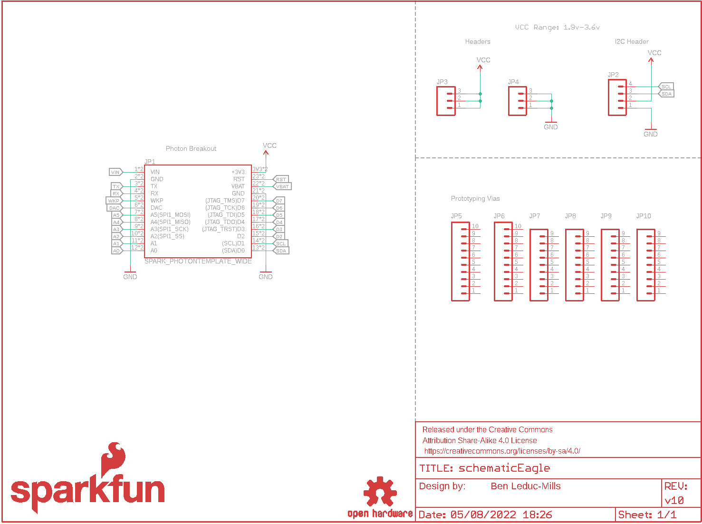
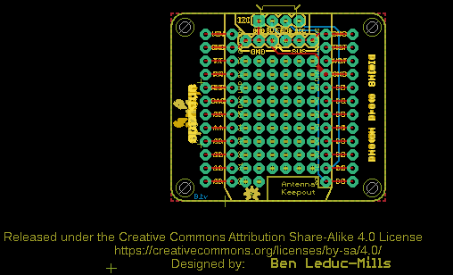
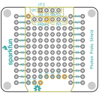
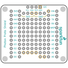
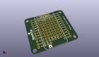
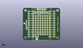
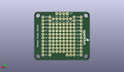
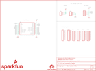
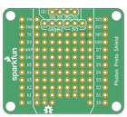
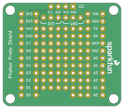

Contents
========

* [PRS13598 > Photon Proto Shield](#prs13598--photon-proto-shield)
	* [Schematic](#schematic)
	* [PCB](#pcb)
	* [Interactive BOM](#interactive-bom)
	* [OOMP Parts](#oomp-parts)
	* [Images](#images)
	* [Tags](#tags)
  
![][im]
# PRS13598 > Photon Proto Shield

- ID: PROJ-SPAR-13598-STAN-01
- Hex ID: PRS13598
- Name: Sparkfun
- Description: Sparkfun
- Long Link: [http://oom.lt/PROJ-SPAR-13598-STAN-01](http://oom.lt/PROJ-SPAR-13598-STAN-01)
- Short Link: [http://oom.lt/PRS13598](http://oom.lt/PRS13598)

## Schematic
  

## PCB
  

## Interactive BOM

- Interactive BOM page: [ibom.html](https://htmlpreview.github.io/?https://github.com/oomlout/oomlout_OOMP_projects/blob/main/PROJ-SPAR-13598-STAN-01/kicad/bom/ibom.html)

## OOMP Parts
  

|OOMP ID|Name|Identifier|
| :---: | :---: | :---: |
|UNMATCHED-UNMATCHED-X-UNMATCHED-01||FRAME1, JP1|
|[HEAD-I01-X-PI04-01](https://github.com/oomlout/oomlout_OOMP_parts/tree/main/HEAD-I01-X-PI04-01/)|[2.54 mm 4 Pin Header](https://github.com/oomlout/oomlout_OOMP_parts/tree/main/HEAD-I01-X-PI04-01/)|[JP2](https://github.com/oomlout/oomlout_OOMP_parts/tree/main/HEAD-I01-X-PI04-01/)|
|[HEAD-I01-X-PI03-01](https://github.com/oomlout/oomlout_OOMP_parts/tree/main/HEAD-I01-X-PI03-01/)|[2.54 mm 3 Pin Header](https://github.com/oomlout/oomlout_OOMP_parts/tree/main/HEAD-I01-X-PI03-01/)|[JP3, JP4](https://github.com/oomlout/oomlout_OOMP_parts/tree/main/HEAD-I01-X-PI03-01/)|
|[HEAD-I01-X-PI10-01](https://github.com/oomlout/oomlout_OOMP_parts/tree/main/HEAD-I01-X-PI10-01/)|[2.54 mm 10 Pin Header](https://github.com/oomlout/oomlout_OOMP_parts/tree/main/HEAD-I01-X-PI10-01/)|[JP5, JP6](https://github.com/oomlout/oomlout_OOMP_parts/tree/main/HEAD-I01-X-PI10-01/)|
|[HEAD-I01-X-PI09-01](https://github.com/oomlout/oomlout_OOMP_parts/tree/main/HEAD-I01-X-PI09-01/)|[2.54 mm 9 Pin Header](https://github.com/oomlout/oomlout_OOMP_parts/tree/main/HEAD-I01-X-PI09-01/)|[JP7, JP8, JP9, JP10](https://github.com/oomlout/oomlout_OOMP_parts/tree/main/HEAD-I01-X-PI09-01/)|

## Images
  
  

|bominteractivefront|bominteractiveback|kicadPcb3d|kicadPcb3dFront|kicadPcb3dBack|eagleImage|eagleSchemImage|pcbdraw|pcbdrawback|
| :---: | :---: | :---: | :---: | :---: | :---: | :---: | :---: | :---: |
||||||||||

## Tags

- hexID: PRS13598
- oompType: PROJ
- oompSize: SPAR
- oompColor: 13598
- oompDesc: STAN
- oompIndex: 01
- oompName: Photon Proto Shield
- sources: All source files from https://github.com/sparkfun/Photon_Proto_Shield (source licence details in srcLicense.md)
- linkBuyPage: https://www.sparkfun.com/products/13598
- oompID: PROJ-SPAR-13598-STAN-01
- oompParts: FRAME1,UNMATCHED-UNMATCHED-X-UNMATCHED-01
- oompParts: JP1,UNMATCHED-UNMATCHED-X-UNMATCHED-01
- oompParts: JP2,HEAD-I01-X-PI04-01
- oompParts: JP3,HEAD-I01-X-PI03-01
- oompParts: JP4,HEAD-I01-X-PI03-01
- oompParts: JP5,HEAD-I01-X-PI10-01
- oompParts: JP6,HEAD-I01-X-PI10-01
- oompParts: JP7,HEAD-I01-X-PI09-01
- oompParts: JP8,HEAD-I01-X-PI09-01
- oompParts: JP9,HEAD-I01-X-PI09-01
- oompParts: JP10,HEAD-I01-X-PI09-01
- rawParts: FRAME1,,FRAME-LETTER,CREATIVE_COMMONS,Schematic Frame,Ben Leduc-Mills,,v10,
- rawParts: JP1,SPARK_PHOTONTEMPLATE_WIDE,SPARK_PHOTONTEMPLATE_WIDE,SPARK_PHOTON_TEMPLATE_WIDE,,,,,
- rawParts: JP2,,M04PTH,1X04,Header 4,,,,
- rawParts: JP3,,M03PTH,1X03,Header 3,,,,
- rawParts: JP4,,M03PTH,1X03,Header 3,,,,
- rawParts: JP5,,M10NO_SILK_PTH_FEMALE,1X10_NO_SILK,Header 10,,CONN-11563,,
- rawParts: JP6,,M10NO_SILK_PTH_FEMALE,1X10_NO_SILK,Header 10,,CONN-11563,,
- rawParts: JP7,,M09NO_SILK,1X09_NO_SILK,Header 9,,,,
- rawParts: JP8,,M09NO_SILK,1X09_NO_SILK,Header 9,,,,
- rawParts: JP9,,M09NO_SILK,1X09_NO_SILK,Header 9,,,,
- rawParts: JP10,,M09NO_SILK,1X09_NO_SILK,Header 9,,,,
- rawParts: LOGO1,SFE_LOGO_NAME_FLAME.1_INCH,SFE_LOGO_NAME_FLAME.1_INCH,SFE_LOGO_NAME_FLAME_.1,SFE Logo, name and flame,,,,
- rawParts: LOGO2,OSHW-LOGOS,OSHW-LOGOS,OSHW-LOGO-S,Open Source Hardware Logo This logo indicates the piece of hardware it is found on incorporates a OSHW license and/or adheres to the definition of open source hardware found here: http://freedomdefined.org/OSHW,,,,

[im]: kicadPcb3d_450.png
