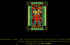
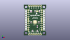
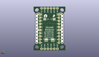
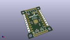

Contents
========

* [PROJ-SPAR-13601-STAN-01>SX1509 IO-Expander](#proj-spar-13601-stan-01sx1509-io-expander)
	* [Images](#images)
	* [Interactive BOM](#interactive-bom)
	* [OOMP Parts](#oomp-parts)
	* [Tags](#tags)
  
![][im]
# PROJ-SPAR-13601-STAN-01>SX1509 IO-Expander

- ID: PROJ-SPAR-13601-STAN-01
- Hex ID: PRS13601
- Name: SX1509 IO-Expander
- Description: 

## Images
  
  

|eagleImage|kicadPcb3dFront|kicadPcb3dBack|kicadPcb3d|
| :---: | :---: | :---: | :---: |
|||||

## Interactive BOM

- Interactive BOM page: [ibom.html](kicad/bom/ibom.html)

## OOMP Parts
  

|OOMP Parts|
| :---: |
|CAPE-0603-X-NF100-01, C1, 15.239999999999998, 10.16, 270,C1, 0.1uF, 0603-CAP, SparkFun-Capacitors, (0.6, 0.4), R270|
|CAPE-0603-X-NF100-01, C2, 8.254999999999999, 15.239999999999998, 90,C2, 0.1uF, 0603-CAP, SparkFun-Capacitors, (0.325, 0.6), R90|
|CAPE-0603-X-NF100-01, C3, 17.145, 15.239999999999998, 270,C3, 0.1uF, 0603-CAP, SparkFun-Capacitors, (0.675, 0.6), R270|
|UNMATCHED-UNMATCHED-X-UNMATCHED-01, JP1, 6.35, 34.29, 0,JP1, 1X06, SparkFun-Connectors, (0.25, 1.35), R0|
|UNMATCHED-UNMATCHED-X-UNMATCHED-01, JP2, 6.35, 1.27, 0,JP2, 1X06, SparkFun-Connectors, (0.25, 0.05), R0|
|UNMATCHED-UNMATCHED-X-UNMATCHED-01, JP3, 3.8099999999999996, 17.779999999999998, 270,JP3, 2X10_ROUND_NOSILK, SparkFun-Connectors, (0.15, 0.7), R270|
|UNMATCHED-UNMATCHED-X-UNMATCHED-01, JP4, 21.59, 17.779999999999998, 90,JP4, 2X10_ROUND_NOSILK, SparkFun-Connectors, (0.85, 0.7), R90|
|UNMATCHED-UNMATCHED-X-UNMATCHED-01, JP9, 20.32, 31.75, 0,JP9, FIDUCIAL1X2, FIDUCIAL-1X2, SparkFun, (0.8, 1.25), R0|
|UNMATCHED-UNMATCHED-X-UNMATCHED-01, JP10, 5.334, 4.191, 0,JP10, FIDUCIAL1X2, FIDUCIAL-1X2, SparkFun, (0.21, 0.165), R0|
|<table><tr><td></td><td> R1</td><td>[RESE-0603-X-O103-01 SMD (0603) 10k Ohm Resistor](https://github.com/oomlout/oomlout_OOMP_parts/tree/main/RESE-0603-X-O103-01/)</td><td>[R6103](https://github.com/oomlout/oomlout_OOMP_parts/tree/main/RESE-0603-X-O103-01/)</td></tr></table>|
|<table><tr><td></td><td> R2</td><td>[RESE-0603-X-O103-01 SMD (0603) 10k Ohm Resistor](https://github.com/oomlout/oomlout_OOMP_parts/tree/main/RESE-0603-X-O103-01/)</td><td>[R6103](https://github.com/oomlout/oomlout_OOMP_parts/tree/main/RESE-0603-X-O103-01/)</td></tr></table>|
|<table><tr><td></td><td> R3</td><td>[RESE-0603-X-O103-01 SMD (0603) 10k Ohm Resistor](https://github.com/oomlout/oomlout_OOMP_parts/tree/main/RESE-0603-X-O103-01/)</td><td>[R6103](https://github.com/oomlout/oomlout_OOMP_parts/tree/main/RESE-0603-X-O103-01/)</td></tr></table>|
|<table><tr><td></td><td> R4</td><td>[RESE-0603-X-O103-01 SMD (0603) 10k Ohm Resistor](https://github.com/oomlout/oomlout_OOMP_parts/tree/main/RESE-0603-X-O103-01/)</td><td>[R6103](https://github.com/oomlout/oomlout_OOMP_parts/tree/main/RESE-0603-X-O103-01/)</td></tr></table>|
|<table><tr><td></td><td> R5</td><td>[RESE-0603-X-O103-01 SMD (0603) 10k Ohm Resistor](https://github.com/oomlout/oomlout_OOMP_parts/tree/main/RESE-0603-X-O103-01/)</td><td>[R6103](https://github.com/oomlout/oomlout_OOMP_parts/tree/main/RESE-0603-X-O103-01/)</td></tr></table>|
|<table><tr><td></td><td> R6</td><td>[RESE-0603-X-O103-01 SMD (0603) 10k Ohm Resistor](https://github.com/oomlout/oomlout_OOMP_parts/tree/main/RESE-0603-X-O103-01/)</td><td>[R6103](https://github.com/oomlout/oomlout_OOMP_parts/tree/main/RESE-0603-X-O103-01/)</td></tr></table>|
|UNMATCHED-UNMATCHED-X-UNMATCHED-01, SJ1, 15.239999999999998, 27.94, 0,SJ1, PAD-JUMPER-3-3OF3_NC_BY_TRACE_YES_SILK_FULL_BOX, SparkFun-Passives, (0.6, 1.1), R0|
|UNMATCHED-UNMATCHED-X-UNMATCHED-01, SJ2, 8.889999999999999, 25.4, M180,SJ2, VCC1-3.3V, PAD-JUMPER-2-NC_BY_TRACE_YES_SILK, SparkFun-Passives, (0.35, 1), MR180|
|UNMATCHED-UNMATCHED-X-UNMATCHED-01, SJ3, 16.509999999999998, 25.4, M0,SJ3, VCC2-3.3V, PAD-JUMPER-2-NC_BY_TRACE_YES_SILK, SparkFun-Passives, (0.65, 1), MR0|
|UNMATCHED-UNMATCHED-X-UNMATCHED-01, SJ4, 10.16, 8.889999999999999, M180,SJ4, PAD-JUMPER-3-2OF3_NC_BY_TRACE_YES_SILK_FULL_BOX, SparkFun-Passives, (0.4, 0.35), MR180|
|UNMATCHED-UNMATCHED-X-UNMATCHED-01, SJ5, 15.239999999999998, 8.889999999999999, M0,SJ5, PAD-JUMPER-3-2OF3_NC_BY_TRACE_YES_SILK_FULL_BOX, SparkFun-Passives, (0.6, 0.35), MR0|
|UNMATCHED-UNMATCHED-X-UNMATCHED-01, SJ6, 3.8099999999999996, 16.509999999999998, M180,SJ6, A-VCC1, PAD-JUMPER-2-NO_NO_SILK, SparkFun-Passives, (0.15, 0.65), MR180|
|UNMATCHED-UNMATCHED-X-UNMATCHED-01, SJ7, 3.8099999999999996, 29.209999999999997, M0,SJ7, GND, PAD-JUMPER-2-NC_BY_TRACE_NO_SILK, SparkFun-Passives, (0.15, 1.15), MR0|
|UNMATCHED-UNMATCHED-X-UNMATCHED-01, SJ8, 21.59, 16.509999999999998, M0,SJ8, B-VCC2, PAD-JUMPER-2-NO_NO_SILK, SparkFun-Passives, (0.85, 0.65), MR0|
|UNMATCHED-UNMATCHED-X-UNMATCHED-01, SJ9, 21.59, 29.209999999999997, M180,SJ9, GND, PAD-JUMPER-2-NC_BY_TRACE_NO_SILK, SparkFun-Passives, (0.85, 1.15), MR180|
|UNMATCHED-UNMATCHED-X-UNMATCHED-01, U1, 12.7, 15.239999999999998, 0,U1, SX1509, QFN-28, SparkFun-DigitalIC, (0.5, 0.6), R0|

## Tags

- hexID: PRS13601
- oompType: PROJ
- oompSize: SPAR
- oompColor: 13601
- oompDesc: STAN
- oompIndex: 01
- oompName: SX1509 IO-Expander
- sources: All source files from https://github.com/sparkfun/SX1509_IO-Expander (source licence details in srcLicense.md)
- linkBuyPage: https://www.sparkfun.com/products/13601
- oompPart: CAPE-0603-X-NF100-01, C1, 15.239999999999998, 10.16, 270
- oompPart: CAPE-0603-X-NF100-01, C2, 8.254999999999999, 15.239999999999998, 90
- oompPart: CAPE-0603-X-NF100-01, C3, 17.145, 15.239999999999998, 270
- oompPart: UNMATCHED-UNMATCHED-X-UNMATCHED-01, JP1, 6.35, 34.29, 0
- oompPart: UNMATCHED-UNMATCHED-X-UNMATCHED-01, JP2, 6.35, 1.27, 0
- oompPart: UNMATCHED-UNMATCHED-X-UNMATCHED-01, JP3, 3.8099999999999996, 17.779999999999998, 270
- oompPart: UNMATCHED-UNMATCHED-X-UNMATCHED-01, JP4, 21.59, 17.779999999999998, 90
- oompPart: UNMATCHED-UNMATCHED-X-UNMATCHED-01, JP9, 20.32, 31.75, 0
- oompPart: UNMATCHED-UNMATCHED-X-UNMATCHED-01, JP10, 5.334, 4.191, 0
- oompPart: RESE-0603-X-O103-01, R1, 7.619999999999999, 27.94, 270
- oompPart: RESE-0603-X-O103-01, R2, 17.779999999999998, 27.94, 270
- oompPart: RESE-0603-X-O103-01, R3, 8.889999999999999, 27.94, 270
- oompPart: RESE-0603-X-O103-01, R4, 12.7, 27.94, 270
- oompPart: RESE-0603-X-O103-01, R5, 10.16, 5.08, 270
- oompPart: RESE-0603-X-O103-01, R6, 15.239999999999998, 5.08, 270
- oompPart: UNMATCHED-UNMATCHED-X-UNMATCHED-01, SJ1, 15.239999999999998, 27.94, 0
- oompPart: UNMATCHED-UNMATCHED-X-UNMATCHED-01, SJ2, 8.889999999999999, 25.4, M180
- oompPart: UNMATCHED-UNMATCHED-X-UNMATCHED-01, SJ3, 16.509999999999998, 25.4, M0
- oompPart: UNMATCHED-UNMATCHED-X-UNMATCHED-01, SJ4, 10.16, 8.889999999999999, M180
- oompPart: UNMATCHED-UNMATCHED-X-UNMATCHED-01, SJ5, 15.239999999999998, 8.889999999999999, M0
- oompPart: UNMATCHED-UNMATCHED-X-UNMATCHED-01, SJ6, 3.8099999999999996, 16.509999999999998, M180
- oompPart: UNMATCHED-UNMATCHED-X-UNMATCHED-01, SJ7, 3.8099999999999996, 29.209999999999997, M0
- oompPart: UNMATCHED-UNMATCHED-X-UNMATCHED-01, SJ8, 21.59, 16.509999999999998, M0
- oompPart: UNMATCHED-UNMATCHED-X-UNMATCHED-01, SJ9, 21.59, 29.209999999999997, M180
- oompPart: UNMATCHED-UNMATCHED-X-UNMATCHED-01, U1, 12.7, 15.239999999999998, 0
- rawPart: C1, 0.1uF, 0603-CAP, SparkFun-Capacitors, (0.6, 0.4), R270
- rawPart: C2, 0.1uF, 0603-CAP, SparkFun-Capacitors, (0.325, 0.6), R90
- rawPart: C3, 0.1uF, 0603-CAP, SparkFun-Capacitors, (0.675, 0.6), R270
- rawPart: JP1, 1X06, SparkFun-Connectors, (0.25, 1.35), R0
- rawPart: JP2, 1X06, SparkFun-Connectors, (0.25, 0.05), R0
- rawPart: JP3, 2X10_ROUND_NOSILK, SparkFun-Connectors, (0.15, 0.7), R270
- rawPart: JP4, 2X10_ROUND_NOSILK, SparkFun-Connectors, (0.85, 0.7), R90
- rawPart: JP9, FIDUCIAL1X2, FIDUCIAL-1X2, SparkFun, (0.8, 1.25), R0
- rawPart: JP10, FIDUCIAL1X2, FIDUCIAL-1X2, SparkFun, (0.21, 0.165), R0
- rawPart: R1, 10K, 0603-RES, SparkFun-Resistors, (0.3, 1.1), R270
- rawPart: R2, 10K, 0603-RES, SparkFun-Resistors, (0.7, 1.1), R270
- rawPart: R3, 10K, 0603-RES, SparkFun-Resistors, (0.35, 1.1), R270
- rawPart: R4, 10K, 0603-RES, SparkFun-Resistors, (0.5, 1.1), R270
- rawPart: R5, 10K, 0603-RES, SparkFun-Resistors, (0.4, 0.2), R270
- rawPart: R6, 10K, 0603-RES, SparkFun-Resistors, (0.6, 0.2), R270
- rawPart: SJ1, PAD-JUMPER-3-3OF3_NC_BY_TRACE_YES_SILK_FULL_BOX, SparkFun-Passives, (0.6, 1.1), R0
- rawPart: SJ2, VCC1-3.3V, PAD-JUMPER-2-NC_BY_TRACE_YES_SILK, SparkFun-Passives, (0.35, 1), MR180
- rawPart: SJ3, VCC2-3.3V, PAD-JUMPER-2-NC_BY_TRACE_YES_SILK, SparkFun-Passives, (0.65, 1), MR0
- rawPart: SJ4, PAD-JUMPER-3-2OF3_NC_BY_TRACE_YES_SILK_FULL_BOX, SparkFun-Passives, (0.4, 0.35), MR180
- rawPart: SJ5, PAD-JUMPER-3-2OF3_NC_BY_TRACE_YES_SILK_FULL_BOX, SparkFun-Passives, (0.6, 0.35), MR0
- rawPart: SJ6, A-VCC1, PAD-JUMPER-2-NO_NO_SILK, SparkFun-Passives, (0.15, 0.65), MR180
- rawPart: SJ7, GND, PAD-JUMPER-2-NC_BY_TRACE_NO_SILK, SparkFun-Passives, (0.15, 1.15), MR0
- rawPart: SJ8, B-VCC2, PAD-JUMPER-2-NO_NO_SILK, SparkFun-Passives, (0.85, 0.65), MR0
- rawPart: SJ9, GND, PAD-JUMPER-2-NC_BY_TRACE_NO_SILK, SparkFun-Passives, (0.85, 1.15), MR180
- rawPart: U1, SX1509, QFN-28, SparkFun-DigitalIC, (0.5, 0.6), R0

[im]: kicadPcb3d_450.png
