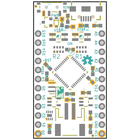
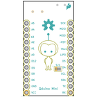
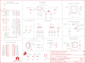

Contents
========

* [PRS13614 > Qduino Mini SFE](#prs13614--qduino-mini-sfe)
	* [Schematic](#schematic)
	* [PCB](#pcb)
	* [Interactive BOM](#interactive-bom)
	* [OOMP Parts](#oomp-parts)
	* [Images](#images)
	* [Tags](#tags)
  
![][im]
# PRS13614 > Qduino Mini SFE

- ID: PROJ-SPAR-13614-STAN-01
- Hex ID: PRS13614
- Name: Sparkfun
- Description: Sparkfun
- Long Link: [http://oom.lt/PROJ-SPAR-13614-STAN-01](http://oom.lt/PROJ-SPAR-13614-STAN-01)
- Short Link: [http://oom.lt/PRS13614](http://oom.lt/PRS13614)

## Schematic
  

## PCB
  

## Interactive BOM

- Interactive BOM page: [ibom.html](https://htmlpreview.github.io/?https://github.com/oomlout/oomlout_OOMP_projects/blob/main/PROJ-SPAR-13614-STAN-01/kicad/bom/ibom.html)

## OOMP Parts
  

|OOMP Parts|
| :---: |
|[CAPC-0603-X-UF47D-V10  SMD (0603) 4.7 uF Capacitor (Ceramic) 10v  C1, C2](https://github.com/oomlout/oomlout_OOMP_parts/tree/main/CAPC-0603-X-UF47D-V10/)|
|[CAPC-0603-X-UF1-V25  SMD (0603) 1 uF Capacitor (Ceramic) 25v  C3, C4, C5](https://github.com/oomlout/oomlout_OOMP_parts/tree/main/CAPC-0603-X-UF1-V25/)|
|[CAPC-0603-X-NF100-V50  SMD (0603) 100 nF Capacitor (Ceramic) 50v  C6](https://github.com/oomlout/oomlout_OOMP_parts/tree/main/CAPC-0603-X-NF100-V50/)|
|[CAPC-0603-X-UF22D-V10  SMD (0603) 2.2 uF Capacitor (Ceramic) 10v  C7](https://github.com/oomlout/oomlout_OOMP_parts/tree/main/CAPC-0603-X-UF22D-V10/)|
|DIOD-S323-X-UNMATCHED-01 D1|
|DIOD-UNMATCHED-X-UNMATCHED-01 D2, D3|
|[LEDS-0603-G-STAN-01  SMD (0603) Green LED  D4](https://github.com/oomlout/oomlout_OOMP_parts/tree/main/LEDS-0603-G-STAN-01/)|
|UNMATCHED-UNMATCHED-X-UNMATCHED-01 J1, JP2, S1, U1, U3, U5, Y1|
|[HEAD-I01-X-PI12-01  2.54 mm 12 Pin Header  JP3, JP4](https://github.com/oomlout/oomlout_OOMP_parts/tree/main/HEAD-I01-X-PI12-01/)|
|UNMATCHED-SO23-X-UNMATCHED-01 Q1|
|RESE-0603-X-UNMATCHED-01 R1, R2, R5|
|[RESE-0603-X-O220-01  SMD (0603) 22 Ohm Resistor  R3, R4](https://github.com/oomlout/oomlout_OOMP_parts/tree/main/RESE-0603-X-O220-01/)|
|RESE-0603-X-O1003-01 R6|
|[RESE-0603-X-O103-01  SMD (0603) 10k Ohm Resistor  R7, R8](https://github.com/oomlout/oomlout_OOMP_parts/tree/main/RESE-0603-X-O103-01/)|
|[RESE-0603-X-O472-01  SMD (0603) 4.7k Ohm Resistor  R11, R12](https://github.com/oomlout/oomlout_OOMP_parts/tree/main/RESE-0603-X-O472-01/)|
|UNMATCHED-SO235-X-UNMATCHED-01 U2|
|VREG-SO235-X-KAP2112K-V33D U4|

## Images
  
  

|bominteractivefront|bominteractiveback|kicadPcb3d|kicadPcb3dFront|kicadPcb3dBack|eagleImage|eagleSchemImage|
| :---: | :---: | :---: | :---: | :---: | :---: | :---: |
||||||||

## Tags

- hexID: PRS13614
- oompType: PROJ
- oompSize: SPAR
- oompColor: 13614
- oompDesc: STAN
- oompIndex: 01
- oompName: Qduino Mini SFE
- sources: All source files from https://github.com/sparkfun/Qduino_Mini_SFE (source licence details in srcLicense.md)
- linkBuyPage: https://www.sparkfun.com/products/13614
- oompID: PROJ-SPAR-13614-STAN-01
- oompParts: C1,CAPC-0603-X-UF47D-V10
- oompParts: C2,CAPC-0603-X-UF47D-V10
- oompParts: C3,CAPC-0603-X-UF1-V25
- oompParts: C4,CAPC-0603-X-UF1-V25
- oompParts: C5,CAPC-0603-X-UF1-V25
- oompParts: C6,CAPC-0603-X-NF100-V50
- oompParts: C7,CAPC-0603-X-UF22D-V10
- oompParts: D1,DIOD-S323-X-UNMATCHED-01
- oompParts: D2,DIOD-UNMATCHED-X-UNMATCHED-01
- oompParts: D3,DIOD-UNMATCHED-X-UNMATCHED-01
- oompParts: D4,LEDS-0603-G-STAN-01
- oompParts: J1,UNMATCHED-UNMATCHED-X-UNMATCHED-01
- oompParts: JP2,UNMATCHED-UNMATCHED-X-UNMATCHED-01
- oompParts: JP3,HEAD-I01-X-PI12-01
- oompParts: JP4,HEAD-I01-X-PI12-01
- oompParts: Q1,UNMATCHED-SO23-X-UNMATCHED-01
- oompParts: R1,RESE-0603-X-UNMATCHED-01
- oompParts: R2,RESE-0603-X-UNMATCHED-01
- oompParts: R3,RESE-0603-X-O220-01
- oompParts: R4,RESE-0603-X-O220-01
- oompParts: R5,RESE-0603-X-UNMATCHED-01
- oompParts: R6,RESE-0603-X-O1003-01
- oompParts: R7,RESE-0603-X-O103-01
- oompParts: R8,RESE-0603-X-O103-01
- oompParts: R11,RESE-0603-X-O472-01
- oompParts: R12,RESE-0603-X-O472-01
- oompParts: S1,UNMATCHED-UNMATCHED-X-UNMATCHED-01
- oompParts: U1,UNMATCHED-UNMATCHED-X-UNMATCHED-01
- oompParts: U2,UNMATCHED-SO235-X-UNMATCHED-01
- oompParts: U3,UNMATCHED-UNMATCHED-X-UNMATCHED-01
- oompParts: U4,VREG-SO235-X-KAP2112K-V33D
- oompParts: U5,UNMATCHED-UNMATCHED-X-UNMATCHED-01
- oompParts: Y1,UNMATCHED-UNMATCHED-X-UNMATCHED-01
- rawParts: C1,4.7uF,CAP0603-CAP,0603-CAP,Capacitor,,,CAP-08280,,,,
- rawParts: C2,4.7uF,CAP0603-CAP,0603-CAP,Capacitor,,,CAP-08280,,,,
- rawParts: C3,1uF,CAP0603-CAP,0603-CAP,Capacitor,,,CAP-00868,,,,
- rawParts: C4,1uF,CAP0603-CAP,0603-CAP,Capacitor,,,CAP-00868,,,,
- rawParts: C5,1uF,CAP0603-CAP,0603-CAP,Capacitor,,,CAP-00868,,,,
- rawParts: C6,0.1uF,0.1UF-25V(+80/-20%)(0603),0603-CAP,CAP-00810,,,CAP-00810,,,0.1uF,
- rawParts: C7,2.2uF,2.2UF-10V-20%(0603),0603-CAP,CAP-07888,,,CAP-07888,,,2.2uF,
- rawParts: D1,BAT20J,DIODE-SCHOTTKY-BAT20J,SOD-323,Schottky diodes in SFEs production catalog,,,DIO-11623,,,BAT20J,
- rawParts: D2,,0.13_RGB_LEDPLCC,P-LCC-4-3,Everlight Red/Green/Blue LED,,,DIO-12986,,,,
- rawParts: D3,,0.13_RGB_LEDPLCC,P-LCC-4-3,Everlight Red/Green/Blue LED,,,DIO-12986,,,,
- rawParts: D4,GREEN,LED-GREEN0603,LED-0603,Various green LEDs,,,DIO-00821,,,GREEN,
- rawParts: FID1,FIDUCIALUFIDUCIAL,FIDUCIALUFIDUCIAL,MICRO-FIDUCIAL,Fiducial Alignment Points,,,,,,,
- rawParts: FID2,FIDUCIALUFIDUCIAL,FIDUCIALUFIDUCIAL,MICRO-FIDUCIAL,Fiducial Alignment Points,,,,,,,
- rawParts: FRAME2,FRAME-LETTER,FRAME-LETTER,CREATIVE_COMMONS,Schematic Frame,,,,,,,
- rawParts: J1,LiPo,JST_2MM_MALE,JST-2-SMD,Mates to single-cell LiPo batteries.,-,+,CONN-11443,-,+,,
- rawParts: JP2,,USB_MICROB_PLUGCONN-11752,USB-B-MICRO-SMD_V03,USB Micro-B connectors,,,CONN-11752,,,,
- rawParts: JP3,,M12PTH,1X12,Header 12,,,CONN-09693,,,,
- rawParts: JP4,,M12PTH,1X12,Header 12,,,CONN-09693,,,,
- rawParts: LOGO1,OSHW-LOGOS,OSHW-LOGOS,OSHW-LOGO-S,Open Source Hardware Logo,,,,,,,
- rawParts: LOGO2,SFE_LOGO_FLAME.1_INCH,SFE_LOGO_FLAME.1_INCH,SFE_LOGO_FLAME_.1,SFE Logo, flame only,,,,,,,
- rawParts: Q1,ZXMP6A13FTA,MOSFET-PCHANNEL,SOT23-3,Generic PMOSFET,,,TRANS-08285,,,,
- rawParts: R1,1KΩ,RESISTOR-ARRAY0603-ARV,0603-ARV,Array Chip Resistor,,,RES-12985,,,,
- rawParts: R2,1KΩ,RESISTOR-ARRAY0603-ARV,0603-ARV,Array Chip Resistor,,,RES-12985,,,,
- rawParts: R3,22,RESISTOR0603,0603-RES,Resistor,,,RES-08698,,,,
- rawParts: R4,22,RESISTOR0603,0603-RES,Resistor,,,RES-08698,,,,
- rawParts: R5,2.0k,2.0KOHM1/10W5%(0603),0603-RES,RES-08296,,,RES-08296,,,2.0k,
- rawParts: R6,100k,100KOHM-1/10W-1%(0603),0603-RES,RES-07828,,,RES-07828,,,100k,
- rawParts: R7,10K,10KOHM-1/10W-1%(0603)0603,0603-RES,RES-00824,,,RES-00824,,,10K,
- rawParts: R8,10K,10KOHM-1/10W-1%(0603)0603,0603-RES,RES-00824,,,RES-00824,,,10K,
- rawParts: R11,4.7K,RESISTOR0603-RES,0603-RES,Resistor,,,RES-07857,,,,
- rawParts: R12,4.7K,RESISTOR0603-RES,0603-RES,Resistor,,,RES-07857,,,,
- rawParts: S1,POWER,SWITCH-SPDT-SMD-A,SWITCH-SPST-SMD-A,SPDT Switch,,,SWCH-10651,,,,
- rawParts: SJ1,,JUMPER-PAD-3-2OF3_NC_BY_TRACE_SMALL,PAD-JUMPER-3-2OF3_NC_BY_TRACE_YES_SILK_FULL_BOX,,,,,,,,
- rawParts: U1,ATMEGA32U41:1-LESS_PASTE,ATMEGA32U41:1-LESS_PASTE,QFN-44-NOPAD_1:1-LESS_PASTE,Atmel 44-pin 8-bit Microcontroller with 32KBytes of ISP Flash and USB Controller,,,IC-10828,,,,
- rawParts: U2,MCP73831,MCP73831,SOT23-5,Microchips MCP73831,,,IC-09995,,,,
- rawParts: U3,MAX17048,MAX17048DFN8,DFN-8,Micropower 1-Cell Li+ ModelGauge,,,IC-12551,,,,
- rawParts: U4,AP2112K-3.3TRG-1,LDO-TPS78233,SOT23-5,Voltage Regulator LDO,,,VREG-12457,,,,
- rawParts: U5,MIGHTYQ-L-SILK,MIGHTYQ-L-SILK,LOGO-LARGE-SILK,,,,,,,,
- rawParts: Y1,8MHZ,RESONATOR8MHZ,RESONATOR-SMD,Resonator,,,XTAL-08895,,,8MHZ,

[im]: kicadPcb3d_450.png
