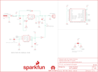

Contents
========

* [PRS13626 > Sparkfun](#prs13626--sparkfun)
	* [Images](#images)
	* [Tags](#tags)
  
![][im]
# PRS13626 > Sparkfun

- ID: PROJ-SPAR-13626-STAN-01
- Hex ID: PRS13626
- Name: Sparkfun
- Description: Sparkfun

## Images
  
  

|kicadPcb3d|kicadPcb3dFront|kicadPcb3dBack|eagleImage|eagleSchemImage|
| :---: | :---: | :---: | :---: | :---: |
||||||

## Tags

- hexID: PRS13626
- oompType: PROJ
- oompSize: SPAR
- oompColor: 13626
- oompDesc: STAN
- oompIndex: 01
- oompName: Photon Battery Shield
- sources: All source files from https://github.com/sparkfun/Photon_Battery_Shield (source licence details in srcLicense.md)
- linkBuyPage: https://www.sparkfun.com/products/13626
- oompID: PROJ-SPAR-13626-STAN-01
- oompParts: C1,UNMATCHED-UNMATCHED-UNMATCHED-UNMATCHED-UNMATCHED
- oompParts: C2,UNMATCHED-UNMATCHED-UNMATCHED-UNMATCHED-UNMATCHED
- oompParts: C3,UNMATCHED-UNMATCHED-UNMATCHED-UNMATCHED-UNMATCHED
- oompParts: D1,UNMATCHED-UNMATCHED-UNMATCHED-UNMATCHED-UNMATCHED
- oompParts: D2,UNMATCHED-UNMATCHED-UNMATCHED-UNMATCHED-UNMATCHED
- oompParts: D3,UNMATCHED-UNMATCHED-UNMATCHED-UNMATCHED-UNMATCHED
- oompParts: FRAME1,UNMATCHED-UNMATCHED-UNMATCHED-UNMATCHED-UNMATCHED
- oompParts: JP1,UNMATCHED-UNMATCHED-UNMATCHED-UNMATCHED-UNMATCHED
- oompParts: JP2,UNMATCHED-UNMATCHED-UNMATCHED-UNMATCHED-UNMATCHED
- oompParts: JP3,UNMATCHED-UNMATCHED-UNMATCHED-UNMATCHED-UNMATCHED
- oompParts: LOGO2,UNMATCHED-UNMATCHED-UNMATCHED-UNMATCHED-UNMATCHED
- oompParts: LOGO3,UNMATCHED-UNMATCHED-UNMATCHED-UNMATCHED-UNMATCHED
- oompParts: R1,UNMATCHED-UNMATCHED-UNMATCHED-UNMATCHED-UNMATCHED
- oompParts: R2,UNMATCHED-UNMATCHED-UNMATCHED-UNMATCHED-UNMATCHED
- oompParts: R3,UNMATCHED-UNMATCHED-UNMATCHED-UNMATCHED-UNMATCHED
- oompParts: R4,UNMATCHED-UNMATCHED-UNMATCHED-UNMATCHED-UNMATCHED
- oompParts: R5,UNMATCHED-UNMATCHED-UNMATCHED-UNMATCHED-UNMATCHED
- oompParts: R6,UNMATCHED-UNMATCHED-UNMATCHED-UNMATCHED-UNMATCHED
- oompParts: SJ1,UNMATCHED-UNMATCHED-UNMATCHED-UNMATCHED-UNMATCHED
- oompParts: SJ2,UNMATCHED-UNMATCHED-UNMATCHED-UNMATCHED-UNMATCHED
- oompParts: TP1,UNMATCHED-UNMATCHED-UNMATCHED-UNMATCHED-UNMATCHED
- oompParts: U1,UNMATCHED-UNMATCHED-UNMATCHED-UNMATCHED-UNMATCHED
- oompParts: U2,UNMATCHED-UNMATCHED-UNMATCHED-UNMATCHED-UNMATCHED
- rawParts: C1,4.7uF,4.7UF-6.3V-10%(0603)0603,0603-CAP,CAP-08280,,CAP-08280,,4.7uF,,
- rawParts: C2,1.0uF,1.0UF-16V-10%(0603),0603-CAP,CAP-00868,,CAP-00868,,1.0uF,,
- rawParts: C3,4.7uF,4.7UF-6.3V-10%(0603)0603,0603-CAP,CAP-08280,,CAP-08280,,4.7uF,,
- rawParts: D1,MBRA140,DIODE-SCHOTTKY-MBRA140,SMA-DIODE,Schottky diodes in SFEs production catalog,,DIO-08053,,MBRA140,,
- rawParts: D2,RED,LED-RED0603,LED-0603,Assorted Red LEDs,,DIO-00819,,RED,,
- rawParts: D3,MBRA140,DIODE-SCHOTTKY-MBRA140,SMA-DIODE,Schottky diodes in SFEs production catalog,,DIO-08053,,MBRA140,,
- rawParts: FID1,FIDUCIAL1X2,FIDUCIAL1X2,FIDUCIAL-1X2,Fiducial Alignment Points,,,,,,
- rawParts: FID2,FIDUCIAL1X2,FIDUCIAL1X2,FIDUCIAL-1X2,Fiducial Alignment Points,,,,,,
- rawParts: FRAME1,,FRAME-LETTER,CREATIVE_COMMONS,Schematic Frame,NAME,,,,v01,
- rawParts: JP1,5.5x2.1mm Barrel,POWER_JACKSMD,POWER_JACK_SMD,Power Jack,,CONN-08106,PRT-12748,5.5x2.1mm Barrel,,
- rawParts: JP2,,M02-JST-2MM-SMT,JST-2-SMD,Standard 2-pin 0.1 header. Use with,,CONN-11443,,,,
- rawParts: JP3,SPARK_PHOTONTEMPLATE_WIDE,SPARK_PHOTONTEMPLATE_WIDE,SPARK_PHOTON_TEMPLATE_WIDE,,,,,,,
- rawParts: LOGO2,OSHW-LOGOS,OSHW-LOGOS,OSHW-LOGO-S,Open Source Hardware Logo,,,,,,
- rawParts: LOGO3,SFE_LOGO_NAME_FLAME.1_INCH,SFE_LOGO_NAME_FLAME.1_INCH,SFE_LOGO_NAME_FLAME_.1,SFE Logo, name and flame,,,,,,
- rawParts: R1,1K,1KOHM-1/10W-1%(0603),0603-RES,RES-07856,,RES-07856,,1K,,
- rawParts: R2,330,330OHM1/10W1%(0603),0603-RES,RES-00818,,RES-00818,,330,,
- rawParts: R3,2.0k,2.0KOHM1/10W5%(0603),0603-RES,RES-08296,,RES-08296,,2.0k,,
- rawParts: R4,1K,1KOHM-1/10W-1%(0603),0603-RES,RES-07856,,RES-07856,,1K,,
- rawParts: R5,10K,10KOHM-1/10W-1%(0603)0603,0603-RES,RES-00824,,RES-00824,,10K,,
- rawParts: R6,10K,10KOHM-1/10W-1%(0603)0603,0603-RES,RES-00824,,RES-00824,,10K,,
- rawParts: SJ1,alert,JUMPER-PAD-2-NOYES_SILK,PAD-JUMPER-2-NO_YES_SILK,,,,,,,
- rawParts: SJ2,,JUMPER-PAD-3-NC_BY_TRACE,PAD-JUMPER-3-3OF3_NC_BY_TRACE_YES_SILK_FULL_BOX,,,,,,,
- rawParts: TP1,TEST-POINT3X5,TEST-POINT3X5,PAD.03X.05,Bare copper test points for troubleshooting or ICT,,,,,,
- rawParts: U1,MAX1704X,MAX1704X,TDFN-8,MAX17043/MAX17044: Battery Fuel Guage (43 is 1cell, 44 is 2cell),,IC-10399,,,,
- rawParts: U2,MCP73831,MCP73831,SOT23-5,Miniature single cell, fully integrated Li-Ion, Li-polymer charge management controller,,IC-09995,,,,

[im]: kicadPcb3d_450.png
