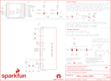

Contents
========

* [PRS13628 > Sparkfun](#prs13628--sparkfun)
	* [Schematic](#schematic)
	* [Interactive BOM](#interactive-bom)
	* [OOMP Parts](#oomp-parts)
	* [Images](#images)
	* [Tags](#tags)
  
![][im]
# PRS13628 > Sparkfun

- ID: PROJ-SPAR-13628-STAN-01
- Hex ID: PRS13628
- Name: Sparkfun
- Description: Sparkfun
- Long Link: [http://oom.lt/PROJ-SPAR-13628-STAN-01](http://oom.lt/PROJ-SPAR-13628-STAN-01)
- Short Link: [http://oom.lt/PRS13628](http://oom.lt/PRS13628)

## Schematic
  

## Interactive BOM

- Interactive BOM page: [ibom.html](https://htmlpreview.github.io/?https://github.com/oomlout/oomlout_OOMP_projects/blob/main/PROJ-SPAR-13628-STAN-01/kicad/bom/ibom.html)

## OOMP Parts
  

|OOMP Parts|
| :---: |
|C1,CAPC-0805-X-UNMATCHED-01,C1,2.2uF,2.2UF-25V-+80/-20(0805),0805-CAP,CAP-11624,,CAP-11624,2.2uF,,|
|C2,CAPC-0805-X-UF1-01,C2,1uF,1UF-25V-10%(0805),0805-CAP,CAP-08064,,,,,|
|C3,CAPC-0805-X-UF1-01,C3,1uF,1UF-25V-10%(0805),0805-CAP,CAP-08064,,,,,|
|C4,CAPC-0603-X-UF1-01,C4,1uF,CAP0603-CAP,0603-CAP,Capacitor,,CAP-00868,,,|
|C5,CAPC-UNMATCHED-X-UNMATCHED-01,C5,4.7uF,4.7UF-16V-20%,+80%-(1206),1206-CAP,CAP-10300,,CAP-10300,4.7uF,,|
|C6,CAPC-0603-X-UF1-01,C6,1uF,CAP0603-CAP,0603-CAP,Capacitor,,CAP-00868,,,|
|FRAME1,UNMATCHED-UNMATCHED-X-UNMATCHED-01,FID1,FIDUCIAL1X2,FIDUCIAL1X2,FIDUCIAL-1X2,Fiducial Alignment Points,,,,,|
|JP3,UNMATCHED-UNMATCHED-X-UNMATCHED-01,FID2,FIDUCIAL1X2,FIDUCIAL1X2,FIDUCIAL-1X2,Fiducial Alignment Points,,,,,|
|OLED1,UNMATCHED-UNMATCHED-X-UNMATCHED-01,FRAME1,,FRAME-LETTER,CREATIVE_COMMONS,Schematic Frame,NAME,,,v01,|
|R1,RESE-0603-X-O3903-01,JP3,SPARK_PHOTONTEMPLATE_WIDE,SPARK_PHOTONTEMPLATE_WIDE,SPARK_PHOTON_TEMPLATE_WIDE,,,,,,|
|R2,RESE-0603-X-O103-01,LOGO1,SFE_LOGO_NAME_FLAME.1_INCH,SFE_LOGO_NAME_FLAME.1_INCH,SFE_LOGO_NAME_FLAME_.1,SFE Logo, name and flame,,,,,|
|R5,RESE-0603-X-O103-01,LOGO2,SFE_LOGO_NAME_FLAME.1_INCH,SFE_LOGO_NAME_FLAME.1_INCH,SFE_LOGO_NAME_FLAME_.1,SFE Logo, name and flame,,,,,|
|R7,RESE-0603-X-O103-01,LOGO3,OSHW-LOGOS,OSHW-LOGOS,OSHW-LOGO-S,Open Source Hardware Logo,,,,,|
|TP1,UNMATCHED-UNMATCHED-X-UNMATCHED-01,OLED1,OLED0.66,OLED0.66,OLED-0.66-64X48,,,LCD-12019,,,|
|TP2,UNMATCHED-UNMATCHED-X-UNMATCHED-01,R1,390k,RESISTOR0603-RES,0603-RES,Resistor,,RES-12024,,,|

## Images
  
  

|kicadPcb3d|kicadPcb3dFront|kicadPcb3dBack|eagleImage|eagleSchemImage|
| :---: | :---: | :---: | :---: | :---: |
||||||

## Tags

- hexID: PRS13628
- oompType: PROJ
- oompSize: SPAR
- oompColor: 13628
- oompDesc: STAN
- oompIndex: 01
- oompName: Photon OLED Shield
- sources: All source files from https://github.com/sparkfun/Photon_OLED_Shield (source licence details in srcLicense.md)
- linkBuyPage: https://www.sparkfun.com/products/13628
- oompID: PROJ-SPAR-13628-STAN-01
- oompParts: C1,CAPC-0805-X-UNMATCHED-01
- oompParts: C2,CAPC-0805-X-UF1-01
- oompParts: C3,CAPC-0805-X-UF1-01
- oompParts: C4,CAPC-0603-X-UF1-01
- oompParts: C5,CAPC-UNMATCHED-X-UNMATCHED-01
- oompParts: C6,CAPC-0603-X-UF1-01
- oompParts: FRAME1,UNMATCHED-UNMATCHED-X-UNMATCHED-01
- oompParts: JP3,UNMATCHED-UNMATCHED-X-UNMATCHED-01
- oompParts: OLED1,UNMATCHED-UNMATCHED-X-UNMATCHED-01
- oompParts: R1,RESE-0603-X-O3903-01
- oompParts: R2,RESE-0603-X-O103-01
- oompParts: R5,RESE-0603-X-O103-01
- oompParts: R7,RESE-0603-X-O103-01
- oompParts: TP1,UNMATCHED-UNMATCHED-X-UNMATCHED-01
- oompParts: TP2,UNMATCHED-UNMATCHED-X-UNMATCHED-01
- rawParts: C1,2.2uF,2.2UF-25V-+80/-20(0805),0805-CAP,CAP-11624,,CAP-11624,2.2uF,,
- rawParts: C2,1uF,1UF-25V-10%(0805),0805-CAP,CAP-08064,,,,,
- rawParts: C3,1uF,1UF-25V-10%(0805),0805-CAP,CAP-08064,,,,,
- rawParts: C4,1uF,CAP0603-CAP,0603-CAP,Capacitor,,CAP-00868,,,
- rawParts: C5,4.7uF,4.7UF-16V-20%,+80%-(1206),1206-CAP,CAP-10300,,CAP-10300,4.7uF,,
- rawParts: C6,1uF,CAP0603-CAP,0603-CAP,Capacitor,,CAP-00868,,,
- rawParts: FID1,FIDUCIAL1X2,FIDUCIAL1X2,FIDUCIAL-1X2,Fiducial Alignment Points,,,,,
- rawParts: FID2,FIDUCIAL1X2,FIDUCIAL1X2,FIDUCIAL-1X2,Fiducial Alignment Points,,,,,
- rawParts: FRAME1,,FRAME-LETTER,CREATIVE_COMMONS,Schematic Frame,NAME,,,v01,
- rawParts: JP3,SPARK_PHOTONTEMPLATE_WIDE,SPARK_PHOTONTEMPLATE_WIDE,SPARK_PHOTON_TEMPLATE_WIDE,,,,,,
- rawParts: LOGO1,SFE_LOGO_NAME_FLAME.1_INCH,SFE_LOGO_NAME_FLAME.1_INCH,SFE_LOGO_NAME_FLAME_.1,SFE Logo, name and flame,,,,,
- rawParts: LOGO2,SFE_LOGO_NAME_FLAME.1_INCH,SFE_LOGO_NAME_FLAME.1_INCH,SFE_LOGO_NAME_FLAME_.1,SFE Logo, name and flame,,,,,
- rawParts: LOGO3,OSHW-LOGOS,OSHW-LOGOS,OSHW-LOGO-S,Open Source Hardware Logo,,,,,
- rawParts: OLED1,OLED0.66,OLED0.66,OLED-0.66-64X48,,,LCD-12019,,,
- rawParts: R1,390k,RESISTOR0603-RES,0603-RES,Resistor,,RES-12024,,,
- rawParts: R2,10k,RESISTOR0603-RES,0603-RES,Resistor,,RES-00824,,,
- rawParts: R5,10K,10KOHM1/10W1%(0603)0603,0603-RES,RES-00824,,RES-00824,10K,,
- rawParts: R7,10K,10KOHM1/10W1%(0603)0603,0603-RES,RES-00824,,RES-00824,10K,,
- rawParts: SJ1,BS1,JUMPER-PAD-3-2OF3_NC_BY_PASTE,PAD-JUMPER-3-2OF3_NC_BY_PASTE_YES_SILK_FULL_BOX,,,,,,
- rawParts: SJ2,BS2,JUMPER-PAD-3-2OF3_NC_BY_PASTE,PAD-JUMPER-3-2OF3_NC_BY_PASTE_YES_SILK_FULL_BOX,,,,,,
- rawParts: SJ3,,JUMPER-PAD-2-NC_BY_TRACE,PAD-JUMPER-2-NC_BY_TRACE_YES_SILK,,,,,,
- rawParts: SJ4,,JUMPER-PAD-3-NOYES_SILK,PAD-JUMPER-3-NO_YES_SILK,,,,,,
- rawParts: SJ5,,JUMPER-PAD-2-NOYES_SILK,PAD-JUMPER-2-NO_YES_SILK,,,,,,
- rawParts: SJ8,,JUMPER-PAD-3-2OF3_NC_BY_TRACE_SMALL,PAD-JUMPER-3-2OF3_NC_BY_TRACE_YES_SILK_FULL_BOX,,,,,,
- rawParts: SJ10,,JUMPER-PAD-3-2OF3_NC_BY_TRACE_SMALL,PAD-JUMPER-3-2OF3_NC_BY_TRACE_YES_SILK_FULL_BOX,,,,,,
- rawParts: TP1,TEST-POINT3X5,TEST-POINT3X5,PAD.03X.05,Bare copper test points for troubleshooting or ICT,,,,,
- rawParts: TP2,TEST-POINT3X5,TEST-POINT3X5,PAD.03X.05,Bare copper test points for troubleshooting or ICT,,,,,

[im]: kicadPcb3d_450.png
