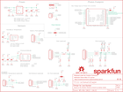

Contents
========

* [PRS13630 > Photon Weather Shield](#prs13630--photon-weather-shield)
	* [Schematic](#schematic)
	* [PCB](#pcb)
	* [Interactive BOM](#interactive-bom)
	* [OOMP Parts](#oomp-parts)
	* [Images](#images)
	* [Tags](#tags)
  
![][im]
# PRS13630 > Photon Weather Shield

- ID: PROJ-SPAR-13630-STAN-01
- Hex ID: PRS13630
- Name: Sparkfun
- Description: Sparkfun
- Long Link: [http://oom.lt/PROJ-SPAR-13630-STAN-01](http://oom.lt/PROJ-SPAR-13630-STAN-01)
- Short Link: [http://oom.lt/PRS13630](http://oom.lt/PRS13630)

## Schematic
  

## PCB
  

## Interactive BOM

- Interactive BOM page: [ibom.html](https://htmlpreview.github.io/?https://github.com/oomlout/oomlout_OOMP_projects/blob/main/PROJ-SPAR-13630-STAN-01/kicad/bom/ibom.html)

## OOMP Parts
  

|OOMP ID|Name|Identifier|
| :---: | :---: | :---: |
|CAPC-0603-X-UNMATCHED-01||C1, C8|
|[CAPC-0603-X-NF100-V50](https://github.com/oomlout/oomlout_OOMP_parts/tree/main/CAPC-0603-X-NF100-V50/)|[SMD (0603) 100 nF Capacitor (Ceramic) 50v](https://github.com/oomlout/oomlout_OOMP_parts/tree/main/CAPC-0603-X-NF100-V50/)|[C2, C5, C6, C7](https://github.com/oomlout/oomlout_OOMP_parts/tree/main/CAPC-0603-X-NF100-V50/)|
|CAPT-3216-X-UF10-01||C13, C14|
|DIOD-S323-X-UNMATCHED-01||D5, D6, D7, D8, D9, D10|
|[HEAD-I01-X-PI04-01](https://github.com/oomlout/oomlout_OOMP_parts/tree/main/HEAD-I01-X-PI04-01/)|[2.54 mm 4 Pin Header](https://github.com/oomlout/oomlout_OOMP_parts/tree/main/HEAD-I01-X-PI04-01/)|[JP1, JP4](https://github.com/oomlout/oomlout_OOMP_parts/tree/main/HEAD-I01-X-PI04-01/)|
|[HEAD-I01-X-PI03-01](https://github.com/oomlout/oomlout_OOMP_parts/tree/main/HEAD-I01-X-PI03-01/)|[2.54 mm 3 Pin Header](https://github.com/oomlout/oomlout_OOMP_parts/tree/main/HEAD-I01-X-PI03-01/)|[JP2, JP3](https://github.com/oomlout/oomlout_OOMP_parts/tree/main/HEAD-I01-X-PI03-01/)|
|UNMATCHED-UNMATCHED-X-UNMATCHED-01||JP5-DNP, JP7, JP8, JP9, U2, U3|
|[TERS-35D-L-PI02-01](https://github.com/oomlout/oomlout_OOMP_parts/tree/main/TERS-35D-L-PI02-01/)|[3.5 mm 2 Pin Blue Screw Terminal](https://github.com/oomlout/oomlout_OOMP_parts/tree/main/TERS-35D-L-PI02-01/)|[JP6-DNP](https://github.com/oomlout/oomlout_OOMP_parts/tree/main/TERS-35D-L-PI02-01/)|
|[RESE-0603-X-O472-01](https://github.com/oomlout/oomlout_OOMP_parts/tree/main/RESE-0603-X-O472-01/)|[SMD (0603) 4.7k Ohm Resistor](https://github.com/oomlout/oomlout_OOMP_parts/tree/main/RESE-0603-X-O472-01/)|[R1, R17](https://github.com/oomlout/oomlout_OOMP_parts/tree/main/RESE-0603-X-O472-01/)|
|[RESE-0603-X-O103-01](https://github.com/oomlout/oomlout_OOMP_parts/tree/main/RESE-0603-X-O103-01/)|[SMD (0603) 10k Ohm Resistor](https://github.com/oomlout/oomlout_OOMP_parts/tree/main/RESE-0603-X-O103-01/)|[R2, R3](https://github.com/oomlout/oomlout_OOMP_parts/tree/main/RESE-0603-X-O103-01/)|
|[RESE-0603-X-O102-01](https://github.com/oomlout/oomlout_OOMP_parts/tree/main/RESE-0603-X-O102-01/)|[SMD (0603) 1k Ohm Resistor](https://github.com/oomlout/oomlout_OOMP_parts/tree/main/RESE-0603-X-O102-01/)|[R11, R12, R13, R14, R15, R16](https://github.com/oomlout/oomlout_OOMP_parts/tree/main/RESE-0603-X-O102-01/)|
|VREG-SO235-X-KMIC5205-01||U1|

## Images
  
  

|bominteractivefront|bominteractiveback|kicadPcb3d|kicadPcb3dFront|kicadPcb3dBack|eagleImage|eagleSchemImage|pcbdraw|pcbdrawback|
| :---: | :---: | :---: | :---: | :---: | :---: | :---: | :---: | :---: |
||||||||||

## Tags

- hexID: PRS13630
- oompType: PROJ
- oompSize: SPAR
- oompColor: 13630
- oompDesc: STAN
- oompIndex: 01
- oompName: Photon Weather Shield
- sources: All source files from https://github.com/sparkfun/Photon_Weather_Shield (source licence details in srcLicense.md)
- linkBuyPage: https://www.sparkfun.com/products/13630
- oompID: PROJ-SPAR-13630-STAN-01
- oompParts: C1,CAPC-0603-X-UNMATCHED-01
- oompParts: C2,CAPC-0603-X-NF100-V50
- oompParts: C5,CAPC-0603-X-NF100-V50
- oompParts: C6,CAPC-0603-X-NF100-V50
- oompParts: C7,CAPC-0603-X-NF100-V50
- oompParts: C8,CAPC-0603-X-UNMATCHED-01
- oompParts: C13,CAPT-3216-X-UF10-01
- oompParts: C14,CAPT-3216-X-UF10-01
- oompParts: D5,DIOD-S323-X-UNMATCHED-01
- oompParts: D6,DIOD-S323-X-UNMATCHED-01
- oompParts: D7,DIOD-S323-X-UNMATCHED-01
- oompParts: D8,DIOD-S323-X-UNMATCHED-01
- oompParts: D9,DIOD-S323-X-UNMATCHED-01
- oompParts: D10,DIOD-S323-X-UNMATCHED-01
- oompParts: JP1,HEAD-I01-X-PI04-01
- oompParts: JP2,HEAD-I01-X-PI03-01
- oompParts: JP3,HEAD-I01-X-PI03-01
- oompParts: JP4,HEAD-I01-X-PI04-01
- oompParts: JP5-DNP,UNMATCHED-UNMATCHED-X-UNMATCHED-01
- oompParts: JP6-DNP,TERS-35D-L-PI02-01
- oompParts: JP7,UNMATCHED-UNMATCHED-X-UNMATCHED-01
- oompParts: JP8,UNMATCHED-UNMATCHED-X-UNMATCHED-01
- oompParts: JP9,UNMATCHED-UNMATCHED-X-UNMATCHED-01
- oompParts: R1,RESE-0603-X-O472-01
- oompParts: R2,RESE-0603-X-O103-01
- oompParts: R3,RESE-0603-X-O103-01
- oompParts: R11,RESE-0603-X-O102-01
- oompParts: R12,RESE-0603-X-O102-01
- oompParts: R13,RESE-0603-X-O102-01
- oompParts: R14,RESE-0603-X-O102-01
- oompParts: R15,RESE-0603-X-O102-01
- oompParts: R16,RESE-0603-X-O102-01
- oompParts: R17,RESE-0603-X-O472-01
- oompParts: U1,VREG-SO235-X-KMIC5205-01
- oompParts: U2,UNMATCHED-UNMATCHED-X-UNMATCHED-01
- oompParts: U3,UNMATCHED-UNMATCHED-X-UNMATCHED-01
- rawParts: C1,1.0uF,1.0UF-16V-10%(0603),0603-CAP,CAP-00868,CAP-00868,,1.0uF,
- rawParts: C2,0.1uF,0.1UF-25V(+80/-20%)(0603),0603-CAP,CAP-00810,CAP-00810,,0.1uF,
- rawParts: C5,0.1uF,0.1UF-25V(+80/-20%)(0603),0603-CAP,CAP-00810,CAP-00810,,0.1uF,
- rawParts: C6,0.1uF,0.1UF-25V(+80/-20%)(0603),0603-CAP,CAP-00810,CAP-00810,,0.1uF,
- rawParts: C7,0.1uF,0.1UF-25V(+80/-20%)(0603),0603-CAP,CAP-00810,CAP-00810,,0.1uF,
- rawParts: C8,1.0uF,1.0UF-16V-10%(0603),0603-CAP,CAP-00868,CAP-00868,,1.0uF,
- rawParts: C13,10uF,10UF-16V-10%(TANT),EIA3216,CAP-00811,CAP-00811,,10uF,
- rawParts: C14,10uF,10UF-16V-10%(TANT),EIA3216,CAP-00811,CAP-00811,,10uF,
- rawParts: D5,250mA/100V,DIODEBAS16,SOD-323,Diode,DIO-09646,,250mA/100V,
- rawParts: D6,250mA/100V,DIODEBAS16,SOD-323,Diode,DIO-09646,,250mA/100V,
- rawParts: D7,250mA/100V,DIODEBAS16,SOD-323,Diode,DIO-09646,,250mA/100V,
- rawParts: D8,250mA/100V,DIODEBAS16,SOD-323,Diode,DIO-09646,,250mA/100V,
- rawParts: D9,250mA/100V,DIODEBAS16,SOD-323,Diode,DIO-09646,,250mA/100V,
- rawParts: D10,250mA/100V,DIODEBAS16,SOD-323,Diode,DIO-09646,,250mA/100V,
- rawParts: FID1,FIDUCIAL1X2,FIDUCIAL1X2,FIDUCIAL-1X2,Fiducial Alignment Points,,,,
- rawParts: FID2,FIDUCIAL1X2,FIDUCIAL1X2,FIDUCIAL-1X2,Fiducial Alignment Points,,,,
- rawParts: FRAME1,FRAME-LETTER,FRAME-LETTER,CREATIVE_COMMONS,Schematic Frame,,,,
- rawParts: JP1,I2C Port,M04PTH,1X04,Header 4,,,,
- rawParts: JP2,Soil/Water Temp,M03PTH,1X03,Header 3,,,,
- rawParts: JP3,Soil Moisture,M03PTH,1X03,Header 3,,,,
- rawParts: JP4,Serial1 Port,M04PTH,1X04,Header 4,,,,
- rawParts: JP5-DNP,5.5x2.1mm Barrel,POWER_JACKSMD,POWER_JACK_SMD,Power Jack,CONN-08106,PRT-12748,5.5x2.1mm Barrel,
- rawParts: JP6-DNP,,M023.5MM,SCREWTERMINAL-3.5MM-2,Standard 2-pin 0.1 header. Use with,CONN-08399,,,
- rawParts: JP7,RJ11,RJ11-6PTH,RJ11-6,RJ11 Jack,CONN-08590,,RJ11,
- rawParts: JP8,RJ11,RJ11-6PTH,RJ11-6,RJ11 Jack,CONN-08590,,RJ11,
- rawParts: JP9,PHOTON_TEMPLATE_WIDE_LOCKING,SPARK_PHOTONSPARK_PHOTON_TEMPLATE_WIDE_LOCKING,SPARK_PHOTON_TEMPLATE_WIDE_LOCKING,,,,,
- rawParts: LOGO1,OSHW-LOGOM,OSHW-LOGOM,OSHW-LOGO-M,Open Source Hardware Logo,,,,
- rawParts: LOGO2,SFE_LOGO_NAME.1_INCH,SFE_LOGO_NAME.1_INCH,SFE_LOGO_NAME_.1,SFE Logo, name only,,,,
- rawParts: R1,4.7K,4.7KOHM-1/10W-1%(0603),0603-RES,RES-07857,RES-07857,,4.7K,
- rawParts: R2,10K,10KOHM-1/10W-1%(0603)0603,0603-RES,RES-00824,RES-00824,,10K,
- rawParts: R3,10K,10KOHM-1/10W-1%(0603)0603,0603-RES,RES-00824,RES-00824,,10K,
- rawParts: R11,1K,1KOHM-1/10W-1%(0603),0603-RES,RES-07856,RES-07856,,1K,
- rawParts: R12,1K,1KOHM-1/10W-1%(0603),0603-RES,RES-07856,RES-07856,,1K,
- rawParts: R13,1K,1KOHM-1/10W-1%(0603),0603-RES,RES-07856,RES-07856,,1K,
- rawParts: R14,1K,1KOHM-1/10W-1%(0603),0603-RES,RES-07856,RES-07856,,1K,
- rawParts: R15,1K,1KOHM-1/10W-1%(0603),0603-RES,RES-07856,RES-07856,,1K,
- rawParts: R16,1K,1KOHM-1/10W-1%(0603),0603-RES,RES-07856,RES-07856,,1K,
- rawParts: R17,4.7K,4.7KOHM-1/10W-1%(0603),0603-RES,RES-07857,RES-07857,,4.7K,
- rawParts: SJ1,,JUMPER-PAD-3-NC_BY_TRACE,PAD-JUMPER-3-3OF3_NC_BY_TRACE_YES_SILK_FULL_BOX,,,,,
- rawParts: SJ2,,JUMPER-PAD-3-2OF3_NC_BY_TRACE_SMALL,PAD-JUMPER-3-2OF3_NC_BY_TRACE_YES_SILK_FULL_BOX,,,,,
- rawParts: SJ3,,JUMPER-PAD-2-NC_BY_TRACE,PAD-JUMPER-2-NC_BY_TRACE_YES_SILK,,,,,
- rawParts: U1,3.3V MIC5205,MIC52053.3V,SOT23-5,MIC5205 150mA vreg,VREG-00822,,,
- rawParts: U2,HTU21D,HTU21DSMD,HTU21D,,IC-11793,,,
- rawParts: U3,MPL3115A2LGA8,MPL3115A2LGA8,LGA8,Altimeter/Pressure Sensor, I2C, 1.95V-3.6V supply, 50 to 110kPa,IC-10869,,,

[im]: kicadPcb3d_450.png
