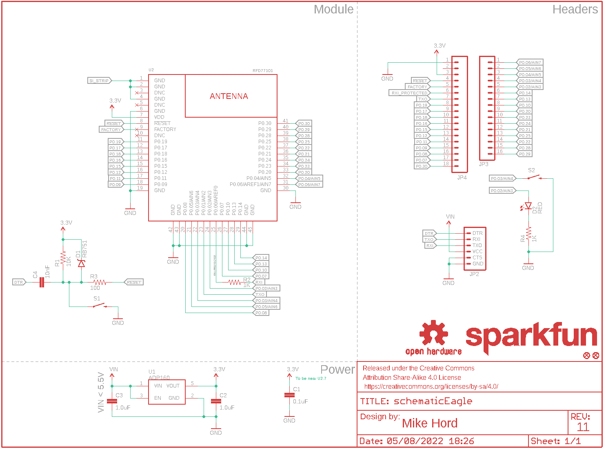

Contents
========

* [PRS13632 > Sparkfun](#prs13632--sparkfun)
	* [Schematic](#schematic)
	* [Interactive BOM](#interactive-bom)
	* [OOMP Parts](#oomp-parts)
	* [Images](#images)
	* [Tags](#tags)
  
![][im]
# PRS13632 > Sparkfun

- ID: PROJ-SPAR-13632-STAN-01
- Hex ID: PRS13632
- Name: Sparkfun
- Description: Sparkfun
- Long Link: [http://oom.lt/PROJ-SPAR-13632-STAN-01](http://oom.lt/PROJ-SPAR-13632-STAN-01)
- Short Link: [http://oom.lt/PRS13632](http://oom.lt/PRS13632)

## Schematic
  

## Interactive BOM

- Interactive BOM page: [ibom.html](https://htmlpreview.github.io/?https://github.com/oomlout/oomlout_OOMP_projects/blob/main/PROJ-SPAR-13632-STAN-01/kicad/bom/ibom.html)

## OOMP Parts
  

|OOMP Parts|
| :---: |
|C1,CAPC-0603-X-NF100-V50,C1,0.1uF,0.1UF-25V(+80/-20%)(0603),0603-CAP,CAP-00810,CAP-00810,0.1uF,|
|C2,CAPC-0603-X-UNMATCHED-01,C2,1.0uF,1.0UF-16V-10%(0603),0603-CAP,CAP-00868,CAP-00868,1.0uF,|
|C3,CAPC-0603-X-UNMATCHED-01,C3,1.0uF,1.0UF-16V-10%(0603),0603-CAP,CAP-00868,CAP-00868,1.0uF,|
|C4,CAPC-0603-X-UNMATCHED-01,C4,10nF,10NF/10000PF-50V-10%(0603),0603-CAP,CAP-00867,CAP-00867,10nF,|
|D1,DIOD-UNMATCHED-X-UNMATCHED-01,D1,RB751,DIODE-SCHOTTKY-RB751,SOD-523,Schottky diodes in SFEs production catalog,DIO-11018,RB751,|
|D2,LEDS-0603-G-STAN-01,D2,RED,LED-RED0603,LED-0603,Assorted Red LEDs,DIO-00819,RED,|
|JP2,HEAD-I01-X-PI06-01,FID1,FIDUCIALUFIDUCIAL,FIDUCIALUFIDUCIAL,MICRO-FIDUCIAL,Fiducial Alignment Points,,,|
|JP3,HEAD-I01-X-PI16-01,FID2,FIDUCIALUFIDUCIAL,FIDUCIALUFIDUCIAL,MICRO-FIDUCIAL,Fiducial Alignment Points,,,|
|JP4,HEAD-I01-X-PI18-01,FRAME1,FRAME-LETTER,FRAME-LETTER,CREATIVE_COMMONS,Schematic Frame,,,|
|R1,RESE-0603-X-O103-01,JP2,,ARDUINO_SERIAL_PROGRAMPTH,1X06,FTDI connector footprints,,,|
|R2,RESE-0603-X-O102-01,JP3,,M16PTH,1X16,1x16 .1 header,,,|
|R3,RESE-0603-X-O101-01,JP4,,M18_,1X18,1x18 .1 header,,,|
|R4,RESE-0603-X-O102-01,LOGO1,SFE_LOGO_NAME.1_INCH,SFE_LOGO_NAME.1_INCH,SFE_LOGO_NAME_.1,SFE Logo, name only,,,|
|S1,UNMATCHED-UNMATCHED-X-UNMATCHED-01,LOGO2,OSHW-LOGOS,OSHW-LOGOS,OSHW-LOGO-S,Open Source Hardware Logo,,,|
|S2,UNMATCHED-UNMATCHED-X-UNMATCHED-01,LOGO3,SFE_LOGO_NAME.1_INCH,SFE_LOGO_NAME.1_INCH,SFE_LOGO_NAME_.1,SFE Logo, name only,,,|
|U1,UNMATCHED-SO235-X-UNMATCHED-01,LOGO4,OSHW-LOGOS,OSHW-LOGOS,OSHW-LOGO-S,Open Source Hardware Logo,,,|
|U2,UNMATCHED-UNMATCHED-X-UNMATCHED-01,R1,10K,10KOHM-1/10W-1%(0603)0603,0603-RES,RES-00824,RES-00824,10K,|

## Images
  
  

|kicadPcb3d|kicadPcb3dFront|kicadPcb3dBack|eagleImage|eagleSchemImage|
| :---: | :---: | :---: | :---: | :---: |
||||||

## Tags

- hexID: PRS13632
- oompType: PROJ
- oompSize: SPAR
- oompColor: 13632
- oompDesc: STAN
- oompIndex: 01
- oompName: SparkFun Simblee Breakout Board
- sources: All source files from https://github.com/sparkfun/SparkFun_Simblee_Breakout_Board (source licence details in srcLicense.md)
- linkBuyPage: https://www.sparkfun.com/products/13632
- oompID: PROJ-SPAR-13632-STAN-01
- oompParts: C1,CAPC-0603-X-NF100-V50
- oompParts: C2,CAPC-0603-X-UNMATCHED-01
- oompParts: C3,CAPC-0603-X-UNMATCHED-01
- oompParts: C4,CAPC-0603-X-UNMATCHED-01
- oompParts: D1,DIOD-UNMATCHED-X-UNMATCHED-01
- oompParts: D2,LEDS-0603-G-STAN-01
- oompParts: JP2,HEAD-I01-X-PI06-01
- oompParts: JP3,HEAD-I01-X-PI16-01
- oompParts: JP4,HEAD-I01-X-PI18-01
- oompParts: R1,RESE-0603-X-O103-01
- oompParts: R2,RESE-0603-X-O102-01
- oompParts: R3,RESE-0603-X-O101-01
- oompParts: R4,RESE-0603-X-O102-01
- oompParts: S1,UNMATCHED-UNMATCHED-X-UNMATCHED-01
- oompParts: S2,UNMATCHED-UNMATCHED-X-UNMATCHED-01
- oompParts: U1,UNMATCHED-SO235-X-UNMATCHED-01
- oompParts: U2,UNMATCHED-UNMATCHED-X-UNMATCHED-01
- rawParts: C1,0.1uF,0.1UF-25V(+80/-20%)(0603),0603-CAP,CAP-00810,CAP-00810,0.1uF,
- rawParts: C2,1.0uF,1.0UF-16V-10%(0603),0603-CAP,CAP-00868,CAP-00868,1.0uF,
- rawParts: C3,1.0uF,1.0UF-16V-10%(0603),0603-CAP,CAP-00868,CAP-00868,1.0uF,
- rawParts: C4,10nF,10NF/10000PF-50V-10%(0603),0603-CAP,CAP-00867,CAP-00867,10nF,
- rawParts: D1,RB751,DIODE-SCHOTTKY-RB751,SOD-523,Schottky diodes in SFEs production catalog,DIO-11018,RB751,
- rawParts: D2,RED,LED-RED0603,LED-0603,Assorted Red LEDs,DIO-00819,RED,
- rawParts: FID1,FIDUCIALUFIDUCIAL,FIDUCIALUFIDUCIAL,MICRO-FIDUCIAL,Fiducial Alignment Points,,,
- rawParts: FID2,FIDUCIALUFIDUCIAL,FIDUCIALUFIDUCIAL,MICRO-FIDUCIAL,Fiducial Alignment Points,,,
- rawParts: FRAME1,FRAME-LETTER,FRAME-LETTER,CREATIVE_COMMONS,Schematic Frame,,,
- rawParts: JP2,,ARDUINO_SERIAL_PROGRAMPTH,1X06,FTDI connector footprints,,,
- rawParts: JP3,,M16PTH,1X16,1x16 .1 header,,,
- rawParts: JP4,,M18_,1X18,1x18 .1 header,,,
- rawParts: LOGO1,SFE_LOGO_NAME.1_INCH,SFE_LOGO_NAME.1_INCH,SFE_LOGO_NAME_.1,SFE Logo, name only,,,
- rawParts: LOGO2,OSHW-LOGOS,OSHW-LOGOS,OSHW-LOGO-S,Open Source Hardware Logo,,,
- rawParts: LOGO3,SFE_LOGO_NAME.1_INCH,SFE_LOGO_NAME.1_INCH,SFE_LOGO_NAME_.1,SFE Logo, name only,,,
- rawParts: LOGO4,OSHW-LOGOS,OSHW-LOGOS,OSHW-LOGO-S,Open Source Hardware Logo,,,
- rawParts: R1,10K,10KOHM-1/10W-1%(0603)0603,0603-RES,RES-00824,RES-00824,10K,
- rawParts: R2,1K,1KOHM-1/10W-1%(0603),0603-RES,RES-07856,RES-07856,1K,
- rawParts: R3,100,100OHM-1/10W-1%(0603),0603-RES,RES-07863,RES-07863,100,
- rawParts: R4,1K,1KOHM-1/10W-1%(0603),0603-RES,RES-07856,RES-07856,1K,
- rawParts: S1,SWITCH-MOMENTARY-2SMD,SWITCH-MOMENTARY-2SMD,TACTILE-SWITCH-SMD,Various NO switches- pushbuttons, reed, etc,SWCH-08247,,
- rawParts: S2,SWITCH-MOMENTARY-2SMD,SWITCH-MOMENTARY-2SMD,TACTILE-SWITCH-SMD,Various NO switches- pushbuttons, reed, etc,SWCH-08247,,
- rawParts: U1,ADP160,ADP160,SOT23-5,Nanopower LDO,VREG-11306,ADP160,
- rawParts: U2,RFD77101,RFD77101,RFD77101,Simblee â„¢ BLE Module RFD77101,COMP-13017,,

[im]: kicadPcb3d_450.png
