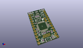
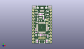
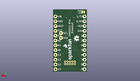
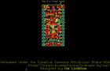
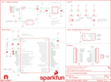

Contents
========

* [PRS13664 > Sparkfun](#prs13664--sparkfun)
	* [Schematic](#schematic)
	* [Interactive BOM](#interactive-bom)
	* [OOMP Parts](#oomp-parts)
	* [Images](#images)
	* [Tags](#tags)
  
![][im]
# PRS13664 > Sparkfun

- ID: PROJ-SPAR-13664-STAN-01
- Hex ID: PRS13664
- Name: Sparkfun
- Description: Sparkfun
- Long Link: [http://oom.lt/PROJ-SPAR-13664-STAN-01](http://oom.lt/PROJ-SPAR-13664-STAN-01)
- Short Link: [http://oom.lt/PRS13664](http://oom.lt/PRS13664)

## Schematic
  

## Interactive BOM

- Interactive BOM page: [ibom.html](https://htmlpreview.github.io/?https://github.com/oomlout/oomlout_OOMP_projects/blob/main/PROJ-SPAR-13664-STAN-01/kicad/bom/ibom.html)

## OOMP Parts
  

|OOMP Parts|
| :---: |
|C1,CAPC-0402-X-NF100-01,C1,0.1uF,0.1UF-16V(+-10%)(0402),0402-CAP,,CAP-12416,0.1uF,|
|C2,CAPC-0402-X-NF100-01,C2,0.1uF,0.1UF-16V(+-10%)(0402),0402-CAP,,CAP-12416,0.1uF,|
|C3,CAPC-0402-X-NF100-01,C3,0.1uF,0.1UF-16V(+-10%)(0402),0402-CAP,,CAP-12416,0.1uF,|
|C4,CAPC-0402-X-NF100-01,C4,0.1uF,0.1UF-16V(+-10%)(0402),0402-CAP,,CAP-12416,0.1uF,|
|C5,CAPC-0402-X-UNMATCHED-01,C5,15pF,15PF-50V(+-5%)(0402),0402-CAP,,CAP-13063,15pF,|
|C6,CAPC-0402-X-UNMATCHED-01,C6,15pF,15PF-50V(+-5%)(0402),0402-CAP,,CAP-13063,15pF,|
|C7,CAPC-0805-X-UNMATCHED-01,C7,1.0uF,1.0UF-25V-+80/-20(0805),0805-CAP,CAP-11625,CAP-11625,1.0uF,|
|C8,CAPC-0603-X-UNMATCHED-01,C8,2.2uF,2.2UF-10V-20%(0603),0603-CAP,CAP-07888,CAP-07888,2.2uF,|
|D1,LEDS-0603-G-STAN-01,D1,GREEN,LED-GREEN0603,LED-0603,Various green LEDs,DIO-00821,GREEN,|
|D2,LEDS-0603-G-STAN-01,D2,RED,LED-RED0603,LED-0603,Assorted Red LEDs,DIO-00819,RED,|
|D3,LEDS-0603-G-STAN-01,D3,BLUE,LED-BLUE0603,LED-0603,Blue LEDs for production use,DIO-08575,BLUE,|
|D4,LEDS-0603-G-STAN-01,D4,Yellow,LED-YELLOW0603,LED-0603,Yellow SMD LEDs,DIO-09003,Yellow,|
|F1,UNMATCHED-1206-X-UNMATCHED-01,F1,500mA,PTCSMD,PTC-1206,Resettable Fuse PTC,RES-11150,,|
|JP1,HEAD-I01-X-PI12-01,FID1,FIDUCIAL1X2,FIDUCIAL1X2,FIDUCIAL-1X2,Fiducial Alignment Points,,,|
|JP2,HEAD-I01-X-PI12-01,FID2,FIDUCIAL1X2,FIDUCIAL1X2,FIDUCIAL-1X2,Fiducial Alignment Points,,,|
|JP3,UNMATCHED-UNMATCHED-X-UNMATCHED-01,FRAME1,FRAME-LETTER,FRAME-LETTER,CREATIVE_COMMONS,Schematic Frame,,,|
|JP4,HEAD-I01-X-PI02-01,JP1,,M12NO_SILK,1X12_NO_SILK,Header 12,,,|
|JP5,UNMATCHED-UNMATCHED-X-UNMATCHED-01,JP2,,M12NO_SILK,1X12_NO_SILK,Header 12,,,|
|L1,UNMATCHED-0603-X-UNMATCHED-01,JP3,,USB-ABCONN-11794,USB-AB-MICRO-SMD_V03,This is a USB AB connector that is compatible with USB OTG. i.e. this connector can serve as a host or device,CONN-11794,,|
|Q1,UNMATCHED-UNMATCHED-X-UNMATCHED-01,JP4,,M021X02_NO_SILK,1X02_NO_SILK,Standard 2-pin 0.1 header. Use with,,,|
|Q2,UNMATCHED-SO23-X-UNMATCHED-01,JP5,CORTEX_DEBUGPTH,CORTEX_DEBUGPTH,2X5-PTH-1.27MM,Cortex Debug Connector,,,|
|R1,RESE-0603-X-O103-01,L1,FB - 30Ohm,INDUCTOR0603,0603,Inductors,RES-07859,,|
|R2,RESE-0603-X-O331-01,LOGO1,SFE_LOGO_FLAME.1_INCH,SFE_LOGO_FLAME.1_INCH,SFE_LOGO_FLAME_.1,SFE Logo, flame only,,,|
|R3,RESE-0603-X-O331-01,LOGO2,OSHW-LOGOS,OSHW-LOGOS,OSHW-LOGO-S,Open Source Hardware Logo,,,|
|R4,RESE-0603-X-O1003-01,LOGO3,SFE_LOGO_NAME_FLAME.1_INCH,SFE_LOGO_NAME_FLAME.1_INCH,SFE_LOGO_NAME_FLAME_.1,SFE Logo, name and flame,,,|
|R5,RESE-0603-X-O331-01,Q1,2N7002PW,MOSFET-NCHANNEL2N7002PW,SOT323,Common NMOSFET Parts,TRANS-11151,,|
|R6,RESE-0603-X-O331-01,Q2,2.5A/30V,MOSFET-PCHANNELDMG2307L,SOT23-3,Generic PMOSFET,TRANS-11308,2.5A/30V,|
|R7,RESE-0603-X-O473-01,R1,10K,10KOHM-1/10W-1%(0603)0603,0603-RES,RES-00824,RES-00824,10K,|
|R8,RESE-0603-X-O331-01,R2,330,330OHM1/10W1%(0603),0603-RES,RES-00818,RES-00818,330,|
|S1,UNMATCHED-UNMATCHED-X-UNMATCHED-01,R3,330,330OHM1/10W1%(0603),0603-RES,RES-00818,RES-00818,330,|
|U1,UNMATCHED-UNMATCHED-X-UNMATCHED-01,R4,100k,100KOHM-1/10W-1%(0603),0603-RES,RES-07828,RES-07828,100k,|
|U2,VREG-SO235-X-KAP2112K-V33D,R5,330,330OHM1/10W1%(0603),0603-RES,RES-00818,RES-00818,330,|
|U3,UNMATCHED-SO235-X-UNMATCHED-01,R6,330,330OHM1/10W1%(0603),0603-RES,RES-00818,RES-00818,330,|
|Y1,UNMATCHED-UNMATCHED-X-UNMATCHED-01,R7,47K,47KOHM1/10W1%(0603),0603-RES,RES-07871,RES-07871,47K,|

## Images
  
  

|kicadPcb3d|kicadPcb3dFront|kicadPcb3dBack|eagleImage|eagleSchemImage|
| :---: | :---: | :---: | :---: | :---: |
||||||

## Tags

- hexID: PRS13664
- oompType: PROJ
- oompSize: SPAR
- oompColor: 13664
- oompDesc: STAN
- oompIndex: 01
- oompName: SAMD21 Mini Breakout
- sources: All source files from https://github.com/sparkfun/SAMD21_Mini_Breakout (source licence details in srcLicense.md)
- linkBuyPage: https://www.sparkfun.com/products/13664
- oompID: PROJ-SPAR-13664-STAN-01
- oompParts: C1,CAPC-0402-X-NF100-01
- oompParts: C2,CAPC-0402-X-NF100-01
- oompParts: C3,CAPC-0402-X-NF100-01
- oompParts: C4,CAPC-0402-X-NF100-01
- oompParts: C5,CAPC-0402-X-UNMATCHED-01
- oompParts: C6,CAPC-0402-X-UNMATCHED-01
- oompParts: C7,CAPC-0805-X-UNMATCHED-01
- oompParts: C8,CAPC-0603-X-UNMATCHED-01
- oompParts: D1,LEDS-0603-G-STAN-01
- oompParts: D2,LEDS-0603-G-STAN-01
- oompParts: D3,LEDS-0603-G-STAN-01
- oompParts: D4,LEDS-0603-G-STAN-01
- oompParts: F1,UNMATCHED-1206-X-UNMATCHED-01
- oompParts: JP1,HEAD-I01-X-PI12-01
- oompParts: JP2,HEAD-I01-X-PI12-01
- oompParts: JP3,UNMATCHED-UNMATCHED-X-UNMATCHED-01
- oompParts: JP4,HEAD-I01-X-PI02-01
- oompParts: JP5,UNMATCHED-UNMATCHED-X-UNMATCHED-01
- oompParts: L1,UNMATCHED-0603-X-UNMATCHED-01
- oompParts: Q1,UNMATCHED-UNMATCHED-X-UNMATCHED-01
- oompParts: Q2,UNMATCHED-SO23-X-UNMATCHED-01
- oompParts: R1,RESE-0603-X-O103-01
- oompParts: R2,RESE-0603-X-O331-01
- oompParts: R3,RESE-0603-X-O331-01
- oompParts: R4,RESE-0603-X-O1003-01
- oompParts: R5,RESE-0603-X-O331-01
- oompParts: R6,RESE-0603-X-O331-01
- oompParts: R7,RESE-0603-X-O473-01
- oompParts: R8,RESE-0603-X-O331-01
- oompParts: S1,UNMATCHED-UNMATCHED-X-UNMATCHED-01
- oompParts: U1,UNMATCHED-UNMATCHED-X-UNMATCHED-01
- oompParts: U2,VREG-SO235-X-KAP2112K-V33D
- oompParts: U3,UNMATCHED-SO235-X-UNMATCHED-01
- oompParts: Y1,UNMATCHED-UNMATCHED-X-UNMATCHED-01
- rawParts: C1,0.1uF,0.1UF-16V(+-10%)(0402),0402-CAP,,CAP-12416,0.1uF,
- rawParts: C2,0.1uF,0.1UF-16V(+-10%)(0402),0402-CAP,,CAP-12416,0.1uF,
- rawParts: C3,0.1uF,0.1UF-16V(+-10%)(0402),0402-CAP,,CAP-12416,0.1uF,
- rawParts: C4,0.1uF,0.1UF-16V(+-10%)(0402),0402-CAP,,CAP-12416,0.1uF,
- rawParts: C5,15pF,15PF-50V(+-5%)(0402),0402-CAP,,CAP-13063,15pF,
- rawParts: C6,15pF,15PF-50V(+-5%)(0402),0402-CAP,,CAP-13063,15pF,
- rawParts: C7,1.0uF,1.0UF-25V-+80/-20(0805),0805-CAP,CAP-11625,CAP-11625,1.0uF,
- rawParts: C8,2.2uF,2.2UF-10V-20%(0603),0603-CAP,CAP-07888,CAP-07888,2.2uF,
- rawParts: D1,GREEN,LED-GREEN0603,LED-0603,Various green LEDs,DIO-00821,GREEN,
- rawParts: D2,RED,LED-RED0603,LED-0603,Assorted Red LEDs,DIO-00819,RED,
- rawParts: D3,BLUE,LED-BLUE0603,LED-0603,Blue LEDs for production use,DIO-08575,BLUE,
- rawParts: D4,Yellow,LED-YELLOW0603,LED-0603,Yellow SMD LEDs,DIO-09003,Yellow,
- rawParts: F1,500mA,PTCSMD,PTC-1206,Resettable Fuse PTC,RES-11150,,
- rawParts: FID1,FIDUCIAL1X2,FIDUCIAL1X2,FIDUCIAL-1X2,Fiducial Alignment Points,,,
- rawParts: FID2,FIDUCIAL1X2,FIDUCIAL1X2,FIDUCIAL-1X2,Fiducial Alignment Points,,,
- rawParts: FRAME1,FRAME-LETTER,FRAME-LETTER,CREATIVE_COMMONS,Schematic Frame,,,
- rawParts: JP1,,M12NO_SILK,1X12_NO_SILK,Header 12,,,
- rawParts: JP2,,M12NO_SILK,1X12_NO_SILK,Header 12,,,
- rawParts: JP3,,USB-ABCONN-11794,USB-AB-MICRO-SMD_V03,This is a USB AB connector that is compatible with USB OTG. i.e. this connector can serve as a host or device,CONN-11794,,
- rawParts: JP4,,M021X02_NO_SILK,1X02_NO_SILK,Standard 2-pin 0.1 header. Use with,,,
- rawParts: JP5,CORTEX_DEBUGPTH,CORTEX_DEBUGPTH,2X5-PTH-1.27MM,Cortex Debug Connector,,,
- rawParts: L1,FB - 30Ohm,INDUCTOR0603,0603,Inductors,RES-07859,,
- rawParts: LOGO1,SFE_LOGO_FLAME.1_INCH,SFE_LOGO_FLAME.1_INCH,SFE_LOGO_FLAME_.1,SFE Logo, flame only,,,
- rawParts: LOGO2,OSHW-LOGOS,OSHW-LOGOS,OSHW-LOGO-S,Open Source Hardware Logo,,,
- rawParts: LOGO3,SFE_LOGO_NAME_FLAME.1_INCH,SFE_LOGO_NAME_FLAME.1_INCH,SFE_LOGO_NAME_FLAME_.1,SFE Logo, name and flame,,,
- rawParts: Q1,2N7002PW,MOSFET-NCHANNEL2N7002PW,SOT323,Common NMOSFET Parts,TRANS-11151,,
- rawParts: Q2,2.5A/30V,MOSFET-PCHANNELDMG2307L,SOT23-3,Generic PMOSFET,TRANS-11308,2.5A/30V,
- rawParts: R1,10K,10KOHM-1/10W-1%(0603)0603,0603-RES,RES-00824,RES-00824,10K,
- rawParts: R2,330,330OHM1/10W1%(0603),0603-RES,RES-00818,RES-00818,330,
- rawParts: R3,330,330OHM1/10W1%(0603),0603-RES,RES-00818,RES-00818,330,
- rawParts: R4,100k,100KOHM-1/10W-1%(0603),0603-RES,RES-07828,RES-07828,100k,
- rawParts: R5,330,330OHM1/10W1%(0603),0603-RES,RES-00818,RES-00818,330,
- rawParts: R6,330,330OHM1/10W1%(0603),0603-RES,RES-00818,RES-00818,330,
- rawParts: R7,47K,47KOHM1/10W1%(0603),0603-RES,RES-07871,RES-07871,47K,
- rawParts: R8,330,330OHM1/10W1%(0603),0603-RES,RES-00818,RES-00818,330,
- rawParts: S1,RESET,SWITCH-MOMENTARY-2SMD-4.6X2.8MM,TACTILE_SWITCH_SMD_4.6X2.8MM,Various NO switches- pushbuttons, reed, etc,SWCH-13065,,
- rawParts: SJ1,PWR-LED,JUMPER-PAD-2-NC_BY_TRACENO_SILK,PAD-JUMPER-2-NC_BY_TRACE_NO_SILK,,,,
- rawParts: U1,ATSAMD21G-A,ATSAMD21G-A,TQFP-48,Atmel SAMD21G SMART ARM-Based Microcontroller,IC-13064,,
- rawParts: U2,3.3V,V_REG_AP2112K-3.3V,SOT23-5,AP2112 - 600mA CMOS LDO Regulator w/ Enable,VREG-12457,3.3V,
- rawParts: U3,74AHC1G125,74AHC1G125,SOT23-5,Single bus buffer gate with 3-state output,IC-11920,,
- rawParts: Y1,32.768kHz,CRYSTAL3.2X1.5MM,CRYSTAL-SMD-3.2X1.5MM,Various standard crystals. Proven footprints.,XTAL-13062,,

[im]: kicadPcb3d_450.png
