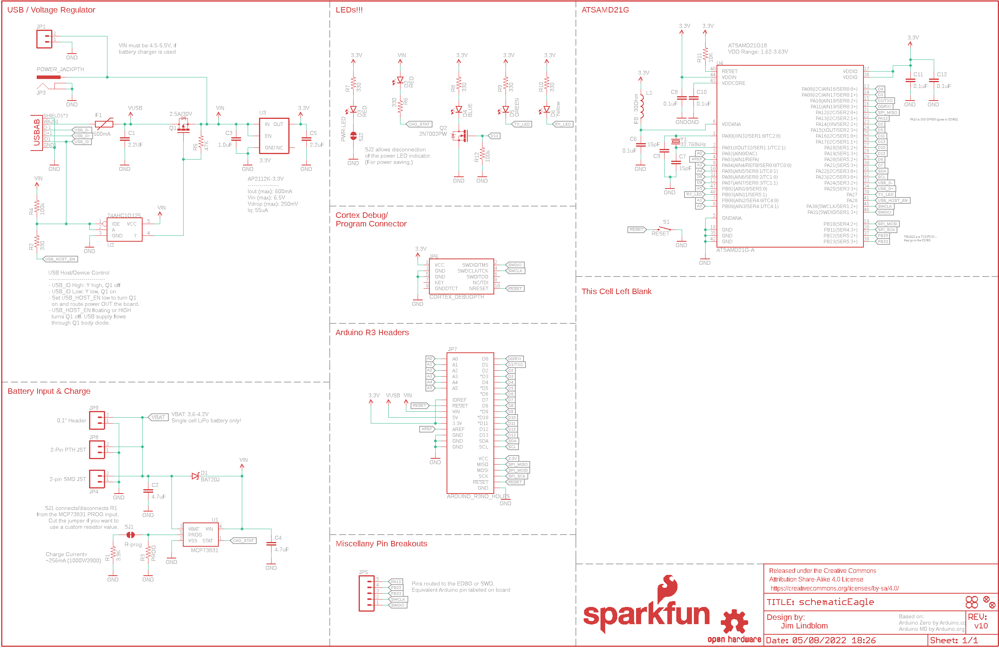
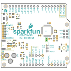
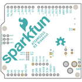
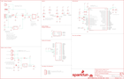

Contents
========

* [PRS13672 > SAMD21 Dev Breakout](#prs13672--samd21-dev-breakout)
	* [Schematic](#schematic)
	* [Interactive BOM](#interactive-bom)
	* [OOMP Parts](#oomp-parts)
	* [Images](#images)
	* [Tags](#tags)
  
![][im]
# PRS13672 > SAMD21 Dev Breakout

- ID: PROJ-SPAR-13672-STAN-01
- Hex ID: PRS13672
- Name: Sparkfun
- Description: Sparkfun
- Long Link: [http://oom.lt/PROJ-SPAR-13672-STAN-01](http://oom.lt/PROJ-SPAR-13672-STAN-01)
- Short Link: [http://oom.lt/PRS13672](http://oom.lt/PRS13672)

## Schematic
  

## Interactive BOM

- Interactive BOM page: [ibom.html](https://htmlpreview.github.io/?https://github.com/oomlout/oomlout_OOMP_projects/blob/main/PROJ-SPAR-13672-STAN-01/kicad/bom/ibom.html)

## OOMP Parts
  

|OOMP Parts|
| :---: |
|CAPC-1206-X-UF22D-01 C1|
|[CAPC-0603-X-UF47D-V10  SMD (0603) 4.7 uF Capacitor (Ceramic) 10v  C2, C4](https://github.com/oomlout/oomlout_OOMP_parts/tree/main/CAPC-0603-X-UF47D-V10/)|
|CAPC-0805-X-UNMATCHED-01 C3|
|[CAPC-0603-X-UF22D-V10  SMD (0603) 2.2 uF Capacitor (Ceramic) 10v  C5](https://github.com/oomlout/oomlout_OOMP_parts/tree/main/CAPC-0603-X-UF22D-V10/)|
|[CAPC-0603-X-NF100-V50  SMD (0603) 100 nF Capacitor (Ceramic) 50v  C6, C8, C10, C11, C12](https://github.com/oomlout/oomlout_OOMP_parts/tree/main/CAPC-0603-X-NF100-V50/)|
|[CAPC-0603-X-PF15-V50  SMD (0603) 15 pF Capacitor (Ceramic) 50v  C7, C9](https://github.com/oomlout/oomlout_OOMP_parts/tree/main/CAPC-0603-X-PF15-V50/)|
|DIOD-S323-X-UNMATCHED-01 D1|
|[LEDS-0603-R-STAN-01  SMD (0603) Red LED  D2, D3](https://github.com/oomlout/oomlout_OOMP_parts/tree/main/LEDS-0603-R-STAN-01/)|
|[LEDS-0603-L-STAN-01  SMD (0603) Blue LED  D4](https://github.com/oomlout/oomlout_OOMP_parts/tree/main/LEDS-0603-L-STAN-01/)|
|[LEDS-0603-G-STAN-01  SMD (0603) Green LED  D5](https://github.com/oomlout/oomlout_OOMP_parts/tree/main/LEDS-0603-G-STAN-01/)|
|[LEDS-0603-Y-STAN-01  SMD (0603) Yellow LED  D6](https://github.com/oomlout/oomlout_OOMP_parts/tree/main/LEDS-0603-Y-STAN-01/)|
|REFU-1206-X-UNMATCHED-01 F1|
|[HEAD-I01-X-PI02-01  2.54 mm 2 Pin Header  JP1, JP9](https://github.com/oomlout/oomlout_OOMP_parts/tree/main/HEAD-I01-X-PI02-01/)|
|UNMATCHED-UNMATCHED-X-UNMATCHED-01 JP2, JP6, Q2, S1, U4, Y1|
|[DCJP-21D-X-STAN-01  2.1 mm DC Jack  JP3](https://github.com/oomlout/oomlout_OOMP_parts/tree/main/DCJP-21D-X-STAN-01/)|
|HEAD-I01-X-UNMATCHED-01 JP4, JP7, JP8|
|[HEAD-I01-X-PI05-01  2.54 mm 5 Pin Header  JP5](https://github.com/oomlout/oomlout_OOMP_parts/tree/main/HEAD-I01-X-PI05-01/)|
|UNMATCHED-0603-X-UNMATCHED-01 L1|
|UNMATCHED-SO23-X-UNMATCHED-01 Q1|
|[RESE-0603-X-O392-01  SMD (0603) 3.9k Ohm Resistor  R1](https://github.com/oomlout/oomlout_OOMP_parts/tree/main/RESE-0603-X-O392-01/)|
|[RESE-0603-X-O331-01  SMD (0603) 330 Ohm Resistor  R2, R6, R7, R8, R9, R10](https://github.com/oomlout/oomlout_OOMP_parts/tree/main/RESE-0603-X-O331-01/)|
|RESE-UNMATCHED-X-UNMATCHED-01 R3|
|RESE-0603-X-O1003-01 R4, R12|
|[RESE-0603-X-O473-01  SMD (0603) 47k Ohm Resistor  R5](https://github.com/oomlout/oomlout_OOMP_parts/tree/main/RESE-0603-X-O473-01/)|
|[RESE-0603-X-O103-01  SMD (0603) 10k Ohm Resistor  R11](https://github.com/oomlout/oomlout_OOMP_parts/tree/main/RESE-0603-X-O103-01/)|
|UNMATCHED-SO235-X-UNMATCHED-01 U1, U2|
|VREG-SO235-X-KAP2112K-V33D U3|

## Images
  
  

|bominteractivefront|bominteractiveback|kicadPcb3d|kicadPcb3dFront|kicadPcb3dBack|eagleSchemImage|
| :---: | :---: | :---: | :---: | :---: | :---: |
|||||||

## Tags

- hexID: PRS13672
- oompType: PROJ
- oompSize: SPAR
- oompColor: 13672
- oompDesc: STAN
- oompIndex: 01
- oompName: SAMD21 Dev Breakout
- sources: All source files from https://github.com/sparkfun/SAMD21_Dev_Breakout (source licence details in srcLicense.md)
- linkBuyPage: https://www.sparkfun.com/products/13672
- oompID: PROJ-SPAR-13672-STAN-01
- oompParts: C1,CAPC-1206-X-UF22D-01
- oompParts: C2,CAPC-0603-X-UF47D-V10
- oompParts: C3,CAPC-0805-X-UNMATCHED-01
- oompParts: C4,CAPC-0603-X-UF47D-V10
- oompParts: C5,CAPC-0603-X-UF22D-V10
- oompParts: C6,CAPC-0603-X-NF100-V50
- oompParts: C7,CAPC-0603-X-PF15-V50
- oompParts: C8,CAPC-0603-X-NF100-V50
- oompParts: C9,CAPC-0603-X-PF15-V50
- oompParts: C10,CAPC-0603-X-NF100-V50
- oompParts: C11,CAPC-0603-X-NF100-V50
- oompParts: C12,CAPC-0603-X-NF100-V50
- oompParts: D1,DIOD-S323-X-UNMATCHED-01
- oompParts: D2,LEDS-0603-R-STAN-01
- oompParts: D3,LEDS-0603-R-STAN-01
- oompParts: D4,LEDS-0603-L-STAN-01
- oompParts: D5,LEDS-0603-G-STAN-01
- oompParts: D6,LEDS-0603-Y-STAN-01
- oompParts: F1,REFU-1206-X-UNMATCHED-01
- oompParts: JP1,HEAD-I01-X-PI02-01
- oompParts: JP2,UNMATCHED-UNMATCHED-X-UNMATCHED-01
- oompParts: JP3,DCJP-21D-X-STAN-01
- oompParts: JP4,HEAD-I01-X-UNMATCHED-01
- oompParts: JP5,HEAD-I01-X-PI05-01
- oompParts: JP6,UNMATCHED-UNMATCHED-X-UNMATCHED-01
- oompParts: JP7,HEAD-I01-X-UNMATCHED-01
- oompParts: JP8,HEAD-I01-X-UNMATCHED-01
- oompParts: JP9,HEAD-I01-X-PI02-01
- oompParts: L1,UNMATCHED-0603-X-UNMATCHED-01
- oompParts: Q1,UNMATCHED-SO23-X-UNMATCHED-01
- oompParts: Q2,UNMATCHED-UNMATCHED-X-UNMATCHED-01
- oompParts: R1,RESE-0603-X-O392-01
- oompParts: R2,RESE-0603-X-O331-01
- oompParts: R3,RESE-UNMATCHED-X-UNMATCHED-01
- oompParts: R4,RESE-0603-X-O1003-01
- oompParts: R5,RESE-0603-X-O473-01
- oompParts: R6,RESE-0603-X-O331-01
- oompParts: R7,RESE-0603-X-O331-01
- oompParts: R8,RESE-0603-X-O331-01
- oompParts: R9,RESE-0603-X-O331-01
- oompParts: R10,RESE-0603-X-O331-01
- oompParts: R11,RESE-0603-X-O103-01
- oompParts: R12,RESE-0603-X-O1003-01
- oompParts: S1,UNMATCHED-UNMATCHED-X-UNMATCHED-01
- oompParts: U1,UNMATCHED-SO235-X-UNMATCHED-01
- oompParts: U2,UNMATCHED-SO235-X-UNMATCHED-01
- oompParts: U3,VREG-SO235-X-KAP2112K-V33D
- oompParts: U4,UNMATCHED-UNMATCHED-X-UNMATCHED-01
- oompParts: Y1,UNMATCHED-UNMATCHED-X-UNMATCHED-01
- rawParts: C1,2.2UF,2.2UF50V10%(1206),1206,CAP-10009,CAP-10009,2.2UF,
- rawParts: C2,4.7uF,4.7UF-6.3V-10%(0603)0603,0603-CAP,CAP-08280,CAP-08280,4.7uF,
- rawParts: C3,1.0uF,1.0UF-25V-+80/-20(0805),0805-CAP,CAP-11625,CAP-11625,1.0uF,
- rawParts: C4,4.7uF,4.7UF-6.3V-10%(0603)0603,0603-CAP,CAP-08280,CAP-08280,4.7uF,
- rawParts: C5,2.2uF,2.2UF-10V-20%(0603),0603-CAP,CAP-07888,CAP-07888,2.2uF,
- rawParts: C6,0.1uF,0.1UF-25V(+80/-20%)(0603),0603-CAP,CAP-00810,CAP-00810,0.1uF,
- rawParts: C7,15pF,15PF-50V-5%(0603),0603-CAP,CAP-07881,CAP-07881,15pF,
- rawParts: C8,0.1uF,0.1UF-25V(+80/-20%)(0603),0603-CAP,CAP-00810,CAP-00810,0.1uF,
- rawParts: C9,15pF,15PF-50V-5%(0603),0603-CAP,CAP-07881,CAP-07881,15pF,
- rawParts: C10,0.1uF,0.1UF-25V(+80/-20%)(0603),0603-CAP,CAP-00810,CAP-00810,0.1uF,
- rawParts: C11,0.1uF,0.1UF-25V(+80/-20%)(0603),0603-CAP,CAP-00810,CAP-00810,0.1uF,
- rawParts: C12,0.1uF,0.1UF-25V(+80/-20%)(0603),0603-CAP,CAP-00810,CAP-00810,0.1uF,
- rawParts: D1,BAT20J,DIODE-SCHOTTKY-BAT20J,SOD-323,Schottky diodes in SFEs production catalog,DIO-11623,BAT20J,
- rawParts: D2,RED,LED-RED0603,LED-0603,Assorted Red LEDs,DIO-00819,RED,
- rawParts: D3,RED,LED-RED0603,LED-0603,Assorted Red LEDs,DIO-00819,RED,
- rawParts: D4,BLUE,LED-BLUE0603,LED-0603,Blue LEDs for production use,DIO-08575,BLUE,
- rawParts: D5,GREEN,LED-GREEN0603,LED-0603,Various green LEDs,DIO-00821,GREEN,
- rawParts: D6,Yellow,LED-YELLOW0603,LED-0603,Yellow SMD LEDs,DIO-09003,Yellow,
- rawParts: F1,500mA,PTCSMD,PTC-1206,Resettable Fuse PTC,RES-11150,,
- rawParts: FID1,FIDUCIAL1X2,FIDUCIAL1X2,FIDUCIAL-1X2,Fiducial Alignment Points,,,
- rawParts: FID2,FIDUCIAL1X2,FIDUCIAL1X2,FIDUCIAL-1X2,Fiducial Alignment Points,,,
- rawParts: FRAME1,FRAME-LEDGER,FRAME-LEDGER,CREATIVE_COMMONS,Schematic Frame,,,
- rawParts: JP1,,M02PTH,1X02,Standard 2-pin 0.1 header. Use with,,,
- rawParts: JP2,,USB-ABCONN-11794,USB-AB-MICRO-SMD_V03,This is a USB AB connector that is compatible with USB OTG. i.e. this connector can serve as a host or device,CONN-11794,,
- rawParts: JP3,POWER_JACKPTH,POWER_JACKPTH,POWER_JACK_PTH,Power Jack,CONN-08197,,
- rawParts: JP4,,M02-JST-2MM-SMT,JST-2-SMD,Standard 2-pin 0.1 header. Use with,CONN-11443,,
- rawParts: JP5,,M05NO_SILK,1X05_NO_SILK,Header 5,,,
- rawParts: JP6,CORTEX_DEBUGPTH,CORTEX_DEBUGPTH,2X5-PTH-1.27MM,Cortex Debug Connector,,,
- rawParts: JP7,ARDUINO_R3NO_HOLES,ARDUINO_R3NO_HOLES,ARDUINO_R3_NO_HOLES,Arduino R3 Footprint (w/ SPI header),,,
- rawParts: JP8,,M02-JST-2-PTH-NO_SILK,JST-2-PTH-NS,Standard 2-pin 0.1 header. Use with,,,
- rawParts: JP9,,M021X02_NO_SILK,1X02_NO_SILK,Standard 2-pin 0.1 header. Use with,,,
- rawParts: L1,FB - 30Ohm,INDUCTOR0603,0603,Inductors,RES-07859,,
- rawParts: LOGO1,SFE_LOGO_NAME_FLAME.2_INCH,SFE_LOGO_NAME_FLAME.2_INCH,SFE_LOGO_NAME_FLAME_.2,SFE Logo, name and flame,,,
- rawParts: LOGO2,SFE_LOGO_NAME_FLAME.4_INCH,SFE_LOGO_NAME_FLAME.4_INCH,SFE_LOGO_NAME_FLAME_.4,SFE Logo, name and flame,,,
- rawParts: LOGO3,OSHW-LOGOS,OSHW-LOGOS,OSHW-LOGO-S,Open Source Hardware Logo,,,
- rawParts: LOGO4,OSHW-LOGOL,OSHW-LOGOL,OSHW-LOGO-L,Open Source Hardware Logo,,,
- rawParts: Q1,2.5A/30V,MOSFET-PCHANNELDMG2307L,SOT23-3,Generic PMOSFET,TRANS-11308,2.5A/30V,
- rawParts: Q2,2N7002PW,MOSFET-NCHANNEL2N7002PW,SOT323,Common NMOSFET Parts,TRANS-11151,,
- rawParts: R1,3.9K,3.9KOHM1/10W1%(0603),0603,RES-08701,RES-08701,3.9K,
- rawParts: R2,330,330OHM1/10W1%(0603),0603-RES,RES-00818,RES-00818,330,
- rawParts: R3,PROG,RESISTORPTH-1/6W,1/6W-RES,Resistor,,,
- rawParts: R4,100k,100KOHM-1/10W-1%(0603),0603-RES,RES-07828,RES-07828,100k,
- rawParts: R5,47K,47KOHM1/10W1%(0603),0603-RES,RES-07871,RES-07871,47K,
- rawParts: R6,330,330OHM1/10W1%(0603),0603-RES,RES-00818,RES-00818,330,
- rawParts: R7,330,330OHM1/10W1%(0603),0603-RES,RES-00818,RES-00818,330,
- rawParts: R8,330,330OHM1/10W1%(0603),0603-RES,RES-00818,RES-00818,330,
- rawParts: R9,330,330OHM1/10W1%(0603),0603-RES,RES-00818,RES-00818,330,
- rawParts: R10,330,330OHM1/10W1%(0603),0603-RES,RES-00818,RES-00818,330,
- rawParts: R11,10K,10KOHM-1/10W-1%(0603)0603,0603-RES,RES-00824,RES-00824,10K,
- rawParts: R12,100k,100KOHM-1/10W-1%(0603),0603-RES,RES-07828,RES-07828,100k,
- rawParts: S1,RESET,SWITCH-MOMENTARY-2SMD,TACTILE-SWITCH-SMD,Various NO switches- pushbuttons, reed, etc,SWCH-08247,,
- rawParts: SJ1,R-prog,JUMPER-PAD-2-NC_BY_TRACE,PAD-JUMPER-2-NC_BY_TRACE_YES_SILK,,,,
- rawParts: SJ2,PWR-LED,JUMPER-PAD-2-NC_BY_TRACENO_SILK,PAD-JUMPER-2-NC_BY_TRACE_NO_SILK,,,,
- rawParts: STANDOFF1,STAND-OFF,STAND-OFF,STAND-OFF,#4 Stand Off,,,
- rawParts: STANDOFF2,STAND-OFF,STAND-OFF,STAND-OFF,#4 Stand Off,,,
- rawParts: STANDOFF3,STAND-OFF,STAND-OFF,STAND-OFF,#4 Stand Off,,,
- rawParts: STANDOFF4,STAND-OFF,STAND-OFF,STAND-OFF,#4 Stand Off,,,
- rawParts: U1,MCP73831,MCP73831,SOT23-5,Miniature single cell, fully integrated Li-Ion, Li-polymer charge management controller,IC-09995,,
- rawParts: U2,74AHC1G125,74AHC1G125,SOT23-5,Single bus buffer gate with 3-state output,IC-11920,,
- rawParts: U3,3.3V,V_REG_AP2112K-3.3V,SOT23-5,AP2112 - 600mA CMOS LDO Regulator w/ Enable,VREG-12457,3.3V,
- rawParts: U4,ATSAMD21G-A,ATSAMD21G-A,TQFP-48,Atmel SAMD21G SMART ARM-Based Microcontroller,IC-13064,,
- rawParts: Y1,32.768kHz,CRYSTAL3.2X1.5MM,CRYSTAL-SMD-3.2X1.5MM,Various standard crystals. Proven footprints.,XTAL-13062,,

[im]: kicadPcb3d_450.png
