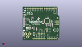
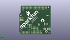
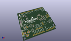

Contents
========

* [PROJ-SPAR-13672-STAN-01>SAMD21 Dev Breakout](#proj-spar-13672-stan-01samd21-dev-breakout)
	* [Images](#images)
	* [Interactive BOM](#interactive-bom)
	* [OOMP Parts](#oomp-parts)
	* [Tags](#tags)
  
![][im]
# PROJ-SPAR-13672-STAN-01>SAMD21 Dev Breakout

- ID: PROJ-SPAR-13672-STAN-01
- Hex ID: PRS13672
- Name: SAMD21 Dev Breakout
- Description: 

## Images
  
  

|kicadPcb3dFront|kicadPcb3dBack|kicadPcb3d|
| :---: | :---: | :---: |
||||

## Interactive BOM

- Interactive BOM page: [ibom.html](kicad/bom/ibom.html)

## OOMP Parts
  

|OOMP Parts|
| :---: |
|CAPC-UNMATCHED-X-UF22D-01, C1, 10.16, 43.18, 270,C1, 2.2UF, 1206, SparkFun-Capacitors, (0.4, 1.7), R270|
|CAPC-0603-X-UNMATCHED-01, C2, 15.239999999999998, 19.685, 270,C2, 4.7uF, 0603-CAP, SparkFun-Capacitors, (0.6, 0.775), R270|
|CAPC-0805-X-UNMATCHED-01, C3, 17.779999999999998, 7.619999999999999, 0,C3, 1.0uF, 0805-CAP, SparkFun-Capacitors, (0.7, 0.3), R0|
|CAPC-0603-X-UNMATCHED-01, C4, 17.779999999999998, 16.509999999999998, 0,C4, 4.7uF, 0603-CAP, SparkFun-Capacitors, (0.7, 0.65), R0|
|CAPC-0603-X-UF22D-01, C5, 17.779999999999998, 12.7, 180,C5, 2.2uF, 0603-CAP, SparkFun-Capacitors, (0.7, 0.5), R180|
|<table><tr><td></td><td> C6</td><td>[CAPC-0603-X-NF100-V50 SMD (0603) 100 nF Capacitor (Ceramic) 50v](https://github.com/oomlout/oomlout_OOMP_parts/tree/main/CAPC-0603-X-NF100-V50/)</td><td>[C6N100](https://github.com/oomlout/oomlout_OOMP_parts/tree/main/CAPC-0603-X-NF100-V50/)</td></tr></table>|
|CAPC-0603-X-UNMATCHED-01, C7, 46.355, 23.368, 270,C7, 15pF, 0603-CAP, SparkFun-Capacitors, (1.825, 0.92), R270|
|<table><tr><td></td><td> C8</td><td>[CAPC-0603-X-NF100-V50 SMD (0603) 100 nF Capacitor (Ceramic) 50v](https://github.com/oomlout/oomlout_OOMP_parts/tree/main/CAPC-0603-X-NF100-V50/)</td><td>[C6N100](https://github.com/oomlout/oomlout_OOMP_parts/tree/main/CAPC-0603-X-NF100-V50/)</td></tr></table>|
|CAPC-0603-X-UNMATCHED-01, C9, 43.815, 23.368, 90,C9, 15pF, 0603-CAP, SparkFun-Capacitors, (1.725, 0.92), R90|
|<table><tr><td></td><td> C10</td><td>[CAPC-0603-X-NF100-V50 SMD (0603) 100 nF Capacitor (Ceramic) 50v](https://github.com/oomlout/oomlout_OOMP_parts/tree/main/CAPC-0603-X-NF100-V50/)</td><td>[C6N100](https://github.com/oomlout/oomlout_OOMP_parts/tree/main/CAPC-0603-X-NF100-V50/)</td></tr></table>|
|<table><tr><td></td><td> C11</td><td>[CAPC-0603-X-NF100-V50 SMD (0603) 100 nF Capacitor (Ceramic) 50v](https://github.com/oomlout/oomlout_OOMP_parts/tree/main/CAPC-0603-X-NF100-V50/)</td><td>[C6N100](https://github.com/oomlout/oomlout_OOMP_parts/tree/main/CAPC-0603-X-NF100-V50/)</td></tr></table>|
|<table><tr><td></td><td> C12</td><td>[CAPC-0603-X-NF100-V50 SMD (0603) 100 nF Capacitor (Ceramic) 50v](https://github.com/oomlout/oomlout_OOMP_parts/tree/main/CAPC-0603-X-NF100-V50/)</td><td>[C6N100](https://github.com/oomlout/oomlout_OOMP_parts/tree/main/CAPC-0603-X-NF100-V50/)</td></tr></table>|
|UNMATCHED-UNMATCHED-X-UNMATCHED-01, D1, 12.7, 19.049999999999997, 90,D1, BAT20J, SOD-323, SparkFun-DiscreteSemi, (0.5, 0.75), R90|
|UNMATCHED-0603-X-UNMATCHED-01, D2, 2.54, 24.764999999999997, 270,D2, RED, LED-0603, SparkFun-LED, (0.1, 0.975), R270|
|UNMATCHED-0603-X-UNMATCHED-01, D3, 2.54, 34.925, 270,D3, RED, LED-0603, SparkFun-LED, (0.1, 1.375), R270|
|UNMATCHED-0603-X-UNMATCHED-01, D4, 2.54, 32.385, 270,D4, BLUE, LED-0603, SparkFun-LED, (0.1, 1.275), R270|
|UNMATCHED-0603-X-UNMATCHED-01, D5, 2.54, 29.845, 270,D5, GREEN, LED-0603, SparkFun-LED, (0.1, 1.175), R270|
|UNMATCHED-0603-X-UNMATCHED-01, D6, 2.54, 27.304999999999996, 270,D6, Yellow, LED-0603, SparkFun-LED, (0.1, 1.075), R270|
|UNMATCHED-UNMATCHED-X-UNMATCHED-01, F1, 7.619999999999999, 43.18, 90,F1, 500mA, PTC-1206, SparkFun-PowerIC, (0.3, 1.7), R90|
|<table><tr><td></td><td> JP1</td><td>[HEAD-I01-X-PI02-01 2.54 mm 2 Pin Header](https://github.com/oomlout/oomlout_OOMP_parts/tree/main/HEAD-I01-X-PI02-01/)</td><td>[H02](https://github.com/oomlout/oomlout_OOMP_parts/tree/main/HEAD-I01-X-PI02-01/)</td></tr></table>|
|UNMATCHED-UNMATCHED-X-UNMATCHED-01, JP2, 2.2859999999999996, 40.64, 0,JP2, USB-AB-MICRO-SMD_V03, SparkFun-Connectors, (0.09, 1.6), R0|
|UNMATCHED-UNMATCHED-X-UNMATCHED-01, JP3, -2.921, 10.16, 270,JP3, POWER_JACKPTH, POWER_JACK_PTH, SparkFun-Connectors, (-0.115, 0.4), R270|
|UNMATCHED-UNMATCHED-X-UNMATCHED-01, JP4, 3.556, 19.177, 90,JP4, JST-2-SMD, SparkFun-Connectors, (0.14, 0.755), R90|
|<table><tr><td></td><td> JP5</td><td>[HEAD-I01-X-PI05-01 2.54 mm 5 Pin Header](https://github.com/oomlout/oomlout_OOMP_parts/tree/main/HEAD-I01-X-PI05-01/)</td><td>[H05](https://github.com/oomlout/oomlout_OOMP_parts/tree/main/HEAD-I01-X-PI05-01/)</td></tr></table>|
|UNMATCHED-UNMATCHED-X-UNMATCHED-01, JP6, 38.099999999999994, 15.875, 270,JP6, CORTEX_DEBUGPTH, 2X5-PTH-1.27MM, samd21-temp, (1.5, 0.625), R270|
|UNMATCHED-UNMATCHED-X-UNMATCHED-01, JP7, -11.43, 0.0, 0,JP7, ARDUINO_R3NO_HOLES, ARDUINO_R3_NO_HOLES, SparkFun-Boards, (-0.45, 0), R0|
|UNMATCHED-UNMATCHED-X-UNMATCHED-01, JP8, 6.476999999999999, 19.177, 90,JP8, JST-2-PTH-NS, SparkFun-Connectors, (0.255, 0.755), R90|
|<table><tr><td></td><td> JP9</td><td>[HEAD-I01-X-PI02-01 2.54 mm 2 Pin Header](https://github.com/oomlout/oomlout_OOMP_parts/tree/main/HEAD-I01-X-PI02-01/)</td><td>[H02](https://github.com/oomlout/oomlout_OOMP_parts/tree/main/HEAD-I01-X-PI02-01/)</td></tr></table>|
|ERROR, L1 FB -, 0, 0, 0,L1, FB, -, 30Ohm, 0603, SparkFun-Passives, (1.805, 1.175), R90|
|UNMATCHED-UNMATCHED-X-UNMATCHED-01, Q1, 13.97, 43.18, 0,Q1, 2.5A/30V, SOT23-3, SparkFun-DiscreteSemi, (0.55, 1.7), R0|
|UNMATCHED-UNMATCHED-X-UNMATCHED-01, Q2, 7.619999999999999, 32.385, 90,Q2, 2N7002PW, SOT323, SparkFun-DiscreteSemi, (0.3, 1.275), R90|
|RESE-0603-X-UNMATCHED-01, R1, 21.59, 17.779999999999998, 270,R1, 3.9K, 0603, SparkFun-Resistors, (0.85, 0.7), R270|
|<table><tr><td></td><td> R2</td><td>[RESE-0603-X-O331-01 SMD (0603) 330 Ohm Resistor](https://github.com/oomlout/oomlout_OOMP_parts/tree/main/RESE-0603-X-O331-01/)</td><td>[R6331](https://github.com/oomlout/oomlout_OOMP_parts/tree/main/RESE-0603-X-O331-01/)</td></tr></table>|
|RESE-UNMATCHED-X-UNMATCHED-01, R3, 21.59, 17.779999999999998, 90,R3, PROG, 1/6W-RES, SparkFun-Passives, (0.85, 0.7), R90|
|<table><tr><td></td><td> R4</td><td>[RESE-0603-X-O104-01 SMD (0603) 100k Ohm Resistor](https://github.com/oomlout/oomlout_OOMP_parts/tree/main/RESE-0603-X-O104-01/)</td><td>[R6104](https://github.com/oomlout/oomlout_OOMP_parts/tree/main/RESE-0603-X-O104-01/)</td></tr></table>|
|<table><tr><td></td><td> R5</td><td>[RESE-0603-X-O473-01 SMD (0603) 47k Ohm Resistor](https://github.com/oomlout/oomlout_OOMP_parts/tree/main/RESE-0603-X-O473-01/)</td><td>[R6473](https://github.com/oomlout/oomlout_OOMP_parts/tree/main/RESE-0603-X-O473-01/)</td></tr></table>|
|<table><tr><td></td><td> R6</td><td>[RESE-0603-X-O331-01 SMD (0603) 330 Ohm Resistor](https://github.com/oomlout/oomlout_OOMP_parts/tree/main/RESE-0603-X-O331-01/)</td><td>[R6331](https://github.com/oomlout/oomlout_OOMP_parts/tree/main/RESE-0603-X-O331-01/)</td></tr></table>|
|<table><tr><td></td><td> R7</td><td>[RESE-0603-X-O331-01 SMD (0603) 330 Ohm Resistor](https://github.com/oomlout/oomlout_OOMP_parts/tree/main/RESE-0603-X-O331-01/)</td><td>[R6331](https://github.com/oomlout/oomlout_OOMP_parts/tree/main/RESE-0603-X-O331-01/)</td></tr></table>|
|<table><tr><td></td><td> R8</td><td>[RESE-0603-X-O331-01 SMD (0603) 330 Ohm Resistor](https://github.com/oomlout/oomlout_OOMP_parts/tree/main/RESE-0603-X-O331-01/)</td><td>[R6331](https://github.com/oomlout/oomlout_OOMP_parts/tree/main/RESE-0603-X-O331-01/)</td></tr></table>|
|<table><tr><td></td><td> R9</td><td>[RESE-0603-X-O331-01 SMD (0603) 330 Ohm Resistor](https://github.com/oomlout/oomlout_OOMP_parts/tree/main/RESE-0603-X-O331-01/)</td><td>[R6331](https://github.com/oomlout/oomlout_OOMP_parts/tree/main/RESE-0603-X-O331-01/)</td></tr></table>|
|<table><tr><td></td><td> R10</td><td>[RESE-0603-X-O331-01 SMD (0603) 330 Ohm Resistor](https://github.com/oomlout/oomlout_OOMP_parts/tree/main/RESE-0603-X-O331-01/)</td><td>[R6331](https://github.com/oomlout/oomlout_OOMP_parts/tree/main/RESE-0603-X-O331-01/)</td></tr></table>|
|<table><tr><td></td><td> R11</td><td>[RESE-0603-X-O103-01 SMD (0603) 10k Ohm Resistor](https://github.com/oomlout/oomlout_OOMP_parts/tree/main/RESE-0603-X-O103-01/)</td><td>[R6103](https://github.com/oomlout/oomlout_OOMP_parts/tree/main/RESE-0603-X-O103-01/)</td></tr></table>|
|<table><tr><td></td><td> R12</td><td>[RESE-0603-X-O104-01 SMD (0603) 100k Ohm Resistor](https://github.com/oomlout/oomlout_OOMP_parts/tree/main/RESE-0603-X-O104-01/)</td><td>[R6104](https://github.com/oomlout/oomlout_OOMP_parts/tree/main/RESE-0603-X-O104-01/)</td></tr></table>|
|UNMATCHED-UNMATCHED-X-UNMATCHED-01, S1, 52.06999999999999, 16.509999999999998, 270,S1, RESET, TACTILE-SWITCH-SMD, SparkFun-Electromechanical, (2.05, 0.65), R270|
|UNMATCHED-UNMATCHED-X-UNMATCHED-01, U1, 17.779999999999998, 19.685, 180,U1, MCP73831, SOT23-5, SparkFun-PowerIC, (0.7, 0.775), R180|
|UNMATCHED-UNMATCHED-X-UNMATCHED-01, U2, 15.239999999999998, 33.019999999999996, 270,U2, 74AHC1G125, SOT23-5, SparkFun-DigitalIC, (0.6, 1.3), R270|
|UNMATCHED-UNMATCHED-X-UNMATCHED-01, U3, 17.779999999999998, 10.16, 270,U3, 3.3V, SOT23-5, SparkFun-PowerIC, (0.7, 0.4), R270|
|UNMATCHED-UNMATCHED-X-UNMATCHED-01, U4, 38.099999999999994, 30.479999999999997, 180,U4, ATSAMD21G-A, TQFP-48, samd21-temp, (1.5, 1.2), R180|
|UNMATCHED-UNMATCHED-X-UNMATCHED-01, Y1, 45.084999999999994, 26.034999999999997, 180,Y1, 32.768kHz, CRYSTAL-SMD-3.2X1.5MM, samd21-temp, (1.775, 1.025), R180|

## Tags

- hexID: PRS13672
- oompType: PROJ
- oompSize: SPAR
- oompColor: 13672
- oompDesc: STAN
- oompIndex: 01
- oompName: SAMD21 Dev Breakout
- sources: All source files from https://github.com/sparkfun/SAMD21_Dev_Breakout (source licence details in srcLicense.md)
- linkBuyPage: https://www.sparkfun.com/products/13672
- oompPart: CAPC-UNMATCHED-X-UF22D-01, C1, 10.16, 43.18, 270
- oompPart: CAPC-0603-X-UNMATCHED-01, C2, 15.239999999999998, 19.685, 270
- oompPart: CAPC-0805-X-UNMATCHED-01, C3, 17.779999999999998, 7.619999999999999, 0
- oompPart: CAPC-0603-X-UNMATCHED-01, C4, 17.779999999999998, 16.509999999999998, 0
- oompPart: CAPC-0603-X-UF22D-01, C5, 17.779999999999998, 12.7, 180
- oompPart: CAPC-0603-X-NF100-V50, C6, 44.577, 29.845, 270
- oompPart: CAPC-0603-X-UNMATCHED-01, C7, 46.355, 23.368, 270
- oompPart: CAPC-0603-X-NF100-V50, C8, 40.64, 24.13, 0
- oompPart: CAPC-0603-X-UNMATCHED-01, C9, 43.815, 23.368, 90
- oompPart: CAPC-0603-X-NF100-V50, C10, 37.465, 23.495, 90
- oompPart: CAPC-0603-X-NF100-V50, C11, 31.75, 26.669999999999998, 180
- oompPart: CAPC-0603-X-NF100-V50, C12, 39.624, 36.83, 180
- oompPart: UNMATCHED-UNMATCHED-X-UNMATCHED-01, D1, 12.7, 19.049999999999997, 90
- oompPart: UNMATCHED-0603-X-UNMATCHED-01, D2, 2.54, 24.764999999999997, 270
- oompPart: UNMATCHED-0603-X-UNMATCHED-01, D3, 2.54, 34.925, 270
- oompPart: UNMATCHED-0603-X-UNMATCHED-01, D4, 2.54, 32.385, 270
- oompPart: UNMATCHED-0603-X-UNMATCHED-01, D5, 2.54, 29.845, 270
- oompPart: UNMATCHED-0603-X-UNMATCHED-01, D6, 2.54, 27.304999999999996, 270
- oompPart: UNMATCHED-UNMATCHED-X-UNMATCHED-01, F1, 7.619999999999999, 43.18, 90
- oompPart: SKIP-UNMATCHED-X-UNMATCHED-01, FID1, 1.27, 48.26, 0
- oompPart: SKIP-UNMATCHED-X-UNMATCHED-01, FID2, 54.60999999999999, 3.8099999999999996, 0
- oompPart: HEAD-I01-X-PI02-01, JP1, 1.27, 8.889999999999999, 90
- oompPart: UNMATCHED-UNMATCHED-X-UNMATCHED-01, JP2, 2.2859999999999996, 40.64, 0
- oompPart: UNMATCHED-UNMATCHED-X-UNMATCHED-01, JP3, -2.921, 10.16, 270
- oompPart: UNMATCHED-UNMATCHED-X-UNMATCHED-01, JP4, 3.556, 19.177, 90
- oompPart: HEAD-I01-X-PI05-01, JP5, 34.29, 10.16, 180
- oompPart: UNMATCHED-UNMATCHED-X-UNMATCHED-01, JP6, 38.099999999999994, 15.875, 270
- oompPart: UNMATCHED-UNMATCHED-X-UNMATCHED-01, JP7, -11.43, 0.0, 0
- oompPart: UNMATCHED-UNMATCHED-X-UNMATCHED-01, JP8, 6.476999999999999, 19.177, 90
- oompPart: HEAD-I01-X-PI02-01, JP9, 10.921999999999999, 17.906999999999996, 90
- oompPart: ERROR, L1 FB -, 0, 0, 0
- oompPart: UNMATCHED-UNMATCHED-X-UNMATCHED-01, Q1, 13.97, 43.18, 0
- oompPart: UNMATCHED-UNMATCHED-X-UNMATCHED-01, Q2, 7.619999999999999, 32.385, 90
- oompPart: RESE-0603-X-UNMATCHED-01, R1, 21.59, 17.779999999999998, 270
- oompPart: RESE-0603-X-O331-01, R2, 15.239999999999998, 36.83, 180
- oompPart: RESE-UNMATCHED-X-UNMATCHED-01, R3, 21.59, 17.779999999999998, 90
- oompPart: RESE-0603-X-O104-01, R4, 15.239999999999998, 35.559999999999995, 0
- oompPart: RESE-0603-X-O473-01, R5, 13.97, 40.64, 0
- oompPart: RESE-0603-X-O331-01, R6, 11.43, 22.86, 0
- oompPart: RESE-0603-X-O331-01, R7, 2.54, 33.654999999999994, 0
- oompPart: RESE-0603-X-O331-01, R8, 2.54, 31.115000000000002, 0
- oompPart: RESE-0603-X-O331-01, R9, 2.54, 28.575, 0
- oompPart: RESE-0603-X-O331-01, R10, 2.54, 26.034999999999997, 0
- oompPart: RESE-0603-X-O103-01, R11, 48.26, 16.509999999999998, 90
- oompPart: RESE-0603-X-O104-01, R12, 10.16, 32.385, 270
- oompPart: UNMATCHED-UNMATCHED-X-UNMATCHED-01, S1, 52.06999999999999, 16.509999999999998, 270
- oompPart: SKIP-UNMATCHED-X-UNMATCHED-01, SJ1, 21.59, 17.779999999999998, M90
- oompPart: SKIP-UNMATCHED-X-UNMATCHED-01, SJ2, 5.08, 34.925, M180
- oompPart: UNMATCHED-UNMATCHED-X-UNMATCHED-01, U1, 17.779999999999998, 19.685, 180
- oompPart: UNMATCHED-UNMATCHED-X-UNMATCHED-01, U2, 15.239999999999998, 33.019999999999996, 270
- oompPart: UNMATCHED-UNMATCHED-X-UNMATCHED-01, U3, 17.779999999999998, 10.16, 270
- oompPart: UNMATCHED-UNMATCHED-X-UNMATCHED-01, U4, 38.099999999999994, 30.479999999999997, 180
- oompPart: UNMATCHED-UNMATCHED-X-UNMATCHED-01, Y1, 45.084999999999994, 26.034999999999997, 180
- rawPart: C1, 2.2UF, 1206, SparkFun-Capacitors, (0.4, 1.7), R270
- rawPart: C2, 4.7uF, 0603-CAP, SparkFun-Capacitors, (0.6, 0.775), R270
- rawPart: C3, 1.0uF, 0805-CAP, SparkFun-Capacitors, (0.7, 0.3), R0
- rawPart: C4, 4.7uF, 0603-CAP, SparkFun-Capacitors, (0.7, 0.65), R0
- rawPart: C5, 2.2uF, 0603-CAP, SparkFun-Capacitors, (0.7, 0.5), R180
- rawPart: C6, 0.1uF, 0603-CAP, SparkFun-Capacitors, (1.755, 1.175), R270
- rawPart: C7, 15pF, 0603-CAP, SparkFun-Capacitors, (1.825, 0.92), R270
- rawPart: C8, 0.1uF, 0603-CAP, SparkFun-Capacitors, (1.6, 0.95), R0
- rawPart: C9, 15pF, 0603-CAP, SparkFun-Capacitors, (1.725, 0.92), R90
- rawPart: C10, 0.1uF, 0603-CAP, SparkFun-Capacitors, (1.475, 0.925), R90
- rawPart: C11, 0.1uF, 0603-CAP, SparkFun-Capacitors, (1.25, 1.05), R180
- rawPart: C12, 0.1uF, 0603-CAP, SparkFun-Capacitors, (1.56, 1.45), R180
- rawPart: D1, BAT20J, SOD-323, SparkFun-DiscreteSemi, (0.5, 0.75), R90
- rawPart: D2, RED, LED-0603, SparkFun-LED, (0.1, 0.975), R270
- rawPart: D3, RED, LED-0603, SparkFun-LED, (0.1, 1.375), R270
- rawPart: D4, BLUE, LED-0603, SparkFun-LED, (0.1, 1.275), R270
- rawPart: D5, GREEN, LED-0603, SparkFun-LED, (0.1, 1.175), R270
- rawPart: D6, Yellow, LED-0603, SparkFun-LED, (0.1, 1.075), R270
- rawPart: F1, 500mA, PTC-1206, SparkFun-PowerIC, (0.3, 1.7), R90
- rawPart: FID1, FIDUCIAL1X2, FIDUCIAL-1X2, SparkFun-Aesthetics, (0.05, 1.9), R0
- rawPart: FID2, FIDUCIAL1X2, FIDUCIAL-1X2, SparkFun-Aesthetics, (2.15, 0.15), R0
- rawPart: JP1, 1X02, SparkFun-Connectors, (0.05, 0.35), R90
- rawPart: JP2, USB-AB-MICRO-SMD_V03, SparkFun-Connectors, (0.09, 1.6), R0
- rawPart: JP3, POWER_JACKPTH, POWER_JACK_PTH, SparkFun-Connectors, (-0.115, 0.4), R270
- rawPart: JP4, JST-2-SMD, SparkFun-Connectors, (0.14, 0.755), R90
- rawPart: JP5, 1X05_NO_SILK, SparkFun-Connectors, (1.35, 0.4), R180
- rawPart: JP6, CORTEX_DEBUGPTH, 2X5-PTH-1.27MM, samd21-temp, (1.5, 0.625), R270
- rawPart: JP7, ARDUINO_R3NO_HOLES, ARDUINO_R3_NO_HOLES, SparkFun-Boards, (-0.45, 0), R0
- rawPart: JP8, JST-2-PTH-NS, SparkFun-Connectors, (0.255, 0.755), R90
- rawPart: JP9, 1X02_NO_SILK, SparkFun-Connectors, (0.43, 0.705), R90
- rawPart: L1, FB, -, 30Ohm, 0603, SparkFun-Passives, (1.805, 1.175), R90
- rawPart: Q1, 2.5A/30V, SOT23-3, SparkFun-DiscreteSemi, (0.55, 1.7), R0
- rawPart: Q2, 2N7002PW, SOT323, SparkFun-DiscreteSemi, (0.3, 1.275), R90
- rawPart: R1, 3.9K, 0603, SparkFun-Resistors, (0.85, 0.7), R270
- rawPart: R2, 330, 0603-RES, SparkFun-Resistors, (0.6, 1.45), R180
- rawPart: R3, PROG, 1/6W-RES, SparkFun-Passives, (0.85, 0.7), R90
- rawPart: R4, 100k, 0603-RES, SparkFun-Resistors, (0.6, 1.4), R0
- rawPart: R5, 47K, 0603-RES, SparkFun-Resistors, (0.55, 1.6), R0
- rawPart: R6, 330, 0603-RES, SparkFun-Resistors, (0.45, 0.9), R0
- rawPart: R7, 330, 0603-RES, SparkFun-Resistors, (0.1, 1.325), R0
- rawPart: R8, 330, 0603-RES, SparkFun-Resistors, (0.1, 1.225), R0
- rawPart: R9, 330, 0603-RES, SparkFun-Resistors, (0.1, 1.125), R0
- rawPart: R10, 330, 0603-RES, SparkFun-Resistors, (0.1, 1.025), R0
- rawPart: R11, 10K, 0603-RES, SparkFun-Resistors, (1.9, 0.65), R90
- rawPart: R12, 100k, 0603-RES, SparkFun-Resistors, (0.4, 1.275), R270
- rawPart: S1, RESET, TACTILE-SWITCH-SMD, SparkFun-Electromechanical, (2.05, 0.65), R270
- rawPart: SJ1, R-prog, PAD-JUMPER-2-NC_BY_TRACE_YES_SILK, SparkFun-Passives, (0.85, 0.7), MR90
- rawPart: SJ2, PWR-LED, PAD-JUMPER-2-NC_BY_TRACE_NO_SILK, SparkFun-Passives, (0.2, 1.375), MR180
- rawPart: U1, MCP73831, SOT23-5, SparkFun-PowerIC, (0.7, 0.775), R180
- rawPart: U2, 74AHC1G125, SOT23-5, SparkFun-DigitalIC, (0.6, 1.3), R270
- rawPart: U3, 3.3V, SOT23-5, SparkFun-PowerIC, (0.7, 0.4), R270
- rawPart: U4, ATSAMD21G-A, TQFP-48, samd21-temp, (1.5, 1.2), R180
- rawPart: Y1, 32.768kHz, CRYSTAL-SMD-3.2X1.5MM, samd21-temp, (1.775, 1.025), R180
- oompID: PROJ-SPAR-13672-STAN-01

[im]: kicadPcb3d_450.png
