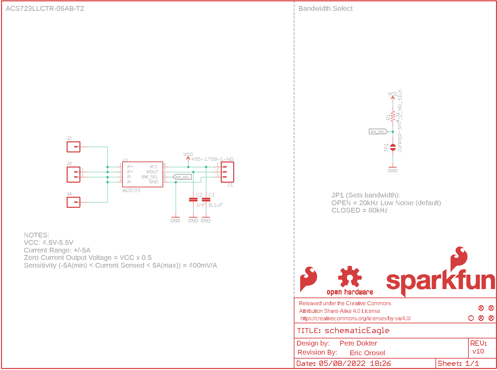
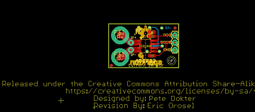
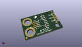
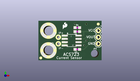
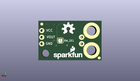
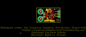
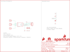

Contents
========

* [PRS13679 > Current Sensor Breakout-ACS723](#prs13679--current-sensor-breakout-acs723)
	* [Schematic](#schematic)
	* [PCB](#pcb)
	* [Interactive BOM](#interactive-bom)
	* [OOMP Parts](#oomp-parts)
	* [Images](#images)
	* [Tags](#tags)
  
![][im]
# PRS13679 > Current Sensor Breakout-ACS723

- ID: PROJ-SPAR-13679-STAN-01
- Hex ID: PRS13679
- Name: Sparkfun
- Description: Sparkfun
- Long Link: [http://oom.lt/PROJ-SPAR-13679-STAN-01](http://oom.lt/PROJ-SPAR-13679-STAN-01)
- Short Link: [http://oom.lt/PRS13679](http://oom.lt/PRS13679)

## Schematic
  

## PCB
  

## Interactive BOM

- Interactive BOM page: [ibom.html](https://htmlpreview.github.io/?https://github.com/oomlout/oomlout_OOMP_projects/blob/main/PROJ-SPAR-13679-STAN-01/kicad/bom/ibom.html)

## OOMP Parts
  

|OOMP Parts|
| :---: |
|CAPC-0603-X-UF1D-01 C1|
|[CAPC-0603-X-NF1-V50  SMD (0603) 1 nF Capacitor (Ceramic) 50v  C2](https://github.com/oomlout/oomlout_OOMP_parts/tree/main/CAPC-0603-X-NF1-V50/)|
|[HEAD-I01-X-PI03-01  2.54 mm 3 Pin Header  J1](https://github.com/oomlout/oomlout_OOMP_parts/tree/main/HEAD-I01-X-PI03-01/)|
|HEAD-I01-X-UNMATCHED-01 J2, J4|
|[HEAD-I01-X-PI02-01  2.54 mm 2 Pin Header  J3](https://github.com/oomlout/oomlout_OOMP_parts/tree/main/HEAD-I01-X-PI02-01/)|
|[RESE-0603-X-O472-01  SMD (0603) 4.7k Ohm Resistor  R1](https://github.com/oomlout/oomlout_OOMP_parts/tree/main/RESE-0603-X-O472-01/)|
|UNMATCHED-UNMATCHED-X-UNMATCHED-01 U1|

## Images
  
  

|kicadPcb3d|kicadPcb3dFront|kicadPcb3dBack|eagleImage|eagleSchemImage|
| :---: | :---: | :---: | :---: | :---: |
||||||

## Tags

- hexID: PRS13679
- oompType: PROJ
- oompSize: SPAR
- oompColor: 13679
- oompDesc: STAN
- oompIndex: 01
- oompName: Current Sensor Breakout-ACS723
- sources: All source files from https://github.com/sparkfun/Current_Sensor_Breakout-ACS723 (source licence details in srcLicense.md)
- linkBuyPage: https://www.sparkfun.com/products/13679
- oompID: PROJ-SPAR-13679-STAN-01
- oompParts: C1,CAPC-0603-X-UF1D-01
- oompParts: C2,CAPC-0603-X-NF1-V50
- oompParts: J1,HEAD-I01-X-PI03-01
- oompParts: J2,HEAD-I01-X-UNMATCHED-01
- oompParts: J3,HEAD-I01-X-PI02-01
- oompParts: J4,HEAD-I01-X-UNMATCHED-01
- oompParts: R1,RESE-0603-X-O472-01
- oompParts: U1,UNMATCHED-UNMATCHED-X-UNMATCHED-01
- rawParts: C1,0.1uF,0.1UF-0603-25V-(+80/-20%),0603,0.1µF ceramic capacitors,,CAP-00810,0.1uF,
- rawParts: C2,1nF,1.0NF/1000PF-0603-50V-10%,0603,1nF/1,000pF ceramic capacitors,,CAP-07886,1nF,
- rawParts: FD2,FIDUCIAL1X2,FIDUCIAL1X2,FIDUCIAL-1X2,Fiducial Alignment Points,,,,
- rawParts: FD3,FIDUCIAL1X2,FIDUCIAL1X2,FIDUCIAL-1X2,Fiducial Alignment Points,,,,
- rawParts: FD4,FIDUCIAL1X2,FIDUCIAL1X2,FIDUCIAL-1X2,Fiducial Alignment Points,,,,
- rawParts: FD5,FIDUCIAL1X2,FIDUCIAL1X2,FIDUCIAL-1X2,Fiducial Alignment Points,,,,
- rawParts: FRAME1,FRAME-LETTER,FRAME-LETTER,CREATIVE_COMMONS,Schematic Frame - Letter,,,,
- rawParts: J1,455-1750-1-ND,CONN_03,1X03,Multi connection point. Often used as Generic Header-pin footprint for 0.1 inch spaced/style header connections,,XXX-00000,455-1750-1-ND,
- rawParts: J2,,M01-SMTSO-256-ET,SMTSO-256-ET,Header 1,,,,
- rawParts: J3,,M021X02_NO_SILK,1X02_NO_SILK@1,Standard 2-pin 0.1 header. Use with,,,,
- rawParts: J4,,M01-SMTSO-256-ET,SMTSO-256-ET,Header 1,,,,
- rawParts: JP1,JUMPER-SMT_2_NO_SILK,JUMPER-SMT_2_NO_SILK,SMT-JUMPER_2_NO_SILK,Normally open jumper,,,,
- rawParts: JP3,STAND-OFFTIGHT,STAND-OFFTIGHT,STAND-OFF-TIGHT,Stand Off,,,,
- rawParts: LOGO1,SFE_LOGO_FLAME.1_INCH,SFE_LOGO_FLAME.1_INCH,SFE_LOGO_FLAME_.1,SparkFun Flame Logo,,,,
- rawParts: LOGO3,SFE_LOGO_NAME_FLAME.1_INCH,SFE_LOGO_NAME_FLAME.1_INCH,SFE_LOGO_NAME_FLAME_.1,SparkFun Font Logo w/ Flame,,,,
- rawParts: LOGO4,OSHW-LOGOM,OSHW-LOGOM,OSHW-LOGO-M,Open-Source Hardware (OSHW) Logo,,,,
- rawParts: R1,4.7k,4.7KOHM-0603-1/10W-1%,0603,4.7kΩ resistor,,RES-07857,4.7k,
- rawParts: U$1,REVISION,REVISION,REVISION,Revision By Text,,,,
- rawParts: U1,ACS723,ACS723,SO08,,ACS723ACS723LLCTR-05AB-T2,IC-13872,,

[im]: kicadPcb3d_450.png
