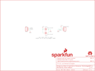

Contents
========

* [PRS13684 > MyoWare Power Shield](#prs13684--myoware-power-shield)
	* [Schematic](#schematic)
	* [PCB](#pcb)
	* [Interactive BOM](#interactive-bom)
	* [OOMP Parts](#oomp-parts)
	* [Images](#images)
	* [Tags](#tags)
  
![][im]
# PRS13684 > MyoWare Power Shield

- ID: PROJ-SPAR-13684-STAN-01
- Hex ID: PRS13684
- Name: Sparkfun
- Description: Sparkfun
- Long Link: [http://oom.lt/PROJ-SPAR-13684-STAN-01](http://oom.lt/PROJ-SPAR-13684-STAN-01)
- Short Link: [http://oom.lt/PRS13684](http://oom.lt/PRS13684)

## Schematic
  

## PCB
  

## Interactive BOM

- Interactive BOM page: [ibom.html](https://htmlpreview.github.io/?https://github.com/oomlout/oomlout_OOMP_projects/blob/main/PROJ-SPAR-13684-STAN-01/kicad/bom/ibom.html)

## OOMP Parts
  

|OOMP Parts|
| :---: |
|UNMATCHED-UNMATCHED-X-UNMATCHED-01 BAT1, BAT2|
|[HEAD-I01-X-PI03-01  2.54 mm 3 Pin Header  JP1, JP2](https://github.com/oomlout/oomlout_OOMP_parts/tree/main/HEAD-I01-X-PI03-01/)|

## Images
  
  

|bominteractivefront|bominteractiveback|kicadPcb3d|kicadPcb3dFront|kicadPcb3dBack|eagleImage|eagleSchemImage|
| :---: | :---: | :---: | :---: | :---: | :---: | :---: |
||||||||

## Tags

- hexID: PRS13684
- oompType: PROJ
- oompSize: SPAR
- oompColor: 13684
- oompDesc: STAN
- oompIndex: 01
- oompName: MyoWare Power Shield
- sources: All source files from https://github.com/sparkfun/MyoWare_Power_Shield (source licence details in srcLicense.md)
- linkBuyPage: https://www.sparkfun.com/products/13684
- oompID: PROJ-SPAR-13684-STAN-01
- oompParts: BAT1,UNMATCHED-UNMATCHED-X-UNMATCHED-01
- oompParts: BAT2,UNMATCHED-UNMATCHED-X-UNMATCHED-01
- oompParts: JP1,HEAD-I01-X-PI03-01
- oompParts: JP2,HEAD-I01-X-PI03-01
- rawParts: BAT1,20mm coincell,BATTERY20MM_4LEGS,BATTCON_20MM_4LEGS,Battery Holders,BATT-10373,20mm coincell,
- rawParts: BAT2,20mm coincell,BATTERY20MM_4LEGS,BATTCON_20MM_4LEGS,Battery Holders,BATT-10373,20mm coincell,
- rawParts: FID1,FIDUCIAL1X2,FIDUCIAL1X2,FIDUCIAL-1X2,Fiducial Alignment Points,,,
- rawParts: FID2,FIDUCIAL1X2,FIDUCIAL1X2,FIDUCIAL-1X2,Fiducial Alignment Points,,,
- rawParts: FRAME1,FRAME-LETTER,FRAME-LETTER,CREATIVE_COMMONS,Schematic Frame,,,
- rawParts: JP1,RAW,M03ALT_ORDER,1X03_NO_SILK,Header 3,,,
- rawParts: JP2,PROCESSED,M031X03_NO_SILK,1X03_NO_SILK,Header 3,,,
- rawParts: JP3,STAND-OFF,STAND-OFF,STAND-OFF,Stand Off,,,
- rawParts: JP4,STAND-OFF,STAND-OFF,STAND-OFF,Stand Off,,,
- rawParts: LOGO1,SFE_LOGO_NAME_FLAME.1_INCH,SFE_LOGO_NAME_FLAME.1_INCH,SFE_LOGO_NAME_FLAME_.1,SFE Logo, name and flame,,,
- rawParts: LOGO2,OSHW-LOGOM,OSHW-LOGOM,OSHW-LOGO-M,Open Source Hardware Logo,,,

[im]: kicadPcb3d_450.png
