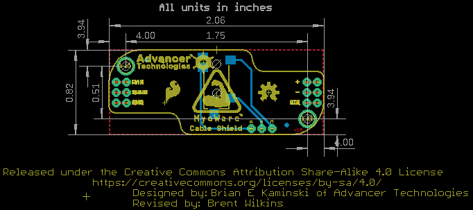
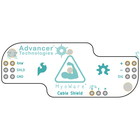
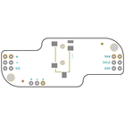
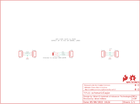
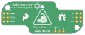
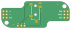

Contents
========

* [PRS13687 > MyoWare Cable Shield](#prs13687--myoware-cable-shield)
	* [Schematic](#schematic)
	* [PCB](#pcb)
	* [Interactive BOM](#interactive-bom)
	* [OOMP Parts](#oomp-parts)
	* [Images](#images)
	* [Tags](#tags)
  
![][im]
# PRS13687 > MyoWare Cable Shield

- ID: PROJ-SPAR-13687-STAN-01
- Hex ID: PRS13687
- Name: Sparkfun
- Description: Sparkfun
- Long Link: [http://oom.lt/PROJ-SPAR-13687-STAN-01](http://oom.lt/PROJ-SPAR-13687-STAN-01)
- Short Link: [http://oom.lt/PRS13687](http://oom.lt/PRS13687)

## Schematic
  

## PCB
  

## Interactive BOM

- Interactive BOM page: [ibom.html](https://htmlpreview.github.io/?https://github.com/oomlout/oomlout_OOMP_projects/blob/main/PROJ-SPAR-13687-STAN-01/kicad/bom/ibom.html)

## OOMP Parts
  

|OOMP ID|Name|Identifier|
| :---: | :---: | :---: |
|[HEAD-I01-X-PI03-01](https://github.com/oomlout/oomlout_OOMP_parts/tree/main/HEAD-I01-X-PI03-01/)|[2.54 mm 3 Pin Header](https://github.com/oomlout/oomlout_OOMP_parts/tree/main/HEAD-I01-X-PI03-01/)|[JP1, JP2, JP4, JP5, JP6](https://github.com/oomlout/oomlout_OOMP_parts/tree/main/HEAD-I01-X-PI03-01/)|
|TERS-35D-L-UNMATCHED-01||JP3|

## Images
  
  

|bominteractivefront|bominteractiveback|kicadPcb3d|kicadPcb3dFront|kicadPcb3dBack|eagleImage|eagleSchemImage|pcbdraw|pcbdrawback|
| :---: | :---: | :---: | :---: | :---: | :---: | :---: | :---: | :---: |
||||||||||

## Tags

- hexID: PRS13687
- oompType: PROJ
- oompSize: SPAR
- oompColor: 13687
- oompDesc: STAN
- oompIndex: 01
- oompName: MyoWare Cable Shield
- sources: All source files from https://github.com/sparkfun/MyoWare_Cable_Shield (source licence details in srcLicense.md)
- linkBuyPage: https://www.sparkfun.com/products/13687
- oompID: PROJ-SPAR-13687-STAN-01
- oompParts: JP1,HEAD-I01-X-PI03-01
- oompParts: JP2,HEAD-I01-X-PI03-01
- oompParts: JP3,TERS-35D-L-UNMATCHED-01
- oompParts: JP4,HEAD-I01-X-PI03-01
- oompParts: JP5,HEAD-I01-X-PI03-01
- oompParts: JP6,HEAD-I01-X-PI03-01
- rawParts: FID1,FIDUCIAL1X2,FIDUCIAL1X2,FIDUCIAL-1X2,Fiducial Alignment Points,,
- rawParts: FID2,FIDUCIAL1X2,FIDUCIAL1X2,FIDUCIAL-1X2,Fiducial Alignment Points,,
- rawParts: FRAME1,FRAME-LETTER,FRAME-LETTER,CREATIVE_COMMONS,Schematic Frame,,
- rawParts: JP1,Power,M031X03_NO_SILK,1X03_NO_SILK,Header 3,,
- rawParts: JP2,Power,M031X03_NO_SILK,1X03_NO_SILK,Header 3,,
- rawParts: JP3,3.5mm Jack,AUDIO-JACKSMD2,AUDIO-JACK-3.5MM-SMD,3.5mm Audio Jack,CONN-10353,
- rawParts: JP4,Power,M031X03_NO_SILK,1X03_NO_SILK,Header 3,,
- rawParts: JP5,Power,M031X03_NO_SILK,1X03_NO_SILK,Header 3,,
- rawParts: JP6,Power,M031X03_NO_SILK,1X03_NO_SILK,Header 3,,
- rawParts: LOGO1,SFE_LOGO_FLAME.2_INCH,SFE_LOGO_FLAME.2_INCH,SFE_LOGO_FLAME_.2,SFE Logo, flame only,,
- rawParts: LOGO2,OSHW-LOGOM,OSHW-LOGOM,OSHW-LOGO-M,Open Source Hardware Logo,,
- rawParts: STANDOFF1,STAND-OFF,STAND-OFF,STAND-OFF,#4 Stand Off,,
- rawParts: STANDOFF2,STAND-OFF,STAND-OFF,STAND-OFF,#4 Stand Off,,

[im]: kicadPcb3d_450.png
