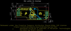
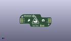
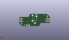
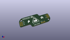

Contents
========

* [PROJ-SPAR-13687-STAN-01>MyoWare Cable Shield](#proj-spar-13687-stan-01myoware-cable-shield)
	* [Images](#images)
	* [Interactive BOM](#interactive-bom)
	* [OOMP Parts](#oomp-parts)
	* [Tags](#tags)
  
![][im]
# PROJ-SPAR-13687-STAN-01>MyoWare Cable Shield

- ID: PROJ-SPAR-13687-STAN-01
- Hex ID: PRS13687
- Name: MyoWare Cable Shield
- Description: 

## Images
  
  

|eagleImage|kicadPcb3dFront|kicadPcb3dBack|kicadPcb3d|
| :---: | :---: | :---: | :---: |
|||||

## Interactive BOM

- Interactive BOM page: [ibom.html](kicad/bom/ibom.html)

## OOMP Parts
  

|OOMP Parts|
| :---: |
|<table><tr><td></td><td> JP1</td><td>[HEAD-I01-X-PI03-01 2.54 mm 3 Pin Header](https://github.com/oomlout/oomlout_OOMP_parts/tree/main/HEAD-I01-X-PI03-01/)</td><td>[H03](https://github.com/oomlout/oomlout_OOMP_parts/tree/main/HEAD-I01-X-PI03-01/)</td></tr></table>|
|<table><tr><td></td><td> JP2</td><td>[HEAD-I01-X-PI03-01 2.54 mm 3 Pin Header](https://github.com/oomlout/oomlout_OOMP_parts/tree/main/HEAD-I01-X-PI03-01/)</td><td>[H03](https://github.com/oomlout/oomlout_OOMP_parts/tree/main/HEAD-I01-X-PI03-01/)</td></tr></table>|
|ERROR, JP3 3.5mm Jack, 0, 0, 0,JP3, 3.5mm, Jack, AUDIO-JACK-3.5MM-SMD, SparkFun-Connectors, (0, 0.41), MR270|
|<table><tr><td></td><td> JP4</td><td>[HEAD-I01-X-PI03-01 2.54 mm 3 Pin Header](https://github.com/oomlout/oomlout_OOMP_parts/tree/main/HEAD-I01-X-PI03-01/)</td><td>[H03](https://github.com/oomlout/oomlout_OOMP_parts/tree/main/HEAD-I01-X-PI03-01/)</td></tr></table>|
|<table><tr><td></td><td> JP5</td><td>[HEAD-I01-X-PI03-01 2.54 mm 3 Pin Header](https://github.com/oomlout/oomlout_OOMP_parts/tree/main/HEAD-I01-X-PI03-01/)</td><td>[H03](https://github.com/oomlout/oomlout_OOMP_parts/tree/main/HEAD-I01-X-PI03-01/)</td></tr></table>|
|<table><tr><td></td><td> JP6</td><td>[HEAD-I01-X-PI03-01 2.54 mm 3 Pin Header](https://github.com/oomlout/oomlout_OOMP_parts/tree/main/HEAD-I01-X-PI03-01/)</td><td>[H03](https://github.com/oomlout/oomlout_OOMP_parts/tree/main/HEAD-I01-X-PI03-01/)</td></tr></table>|

## Tags

- hexID: PRS13687
- oompType: PROJ
- oompSize: SPAR
- oompColor: 13687
- oompDesc: STAN
- oompIndex: 01
- oompName: MyoWare Cable Shield
- sources: All source files from https://github.com/sparkfun/MyoWare_Cable_Shield (source licence details in srcLicense.md)
- linkBuyPage: https://www.sparkfun.com/products/13687
- oompID: PROJ-SPAR-13687-STAN-01
- oompPart: SKIP-UNMATCHED-X-UNMATCHED-01, FID1, 17.000000036, -8.000000002, M0
- oompPart: SKIP-UNMATCHED-X-UNMATCHED-01, FID2, -17.000000036, 8.000000002, M0
- oompPart: HEAD-I01-X-PI03-01, JP1, -22.0345, 2.54, 270
- oompPart: HEAD-I01-X-PI03-01, JP2, -24.5745, 2.54, 270
- oompPart: ERROR, JP3 3.5mm Jack, 0, 0, 0
- oompPart: HEAD-I01-X-PI03-01, JP4, 8.382, -8.889999999999999, 0
- oompPart: HEAD-I01-X-PI03-01, JP5, 24.5745, 2.54, 270
- oompPart: HEAD-I01-X-PI03-01, JP6, 22.0345, 2.54, 270
- rawPart: FID1, FIDUCIAL1X2, FIDUCIAL-1X2, SparkFun-Aesthetics, (0.66929134, -0.31496063), MR0
- rawPart: FID2, FIDUCIAL1X2, FIDUCIAL-1X2, SparkFun-Aesthetics, (-0.66929134, 0.31496063), MR0
- rawPart: JP1, Power, 1X03_NO_SILK, SparkFun-Connectors, (-0.8675, 0.1), R270
- rawPart: JP2, Power, 1X03_NO_SILK, SparkFun-Connectors, (-0.9675, 0.1), R270
- rawPart: JP3, 3.5mm, Jack, AUDIO-JACK-3.5MM-SMD, SparkFun-Connectors, (0, 0.41), MR270
- rawPart: JP4, Power, 1X03_NO_SILK, SparkFun-Connectors, (0.33, -0.35), R0
- rawPart: JP5, Power, 1X03_NO_SILK, SparkFun-Connectors, (0.9675, 0.1), R270
- rawPart: JP6, Power, 1X03_NO_SILK, SparkFun-Connectors, (0.8675, 0.1), R270

[im]: kicadPcb3d_450.png
