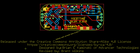
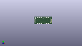
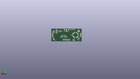
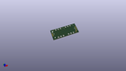

Contents
========

* [PROJ-SPAR-13688-STAN-01>MyoWare LED Shield](#proj-spar-13688-stan-01myoware-led-shield)
	* [Images](#images)
	* [Interactive BOM](#interactive-bom)
	* [OOMP Parts](#oomp-parts)
	* [Tags](#tags)
  
![][im]
# PROJ-SPAR-13688-STAN-01>MyoWare LED Shield

- ID: PROJ-SPAR-13688-STAN-01
- Hex ID: PRS13688
- Name: MyoWare LED Shield
- Description: 

## Images
  
  

|eagleImage|kicadPcb3dFront|kicadPcb3dBack|kicadPcb3d|
| :---: | :---: | :---: | :---: |
|||||

## Interactive BOM

- Interactive BOM page: [ibom.html](kicad/bom/ibom.html)

## OOMP Parts
  

|OOMP Parts|
| :---: |
|CAPE-0603-X-UNMATCHED-01, C1, 43.561, 20.1295, M180,C1, 4.7uF, 0603-CAP, SparkFun-Capacitors, (1.715, 0.7925), MR180|
|CAPE-0603-X-UNMATCHED-01, C2, 35.2425, 17.525999999999996, M270,C2, 4.7uF, 0603-CAP, SparkFun-Capacitors, (1.3875, 0.69), MR270|
|UNMATCHED-0603-X-UNMATCHED-01, D1, 48.5775, 17.779999999999998, M90,D1, RED, LED-0603, SparkFun-LED, (1.9125, 0.7), MR90|
|UNMATCHED-0603-X-UNMATCHED-01, D2, 48.5775, 15.938499999999998, M90,D2, GREEN, LED-0603, SparkFun-LED, (1.9125, 0.6275), MR90|
|UNMATCHED-UNMATCHED-X-UNMATCHED-01, D3, 36.512499999999996, 10.921999999999999, 180,D3, SMA-B500, LED_BAR_SMD, Testing, (1.4375, 0.43), R180|
|UNMATCHED-UNMATCHED-X-UNMATCHED-01, D4, 15.8115, 10.921999999999999, 180,D4, SMA-B500, LED_BAR_SMD, Testing, (0.6225, 0.43), R180|
|UNMATCHED-UNMATCHED-X-UNMATCHED-01, JP1, 1.5239999999999998, 13.462, 270,JP1, Power, 1X03_NO_SILK, SparkFun-Connectors, (0.06, 0.53), R270|
|UNMATCHED-UNMATCHED-X-UNMATCHED-01, JP2, 50.4825, 13.462, 270,JP2, Signal, 1X03_NO_SILK, SparkFun-Connectors, (1.9875, 0.53), R270|
|UNMATCHED-UNMATCHED-X-UNMATCHED-01, JP3, 49.466499999999996, 5.0165, 225,JP3, LiPo, 1X02_NO_SILK, SparkFun-Connectors, (1.9475, 0.1975), R225|
|UNMATCHED-UNMATCHED-X-UNMATCHED-01, JP4, 26.12700007, 19.8755, M270,JP4, USB-B-MICRO-SMD_V03, SparkFun-Connectors, (1.02862205, 0.7825), MR270|
|UNMATCHED-UNMATCHED-X-UNMATCHED-01, MODE, 5.225596864, 5.5322030579999995, M315,MODE, JUMPER-PAD-2-NC_BY_TRACE, PAD-JUMPER-2-NC_BY_TRACE_YES_SILK, SparkFun-Passives, (0.20573216, 0.21780327), MR315|
|RESE-0603-X-UNMATCHED-01, R1, 12.6365, 2.3495, M90,R1, 6.49k, R0603, resistor, (0.4975, 0.0925), MR90|
|RESE-0603-X-UNMATCHED-01, R2, 14.731999999999998, 2.3495, M270,R2, 7.5k, R0603, resistor, (0.58, 0.0925), MR270|
|<table><tr><td></td><td> R3</td><td>[RESE-0603-X-O331-01 SMD (0603) 330 Ohm Resistor](https://github.com/oomlout/oomlout_OOMP_parts/tree/main/RESE-0603-X-O331-01/)</td><td>[R6331](https://github.com/oomlout/oomlout_OOMP_parts/tree/main/RESE-0603-X-O331-01/)</td></tr></table>|
|<table><tr><td></td><td> R4</td><td>[RESE-0603-X-O103-01 SMD (0603) 10k Ohm Resistor](https://github.com/oomlout/oomlout_OOMP_parts/tree/main/RESE-0603-X-O103-01/)</td><td>[R6103](https://github.com/oomlout/oomlout_OOMP_parts/tree/main/RESE-0603-X-O103-01/)</td></tr></table>|
|<table><tr><td></td><td> R5</td><td>[RESE-0603-X-O331-01 SMD (0603) 330 Ohm Resistor](https://github.com/oomlout/oomlout_OOMP_parts/tree/main/RESE-0603-X-O331-01/)</td><td>[R6331](https://github.com/oomlout/oomlout_OOMP_parts/tree/main/RESE-0603-X-O331-01/)</td></tr></table>|
|UNMATCHED-UNMATCHED-X-UNMATCHED-01, U1, 38.989, 17.7165, M90,U1, MCP73831, SOT23-5, SparkFun-PowerIC, (1.535, 0.6975), MR90|
|UNMATCHED-UNMATCHED-X-UNMATCHED-01, U2, 10.6045, 10.921999999999999, M45,U2, LM3914V, PLCC20S, Testing, (0.4175, 0.43), MR45|

## Tags

- hexID: PRS13688
- oompType: PROJ
- oompSize: SPAR
- oompColor: 13688
- oompDesc: STAN
- oompIndex: 01
- oompName: MyoWare LED Shield
- sources: All source files from https://github.com/sparkfun/MyoWare_LED_Shield (source licence details in srcLicense.md)
- linkBuyPage: https://www.sparkfun.com/products/13688
- oompPart: CAPE-0603-X-UNMATCHED-01, C1, 43.561, 20.1295, M180
- oompPart: CAPE-0603-X-UNMATCHED-01, C2, 35.2425, 17.525999999999996, M270
- oompPart: UNMATCHED-0603-X-UNMATCHED-01, D1, 48.5775, 17.779999999999998, M90
- oompPart: UNMATCHED-0603-X-UNMATCHED-01, D2, 48.5775, 15.938499999999998, M90
- oompPart: UNMATCHED-UNMATCHED-X-UNMATCHED-01, D3, 36.512499999999996, 10.921999999999999, 180
- oompPart: UNMATCHED-UNMATCHED-X-UNMATCHED-01, D4, 15.8115, 10.921999999999999, 180
- oompPart: SKIP-UNMATCHED-X-UNMATCHED-01, FID1, 5.7912, 20.5486, M0
- oompPart: SKIP-UNMATCHED-X-UNMATCHED-01, FID2, 46.2534, 1.27, M0
- oompPart: SKIP-UNMATCHED-X-UNMATCHED-01, FID3, 46.2534, 1.27, 0
- oompPart: SKIP-UNMATCHED-X-UNMATCHED-01, FID4, 5.7912, 20.5486, 0
- oompPart: UNMATCHED-UNMATCHED-X-UNMATCHED-01, JP1, 1.5239999999999998, 13.462, 270
- oompPart: UNMATCHED-UNMATCHED-X-UNMATCHED-01, JP2, 50.4825, 13.462, 270
- oompPart: UNMATCHED-UNMATCHED-X-UNMATCHED-01, JP3, 49.466499999999996, 5.0165, 225
- oompPart: UNMATCHED-UNMATCHED-X-UNMATCHED-01, JP4, 26.12700007, 19.8755, M270
- oompPart: UNMATCHED-UNMATCHED-X-UNMATCHED-01, MODE, 5.225596864, 5.5322030579999995, M315
- oompPart: RESE-0603-X-UNMATCHED-01, R1, 12.6365, 2.3495, M90
- oompPart: RESE-0603-X-UNMATCHED-01, R2, 14.731999999999998, 2.3495, M270
- oompPart: RESE-0603-X-O331-01, R3, 43.561, 18.160999999999998, M0
- oompPart: RESE-0603-X-O103-01, R4, 43.561, 16.256, M0
- oompPart: RESE-0603-X-O331-01, R5, 43.561, 14.350999999999997, M180
- oompPart: UNMATCHED-UNMATCHED-X-UNMATCHED-01, U1, 38.989, 17.7165, M90
- oompPart: UNMATCHED-UNMATCHED-X-UNMATCHED-01, U2, 10.6045, 10.921999999999999, M45
- rawPart: C1, 4.7uF, 0603-CAP, SparkFun-Capacitors, (1.715, 0.7925), MR180
- rawPart: C2, 4.7uF, 0603-CAP, SparkFun-Capacitors, (1.3875, 0.69), MR270
- rawPart: D1, RED, LED-0603, SparkFun-LED, (1.9125, 0.7), MR90
- rawPart: D2, GREEN, LED-0603, SparkFun-LED, (1.9125, 0.6275), MR90
- rawPart: D3, SMA-B500, LED_BAR_SMD, Testing, (1.4375, 0.43), R180
- rawPart: D4, SMA-B500, LED_BAR_SMD, Testing, (0.6225, 0.43), R180
- rawPart: FID1, FIDUCIAL1X2, FIDUCIAL-1X2, SparkFun-Aesthetics, (0.228, 0.809), MR0
- rawPart: FID2, FIDUCIAL1X2, FIDUCIAL-1X2, SparkFun-Aesthetics, (1.821, 0.05), MR0
- rawPart: FID3, FIDUCIAL1X2, FIDUCIAL-1X2, SparkFun-Aesthetics, (1.821, 0.05), R0
- rawPart: FID4, FIDUCIAL1X2, FIDUCIAL-1X2, SparkFun-Aesthetics, (0.228, 0.809), R0
- rawPart: JP1, Power, 1X03_NO_SILK, SparkFun-Connectors, (0.06, 0.53), R270
- rawPart: JP2, Signal, 1X03_NO_SILK, SparkFun-Connectors, (1.9875, 0.53), R270
- rawPart: JP3, LiPo, 1X02_NO_SILK, SparkFun-Connectors, (1.9475, 0.1975), R225
- rawPart: JP4, USB-B-MICRO-SMD_V03, SparkFun-Connectors, (1.02862205, 0.7825), MR270
- rawPart: MODE, JUMPER-PAD-2-NC_BY_TRACE, PAD-JUMPER-2-NC_BY_TRACE_YES_SILK, SparkFun-Passives, (0.20573216, 0.21780327), MR315
- rawPart: R1, 6.49k, R0603, resistor, (0.4975, 0.0925), MR90
- rawPart: R2, 7.5k, R0603, resistor, (0.58, 0.0925), MR270
- rawPart: R3, 330, 0603-RES, SparkFun-Resistors, (1.715, 0.715), MR0
- rawPart: R4, 10K, 0603-RES, SparkFun-Resistors, (1.715, 0.64), MR0
- rawPart: R5, 330, 0603-RES, SparkFun-Resistors, (1.715, 0.565), MR180
- rawPart: U1, MCP73831, SOT23-5, SparkFun-PowerIC, (1.535, 0.6975), MR90
- rawPart: U2, LM3914V, PLCC20S, Testing, (0.4175, 0.43), MR45

[im]: kicadPcb3d_450.png
