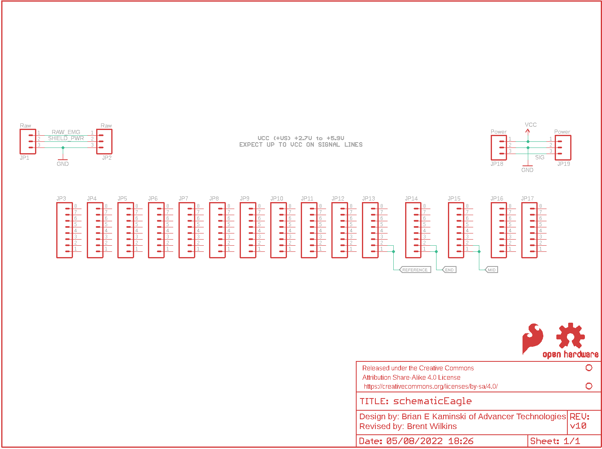
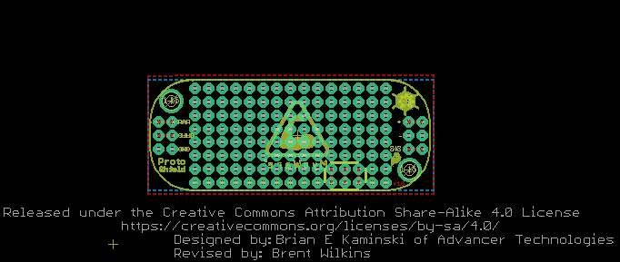

Contents
========

* [PRS13709 > MyoWare Proto Shield](#prs13709--myoware-proto-shield)
	* [Schematic](#schematic)
	* [PCB](#pcb)
	* [Interactive BOM](#interactive-bom)
	* [OOMP Parts](#oomp-parts)
	* [Images](#images)
	* [Tags](#tags)
  
![][im]
# PRS13709 > MyoWare Proto Shield

- ID: PROJ-SPAR-13709-STAN-01
- Hex ID: PRS13709
- Name: Sparkfun
- Description: Sparkfun
- Long Link: [http://oom.lt/PROJ-SPAR-13709-STAN-01](http://oom.lt/PROJ-SPAR-13709-STAN-01)
- Short Link: [http://oom.lt/PRS13709](http://oom.lt/PRS13709)

## Schematic
  

## PCB
  

## Interactive BOM

- Interactive BOM page: [ibom.html](https://htmlpreview.github.io/?https://github.com/oomlout/oomlout_OOMP_projects/blob/main/PROJ-SPAR-13709-STAN-01/kicad/bom/ibom.html)

## OOMP Parts
  

|OOMP Parts|
| :---: |
|[JP1 HEAD-I01-X-PI03-01 2.54 mm 3 Pin Header](https://github.com/oomlout/oomlout_OOMP_parts/tree/main/HEAD-I01-X-PI03-01/)|
|[JP2 HEAD-I01-X-PI03-01 2.54 mm 3 Pin Header](https://github.com/oomlout/oomlout_OOMP_parts/tree/main/HEAD-I01-X-PI03-01/)|
|[JP3 HEAD-I01-X-PI08-01 2.54 mm 8 Pin Header](https://github.com/oomlout/oomlout_OOMP_parts/tree/main/HEAD-I01-X-PI08-01/)|
|[JP4 HEAD-I01-X-PI08-01 2.54 mm 8 Pin Header](https://github.com/oomlout/oomlout_OOMP_parts/tree/main/HEAD-I01-X-PI08-01/)|
|[JP5 HEAD-I01-X-PI08-01 2.54 mm 8 Pin Header](https://github.com/oomlout/oomlout_OOMP_parts/tree/main/HEAD-I01-X-PI08-01/)|
|[JP6 HEAD-I01-X-PI08-01 2.54 mm 8 Pin Header](https://github.com/oomlout/oomlout_OOMP_parts/tree/main/HEAD-I01-X-PI08-01/)|
|[JP7 HEAD-I01-X-PI08-01 2.54 mm 8 Pin Header](https://github.com/oomlout/oomlout_OOMP_parts/tree/main/HEAD-I01-X-PI08-01/)|
|[JP8 HEAD-I01-X-PI08-01 2.54 mm 8 Pin Header](https://github.com/oomlout/oomlout_OOMP_parts/tree/main/HEAD-I01-X-PI08-01/)|
|[JP9 HEAD-I01-X-PI08-01 2.54 mm 8 Pin Header](https://github.com/oomlout/oomlout_OOMP_parts/tree/main/HEAD-I01-X-PI08-01/)|
|[JP10 HEAD-I01-X-PI08-01 2.54 mm 8 Pin Header](https://github.com/oomlout/oomlout_OOMP_parts/tree/main/HEAD-I01-X-PI08-01/)|
|[JP11 HEAD-I01-X-PI08-01 2.54 mm 8 Pin Header](https://github.com/oomlout/oomlout_OOMP_parts/tree/main/HEAD-I01-X-PI08-01/)|
|[JP12 HEAD-I01-X-PI08-01 2.54 mm 8 Pin Header](https://github.com/oomlout/oomlout_OOMP_parts/tree/main/HEAD-I01-X-PI08-01/)|
|[JP13 HEAD-I01-X-PI08-01 2.54 mm 8 Pin Header](https://github.com/oomlout/oomlout_OOMP_parts/tree/main/HEAD-I01-X-PI08-01/)|
|[JP14 HEAD-I01-X-PI08-01 2.54 mm 8 Pin Header](https://github.com/oomlout/oomlout_OOMP_parts/tree/main/HEAD-I01-X-PI08-01/)|
|[JP15 HEAD-I01-X-PI08-01 2.54 mm 8 Pin Header](https://github.com/oomlout/oomlout_OOMP_parts/tree/main/HEAD-I01-X-PI08-01/)|
|[JP16 HEAD-I01-X-PI08-01 2.54 mm 8 Pin Header](https://github.com/oomlout/oomlout_OOMP_parts/tree/main/HEAD-I01-X-PI08-01/)|
|[JP17 HEAD-I01-X-PI08-01 2.54 mm 8 Pin Header](https://github.com/oomlout/oomlout_OOMP_parts/tree/main/HEAD-I01-X-PI08-01/)|
|[JP18 HEAD-I01-X-PI03-01 2.54 mm 3 Pin Header](https://github.com/oomlout/oomlout_OOMP_parts/tree/main/HEAD-I01-X-PI03-01/)|
|[JP19 HEAD-I01-X-PI03-01 2.54 mm 3 Pin Header](https://github.com/oomlout/oomlout_OOMP_parts/tree/main/HEAD-I01-X-PI03-01/)|

## Images
  
  

|kicadPcb3d|kicadPcb3dFront|kicadPcb3dBack|eagleImage|eagleSchemImage|
| :---: | :---: | :---: | :---: | :---: |
||||||

## Tags

- hexID: PRS13709
- oompType: PROJ
- oompSize: SPAR
- oompColor: 13709
- oompDesc: STAN
- oompIndex: 01
- oompName: MyoWare Proto Shield
- sources: All source files from https://github.com/sparkfun/MyoWare_Proto_Shield (source licence details in srcLicense.md)
- linkBuyPage: https://www.sparkfun.com/products/13709
- oompID: PROJ-SPAR-13709-STAN-01
- oompParts: JP1,HEAD-I01-X-PI03-01
- oompParts: JP2,HEAD-I01-X-PI03-01
- oompParts: JP3,HEAD-I01-X-PI08-01
- oompParts: JP4,HEAD-I01-X-PI08-01
- oompParts: JP5,HEAD-I01-X-PI08-01
- oompParts: JP6,HEAD-I01-X-PI08-01
- oompParts: JP7,HEAD-I01-X-PI08-01
- oompParts: JP8,HEAD-I01-X-PI08-01
- oompParts: JP9,HEAD-I01-X-PI08-01
- oompParts: JP10,HEAD-I01-X-PI08-01
- oompParts: JP11,HEAD-I01-X-PI08-01
- oompParts: JP12,HEAD-I01-X-PI08-01
- oompParts: JP13,HEAD-I01-X-PI08-01
- oompParts: JP14,HEAD-I01-X-PI08-01
- oompParts: JP15,HEAD-I01-X-PI08-01
- oompParts: JP16,HEAD-I01-X-PI08-01
- oompParts: JP17,HEAD-I01-X-PI08-01
- oompParts: JP18,HEAD-I01-X-PI03-01
- oompParts: JP19,HEAD-I01-X-PI03-01
- rawParts: FRAME1,FRAME-LETTER,FRAME-LETTER,CREATIVE_COMMONS,Schematic Frame,,
- rawParts: JP1,Raw,M031X03_NO_SILK,1X03_NO_SILK,Header 3,,
- rawParts: JP2,Raw,M031X03_NO_SILK,1X03_NO_SILK,Header 3,,
- rawParts: JP3,,M08NO_SILK,1X08_NO_SILK,Header 8,,
- rawParts: JP4,,M08NO_SILK,1X08_NO_SILK,Header 8,,
- rawParts: JP5,,M08NO_SILK,1X08_NO_SILK,Header 8,,
- rawParts: JP6,,M08NO_SILK,1X08_NO_SILK,Header 8,,
- rawParts: JP7,,M08NO_SILK,1X08_NO_SILK,Header 8,,
- rawParts: JP8,,M08NO_SILK,1X08_NO_SILK,Header 8,,
- rawParts: JP9,,M08NO_SILK,1X08_NO_SILK,Header 8,,
- rawParts: JP10,,M08NO_SILK,1X08_NO_SILK,Header 8,,
- rawParts: JP11,,M08NO_SILK,1X08_NO_SILK,Header 8,,
- rawParts: JP12,,M08NO_SILK,1X08_NO_SILK,Header 8,,
- rawParts: JP13,,M08NO_SILK,1X08_NO_SILK,Header 8,,
- rawParts: JP14,,M08NO_SILK,1X08_NO_SILK,Header 8,,
- rawParts: JP15,,M08NO_SILK,1X08_NO_SILK,Header 8,,
- rawParts: JP16,,M08NO_SILK,1X08_NO_SILK,Header 8,,
- rawParts: JP17,,M08NO_SILK,1X08_NO_SILK,Header 8,,
- rawParts: JP18,Power,M031X03_NO_SILK,1X03_NO_SILK,Header 3,,
- rawParts: JP19,Power,M031X03_NO_SILK,1X03_NO_SILK,Header 3,,
- rawParts: JP20,STAND-OFF,STAND-OFF,STAND-OFF,#4 Stand Off,,
- rawParts: JP21,STAND-OFF,STAND-OFF,STAND-OFF,#4 Stand Off,,
- rawParts: LOGO1,SFE_LOGO_FLAME.1_INCH,SFE_LOGO_FLAME.1_INCH,SFE_LOGO_FLAME_.1,SFE Logo, flame only,,
- rawParts: LOGO2,OSHW-LOGOS,OSHW-LOGOS,OSHW-LOGO-S,Open Source Hardware Logo,,

[im]: kicadPcb3d_450.png
