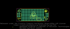
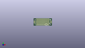
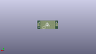
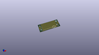

Contents
========

* [PROJ-SPAR-13709-STAN-01>MyoWare Proto Shield](#proj-spar-13709-stan-01myoware-proto-shield)
	* [Images](#images)
	* [Interactive BOM](#interactive-bom)
	* [OOMP Parts](#oomp-parts)
	* [Tags](#tags)
  
![][im]
# PROJ-SPAR-13709-STAN-01>MyoWare Proto Shield

- ID: PROJ-SPAR-13709-STAN-01
- Hex ID: PRS13709
- Name: MyoWare Proto Shield
- Description: 

## Images
  
  

|eagleImage|kicadPcb3dFront|kicadPcb3dBack|kicadPcb3d|
| :---: | :---: | :---: | :---: |
|||||

## Interactive BOM

- Interactive BOM page: [ibom.html](kicad/bom/ibom.html)

## OOMP Parts
  

|OOMP Parts|
| :---: |
|UNMATCHED-UNMATCHED-X-UNMATCHED-01, JP1, -21.971, 2.54, 270,JP1, Raw, 1X03_NO_SILK, SparkFun-Connectors, (-0.865, 0.1), R270|
|UNMATCHED-UNMATCHED-X-UNMATCHED-01, JP2, -24.511, 2.54, 270,JP2, Raw, 1X03_NO_SILK, SparkFun-Connectors, (-0.965, 0.1), R270|
|UNMATCHED-UNMATCHED-X-UNMATCHED-01, JP3, -17.779999999999998, -8.889999999999999, 90,JP3, 1X08_NO_SILK, SparkFun-Connectors, (-0.7, -0.35), R90|
|UNMATCHED-UNMATCHED-X-UNMATCHED-01, JP4, -15.239999999999998, -8.889999999999999, 90,JP4, 1X08_NO_SILK, SparkFun-Connectors, (-0.6, -0.35), R90|
|UNMATCHED-UNMATCHED-X-UNMATCHED-01, JP5, -12.7, -8.889999999999999, 90,JP5, 1X08_NO_SILK, SparkFun-Connectors, (-0.5, -0.35), R90|
|UNMATCHED-UNMATCHED-X-UNMATCHED-01, JP6, -10.16, -8.889999999999999, 90,JP6, 1X08_NO_SILK, SparkFun-Connectors, (-0.4, -0.35), R90|
|UNMATCHED-UNMATCHED-X-UNMATCHED-01, JP7, -7.619999999999999, -8.889999999999999, 90,JP7, 1X08_NO_SILK, SparkFun-Connectors, (-0.3, -0.35), R90|
|UNMATCHED-UNMATCHED-X-UNMATCHED-01, JP8, -5.08, -8.889999999999999, 90,JP8, 1X08_NO_SILK, SparkFun-Connectors, (-0.2, -0.35), R90|
|UNMATCHED-UNMATCHED-X-UNMATCHED-01, JP9, -2.54, -8.889999999999999, 90,JP9, 1X08_NO_SILK, SparkFun-Connectors, (-0.1, -0.35), R90|
|UNMATCHED-UNMATCHED-X-UNMATCHED-01, JP10, 0.0, -8.889999999999999, 90,JP10, 1X08_NO_SILK, SparkFun-Connectors, (0, -0.35), R90|
|UNMATCHED-UNMATCHED-X-UNMATCHED-01, JP11, 2.54, -8.889999999999999, 90,JP11, 1X08_NO_SILK, SparkFun-Connectors, (0.1, -0.35), R90|
|UNMATCHED-UNMATCHED-X-UNMATCHED-01, JP12, 5.08, -8.889999999999999, 90,JP12, 1X08_NO_SILK, SparkFun-Connectors, (0.2, -0.35), R90|
|UNMATCHED-UNMATCHED-X-UNMATCHED-01, JP13, 7.619999999999999, -8.889999999999999, 90,JP13, 1X08_NO_SILK, SparkFun-Connectors, (0.3, -0.35), R90|
|UNMATCHED-UNMATCHED-X-UNMATCHED-01, JP14, 10.16, -8.889999999999999, 90,JP14, 1X08_NO_SILK, SparkFun-Connectors, (0.4, -0.35), R90|
|UNMATCHED-UNMATCHED-X-UNMATCHED-01, JP15, 12.7, -8.889999999999999, 90,JP15, 1X08_NO_SILK, SparkFun-Connectors, (0.5, -0.35), R90|
|UNMATCHED-UNMATCHED-X-UNMATCHED-01, JP16, 15.239999999999998, -8.889999999999999, 90,JP16, 1X08_NO_SILK, SparkFun-Connectors, (0.6, -0.35), R90|
|UNMATCHED-UNMATCHED-X-UNMATCHED-01, JP17, 17.779999999999998, -8.889999999999999, 90,JP17, 1X08_NO_SILK, SparkFun-Connectors, (0.7, -0.35), R90|
|UNMATCHED-UNMATCHED-X-UNMATCHED-01, JP18, 22.0345, 2.54, 270,JP18, Power, 1X03_NO_SILK, SparkFun-Connectors, (0.8675, 0.1), R270|
|UNMATCHED-UNMATCHED-X-UNMATCHED-01, JP19, 24.5745, 2.54, 270,JP19, Power, 1X03_NO_SILK, SparkFun-Connectors, (0.9675, 0.1), R270|

## Tags

- hexID: PRS13709
- oompType: PROJ
- oompSize: SPAR
- oompColor: 13709
- oompDesc: STAN
- oompIndex: 01
- oompName: MyoWare Proto Shield
- sources: All source files from https://github.com/sparkfun/MyoWare_Proto_Shield (source licence details in srcLicense.md)
- linkBuyPage: https://www.sparkfun.com/products/13709
- oompPart: UNMATCHED-UNMATCHED-X-UNMATCHED-01, JP1, -21.971, 2.54, 270
- oompPart: UNMATCHED-UNMATCHED-X-UNMATCHED-01, JP2, -24.511, 2.54, 270
- oompPart: UNMATCHED-UNMATCHED-X-UNMATCHED-01, JP3, -17.779999999999998, -8.889999999999999, 90
- oompPart: UNMATCHED-UNMATCHED-X-UNMATCHED-01, JP4, -15.239999999999998, -8.889999999999999, 90
- oompPart: UNMATCHED-UNMATCHED-X-UNMATCHED-01, JP5, -12.7, -8.889999999999999, 90
- oompPart: UNMATCHED-UNMATCHED-X-UNMATCHED-01, JP6, -10.16, -8.889999999999999, 90
- oompPart: UNMATCHED-UNMATCHED-X-UNMATCHED-01, JP7, -7.619999999999999, -8.889999999999999, 90
- oompPart: UNMATCHED-UNMATCHED-X-UNMATCHED-01, JP8, -5.08, -8.889999999999999, 90
- oompPart: UNMATCHED-UNMATCHED-X-UNMATCHED-01, JP9, -2.54, -8.889999999999999, 90
- oompPart: UNMATCHED-UNMATCHED-X-UNMATCHED-01, JP10, 0.0, -8.889999999999999, 90
- oompPart: UNMATCHED-UNMATCHED-X-UNMATCHED-01, JP11, 2.54, -8.889999999999999, 90
- oompPart: UNMATCHED-UNMATCHED-X-UNMATCHED-01, JP12, 5.08, -8.889999999999999, 90
- oompPart: UNMATCHED-UNMATCHED-X-UNMATCHED-01, JP13, 7.619999999999999, -8.889999999999999, 90
- oompPart: UNMATCHED-UNMATCHED-X-UNMATCHED-01, JP14, 10.16, -8.889999999999999, 90
- oompPart: UNMATCHED-UNMATCHED-X-UNMATCHED-01, JP15, 12.7, -8.889999999999999, 90
- oompPart: UNMATCHED-UNMATCHED-X-UNMATCHED-01, JP16, 15.239999999999998, -8.889999999999999, 90
- oompPart: UNMATCHED-UNMATCHED-X-UNMATCHED-01, JP17, 17.779999999999998, -8.889999999999999, 90
- oompPart: UNMATCHED-UNMATCHED-X-UNMATCHED-01, JP18, 22.0345, 2.54, 270
- oompPart: UNMATCHED-UNMATCHED-X-UNMATCHED-01, JP19, 24.5745, 2.54, 270
- rawPart: JP1, Raw, 1X03_NO_SILK, SparkFun-Connectors, (-0.865, 0.1), R270
- rawPart: JP2, Raw, 1X03_NO_SILK, SparkFun-Connectors, (-0.965, 0.1), R270
- rawPart: JP3, 1X08_NO_SILK, SparkFun-Connectors, (-0.7, -0.35), R90
- rawPart: JP4, 1X08_NO_SILK, SparkFun-Connectors, (-0.6, -0.35), R90
- rawPart: JP5, 1X08_NO_SILK, SparkFun-Connectors, (-0.5, -0.35), R90
- rawPart: JP6, 1X08_NO_SILK, SparkFun-Connectors, (-0.4, -0.35), R90
- rawPart: JP7, 1X08_NO_SILK, SparkFun-Connectors, (-0.3, -0.35), R90
- rawPart: JP8, 1X08_NO_SILK, SparkFun-Connectors, (-0.2, -0.35), R90
- rawPart: JP9, 1X08_NO_SILK, SparkFun-Connectors, (-0.1, -0.35), R90
- rawPart: JP10, 1X08_NO_SILK, SparkFun-Connectors, (0, -0.35), R90
- rawPart: JP11, 1X08_NO_SILK, SparkFun-Connectors, (0.1, -0.35), R90
- rawPart: JP12, 1X08_NO_SILK, SparkFun-Connectors, (0.2, -0.35), R90
- rawPart: JP13, 1X08_NO_SILK, SparkFun-Connectors, (0.3, -0.35), R90
- rawPart: JP14, 1X08_NO_SILK, SparkFun-Connectors, (0.4, -0.35), R90
- rawPart: JP15, 1X08_NO_SILK, SparkFun-Connectors, (0.5, -0.35), R90
- rawPart: JP16, 1X08_NO_SILK, SparkFun-Connectors, (0.6, -0.35), R90
- rawPart: JP17, 1X08_NO_SILK, SparkFun-Connectors, (0.7, -0.35), R90
- rawPart: JP18, Power, 1X03_NO_SILK, SparkFun-Connectors, (0.8675, 0.1), R270
- rawPart: JP19, Power, 1X03_NO_SILK, SparkFun-Connectors, (0.9675, 0.1), R270

[im]: kicadPcb3d_450.png
