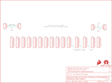

Contents
========

* [PRS13709 > Sparkfun](#prs13709--sparkfun)
	* [Schematic](#schematic)
	* [Interactive BOM](#interactive-bom)
	* [OOMP Parts](#oomp-parts)
	* [Images](#images)
	* [Tags](#tags)
  
![][im]
# PRS13709 > Sparkfun

- ID: PROJ-SPAR-13709-STAN-01
- Hex ID: PRS13709
- Name: Sparkfun
- Description: Sparkfun
- Long Link: [http://oom.lt/PROJ-SPAR-13709-STAN-01](http://oom.lt/PROJ-SPAR-13709-STAN-01)
- Long Link: [http://oom.lt/PRS13709](http://oom.lt/PRS13709)

## Schematic
  
![][schem]
## Interactive BOM

- Interactive BOM page: [ibom.html](https://htmlpreview.github.io/?https://github.com/oomlout/oomlout_OOMP_projects/blob/main/PROJ-SPAR-13709-STAN-01/kicad/bom/ibom.html)

## OOMP Parts
  

|OOMP Parts|
| :---: |
|FRAME1,UNMATCHED-UNMATCHED-UNMATCHED-UNMATCHED-UNMATCHED,FRAME1,FRAME-LETTER,FRAME-LETTER,CREATIVE_COMMONS,Schematic Frame,,|
|JP1,UNMATCHED-UNMATCHED-UNMATCHED-UNMATCHED-UNMATCHED,JP1,Raw,M031X03_NO_SILK,1X03_NO_SILK,Header 3,,|
|JP2,UNMATCHED-UNMATCHED-UNMATCHED-UNMATCHED-UNMATCHED,JP2,Raw,M031X03_NO_SILK,1X03_NO_SILK,Header 3,,|
|JP3,UNMATCHED-UNMATCHED-UNMATCHED-UNMATCHED-UNMATCHED,JP3,,M08NO_SILK,1X08_NO_SILK,Header 8,,|
|JP4,UNMATCHED-UNMATCHED-UNMATCHED-UNMATCHED-UNMATCHED,JP4,,M08NO_SILK,1X08_NO_SILK,Header 8,,|
|JP5,UNMATCHED-UNMATCHED-UNMATCHED-UNMATCHED-UNMATCHED,JP5,,M08NO_SILK,1X08_NO_SILK,Header 8,,|
|JP6,UNMATCHED-UNMATCHED-UNMATCHED-UNMATCHED-UNMATCHED,JP6,,M08NO_SILK,1X08_NO_SILK,Header 8,,|
|JP7,UNMATCHED-UNMATCHED-UNMATCHED-UNMATCHED-UNMATCHED,JP7,,M08NO_SILK,1X08_NO_SILK,Header 8,,|
|JP8,UNMATCHED-UNMATCHED-UNMATCHED-UNMATCHED-UNMATCHED,JP8,,M08NO_SILK,1X08_NO_SILK,Header 8,,|
|JP9,UNMATCHED-UNMATCHED-UNMATCHED-UNMATCHED-UNMATCHED,JP9,,M08NO_SILK,1X08_NO_SILK,Header 8,,|
|JP10,UNMATCHED-UNMATCHED-UNMATCHED-UNMATCHED-UNMATCHED,JP10,,M08NO_SILK,1X08_NO_SILK,Header 8,,|
|JP11,UNMATCHED-UNMATCHED-UNMATCHED-UNMATCHED-UNMATCHED,JP11,,M08NO_SILK,1X08_NO_SILK,Header 8,,|
|JP12,UNMATCHED-UNMATCHED-UNMATCHED-UNMATCHED-UNMATCHED,JP12,,M08NO_SILK,1X08_NO_SILK,Header 8,,|
|JP13,UNMATCHED-UNMATCHED-UNMATCHED-UNMATCHED-UNMATCHED,JP13,,M08NO_SILK,1X08_NO_SILK,Header 8,,|
|JP14,UNMATCHED-UNMATCHED-UNMATCHED-UNMATCHED-UNMATCHED,JP14,,M08NO_SILK,1X08_NO_SILK,Header 8,,|
|JP15,UNMATCHED-UNMATCHED-UNMATCHED-UNMATCHED-UNMATCHED,JP15,,M08NO_SILK,1X08_NO_SILK,Header 8,,|
|JP16,UNMATCHED-UNMATCHED-UNMATCHED-UNMATCHED-UNMATCHED,JP16,,M08NO_SILK,1X08_NO_SILK,Header 8,,|
|JP17,UNMATCHED-UNMATCHED-UNMATCHED-UNMATCHED-UNMATCHED,JP17,,M08NO_SILK,1X08_NO_SILK,Header 8,,|
|JP18,UNMATCHED-UNMATCHED-UNMATCHED-UNMATCHED-UNMATCHED,JP18,Power,M031X03_NO_SILK,1X03_NO_SILK,Header 3,,|
|JP19,UNMATCHED-UNMATCHED-UNMATCHED-UNMATCHED-UNMATCHED,JP19,Power,M031X03_NO_SILK,1X03_NO_SILK,Header 3,,|
|JP20,UNMATCHED-UNMATCHED-UNMATCHED-UNMATCHED-UNMATCHED,JP20,STAND-OFF,STAND-OFF,STAND-OFF,#4 Stand Off,,|
|JP21,UNMATCHED-UNMATCHED-UNMATCHED-UNMATCHED-UNMATCHED,JP21,STAND-OFF,STAND-OFF,STAND-OFF,#4 Stand Off,,|
|LOGO1,UNMATCHED-UNMATCHED-UNMATCHED-UNMATCHED-UNMATCHED,LOGO1,SFE_LOGO_FLAME.1_INCH,SFE_LOGO_FLAME.1_INCH,SFE_LOGO_FLAME_.1,SFE Logo, flame only,,|
|LOGO2,UNMATCHED-UNMATCHED-UNMATCHED-UNMATCHED-UNMATCHED,LOGO2,OSHW-LOGOS,OSHW-LOGOS,OSHW-LOGO-S,Open Source Hardware Logo,,|

## Images
  
  

|kicadPcb3d|kicadPcb3dFront|kicadPcb3dBack|eagleImage|eagleSchemImage|
| :---: | :---: | :---: | :---: | :---: |
||||||

## Tags

- hexID: PRS13709
- oompType: PROJ
- oompSize: SPAR
- oompColor: 13709
- oompDesc: STAN
- oompIndex: 01
- oompName: MyoWare Proto Shield
- sources: All source files from https://github.com/sparkfun/MyoWare_Proto_Shield (source licence details in srcLicense.md)
- linkBuyPage: https://www.sparkfun.com/products/13709
- oompID: PROJ-SPAR-13709-STAN-01
- oompParts: FRAME1,UNMATCHED-UNMATCHED-UNMATCHED-UNMATCHED-UNMATCHED
- oompParts: JP1,UNMATCHED-UNMATCHED-UNMATCHED-UNMATCHED-UNMATCHED
- oompParts: JP2,UNMATCHED-UNMATCHED-UNMATCHED-UNMATCHED-UNMATCHED
- oompParts: JP3,UNMATCHED-UNMATCHED-UNMATCHED-UNMATCHED-UNMATCHED
- oompParts: JP4,UNMATCHED-UNMATCHED-UNMATCHED-UNMATCHED-UNMATCHED
- oompParts: JP5,UNMATCHED-UNMATCHED-UNMATCHED-UNMATCHED-UNMATCHED
- oompParts: JP6,UNMATCHED-UNMATCHED-UNMATCHED-UNMATCHED-UNMATCHED
- oompParts: JP7,UNMATCHED-UNMATCHED-UNMATCHED-UNMATCHED-UNMATCHED
- oompParts: JP8,UNMATCHED-UNMATCHED-UNMATCHED-UNMATCHED-UNMATCHED
- oompParts: JP9,UNMATCHED-UNMATCHED-UNMATCHED-UNMATCHED-UNMATCHED
- oompParts: JP10,UNMATCHED-UNMATCHED-UNMATCHED-UNMATCHED-UNMATCHED
- oompParts: JP11,UNMATCHED-UNMATCHED-UNMATCHED-UNMATCHED-UNMATCHED
- oompParts: JP12,UNMATCHED-UNMATCHED-UNMATCHED-UNMATCHED-UNMATCHED
- oompParts: JP13,UNMATCHED-UNMATCHED-UNMATCHED-UNMATCHED-UNMATCHED
- oompParts: JP14,UNMATCHED-UNMATCHED-UNMATCHED-UNMATCHED-UNMATCHED
- oompParts: JP15,UNMATCHED-UNMATCHED-UNMATCHED-UNMATCHED-UNMATCHED
- oompParts: JP16,UNMATCHED-UNMATCHED-UNMATCHED-UNMATCHED-UNMATCHED
- oompParts: JP17,UNMATCHED-UNMATCHED-UNMATCHED-UNMATCHED-UNMATCHED
- oompParts: JP18,UNMATCHED-UNMATCHED-UNMATCHED-UNMATCHED-UNMATCHED
- oompParts: JP19,UNMATCHED-UNMATCHED-UNMATCHED-UNMATCHED-UNMATCHED
- oompParts: JP20,UNMATCHED-UNMATCHED-UNMATCHED-UNMATCHED-UNMATCHED
- oompParts: JP21,UNMATCHED-UNMATCHED-UNMATCHED-UNMATCHED-UNMATCHED
- oompParts: LOGO1,UNMATCHED-UNMATCHED-UNMATCHED-UNMATCHED-UNMATCHED
- oompParts: LOGO2,UNMATCHED-UNMATCHED-UNMATCHED-UNMATCHED-UNMATCHED
- rawParts: FRAME1,FRAME-LETTER,FRAME-LETTER,CREATIVE_COMMONS,Schematic Frame,,
- rawParts: JP1,Raw,M031X03_NO_SILK,1X03_NO_SILK,Header 3,,
- rawParts: JP2,Raw,M031X03_NO_SILK,1X03_NO_SILK,Header 3,,
- rawParts: JP3,,M08NO_SILK,1X08_NO_SILK,Header 8,,
- rawParts: JP4,,M08NO_SILK,1X08_NO_SILK,Header 8,,
- rawParts: JP5,,M08NO_SILK,1X08_NO_SILK,Header 8,,
- rawParts: JP6,,M08NO_SILK,1X08_NO_SILK,Header 8,,
- rawParts: JP7,,M08NO_SILK,1X08_NO_SILK,Header 8,,
- rawParts: JP8,,M08NO_SILK,1X08_NO_SILK,Header 8,,
- rawParts: JP9,,M08NO_SILK,1X08_NO_SILK,Header 8,,
- rawParts: JP10,,M08NO_SILK,1X08_NO_SILK,Header 8,,
- rawParts: JP11,,M08NO_SILK,1X08_NO_SILK,Header 8,,
- rawParts: JP12,,M08NO_SILK,1X08_NO_SILK,Header 8,,
- rawParts: JP13,,M08NO_SILK,1X08_NO_SILK,Header 8,,
- rawParts: JP14,,M08NO_SILK,1X08_NO_SILK,Header 8,,
- rawParts: JP15,,M08NO_SILK,1X08_NO_SILK,Header 8,,
- rawParts: JP16,,M08NO_SILK,1X08_NO_SILK,Header 8,,
- rawParts: JP17,,M08NO_SILK,1X08_NO_SILK,Header 8,,
- rawParts: JP18,Power,M031X03_NO_SILK,1X03_NO_SILK,Header 3,,
- rawParts: JP19,Power,M031X03_NO_SILK,1X03_NO_SILK,Header 3,,
- rawParts: JP20,STAND-OFF,STAND-OFF,STAND-OFF,#4 Stand Off,,
- rawParts: JP21,STAND-OFF,STAND-OFF,STAND-OFF,#4 Stand Off,,
- rawParts: LOGO1,SFE_LOGO_FLAME.1_INCH,SFE_LOGO_FLAME.1_INCH,SFE_LOGO_FLAME_.1,SFE Logo, flame only,,
- rawParts: LOGO2,OSHW-LOGOS,OSHW-LOGOS,OSHW-LOGO-S,Open Source Hardware Logo,,

[im]: kicadPcb3d_450.png
[schem]: eagleSchemImage.png
