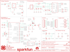

Contents
========

* [PRS13711 > Sparkfun](#prs13711--sparkfun)
	* [Schematic](#schematic)
	* [Interactive BOM](#interactive-bom)
	* [OOMP Parts](#oomp-parts)
	* [Images](#images)
	* [Tags](#tags)
  
![][im]
# PRS13711 > Sparkfun

- ID: PROJ-SPAR-13711-STAN-01
- Hex ID: PRS13711
- Name: Sparkfun
- Description: Sparkfun
- Long Link: [http://oom.lt/PROJ-SPAR-13711-STAN-01](http://oom.lt/PROJ-SPAR-13711-STAN-01)
- Short Link: [http://oom.lt/PRS13711](http://oom.lt/PRS13711)

## Schematic
  

## Interactive BOM

- Interactive BOM page: [ibom.html](https://htmlpreview.github.io/?https://github.com/oomlout/oomlout_OOMP_projects/blob/main/PROJ-SPAR-13711-STAN-01/kicad/bom/ibom.html)

## OOMP Parts
  

|OOMP Parts|
| :---: |
|C1,UNMATCHED-UNMATCHED-UNMATCHED-UNMATCHED-UNMATCHED,C1,10uF,10UF-0603-6.3V-20%,0603,10.0µF ceramic capacitors,CAP-11015,,,,10uF,|
|C2,UNMATCHED-UNMATCHED-UNMATCHED-UNMATCHED-UNMATCHED,C2,0.1uF,0.1UF-0603-25V-(+80/-20%),0603,0.1µF ceramic capacitors,CAP-00810,,,,0.1uF,|
|C3,UNMATCHED-UNMATCHED-UNMATCHED-UNMATCHED-UNMATCHED,C3,10pF,10PF-0603-50V-5%,0603,10pF ceramic capacitors,CAP-11812,,,,10pF,|
|C4,UNMATCHED-UNMATCHED-UNMATCHED-UNMATCHED-UNMATCHED,C4,10pF,10PF-0603-50V-5%,0603,10pF ceramic capacitors,CAP-11812,,,,10pF,|
|C5,UNMATCHED-UNMATCHED-UNMATCHED-UNMATCHED-UNMATCHED,C5,1.0uF,1.0UF-0805-25V-(+80/-20%),0805,1µF ceramic capacitors,CAP-11625,,,,1.0uF,|
|C6,UNMATCHED-UNMATCHED-UNMATCHED-UNMATCHED-UNMATCHED,C6,2.2uF,2.2UF-0603-10V-20%,0603,2.2µF ceramic capacitors,CAP-07888,,,,2.2uF,|
|C7,UNMATCHED-UNMATCHED-UNMATCHED-UNMATCHED-UNMATCHED,C7,5.6PF,5.6PF-0603-50V-5%,0603,5.6pF ceramic capacitors,CAP-12456,,,,5.6PF,|
|C8,UNMATCHED-UNMATCHED-UNMATCHED-UNMATCHED-UNMATCHED,C8,0.1uF,0.1UF-0603-25V-(+80/-20%),0603,0.1µF ceramic capacitors,CAP-00810,,,,0.1uF,|
|C9,UNMATCHED-UNMATCHED-UNMATCHED-UNMATCHED-UNMATCHED,C9,47pF,47PF-0603-50V-5%,0603,47pF ceramic capacitors,CAP-08913,,,,47pF,|
|C10,UNMATCHED-UNMATCHED-UNMATCHED-UNMATCHED-UNMATCHED,C10,0.1uF,0.1UF-0603-25V-(+80/-20%),0603,0.1µF ceramic capacitors,CAP-00810,,,,0.1uF,|
|C11,UNMATCHED-UNMATCHED-UNMATCHED-UNMATCHED-UNMATCHED,C11,47pF,47PF-0603-50V-5%,0603,47pF ceramic capacitors,CAP-08913,,,,47pF,|
|C12,UNMATCHED-UNMATCHED-UNMATCHED-UNMATCHED-UNMATCHED,C12,0.1uF,0.1UF-0603-25V-(+80/-20%),0603,0.1µF ceramic capacitors,CAP-00810,,,,0.1uF,|
|C13,UNMATCHED-UNMATCHED-UNMATCHED-UNMATCHED-UNMATCHED,C13,10uF,10UF-POLAR-EIA3216-16V-10%(TANT),EIA3216,10.0µF polarized capacitors,CAP-00811,,,,10uF,|
|C14,UNMATCHED-UNMATCHED-UNMATCHED-UNMATCHED-UNMATCHED,C14,0.1uF,0.1UF-0603-25V-(+80/-20%),0603,0.1µF ceramic capacitors,CAP-00810,,,,0.1uF,|
|D1,UNMATCHED-UNMATCHED-UNMATCHED-UNMATCHED-UNMATCHED,D1,1A/23V/620mV,DIODE-SCHOTTKY-BAT20J,SOD-323,Schottky diode,DIO-11623,,,,1A/23V/620mV,|
|D2,UNMATCHED-UNMATCHED-UNMATCHED-UNMATCHED-UNMATCHED,D2,RED,LED-RED0603,LED-0603,Red SMD LED,DIO-00819,,,,RED,|
|D3,UNMATCHED-UNMATCHED-UNMATCHED-UNMATCHED-UNMATCHED,D3,BLUE,LED-BLUE0603,LED-0603,Blue SMD LED,DIO-08575,,,,BLUE,|
|D4,UNMATCHED-UNMATCHED-UNMATCHED-UNMATCHED-UNMATCHED,D4,Yellow,LED-YELLOW0603,LED-0603,Yellow SMD LED,DIO-09003,,,,Yellow,|
|D5,UNMATCHED-UNMATCHED-UNMATCHED-UNMATCHED-UNMATCHED,D5,GREEN,LED-GREEN0603,LED-0603,Green SMD LED,DIO-00821,,,,GREEN,|
|E1,UNMATCHED-UNMATCHED-UNMATCHED-UNMATCHED-UNMATCHED,E1,,ANTENNA-GROUNDEDTRACE-25.7MM,TRACE_ANTENNA_2.4GHZ_25.7MM,Antenna w/ Ground Connection,,,,,,|
|F1,UNMATCHED-UNMATCHED-UNMATCHED-UNMATCHED-UNMATCHED,F1,500mA,PTCSMD,PTC-1206,Resettable Fuse PTC,RES-11150,,,,,|
|FRAME1,UNMATCHED-UNMATCHED-UNMATCHED-UNMATCHED-UNMATCHED,FID1,FIDUCIAL1X2,FIDUCIAL1X2,FIDUCIAL-1X2,Fiducial Alignment Points,,,,,,|
|J1,UNMATCHED-UNMATCHED-UNMATCHED-UNMATCHED-UNMATCHED,FID2,FIDUCIAL1X2,FIDUCIAL1X2,FIDUCIAL-1X2,Fiducial Alignment Points,,,,,,|
|J2,UNMATCHED-UNMATCHED-UNMATCHED-UNMATCHED-UNMATCHED,FRAME1,FRAME-LETTER,FRAME-LETTER,CREATIVE_COMMONS,Schematic Frame - Letter,,,,,,|
|JP2,UNMATCHED-UNMATCHED-UNMATCHED-UNMATCHED-UNMATCHED,J1,U.FL,U.FL,U.FL,SMD Antenna Connector - U.FL,CONN-09193,WRL-09144,,,U.FL,|
|JP3,UNMATCHED-UNMATCHED-UNMATCHED-UNMATCHED-UNMATCHED,J2,,USB_MICROB_PLUGCONN-11752,USB-B-MICRO-SMD_V03,USB Micro-B connectors,CONN-11752,,,,,|
|JP4,UNMATCHED-UNMATCHED-UNMATCHED-UNMATCHED-UNMATCHED,JP2,,CONN_10LOCK_NS,1X10_LOCK_NS,Multi connection point. Often used as Generic Header-pin footprint for 0.1 inch spaced/style header connections,,,,,,|
|JP5,UNMATCHED-UNMATCHED-UNMATCHED-UNMATCHED-UNMATCHED,JP3,,CONN_10LOCK_NS,1X10_LOCK_NS,Multi connection point. Often used as Generic Header-pin footprint for 0.1 inch spaced/style header connections,,,,,,|
|JP6,UNMATCHED-UNMATCHED-UNMATCHED-UNMATCHED-UNMATCHED,JP4,,CONN_02JST-PTH-2,JST-2-PTH,Multi connection point. Often used as Generic Header-pin footprint for 0.1 inch spaced/style header connections,CONN-09863,,,PRT-09914,,|
|L1,UNMATCHED-UNMATCHED-UNMATCHED-UNMATCHED-UNMATCHED,JP5,,CONN_021X02_NO_SILK,1X02_NO_SILK,Multi connection point. Often used as Generic Header-pin footprint for 0.1 inch spaced/style header connections,,,,,,|
|L2,UNMATCHED-UNMATCHED-UNMATCHED-UNMATCHED-UNMATCHED,JP6,,CONN_023.5MM-NO_SILK,SCREWTERMINAL-3.5MM-2-NS,Multi connection point. Often used as Generic Header-pin footprint for 0.1 inch spaced/style header connections,CONN-08399,,,,,|
|LOGO1,UNMATCHED-UNMATCHED-UNMATCHED-UNMATCHED-UNMATCHED,L1,DNP,INDUCTOR0603,0603,Inductors,,,,,,|
|LOGO2,UNMATCHED-UNMATCHED-UNMATCHED-UNMATCHED-UNMATCHED,L2,DNP,INDUCTOR0603,0603,Inductors,,,,,,|
|Q1,UNMATCHED-UNMATCHED-UNMATCHED-UNMATCHED-UNMATCHED,LOGO1,SFE_LOGO_NAME.2_INCH,SFE_LOGO_NAME.2_INCH,SFE_LOGO_NAME_.2,SparkFun Font Logo,,,,,,|
|Q2,UNMATCHED-UNMATCHED-UNMATCHED-UNMATCHED-UNMATCHED,LOGO2,OSHW-LOGOS,OSHW-LOGOS,OSHW-LOGO-S,Open-Source Hardware (OSHW) Logo,,,,,,|
|R1,UNMATCHED-UNMATCHED-UNMATCHED-UNMATCHED-UNMATCHED,Q1,600mA/40V,TRANS_NPN-MMBT2222AL,SOT23-3,NPN transistor,TRANS-08049,,,,600mA/40V,|
|R2,UNMATCHED-UNMATCHED-UNMATCHED-UNMATCHED-UNMATCHED,Q2,600mA/40V,TRANS_NPN-MMBT2222AL,SOT23-3,NPN transistor,TRANS-08049,,,,600mA/40V,|
|R3,UNMATCHED-UNMATCHED-UNMATCHED-UNMATCHED-UNMATCHED,R1,12k,12KOHM-0603-1/10W-1%,0603,12kΩ resistor,RES-10327,,,,12k,|
|R4,UNMATCHED-UNMATCHED-UNMATCHED-UNMATCHED-UNMATCHED,R2,10k,10KOHM-0603-1/10W-1%,0603,10kΩ resistor,RES-00824,,,,10k,|
|R5,UNMATCHED-UNMATCHED-UNMATCHED-UNMATCHED-UNMATCHED,R3,200,200OHM-0603-1/10W-1%,0603,200Ω resistor,RES-08220,,,,200,|
|R6,UNMATCHED-UNMATCHED-UNMATCHED-UNMATCHED-UNMATCHED,R4,200,200OHM-0603-1/10W-1%,0603,200Ω resistor,RES-08220,,,,200,|
|R7,UNMATCHED-UNMATCHED-UNMATCHED-UNMATCHED-UNMATCHED,R5,10k,10KOHM-0603-1/10W-1%,0603,10kΩ resistor,RES-00824,,,,10k,|
|R8,UNMATCHED-UNMATCHED-UNMATCHED-UNMATCHED-UNMATCHED,R6,200,200OHM-0603-1/10W-1%,0603,200Ω resistor,RES-08220,,,,200,|
|R9,UNMATCHED-UNMATCHED-UNMATCHED-UNMATCHED-UNMATCHED,R7,27,27OHM-0603-1/10W-1%,0603,27Ω resistor,RES-09334,,,,27,|
|R10,UNMATCHED-UNMATCHED-UNMATCHED-UNMATCHED-UNMATCHED,R8,27,27OHM-0603-1/10W-1%,0603,27Ω resistor,RES-09334,,,,27,|
|R11,UNMATCHED-UNMATCHED-UNMATCHED-UNMATCHED-UNMATCHED,R9,10k,10KOHM-0603-1/10W-1%,0603,10kΩ resistor,RES-00824,,,,10k,|
|R12,UNMATCHED-UNMATCHED-UNMATCHED-UNMATCHED-UNMATCHED,R10,10k,10KOHM-0603-1/10W-1%,0603,10kΩ resistor,RES-00824,,,,10k,|
|R13,UNMATCHED-UNMATCHED-UNMATCHED-UNMATCHED-UNMATCHED,R11,10k,10KOHM-0603-1/10W-1%,0603,10kΩ resistor,RES-00824,,,,10k,|
|R14,UNMATCHED-UNMATCHED-UNMATCHED-UNMATCHED-UNMATCHED,R12,1k,1KOHM-0603-1/10W-1%,0603,1kΩ resistor,RES-07856,,,,1k,|
|R15,UNMATCHED-UNMATCHED-UNMATCHED-UNMATCHED-UNMATCHED,R13,1k,1KOHM-0603-1/10W-1%,0603,1kΩ resistor,RES-07856,,,,1k,|
|R16,UNMATCHED-UNMATCHED-UNMATCHED-UNMATCHED-UNMATCHED,R14,10k,10KOHM-0603-1/10W-1%,0603,10kΩ resistor,RES-00824,,,,10k,|
|R17,UNMATCHED-UNMATCHED-UNMATCHED-UNMATCHED-UNMATCHED,R15,1k,1KOHM-0603-1/10W-1%,0603,1kΩ resistor,RES-07856,,,,1k,|
|S1,UNMATCHED-UNMATCHED-UNMATCHED-UNMATCHED-UNMATCHED,R16,1k,1KOHM-0603-1/10W-1%,0603,1kΩ resistor,RES-07856,,,,1k,|
|SJ1,UNMATCHED-UNMATCHED-UNMATCHED-UNMATCHED-UNMATCHED,R17,10k,10KOHM-0603-1/10W-1%,0603,10kΩ resistor,RES-00824,,,,10k,|
|SJ2,UNMATCHED-UNMATCHED-UNMATCHED-UNMATCHED-UNMATCHED,S1,,SWITCH-SPDT-SMD-RIGHT-ANGLE,SWITCH_SPST_SMD_A,Single Pole, Double Throw (SPDT) Switch,SWCH-10651,,COM-10860,,,|
|SJ3,UNMATCHED-UNMATCHED-UNMATCHED-UNMATCHED-UNMATCHED,SJ1,PWRLED,JUMPER-PAD-2-NC_BY_TRACE,PAD-JUMPER-2-NC_BY_TRACE_YES_SILK,,,,,,,|
|SJ4,UNMATCHED-UNMATCHED-UNMATCHED-UNMATCHED-UNMATCHED,SJ2,SLEEP-PTH,JUMPER-PTH-2-NO,PTH-JUMPER-2-NO_NO_SILK,,,,,,,|
|STANDOFF1,UNMATCHED-UNMATCHED-UNMATCHED-UNMATCHED-UNMATCHED,SJ3,TRACE,JUMPER-PAD-2-NC_BY_PASTENO-SILK,PAD-JUMPER-2-NC_BY_PASTE_NO_SILK,,,,,,,|
|STANDOFF2,UNMATCHED-UNMATCHED-UNMATCHED-UNMATCHED-UNMATCHED,SJ4,U.FL,JUMPER-PAD-2-NO,PAD-JUMPER-2-NO_NO_SILK,,,,,,,|
|STANDOFF3,UNMATCHED-UNMATCHED-UNMATCHED-UNMATCHED-UNMATCHED,STANDOFF1,STAND-OFF,STAND-OFF,STAND-OFF,Stand Off,,,,,,|
|STANDOFF4,UNMATCHED-UNMATCHED-UNMATCHED-UNMATCHED-UNMATCHED,STANDOFF2,STAND-OFF,STAND-OFF,STAND-OFF,Stand Off,,,,,,|
|U$1,UNMATCHED-UNMATCHED-UNMATCHED-UNMATCHED-UNMATCHED,STANDOFF3,STAND-OFF,STAND-OFF,STAND-OFF,Stand Off,,,,,,|
|U$2,UNMATCHED-UNMATCHED-UNMATCHED-UNMATCHED-UNMATCHED,STANDOFF4,STAND-OFF,STAND-OFF,STAND-OFF,Stand Off,,,,,,|
|U1,UNMATCHED-UNMATCHED-UNMATCHED-UNMATCHED-UNMATCHED,U$1,4H-NYSD-LOGO-1.35IN,4H-NYSD-LOGO-1.35IN,4H-1.35IN_WIDE,4-H National Youth Science Day Logo,,,,,,|
|U2,UNMATCHED-UNMATCHED-UNMATCHED-UNMATCHED-UNMATCHED,U$2,SPECIAL_INSTRUCTIONS-ORDERING,SPECIAL_INSTRUCTIONS-ORDERING,ORDERING_INSTRUCTIONS,Special Ordering/Production Instructions Alert,,,,,,|
|U3,UNMATCHED-UNMATCHED-UNMATCHED-UNMATCHED-UNMATCHED,U1,AP2112K-3.3V,V_REG_LDOSMD,SOT23-5,Voltage Regulator LDO,VREG-12457,,,,,|
|U4,UNMATCHED-UNMATCHED-UNMATCHED-UNMATCHED-UNMATCHED,U2,ESP8266,ESP8266,QFN32-5X5MM,Espressif ESP8266 WiFi/Microcontroller SoC,IC-12452,,,,,|
|Y1,UNMATCHED-UNMATCHED-UNMATCHED-UNMATCHED-UNMATCHED,U3,AT25SF041-SOIC8,AT25SF041-SOIC8,SO08,SPI Serial Flash Memory with Dual/Quad-IO Support,IC-12455,,,,,|

## Images
  
  

|kicadPcb3d|kicadPcb3dFront|kicadPcb3dBack|eagleImage|eagleSchemImage|
| :---: | :---: | :---: | :---: | :---: |
||||||

## Tags

- hexID: PRS13711
- oompType: PROJ
- oompSize: SPAR
- oompColor: 13711
- oompDesc: STAN
- oompIndex: 01
- oompName: ESP8266 Thing Dev 4H
- sources: All source files from https://github.com/sparkfun/ESP8266_Thing_Dev_4H (source licence details in srcLicense.md)
- linkBuyPage: https://www.sparkfun.com/products/13711
- oompID: PROJ-SPAR-13711-STAN-01
- oompParts: C1,UNMATCHED-UNMATCHED-UNMATCHED-UNMATCHED-UNMATCHED
- oompParts: C2,UNMATCHED-UNMATCHED-UNMATCHED-UNMATCHED-UNMATCHED
- oompParts: C3,UNMATCHED-UNMATCHED-UNMATCHED-UNMATCHED-UNMATCHED
- oompParts: C4,UNMATCHED-UNMATCHED-UNMATCHED-UNMATCHED-UNMATCHED
- oompParts: C5,UNMATCHED-UNMATCHED-UNMATCHED-UNMATCHED-UNMATCHED
- oompParts: C6,UNMATCHED-UNMATCHED-UNMATCHED-UNMATCHED-UNMATCHED
- oompParts: C7,UNMATCHED-UNMATCHED-UNMATCHED-UNMATCHED-UNMATCHED
- oompParts: C8,UNMATCHED-UNMATCHED-UNMATCHED-UNMATCHED-UNMATCHED
- oompParts: C9,UNMATCHED-UNMATCHED-UNMATCHED-UNMATCHED-UNMATCHED
- oompParts: C10,UNMATCHED-UNMATCHED-UNMATCHED-UNMATCHED-UNMATCHED
- oompParts: C11,UNMATCHED-UNMATCHED-UNMATCHED-UNMATCHED-UNMATCHED
- oompParts: C12,UNMATCHED-UNMATCHED-UNMATCHED-UNMATCHED-UNMATCHED
- oompParts: C13,UNMATCHED-UNMATCHED-UNMATCHED-UNMATCHED-UNMATCHED
- oompParts: C14,UNMATCHED-UNMATCHED-UNMATCHED-UNMATCHED-UNMATCHED
- oompParts: D1,UNMATCHED-UNMATCHED-UNMATCHED-UNMATCHED-UNMATCHED
- oompParts: D2,UNMATCHED-UNMATCHED-UNMATCHED-UNMATCHED-UNMATCHED
- oompParts: D3,UNMATCHED-UNMATCHED-UNMATCHED-UNMATCHED-UNMATCHED
- oompParts: D4,UNMATCHED-UNMATCHED-UNMATCHED-UNMATCHED-UNMATCHED
- oompParts: D5,UNMATCHED-UNMATCHED-UNMATCHED-UNMATCHED-UNMATCHED
- oompParts: E1,UNMATCHED-UNMATCHED-UNMATCHED-UNMATCHED-UNMATCHED
- oompParts: F1,UNMATCHED-UNMATCHED-UNMATCHED-UNMATCHED-UNMATCHED
- oompParts: FRAME1,UNMATCHED-UNMATCHED-UNMATCHED-UNMATCHED-UNMATCHED
- oompParts: J1,UNMATCHED-UNMATCHED-UNMATCHED-UNMATCHED-UNMATCHED
- oompParts: J2,UNMATCHED-UNMATCHED-UNMATCHED-UNMATCHED-UNMATCHED
- oompParts: JP2,UNMATCHED-UNMATCHED-UNMATCHED-UNMATCHED-UNMATCHED
- oompParts: JP3,UNMATCHED-UNMATCHED-UNMATCHED-UNMATCHED-UNMATCHED
- oompParts: JP4,UNMATCHED-UNMATCHED-UNMATCHED-UNMATCHED-UNMATCHED
- oompParts: JP5,UNMATCHED-UNMATCHED-UNMATCHED-UNMATCHED-UNMATCHED
- oompParts: JP6,UNMATCHED-UNMATCHED-UNMATCHED-UNMATCHED-UNMATCHED
- oompParts: L1,UNMATCHED-UNMATCHED-UNMATCHED-UNMATCHED-UNMATCHED
- oompParts: L2,UNMATCHED-UNMATCHED-UNMATCHED-UNMATCHED-UNMATCHED
- oompParts: LOGO1,UNMATCHED-UNMATCHED-UNMATCHED-UNMATCHED-UNMATCHED
- oompParts: LOGO2,UNMATCHED-UNMATCHED-UNMATCHED-UNMATCHED-UNMATCHED
- oompParts: Q1,UNMATCHED-UNMATCHED-UNMATCHED-UNMATCHED-UNMATCHED
- oompParts: Q2,UNMATCHED-UNMATCHED-UNMATCHED-UNMATCHED-UNMATCHED
- oompParts: R1,UNMATCHED-UNMATCHED-UNMATCHED-UNMATCHED-UNMATCHED
- oompParts: R2,UNMATCHED-UNMATCHED-UNMATCHED-UNMATCHED-UNMATCHED
- oompParts: R3,UNMATCHED-UNMATCHED-UNMATCHED-UNMATCHED-UNMATCHED
- oompParts: R4,UNMATCHED-UNMATCHED-UNMATCHED-UNMATCHED-UNMATCHED
- oompParts: R5,UNMATCHED-UNMATCHED-UNMATCHED-UNMATCHED-UNMATCHED
- oompParts: R6,UNMATCHED-UNMATCHED-UNMATCHED-UNMATCHED-UNMATCHED
- oompParts: R7,UNMATCHED-UNMATCHED-UNMATCHED-UNMATCHED-UNMATCHED
- oompParts: R8,UNMATCHED-UNMATCHED-UNMATCHED-UNMATCHED-UNMATCHED
- oompParts: R9,UNMATCHED-UNMATCHED-UNMATCHED-UNMATCHED-UNMATCHED
- oompParts: R10,UNMATCHED-UNMATCHED-UNMATCHED-UNMATCHED-UNMATCHED
- oompParts: R11,UNMATCHED-UNMATCHED-UNMATCHED-UNMATCHED-UNMATCHED
- oompParts: R12,UNMATCHED-UNMATCHED-UNMATCHED-UNMATCHED-UNMATCHED
- oompParts: R13,UNMATCHED-UNMATCHED-UNMATCHED-UNMATCHED-UNMATCHED
- oompParts: R14,UNMATCHED-UNMATCHED-UNMATCHED-UNMATCHED-UNMATCHED
- oompParts: R15,UNMATCHED-UNMATCHED-UNMATCHED-UNMATCHED-UNMATCHED
- oompParts: R16,UNMATCHED-UNMATCHED-UNMATCHED-UNMATCHED-UNMATCHED
- oompParts: R17,UNMATCHED-UNMATCHED-UNMATCHED-UNMATCHED-UNMATCHED
- oompParts: S1,UNMATCHED-UNMATCHED-UNMATCHED-UNMATCHED-UNMATCHED
- oompParts: SJ1,UNMATCHED-UNMATCHED-UNMATCHED-UNMATCHED-UNMATCHED
- oompParts: SJ2,UNMATCHED-UNMATCHED-UNMATCHED-UNMATCHED-UNMATCHED
- oompParts: SJ3,UNMATCHED-UNMATCHED-UNMATCHED-UNMATCHED-UNMATCHED
- oompParts: SJ4,UNMATCHED-UNMATCHED-UNMATCHED-UNMATCHED-UNMATCHED
- oompParts: STANDOFF1,UNMATCHED-UNMATCHED-UNMATCHED-UNMATCHED-UNMATCHED
- oompParts: STANDOFF2,UNMATCHED-UNMATCHED-UNMATCHED-UNMATCHED-UNMATCHED
- oompParts: STANDOFF3,UNMATCHED-UNMATCHED-UNMATCHED-UNMATCHED-UNMATCHED
- oompParts: STANDOFF4,UNMATCHED-UNMATCHED-UNMATCHED-UNMATCHED-UNMATCHED
- oompParts: U$1,UNMATCHED-UNMATCHED-UNMATCHED-UNMATCHED-UNMATCHED
- oompParts: U$2,UNMATCHED-UNMATCHED-UNMATCHED-UNMATCHED-UNMATCHED
- oompParts: U1,UNMATCHED-UNMATCHED-UNMATCHED-UNMATCHED-UNMATCHED
- oompParts: U2,UNMATCHED-UNMATCHED-UNMATCHED-UNMATCHED-UNMATCHED
- oompParts: U3,UNMATCHED-UNMATCHED-UNMATCHED-UNMATCHED-UNMATCHED
- oompParts: U4,UNMATCHED-UNMATCHED-UNMATCHED-UNMATCHED-UNMATCHED
- oompParts: Y1,UNMATCHED-UNMATCHED-UNMATCHED-UNMATCHED-UNMATCHED
- rawParts: C1,10uF,10UF-0603-6.3V-20%,0603,10.0µF ceramic capacitors,CAP-11015,,,,10uF,
- rawParts: C2,0.1uF,0.1UF-0603-25V-(+80/-20%),0603,0.1µF ceramic capacitors,CAP-00810,,,,0.1uF,
- rawParts: C3,10pF,10PF-0603-50V-5%,0603,10pF ceramic capacitors,CAP-11812,,,,10pF,
- rawParts: C4,10pF,10PF-0603-50V-5%,0603,10pF ceramic capacitors,CAP-11812,,,,10pF,
- rawParts: C5,1.0uF,1.0UF-0805-25V-(+80/-20%),0805,1µF ceramic capacitors,CAP-11625,,,,1.0uF,
- rawParts: C6,2.2uF,2.2UF-0603-10V-20%,0603,2.2µF ceramic capacitors,CAP-07888,,,,2.2uF,
- rawParts: C7,5.6PF,5.6PF-0603-50V-5%,0603,5.6pF ceramic capacitors,CAP-12456,,,,5.6PF,
- rawParts: C8,0.1uF,0.1UF-0603-25V-(+80/-20%),0603,0.1µF ceramic capacitors,CAP-00810,,,,0.1uF,
- rawParts: C9,47pF,47PF-0603-50V-5%,0603,47pF ceramic capacitors,CAP-08913,,,,47pF,
- rawParts: C10,0.1uF,0.1UF-0603-25V-(+80/-20%),0603,0.1µF ceramic capacitors,CAP-00810,,,,0.1uF,
- rawParts: C11,47pF,47PF-0603-50V-5%,0603,47pF ceramic capacitors,CAP-08913,,,,47pF,
- rawParts: C12,0.1uF,0.1UF-0603-25V-(+80/-20%),0603,0.1µF ceramic capacitors,CAP-00810,,,,0.1uF,
- rawParts: C13,10uF,10UF-POLAR-EIA3216-16V-10%(TANT),EIA3216,10.0µF polarized capacitors,CAP-00811,,,,10uF,
- rawParts: C14,0.1uF,0.1UF-0603-25V-(+80/-20%),0603,0.1µF ceramic capacitors,CAP-00810,,,,0.1uF,
- rawParts: D1,1A/23V/620mV,DIODE-SCHOTTKY-BAT20J,SOD-323,Schottky diode,DIO-11623,,,,1A/23V/620mV,
- rawParts: D2,RED,LED-RED0603,LED-0603,Red SMD LED,DIO-00819,,,,RED,
- rawParts: D3,BLUE,LED-BLUE0603,LED-0603,Blue SMD LED,DIO-08575,,,,BLUE,
- rawParts: D4,Yellow,LED-YELLOW0603,LED-0603,Yellow SMD LED,DIO-09003,,,,Yellow,
- rawParts: D5,GREEN,LED-GREEN0603,LED-0603,Green SMD LED,DIO-00821,,,,GREEN,
- rawParts: E1,,ANTENNA-GROUNDEDTRACE-25.7MM,TRACE_ANTENNA_2.4GHZ_25.7MM,Antenna w/ Ground Connection,,,,,,
- rawParts: F1,500mA,PTCSMD,PTC-1206,Resettable Fuse PTC,RES-11150,,,,,
- rawParts: FID1,FIDUCIAL1X2,FIDUCIAL1X2,FIDUCIAL-1X2,Fiducial Alignment Points,,,,,,
- rawParts: FID2,FIDUCIAL1X2,FIDUCIAL1X2,FIDUCIAL-1X2,Fiducial Alignment Points,,,,,,
- rawParts: FRAME1,FRAME-LETTER,FRAME-LETTER,CREATIVE_COMMONS,Schematic Frame - Letter,,,,,,
- rawParts: J1,U.FL,U.FL,U.FL,SMD Antenna Connector - U.FL,CONN-09193,WRL-09144,,,U.FL,
- rawParts: J2,,USB_MICROB_PLUGCONN-11752,USB-B-MICRO-SMD_V03,USB Micro-B connectors,CONN-11752,,,,,
- rawParts: JP2,,CONN_10LOCK_NS,1X10_LOCK_NS,Multi connection point. Often used as Generic Header-pin footprint for 0.1 inch spaced/style header connections,,,,,,
- rawParts: JP3,,CONN_10LOCK_NS,1X10_LOCK_NS,Multi connection point. Often used as Generic Header-pin footprint for 0.1 inch spaced/style header connections,,,,,,
- rawParts: JP4,,CONN_02JST-PTH-2,JST-2-PTH,Multi connection point. Often used as Generic Header-pin footprint for 0.1 inch spaced/style header connections,CONN-09863,,,PRT-09914,,
- rawParts: JP5,,CONN_021X02_NO_SILK,1X02_NO_SILK,Multi connection point. Often used as Generic Header-pin footprint for 0.1 inch spaced/style header connections,,,,,,
- rawParts: JP6,,CONN_023.5MM-NO_SILK,SCREWTERMINAL-3.5MM-2-NS,Multi connection point. Often used as Generic Header-pin footprint for 0.1 inch spaced/style header connections,CONN-08399,,,,,
- rawParts: L1,DNP,INDUCTOR0603,0603,Inductors,,,,,,
- rawParts: L2,DNP,INDUCTOR0603,0603,Inductors,,,,,,
- rawParts: LOGO1,SFE_LOGO_NAME.2_INCH,SFE_LOGO_NAME.2_INCH,SFE_LOGO_NAME_.2,SparkFun Font Logo,,,,,,
- rawParts: LOGO2,OSHW-LOGOS,OSHW-LOGOS,OSHW-LOGO-S,Open-Source Hardware (OSHW) Logo,,,,,,
- rawParts: Q1,600mA/40V,TRANS_NPN-MMBT2222AL,SOT23-3,NPN transistor,TRANS-08049,,,,600mA/40V,
- rawParts: Q2,600mA/40V,TRANS_NPN-MMBT2222AL,SOT23-3,NPN transistor,TRANS-08049,,,,600mA/40V,
- rawParts: R1,12k,12KOHM-0603-1/10W-1%,0603,12kΩ resistor,RES-10327,,,,12k,
- rawParts: R2,10k,10KOHM-0603-1/10W-1%,0603,10kΩ resistor,RES-00824,,,,10k,
- rawParts: R3,200,200OHM-0603-1/10W-1%,0603,200Ω resistor,RES-08220,,,,200,
- rawParts: R4,200,200OHM-0603-1/10W-1%,0603,200Ω resistor,RES-08220,,,,200,
- rawParts: R5,10k,10KOHM-0603-1/10W-1%,0603,10kΩ resistor,RES-00824,,,,10k,
- rawParts: R6,200,200OHM-0603-1/10W-1%,0603,200Ω resistor,RES-08220,,,,200,
- rawParts: R7,27,27OHM-0603-1/10W-1%,0603,27Ω resistor,RES-09334,,,,27,
- rawParts: R8,27,27OHM-0603-1/10W-1%,0603,27Ω resistor,RES-09334,,,,27,
- rawParts: R9,10k,10KOHM-0603-1/10W-1%,0603,10kΩ resistor,RES-00824,,,,10k,
- rawParts: R10,10k,10KOHM-0603-1/10W-1%,0603,10kΩ resistor,RES-00824,,,,10k,
- rawParts: R11,10k,10KOHM-0603-1/10W-1%,0603,10kΩ resistor,RES-00824,,,,10k,
- rawParts: R12,1k,1KOHM-0603-1/10W-1%,0603,1kΩ resistor,RES-07856,,,,1k,
- rawParts: R13,1k,1KOHM-0603-1/10W-1%,0603,1kΩ resistor,RES-07856,,,,1k,
- rawParts: R14,10k,10KOHM-0603-1/10W-1%,0603,10kΩ resistor,RES-00824,,,,10k,
- rawParts: R15,1k,1KOHM-0603-1/10W-1%,0603,1kΩ resistor,RES-07856,,,,1k,
- rawParts: R16,1k,1KOHM-0603-1/10W-1%,0603,1kΩ resistor,RES-07856,,,,1k,
- rawParts: R17,10k,10KOHM-0603-1/10W-1%,0603,10kΩ resistor,RES-00824,,,,10k,
- rawParts: S1,,SWITCH-SPDT-SMD-RIGHT-ANGLE,SWITCH_SPST_SMD_A,Single Pole, Double Throw (SPDT) Switch,SWCH-10651,,COM-10860,,,
- rawParts: SJ1,PWRLED,JUMPER-PAD-2-NC_BY_TRACE,PAD-JUMPER-2-NC_BY_TRACE_YES_SILK,,,,,,,
- rawParts: SJ2,SLEEP-PTH,JUMPER-PTH-2-NO,PTH-JUMPER-2-NO_NO_SILK,,,,,,,
- rawParts: SJ3,TRACE,JUMPER-PAD-2-NC_BY_PASTENO-SILK,PAD-JUMPER-2-NC_BY_PASTE_NO_SILK,,,,,,,
- rawParts: SJ4,U.FL,JUMPER-PAD-2-NO,PAD-JUMPER-2-NO_NO_SILK,,,,,,,
- rawParts: STANDOFF1,STAND-OFF,STAND-OFF,STAND-OFF,Stand Off,,,,,,
- rawParts: STANDOFF2,STAND-OFF,STAND-OFF,STAND-OFF,Stand Off,,,,,,
- rawParts: STANDOFF3,STAND-OFF,STAND-OFF,STAND-OFF,Stand Off,,,,,,
- rawParts: STANDOFF4,STAND-OFF,STAND-OFF,STAND-OFF,Stand Off,,,,,,
- rawParts: U$1,4H-NYSD-LOGO-1.35IN,4H-NYSD-LOGO-1.35IN,4H-1.35IN_WIDE,4-H National Youth Science Day Logo,,,,,,
- rawParts: U$2,SPECIAL_INSTRUCTIONS-ORDERING,SPECIAL_INSTRUCTIONS-ORDERING,ORDERING_INSTRUCTIONS,Special Ordering/Production Instructions Alert,,,,,,
- rawParts: U1,AP2112K-3.3V,V_REG_LDOSMD,SOT23-5,Voltage Regulator LDO,VREG-12457,,,,,
- rawParts: U2,ESP8266,ESP8266,QFN32-5X5MM,Espressif ESP8266 WiFi/Microcontroller SoC,IC-12452,,,,,
- rawParts: U3,AT25SF041-SOIC8,AT25SF041-SOIC8,SO08,SPI Serial Flash Memory with Dual/Quad-IO Support,IC-12455,,,,,
- rawParts: U4,FTS31XS-U,FT231XS,SSOP20_L,FTDI FT231X Full Speed USB to Full-handshake UART,IC-11524,,,,FTS31XS-U,
- rawParts: Y1,26MHz,CRYSTAL-GROUNDED3.2X2.5,CRYSTAL-SMD-3.2X2.5,,XTAL-12454,,,,,

[im]: kicadPcb3d_450.png
