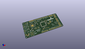
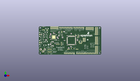
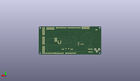
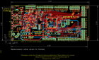
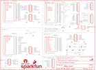

Contents
========

* [PRS13714 > Sparkfun](#prs13714--sparkfun)
	* [Images](#images)
	* [Tags](#tags)
  
![][im]
# PRS13714 > Sparkfun

- ID: PROJ-SPAR-13714-STAN-01
- Hex ID: PRS13714
- Name: Sparkfun
- Description: Sparkfun

## Images
  
  

|kicadPcb3d|kicadPcb3dFront|kicadPcb3dBack|eagleImage|eagleSchemImage|
| :---: | :---: | :---: | :---: | :---: |
||||||

## Tags

- hexID: PRS13714
- oompType: PROJ
- oompSize: SPAR
- oompColor: 13714
- oompDesc: STAN
- oompIndex: 01
- oompName: FreeSoc2
- sources: All source files from https://github.com/sparkfun/FreeSoc2 (source licence details in srcLicense.md)
- linkBuyPage: https://www.sparkfun.com/products/13714
- oompID: PROJ-SPAR-13714-STAN-01
- oompParts: C1,UNMATCHED-UNMATCHED-UNMATCHED-UNMATCHED-UNMATCHED
- oompParts: C2,UNMATCHED-UNMATCHED-UNMATCHED-UNMATCHED-UNMATCHED
- oompParts: C3,UNMATCHED-UNMATCHED-UNMATCHED-UNMATCHED-UNMATCHED
- oompParts: C4,UNMATCHED-UNMATCHED-UNMATCHED-UNMATCHED-UNMATCHED
- oompParts: C5,UNMATCHED-UNMATCHED-UNMATCHED-UNMATCHED-UNMATCHED
- oompParts: C6,UNMATCHED-UNMATCHED-UNMATCHED-UNMATCHED-UNMATCHED
- oompParts: C7,UNMATCHED-UNMATCHED-UNMATCHED-UNMATCHED-UNMATCHED
- oompParts: C9,UNMATCHED-UNMATCHED-UNMATCHED-UNMATCHED-UNMATCHED
- oompParts: C11,UNMATCHED-UNMATCHED-UNMATCHED-UNMATCHED-UNMATCHED
- oompParts: C12,UNMATCHED-UNMATCHED-UNMATCHED-UNMATCHED-UNMATCHED
- oompParts: C13,UNMATCHED-UNMATCHED-UNMATCHED-UNMATCHED-UNMATCHED
- oompParts: C14,UNMATCHED-UNMATCHED-UNMATCHED-UNMATCHED-UNMATCHED
- oompParts: C15,UNMATCHED-UNMATCHED-UNMATCHED-UNMATCHED-UNMATCHED
- oompParts: C16,UNMATCHED-UNMATCHED-UNMATCHED-UNMATCHED-UNMATCHED
- oompParts: C17,UNMATCHED-UNMATCHED-UNMATCHED-UNMATCHED-UNMATCHED
- oompParts: C18,UNMATCHED-UNMATCHED-UNMATCHED-UNMATCHED-UNMATCHED
- oompParts: C19,UNMATCHED-UNMATCHED-UNMATCHED-UNMATCHED-UNMATCHED
- oompParts: C20,UNMATCHED-UNMATCHED-UNMATCHED-UNMATCHED-UNMATCHED
- oompParts: C21,UNMATCHED-UNMATCHED-UNMATCHED-UNMATCHED-UNMATCHED
- oompParts: C22,UNMATCHED-UNMATCHED-UNMATCHED-UNMATCHED-UNMATCHED
- oompParts: C23,UNMATCHED-UNMATCHED-UNMATCHED-UNMATCHED-UNMATCHED
- oompParts: C24,UNMATCHED-UNMATCHED-UNMATCHED-UNMATCHED-UNMATCHED
- oompParts: C25,UNMATCHED-UNMATCHED-UNMATCHED-UNMATCHED-UNMATCHED
- oompParts: C26,UNMATCHED-UNMATCHED-UNMATCHED-UNMATCHED-UNMATCHED
- oompParts: C27,UNMATCHED-UNMATCHED-UNMATCHED-UNMATCHED-UNMATCHED
- oompParts: C28,UNMATCHED-UNMATCHED-UNMATCHED-UNMATCHED-UNMATCHED
- oompParts: C29,UNMATCHED-UNMATCHED-UNMATCHED-UNMATCHED-UNMATCHED
- oompParts: C30,UNMATCHED-UNMATCHED-UNMATCHED-UNMATCHED-UNMATCHED
- oompParts: C31,UNMATCHED-UNMATCHED-UNMATCHED-UNMATCHED-UNMATCHED
- oompParts: C32,UNMATCHED-UNMATCHED-UNMATCHED-UNMATCHED-UNMATCHED
- oompParts: C33,UNMATCHED-UNMATCHED-UNMATCHED-UNMATCHED-UNMATCHED
- oompParts: C34,UNMATCHED-UNMATCHED-UNMATCHED-UNMATCHED-UNMATCHED
- oompParts: C35,UNMATCHED-UNMATCHED-UNMATCHED-UNMATCHED-UNMATCHED
- oompParts: C36,UNMATCHED-UNMATCHED-UNMATCHED-UNMATCHED-UNMATCHED
- oompParts: C37,UNMATCHED-UNMATCHED-UNMATCHED-UNMATCHED-UNMATCHED
- oompParts: C38,UNMATCHED-UNMATCHED-UNMATCHED-UNMATCHED-UNMATCHED
- oompParts: D1,UNMATCHED-UNMATCHED-UNMATCHED-UNMATCHED-UNMATCHED
- oompParts: D2,UNMATCHED-UNMATCHED-UNMATCHED-UNMATCHED-UNMATCHED
- oompParts: D3,UNMATCHED-UNMATCHED-UNMATCHED-UNMATCHED-UNMATCHED
- oompParts: D4,UNMATCHED-UNMATCHED-UNMATCHED-UNMATCHED-UNMATCHED
- oompParts: D5,UNMATCHED-UNMATCHED-UNMATCHED-UNMATCHED-UNMATCHED
- oompParts: D6,UNMATCHED-UNMATCHED-UNMATCHED-UNMATCHED-UNMATCHED
- oompParts: FRAME1,UNMATCHED-UNMATCHED-UNMATCHED-UNMATCHED-UNMATCHED
- oompParts: FRAME2,UNMATCHED-UNMATCHED-UNMATCHED-UNMATCHED-UNMATCHED
- oompParts: FRAME3,UNMATCHED-UNMATCHED-UNMATCHED-UNMATCHED-UNMATCHED
- oompParts: JP1,UNMATCHED-UNMATCHED-UNMATCHED-UNMATCHED-UNMATCHED
- oompParts: JP2,UNMATCHED-UNMATCHED-UNMATCHED-UNMATCHED-UNMATCHED
- oompParts: JP3,UNMATCHED-UNMATCHED-UNMATCHED-UNMATCHED-UNMATCHED
- oompParts: JP4,UNMATCHED-UNMATCHED-UNMATCHED-UNMATCHED-UNMATCHED
- oompParts: JP5,UNMATCHED-UNMATCHED-UNMATCHED-UNMATCHED-UNMATCHED
- oompParts: JP6,UNMATCHED-UNMATCHED-UNMATCHED-UNMATCHED-UNMATCHED
- oompParts: JP7,UNMATCHED-UNMATCHED-UNMATCHED-UNMATCHED-UNMATCHED
- oompParts: JP8,UNMATCHED-UNMATCHED-UNMATCHED-UNMATCHED-UNMATCHED
- oompParts: JP9,UNMATCHED-UNMATCHED-UNMATCHED-UNMATCHED-UNMATCHED
- oompParts: JP10,UNMATCHED-UNMATCHED-UNMATCHED-UNMATCHED-UNMATCHED
- oompParts: JP11,UNMATCHED-UNMATCHED-UNMATCHED-UNMATCHED-UNMATCHED
- oompParts: JP12,UNMATCHED-UNMATCHED-UNMATCHED-UNMATCHED-UNMATCHED
- oompParts: JP13,UNMATCHED-UNMATCHED-UNMATCHED-UNMATCHED-UNMATCHED
- oompParts: JP14,UNMATCHED-UNMATCHED-UNMATCHED-UNMATCHED-UNMATCHED
- oompParts: JP15,UNMATCHED-UNMATCHED-UNMATCHED-UNMATCHED-UNMATCHED
- oompParts: JP17,UNMATCHED-UNMATCHED-UNMATCHED-UNMATCHED-UNMATCHED
- oompParts: JP18,UNMATCHED-UNMATCHED-UNMATCHED-UNMATCHED-UNMATCHED
- oompParts: LOGO1,UNMATCHED-UNMATCHED-UNMATCHED-UNMATCHED-UNMATCHED
- oompParts: LOGO2,UNMATCHED-UNMATCHED-UNMATCHED-UNMATCHED-UNMATCHED
- oompParts: R1,UNMATCHED-UNMATCHED-UNMATCHED-UNMATCHED-UNMATCHED
- oompParts: R2,UNMATCHED-UNMATCHED-UNMATCHED-UNMATCHED-UNMATCHED
- oompParts: R3,UNMATCHED-UNMATCHED-UNMATCHED-UNMATCHED-UNMATCHED
- oompParts: R4,UNMATCHED-UNMATCHED-UNMATCHED-UNMATCHED-UNMATCHED
- oompParts: R5,UNMATCHED-UNMATCHED-UNMATCHED-UNMATCHED-UNMATCHED
- oompParts: R6,UNMATCHED-UNMATCHED-UNMATCHED-UNMATCHED-UNMATCHED
- oompParts: R7,UNMATCHED-UNMATCHED-UNMATCHED-UNMATCHED-UNMATCHED
- oompParts: R8,UNMATCHED-UNMATCHED-UNMATCHED-UNMATCHED-UNMATCHED
- oompParts: R9,UNMATCHED-UNMATCHED-UNMATCHED-UNMATCHED-UNMATCHED
- oompParts: R10,UNMATCHED-UNMATCHED-UNMATCHED-UNMATCHED-UNMATCHED
- oompParts: R11,UNMATCHED-UNMATCHED-UNMATCHED-UNMATCHED-UNMATCHED
- oompParts: R12,UNMATCHED-UNMATCHED-UNMATCHED-UNMATCHED-UNMATCHED
- oompParts: R16,UNMATCHED-UNMATCHED-UNMATCHED-UNMATCHED-UNMATCHED
- oompParts: R17,UNMATCHED-UNMATCHED-UNMATCHED-UNMATCHED-UNMATCHED
- oompParts: R18,UNMATCHED-UNMATCHED-UNMATCHED-UNMATCHED-UNMATCHED
- oompParts: R19,UNMATCHED-UNMATCHED-UNMATCHED-UNMATCHED-UNMATCHED
- oompParts: R20,UNMATCHED-UNMATCHED-UNMATCHED-UNMATCHED-UNMATCHED
- oompParts: R21,UNMATCHED-UNMATCHED-UNMATCHED-UNMATCHED-UNMATCHED
- oompParts: S1,UNMATCHED-UNMATCHED-UNMATCHED-UNMATCHED-UNMATCHED
- oompParts: S2,UNMATCHED-UNMATCHED-UNMATCHED-UNMATCHED-UNMATCHED
- oompParts: S3,UNMATCHED-UNMATCHED-UNMATCHED-UNMATCHED-UNMATCHED
- oompParts: S4,UNMATCHED-UNMATCHED-UNMATCHED-UNMATCHED-UNMATCHED
- oompParts: S5,UNMATCHED-UNMATCHED-UNMATCHED-UNMATCHED-UNMATCHED
- oompParts: S6,UNMATCHED-UNMATCHED-UNMATCHED-UNMATCHED-UNMATCHED
- oompParts: SJ1,UNMATCHED-UNMATCHED-UNMATCHED-UNMATCHED-UNMATCHED
- oompParts: SJ2,UNMATCHED-UNMATCHED-UNMATCHED-UNMATCHED-UNMATCHED
- oompParts: SJ3,UNMATCHED-UNMATCHED-UNMATCHED-UNMATCHED-UNMATCHED
- oompParts: SJ4,UNMATCHED-UNMATCHED-UNMATCHED-UNMATCHED-UNMATCHED
- oompParts: SJ5,UNMATCHED-UNMATCHED-UNMATCHED-UNMATCHED-UNMATCHED
- oompParts: SJ6,UNMATCHED-UNMATCHED-UNMATCHED-UNMATCHED-UNMATCHED
- oompParts: SJ7,UNMATCHED-UNMATCHED-UNMATCHED-UNMATCHED-UNMATCHED
- oompParts: STANDOFF1,UNMATCHED-UNMATCHED-UNMATCHED-UNMATCHED-UNMATCHED
- oompParts: STANDOFF2,UNMATCHED-UNMATCHED-UNMATCHED-UNMATCHED-UNMATCHED
- oompParts: STANDOFF3,UNMATCHED-UNMATCHED-UNMATCHED-UNMATCHED-UNMATCHED
- oompParts: STANDOFF4,UNMATCHED-UNMATCHED-UNMATCHED-UNMATCHED-UNMATCHED
- oompParts: U$1,UNMATCHED-UNMATCHED-UNMATCHED-UNMATCHED-UNMATCHED
- oompParts: U1,UNMATCHED-UNMATCHED-UNMATCHED-UNMATCHED-UNMATCHED
- oompParts: U2,UNMATCHED-UNMATCHED-UNMATCHED-UNMATCHED-UNMATCHED
- oompParts: U3,UNMATCHED-UNMATCHED-UNMATCHED-UNMATCHED-UNMATCHED
- oompParts: U4,UNMATCHED-UNMATCHED-UNMATCHED-UNMATCHED-UNMATCHED
- oompParts: U7,UNMATCHED-UNMATCHED-UNMATCHED-UNMATCHED-UNMATCHED
- oompParts: Y1,UNMATCHED-UNMATCHED-UNMATCHED-UNMATCHED-UNMATCHED
- oompParts: Y2,UNMATCHED-UNMATCHED-UNMATCHED-UNMATCHED-UNMATCHED
- rawParts: C1,1.0uF,1.0UF-16V-10%(0402),0402-CAP,,,CAP-12417,,,1.0uF,,
- rawParts: C2,1.0uF,1.0UF-16V-10%(0402),0402-CAP,,,CAP-12417,,,1.0uF,,
- rawParts: C3,0.1uF,0.1UF-16V(+-10%)(0402),0402-CAP,,,CAP-12416,,,0.1uF,,
- rawParts: C4,1.0uF,1.0UF-16V-10%(0402),0402-CAP,,,CAP-12417,,,1.0uF,,
- rawParts: C5,1.0uF,1.0UF-16V-10%(0402),0402-CAP,,,CAP-12417,,,1.0uF,,
- rawParts: C6,0.1uF,0.1UF-16V(+-10%)(0402),0402-CAP,,,CAP-12416,,,0.1uF,,
- rawParts: C7,1.0uF,1.0UF-16V-10%(0402),0402-CAP,,,CAP-12417,,,1.0uF,,
- rawParts: C9,0.1uF,0.1UF-16V(+-10%)(0402),0402-CAP,,,CAP-12416,,,0.1uF,,
- rawParts: C11,0.1uF,0.1UF-16V(+-10%)(0402),0402-CAP,,,CAP-12416,,,0.1uF,,
- rawParts: C12,,CAPPTH,CAP-PTH-SMALL,Capacitor,,,,,,,
- rawParts: C13,0.1uF,0.1UF-16V(+-10%)(0402),0402-CAP,,,CAP-12416,,,0.1uF,,
- rawParts: C14,,CAPPTH,CAP-PTH-SMALL,Capacitor,,,,,,,
- rawParts: C15,0.1uF,0.1UF-16V(+-10%)(0402),0402-CAP,,,CAP-12416,,,0.1uF,,
- rawParts: C16,1.0uF,1.0UF-16V-10%(0402),0402-CAP,,,CAP-12417,,,1.0uF,,
- rawParts: C17,1.0uF,1.0UF-16V-10%(0402),0402-CAP,,,CAP-12417,,,1.0uF,,
- rawParts: C18,,CAPPTH,CAP-PTH-SMALL,Capacitor,,,,,,,
- rawParts: C19,1.0uF,1.0UF-16V-10%(0402),0402-CAP,,,CAP-12417,,,1.0uF,,
- rawParts: C20,1.0uF,1.0UF-16V-10%(0402),0402-CAP,,,CAP-12417,,,1.0uF,,
- rawParts: C21,0.1uF,0.1UF-16V(+-10%)(0402),0402-CAP,,,CAP-12416,,,0.1uF,,
- rawParts: C22,0.1uF,0.1UF-16V(+-10%)(0402),0402-CAP,,,CAP-12416,,,0.1uF,,
- rawParts: C23,0.1uF,0.1UF-16V(+-10%)(0402),0402-CAP,,,CAP-12416,,,0.1uF,,
- rawParts: C24,,CAPPTH,CAP-PTH-SMALL,Capacitor,,,,,,,
- rawParts: C25,0.1uF,0.1UF-16V(+-10%)(0402),0402-CAP,,,CAP-12416,,,0.1uF,,
- rawParts: C26,10uF,10UF10V10%(0805),0805-CAP,CAP-11330,,CAP-11330,,,,,
- rawParts: C27,0.1uF,0.1UF-16V(+-10%)(0402),0402-CAP,,,CAP-12416,,,0.1uF,,
- rawParts: C28,10uF,10UF10V10%(0805),0805-CAP,CAP-11330,,CAP-11330,,,,,
- rawParts: C29,0.1uF,0.1UF-16V(+-10%)(0402),0402-CAP,,,CAP-12416,,,0.1uF,,
- rawParts: C30,0.1uF,0.1UF-16V(+-10%)(0402),0402-CAP,,,CAP-12416,,,0.1uF,,
- rawParts: C31,0.1uF,0.1UF-16V(+-10%)(0402),0402-CAP,,,CAP-12416,,,0.1uF,,
- rawParts: C32,0.1uF,0.1UF-16V(+-10%)(0402),0402-CAP,,,CAP-12416,,,0.1uF,,
- rawParts: C33,0.1uF,0.1UF-16V(+-10%)(0402),0402-CAP,,,CAP-12416,,,0.1uF,,
- rawParts: C34,0.1uF,0.1UF-16V(+-10%)(0402),0402-CAP,,,CAP-12416,,,0.1uF,,
- rawParts: C35,0.1uF,0.1UF-16V(+-10%)(0402),0402-CAP,,,CAP-12416,,,0.1uF,,
- rawParts: C36,0.1uF,0.1UF-16V(+-10%)(0402),0402-CAP,,,CAP-12416,,,0.1uF,,
- rawParts: C37,1.0uF,1.0UF-16V-10%(0603),0603-CAP,CAP-00868,,CAP-00868,,,1.0uF,,
- rawParts: C38,0.1uF,0.1UF-25V(+80/-20%)(0603),0603-CAP,CAP-00810,,CAP-00810,,,0.1uF,,
- rawParts: D1,MBRA140,MBRA140,SMA-DIODE,40V, 1A Schottky rectifier,,DIO-08053,,,,,
- rawParts: D2,MBRA140,MBRA140,SMA-DIODE,40V, 1A Schottky rectifier,,DIO-08053,,,,,
- rawParts: D3,MBRA140,MBRA140,SMA-DIODE,40V, 1A Schottky rectifier,,DIO-08053,,,,,
- rawParts: D4,MBRA140,MBRA140,SMA-DIODE,40V, 1A Schottky rectifier,,DIO-08053,,,,,
- rawParts: D5,RED,LED-RED0603,LED-0603,Assorted Red LEDs,,DIO-00819,,,RED,,
- rawParts: D6,RED,LED-RED0603,LED-0603,Assorted Red LEDs,,DIO-00819,,,RED,,
- rawParts: FID1,FIDUCIAL1X2,FIDUCIAL1X2,FIDUCIAL-1X2,Fiducial Alignment Points,,,,,,,
- rawParts: FID2,FIDUCIAL1X2,FIDUCIAL1X2,FIDUCIAL-1X2,Fiducial Alignment Points,,,,,,,
- rawParts: FRAME1,FRAME-LETTERNO_PACKAGE,FRAME-LETTERNO_PACKAGE,DUMMY,Schematic Frame,Nobody,,,,,v01,
- rawParts: FRAME2,FRAME-LETTERNO_PACKAGE,FRAME-LETTERNO_PACKAGE,DUMMY,Schematic Frame,Nobody,,,,,v01,
- rawParts: FRAME3,FRAME-LETTERNO_PACKAGE,FRAME-LETTERNO_PACKAGE,DUMMY,Schematic Frame,Nobody,,,,,v01,
- rawParts: JP1,MicroB,USB_MICROB_PLUGCONN-11752,USB-B-MICRO-SMD_V03,USB Micro-B connectors,,CONN-11752,,,,,
- rawParts: JP2,MicroB,USB_MICROB_PLUGCONN-11752,USB-B-MICRO-SMD_V03,USB Micro-B connectors,,CONN-11752,,,,,
- rawParts: JP3,,M02JST-PTH-2,JST-2-PTH,Standard 2-pin 0.1 header. Use with,,CONN-09863,,PRT-09914,,,
- rawParts: JP4,1X6 FEMALE PTH,M06SIP_LOCK,1X06-SIP_LOCK,Header 6,,CONN-08437,,,,,
- rawParts: JP5,1X8 FEMALE PTH,M08LOCK,1X08_LOCK,Header 8,,CONN-08438,,,,,
- rawParts: JP6,1X8 FEMALE PTH,M08LOCK,1X08_LOCK,Header 8,,CONN-08438,,,,,
- rawParts: JP7,1X10 FEMALE PTH,M10LOCK,1X10_LOCK,Header 10,,CONN-11563,,,,,
- rawParts: JP8,2X6 FEMALE,M06X2PTH_FEMALE,2X6,,,CONN-12423,,,2X6 FEMALE,,
- rawParts: JP9,2X6 FEMALE,M06X2PTH_FEMALE,2X6,,,CONN-12423,,,2X6 FEMALE,,
- rawParts: JP10,1x8 FEMALE PTH,M08LOCK,1X08_LOCK,Header 8,,CONN-08438,,,,,
- rawParts: JP11,2X6 FEMALE,M06X2PTH_FEMALE,2X6,,,CONN-12423,,,2X6 FEMALE,,
- rawParts: JP12,2X6 FEMALE,M06X2PTH_FEMALE,2X6,,,CONN-12423,,,2X6 FEMALE,,
- rawParts: JP13,,M03X22X3_SILK_MALE_PTH,2X3,2x3 .1 header.,,CONN-09701,,,,,
- rawParts: JP14,DNP,M05X20.05_IN_PTH_SILK,2X5_PTH_SILK_.05,Header 5x2,,,,,,,
- rawParts: JP15,2X6 FEMALE,M06X2PTH_FEMALE,2X6,,,CONN-12423,,,2X6 FEMALE,,
- rawParts: JP17,DNP,M05X20.05_IN_PTH_SILK,2X5_PTH_SILK_.05,Header 5x2,,,,,,,
- rawParts: JP18,POWER_JACKPTH_LOCK,POWER_JACKPTH_LOCK,POWER_JACK_PTH_LOCK,Power Jack,,CONN-08197,PRT-00119,,,,
- rawParts: LOGO1,SFE_LOGO_NAME_FLAME.2_INCH,SFE_LOGO_NAME_FLAME.2_INCH,SFE_LOGO_NAME_FLAME_.2,SFE Logo, name and flame,,,,,,,
- rawParts: LOGO2,OSHW-LOGOS,OSHW-LOGOS,OSHW-LOGO-S,Open Source Hardware Logo,,,,,,,
- rawParts: R1,4.7K,4.7KOHM-1/10W-1%(0603),0603-RES,RES-07857,,RES-07857,,,4.7K,,
- rawParts: R2,4.7K,4.7KOHM-1/10W-1%(0603),0603-RES,RES-07857,,RES-07857,,,4.7K,,
- rawParts: R3,10K,10KOHM-1/10W-1%(0603)0603,0603-RES,RES-00824,,RES-00824,,,10K,,
- rawParts: R4,10K,10KOHM-1/10W-1%(0603)0603,0603-RES,RES-00824,,RES-00824,,,10K,,
- rawParts: R5,20k,20KOHM1/10W1%(0603),0603-RES,RES-09383,,RES-09383,,,20k,,
- rawParts: R6,20k,20KOHM1/10W1%(0603),0603-RES,RES-09383,,RES-09383,,,20k,,
- rawParts: R7,2.2k,2.2KOHM-1/10W-1%(0603),0603-RES,RES-08272,,RES-08272,,,2.2k,,
- rawParts: R8,2.2k,2.2KOHM-1/10W-1%(0603),0603-RES,RES-08272,,RES-08272,,,2.2k,,
- rawParts: R9,1K,1KOHM1/10W1%(0603),0603-RES@1,RES-07856,,RES-07856,,,1K,,
- rawParts: R10,1K,1KOHM1/10W1%(0603),0603-RES@1,RES-07856,,RES-07856,,,1K,,
- rawParts: R11,0.27,0.27OHM-1/10W-1%(0603),0603-RES,RES-08787,,RES-08787,,,,,
- rawParts: R12,0.27,0.27OHM-1/10W-1%(0603),0603-RES,RES-08787,,RES-08787,,,,,
- rawParts: R16,22,22OHM1/10W1%(0402),0402-RES,,,RES-12427,,,22,,
- rawParts: R17,22,22OHM1/10W1%(0402),0402-RES,,,RES-12427,,,22,,
- rawParts: R18,22,22OHM1/10W1%(0402),0402-RES,,,RES-12427,,,22,,
- rawParts: R19,22,22OHM1/10W1%(0402),0402-RES,,,RES-12427,,,22,,
- rawParts: R20,1K,1KOHM1/10W1%(0603),0603-RES@1,RES-07856,,RES-07856,,,1K,,
- rawParts: R21,1K,1KOHM1/10W1%(0603),0603-RES@1,RES-07856,,RES-07856,,,1K,,
- rawParts: S1,SPST-MOM,SWITCH-MOMENTARY-2SMD,TACTILE-SWITCH-SMD,Various NO switches- pushbuttons, reed, etc,,SWCH-08247,,,,,
- rawParts: S2,SPST-MOM,SWITCH-MOMENTARY-2SMD,TACTILE-SWITCH-SMD,Various NO switches- pushbuttons, reed, etc,,SWCH-08247,,,,,
- rawParts: S3,SPDT,SWITCH-SPDTPTH_LOCK,SWITCH-SPDT_LOCK.007S,SPDT Switch,,SWCH-08261,,,,,
- rawParts: S4,SPDT,SWITCH-SPDTPTH_LOCK,SWITCH-SPDT_LOCK.007S,SPDT Switch,,SWCH-08261,,,,,
- rawParts: S5,SPST-MOM,SWITCH-MOMENTARY-2SMD,TACTILE-SWITCH-SMD,Various NO switches- pushbuttons, reed, etc,,SWCH-08247,,,,,
- rawParts: S6,SPST-MOM,SWITCH-MOMENTARY-2SMD,TACTILE-SWITCH-SMD,Various NO switches- pushbuttons, reed, etc,,SWCH-08247,,,,,
- rawParts: SJ1,JUMPER-PAD-2-NC_BY_PASTE,JUMPER-PAD-2-NC_BY_PASTE,PAD-JUMPER-2-NC_BY_PASTE_YES_SILK,,,,,,,,
- rawParts: SJ2,JUMPER-PAD-2-NOYES_SILK,JUMPER-PAD-2-NOYES_SILK,PAD-JUMPER-2-NO_YES_SILK,,,,,,,,
- rawParts: SJ3,JUMPER-PAD-2-NO,JUMPER-PAD-2-NO,PAD-JUMPER-2-NO_NO_SILK,,,,,,,,
- rawParts: SJ4,JUMPER-PAD-2-NO,JUMPER-PAD-2-NO,PAD-JUMPER-2-NO_NO_SILK,,,,,,,,
- rawParts: SJ5,JUMPER-PAD-2-NO,JUMPER-PAD-2-NO,PAD-JUMPER-2-NO_NO_SILK,,,,,,,,
- rawParts: SJ6,JUMPER-PAD-2-NO,JUMPER-PAD-2-NO,PAD-JUMPER-2-NO_NO_SILK,,,,,,,,
- rawParts: SJ7,JUMPER-PAD-2-NO,JUMPER-PAD-2-NO,PAD-JUMPER-2-NO_NO_SILK,,,,,,,,
- rawParts: STANDOFF1,STAND-OFF,STAND-OFF,STAND-OFF,#4 Stand Off,,,,,,,
- rawParts: STANDOFF2,STAND-OFF,STAND-OFF,STAND-OFF,#4 Stand Off,,,,,,,
- rawParts: STANDOFF3,STAND-OFF,STAND-OFF,STAND-OFF,#4 Stand Off,,,,,,,
- rawParts: STANDOFF4,STAND-OFF,STAND-OFF,STAND-OFF,#4 Stand Off,,,,,,,
- rawParts: U$1,FOUR_LAYER_WARNING,FOUR_LAYER_WARNING,FOUR_LAYER_WARNING,Warning text which will appear on both the schematic,,,,,,,
- rawParts: U1,CY8C5888AXI-LP096,PSOC_5LP_100QFP,TQFP-100-14X14MM,Cypress PSOC 5LP, 100-pin package,,IC-12190,,,CY8C5868AXI-LP035,,
- rawParts: U2,MIC5219 5V,V_REG_MIC52195V,SOT23-5,V_REG MIC5219,,VREG-10107,,,MIC5219 5V,,
- rawParts: U3,MIC5219 3.3V,V_REG_MIC52193.3V,SOT23-5,V_REG MIC5219,,VREG-09872,,,MIC5219 3.3V,,
- rawParts: U4,2A/20V,MOSFET-PCHANNEL_DUALSOT26,SOT26,,,TRAN-12444,,,2A/20V,,
- rawParts: U7,CY8C5868LTI-LP039,PSOC_5LP_68QFN,QFN-68,PSoC5LP 68-QFN package,,IC-12391,,,CY8C5868LTI-LP039,,
- rawParts: Y1,32.768kHz,CRYSTALTC26H,TC26H,Various standard crystals. Proven footprints.,,XTAL-10112,,,32.768kHz,,
- rawParts: Y2,,CRYSTALHC49US,HC49US,Various standard crystals. Proven footprints.,,,,,,,

[im]: kicadPcb3d_450.png
