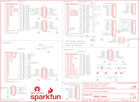

Contents
========

* [PRS13714 > FreeSoc2](#prs13714--freesoc2)
	* [Schematic](#schematic)
	* [PCB](#pcb)
	* [Interactive BOM](#interactive-bom)
	* [OOMP Parts](#oomp-parts)
	* [Images](#images)
	* [Tags](#tags)
  
![][im]
# PRS13714 > FreeSoc2

- ID: PROJ-SPAR-13714-STAN-01
- Hex ID: PRS13714
- Name: Sparkfun
- Description: Sparkfun
- Long Link: [http://oom.lt/PROJ-SPAR-13714-STAN-01](http://oom.lt/PROJ-SPAR-13714-STAN-01)
- Short Link: [http://oom.lt/PRS13714](http://oom.lt/PRS13714)

## Schematic
  

## PCB
  

## Interactive BOM

- Interactive BOM page: [ibom.html](https://htmlpreview.github.io/?https://github.com/oomlout/oomlout_OOMP_projects/blob/main/PROJ-SPAR-13714-STAN-01/kicad/bom/ibom.html)

## OOMP Parts
  

|OOMP Parts|
| :---: |
|[CAPC-0402-X-UF1-V63D  SMD (0402) 1 uF Capacitor (Ceramic) 6.3v  C1, C2, C4, C5, C7, C16, C17, C19, C20](https://github.com/oomlout/oomlout_OOMP_parts/tree/main/CAPC-0402-X-UF1-V63D/)|
|CAPC-0402-X-UF1D-01 C3, C6, C9, C11, C13, C15, C21, C22, C23, C25, C27, C29, C30, C31, C32, C33, C34, C35, C36|
|CAPX-UNMATCHED-X-NF100-01 C12, C14, C18, C24|
|[CAPC-0805-X-UF10-V10  SMD (0805) 10 uF Capacitor (Ceramic) 10v  C26, C28](https://github.com/oomlout/oomlout_OOMP_parts/tree/main/CAPC-0805-X-UF10-V10/)|
|[CAPC-0603-X-UF1-V25  SMD (0603) 1 uF Capacitor (Ceramic) 25v  C37](https://github.com/oomlout/oomlout_OOMP_parts/tree/main/CAPC-0603-X-UF1-V25/)|
|CAPC-0603-X-UF1D-01 C38|
|DIOD-UNMATCHED-X-UNMATCHED-01 D1, D2, D3, D4|
|[LEDS-0603-R-STAN-01  SMD (0603) Red LED  D5, D6](https://github.com/oomlout/oomlout_OOMP_parts/tree/main/LEDS-0603-R-STAN-01/)|
|UNMATCHED-UNMATCHED-X-UNMATCHED-01 JP1, JP2, JP8, JP9, JP11, JP12, JP15, S1, S2, S3, S4, S5, S6, U$1, U1, U4, U7, Y1, Y2|
|HEAD-I01-X-UNMATCHED-01 JP3, JP13|
|[HEAD-I01-X-PI06-01  2.54 mm 6 Pin Header  JP4](https://github.com/oomlout/oomlout_OOMP_parts/tree/main/HEAD-I01-X-PI06-01/)|
|[HEAD-I01-X-PI08-01  2.54 mm 8 Pin Header  JP5, JP6, JP10](https://github.com/oomlout/oomlout_OOMP_parts/tree/main/HEAD-I01-X-PI08-01/)|
|[HEAD-I01-X-PI10-01  2.54 mm 10 Pin Header  JP7](https://github.com/oomlout/oomlout_OOMP_parts/tree/main/HEAD-I01-X-PI10-01/)|
|[DCJP-21D-X-STAN-01  2.1 mm DC Jack  JP18](https://github.com/oomlout/oomlout_OOMP_parts/tree/main/DCJP-21D-X-STAN-01/)|
|[RESE-0603-X-O472-01  SMD (0603) 4.7k Ohm Resistor  R1, R2](https://github.com/oomlout/oomlout_OOMP_parts/tree/main/RESE-0603-X-O472-01/)|
|[RESE-0603-X-O103-01  SMD (0603) 10k Ohm Resistor  R3, R4](https://github.com/oomlout/oomlout_OOMP_parts/tree/main/RESE-0603-X-O103-01/)|
|[RESE-0603-X-O203-01  SMD (0603) 20k Ohm Resistor  R5, R6](https://github.com/oomlout/oomlout_OOMP_parts/tree/main/RESE-0603-X-O203-01/)|
|[RESE-0603-X-O222-01  SMD (0603) 2.2k Ohm Resistor  R7, R8](https://github.com/oomlout/oomlout_OOMP_parts/tree/main/RESE-0603-X-O222-01/)|
|RESE-UNMATCHED-X-O102-01 R9, R10, R20, R21|
|RESE-0603-X-UNMATCHED-01 R11, R12|
|RESE-0402-X-O220-01 R16, R17, R18, R19|
|UNMATCHED-SO235-X-UNMATCHED-01 U2, U3|

## Images
  
  

|kicadPcb3d|kicadPcb3dFront|kicadPcb3dBack|eagleImage|eagleSchemImage|
| :---: | :---: | :---: | :---: | :---: |
||||||

## Tags

- hexID: PRS13714
- oompType: PROJ
- oompSize: SPAR
- oompColor: 13714
- oompDesc: STAN
- oompIndex: 01
- oompName: FreeSoc2
- sources: All source files from https://github.com/sparkfun/FreeSoc2 (source licence details in srcLicense.md)
- linkBuyPage: https://www.sparkfun.com/products/13714
- oompID: PROJ-SPAR-13714-STAN-01
- oompParts: C1,CAPC-0402-X-UF1-V63D
- oompParts: C2,CAPC-0402-X-UF1-V63D
- oompParts: C3,CAPC-0402-X-UF1D-01
- oompParts: C4,CAPC-0402-X-UF1-V63D
- oompParts: C5,CAPC-0402-X-UF1-V63D
- oompParts: C6,CAPC-0402-X-UF1D-01
- oompParts: C7,CAPC-0402-X-UF1-V63D
- oompParts: C9,CAPC-0402-X-UF1D-01
- oompParts: C11,CAPC-0402-X-UF1D-01
- oompParts: C12,CAPX-UNMATCHED-X-NF100-01
- oompParts: C13,CAPC-0402-X-UF1D-01
- oompParts: C14,CAPX-UNMATCHED-X-NF100-01
- oompParts: C15,CAPC-0402-X-UF1D-01
- oompParts: C16,CAPC-0402-X-UF1-V63D
- oompParts: C17,CAPC-0402-X-UF1-V63D
- oompParts: C18,CAPX-UNMATCHED-X-NF100-01
- oompParts: C19,CAPC-0402-X-UF1-V63D
- oompParts: C20,CAPC-0402-X-UF1-V63D
- oompParts: C21,CAPC-0402-X-UF1D-01
- oompParts: C22,CAPC-0402-X-UF1D-01
- oompParts: C23,CAPC-0402-X-UF1D-01
- oompParts: C24,CAPX-UNMATCHED-X-NF100-01
- oompParts: C25,CAPC-0402-X-UF1D-01
- oompParts: C26,CAPC-0805-X-UF10-V10
- oompParts: C27,CAPC-0402-X-UF1D-01
- oompParts: C28,CAPC-0805-X-UF10-V10
- oompParts: C29,CAPC-0402-X-UF1D-01
- oompParts: C30,CAPC-0402-X-UF1D-01
- oompParts: C31,CAPC-0402-X-UF1D-01
- oompParts: C32,CAPC-0402-X-UF1D-01
- oompParts: C33,CAPC-0402-X-UF1D-01
- oompParts: C34,CAPC-0402-X-UF1D-01
- oompParts: C35,CAPC-0402-X-UF1D-01
- oompParts: C36,CAPC-0402-X-UF1D-01
- oompParts: C37,CAPC-0603-X-UF1-V25
- oompParts: C38,CAPC-0603-X-UF1D-01
- oompParts: D1,DIOD-UNMATCHED-X-UNMATCHED-01
- oompParts: D2,DIOD-UNMATCHED-X-UNMATCHED-01
- oompParts: D3,DIOD-UNMATCHED-X-UNMATCHED-01
- oompParts: D4,DIOD-UNMATCHED-X-UNMATCHED-01
- oompParts: D5,LEDS-0603-R-STAN-01
- oompParts: D6,LEDS-0603-R-STAN-01
- oompParts: JP1,UNMATCHED-UNMATCHED-X-UNMATCHED-01
- oompParts: JP2,UNMATCHED-UNMATCHED-X-UNMATCHED-01
- oompParts: JP3,HEAD-I01-X-UNMATCHED-01
- oompParts: JP4,HEAD-I01-X-PI06-01
- oompParts: JP5,HEAD-I01-X-PI08-01
- oompParts: JP6,HEAD-I01-X-PI08-01
- oompParts: JP7,HEAD-I01-X-PI10-01
- oompParts: JP8,UNMATCHED-UNMATCHED-X-UNMATCHED-01
- oompParts: JP9,UNMATCHED-UNMATCHED-X-UNMATCHED-01
- oompParts: JP10,HEAD-I01-X-PI08-01
- oompParts: JP11,UNMATCHED-UNMATCHED-X-UNMATCHED-01
- oompParts: JP12,UNMATCHED-UNMATCHED-X-UNMATCHED-01
- oompParts: JP13,HEAD-I01-X-UNMATCHED-01
- oompParts: JP15,UNMATCHED-UNMATCHED-X-UNMATCHED-01
- oompParts: JP18,DCJP-21D-X-STAN-01
- oompParts: R1,RESE-0603-X-O472-01
- oompParts: R2,RESE-0603-X-O472-01
- oompParts: R3,RESE-0603-X-O103-01
- oompParts: R4,RESE-0603-X-O103-01
- oompParts: R5,RESE-0603-X-O203-01
- oompParts: R6,RESE-0603-X-O203-01
- oompParts: R7,RESE-0603-X-O222-01
- oompParts: R8,RESE-0603-X-O222-01
- oompParts: R9,RESE-UNMATCHED-X-O102-01
- oompParts: R10,RESE-UNMATCHED-X-O102-01
- oompParts: R11,RESE-0603-X-UNMATCHED-01
- oompParts: R12,RESE-0603-X-UNMATCHED-01
- oompParts: R16,RESE-0402-X-O220-01
- oompParts: R17,RESE-0402-X-O220-01
- oompParts: R18,RESE-0402-X-O220-01
- oompParts: R19,RESE-0402-X-O220-01
- oompParts: R20,RESE-UNMATCHED-X-O102-01
- oompParts: R21,RESE-UNMATCHED-X-O102-01
- oompParts: S1,UNMATCHED-UNMATCHED-X-UNMATCHED-01
- oompParts: S2,UNMATCHED-UNMATCHED-X-UNMATCHED-01
- oompParts: S3,UNMATCHED-UNMATCHED-X-UNMATCHED-01
- oompParts: S4,UNMATCHED-UNMATCHED-X-UNMATCHED-01
- oompParts: S5,UNMATCHED-UNMATCHED-X-UNMATCHED-01
- oompParts: S6,UNMATCHED-UNMATCHED-X-UNMATCHED-01
- oompParts: U$1,UNMATCHED-UNMATCHED-X-UNMATCHED-01
- oompParts: U1,UNMATCHED-UNMATCHED-X-UNMATCHED-01
- oompParts: U2,UNMATCHED-SO235-X-UNMATCHED-01
- oompParts: U3,UNMATCHED-SO235-X-UNMATCHED-01
- oompParts: U4,UNMATCHED-UNMATCHED-X-UNMATCHED-01
- oompParts: U7,UNMATCHED-UNMATCHED-X-UNMATCHED-01
- oompParts: Y1,UNMATCHED-UNMATCHED-X-UNMATCHED-01
- oompParts: Y2,UNMATCHED-UNMATCHED-X-UNMATCHED-01
- rawParts: C1,1.0uF,1.0UF-16V-10%(0402),0402-CAP,,,CAP-12417,,,1.0uF,,
- rawParts: C2,1.0uF,1.0UF-16V-10%(0402),0402-CAP,,,CAP-12417,,,1.0uF,,
- rawParts: C3,0.1uF,0.1UF-16V(+-10%)(0402),0402-CAP,,,CAP-12416,,,0.1uF,,
- rawParts: C4,1.0uF,1.0UF-16V-10%(0402),0402-CAP,,,CAP-12417,,,1.0uF,,
- rawParts: C5,1.0uF,1.0UF-16V-10%(0402),0402-CAP,,,CAP-12417,,,1.0uF,,
- rawParts: C6,0.1uF,0.1UF-16V(+-10%)(0402),0402-CAP,,,CAP-12416,,,0.1uF,,
- rawParts: C7,1.0uF,1.0UF-16V-10%(0402),0402-CAP,,,CAP-12417,,,1.0uF,,
- rawParts: C9,0.1uF,0.1UF-16V(+-10%)(0402),0402-CAP,,,CAP-12416,,,0.1uF,,
- rawParts: C11,0.1uF,0.1UF-16V(+-10%)(0402),0402-CAP,,,CAP-12416,,,0.1uF,,
- rawParts: C12,,CAPPTH,CAP-PTH-SMALL,Capacitor,,,,,,,
- rawParts: C13,0.1uF,0.1UF-16V(+-10%)(0402),0402-CAP,,,CAP-12416,,,0.1uF,,
- rawParts: C14,,CAPPTH,CAP-PTH-SMALL,Capacitor,,,,,,,
- rawParts: C15,0.1uF,0.1UF-16V(+-10%)(0402),0402-CAP,,,CAP-12416,,,0.1uF,,
- rawParts: C16,1.0uF,1.0UF-16V-10%(0402),0402-CAP,,,CAP-12417,,,1.0uF,,
- rawParts: C17,1.0uF,1.0UF-16V-10%(0402),0402-CAP,,,CAP-12417,,,1.0uF,,
- rawParts: C18,,CAPPTH,CAP-PTH-SMALL,Capacitor,,,,,,,
- rawParts: C19,1.0uF,1.0UF-16V-10%(0402),0402-CAP,,,CAP-12417,,,1.0uF,,
- rawParts: C20,1.0uF,1.0UF-16V-10%(0402),0402-CAP,,,CAP-12417,,,1.0uF,,
- rawParts: C21,0.1uF,0.1UF-16V(+-10%)(0402),0402-CAP,,,CAP-12416,,,0.1uF,,
- rawParts: C22,0.1uF,0.1UF-16V(+-10%)(0402),0402-CAP,,,CAP-12416,,,0.1uF,,
- rawParts: C23,0.1uF,0.1UF-16V(+-10%)(0402),0402-CAP,,,CAP-12416,,,0.1uF,,
- rawParts: C24,,CAPPTH,CAP-PTH-SMALL,Capacitor,,,,,,,
- rawParts: C25,0.1uF,0.1UF-16V(+-10%)(0402),0402-CAP,,,CAP-12416,,,0.1uF,,
- rawParts: C26,10uF,10UF10V10%(0805),0805-CAP,CAP-11330,,CAP-11330,,,,,
- rawParts: C27,0.1uF,0.1UF-16V(+-10%)(0402),0402-CAP,,,CAP-12416,,,0.1uF,,
- rawParts: C28,10uF,10UF10V10%(0805),0805-CAP,CAP-11330,,CAP-11330,,,,,
- rawParts: C29,0.1uF,0.1UF-16V(+-10%)(0402),0402-CAP,,,CAP-12416,,,0.1uF,,
- rawParts: C30,0.1uF,0.1UF-16V(+-10%)(0402),0402-CAP,,,CAP-12416,,,0.1uF,,
- rawParts: C31,0.1uF,0.1UF-16V(+-10%)(0402),0402-CAP,,,CAP-12416,,,0.1uF,,
- rawParts: C32,0.1uF,0.1UF-16V(+-10%)(0402),0402-CAP,,,CAP-12416,,,0.1uF,,
- rawParts: C33,0.1uF,0.1UF-16V(+-10%)(0402),0402-CAP,,,CAP-12416,,,0.1uF,,
- rawParts: C34,0.1uF,0.1UF-16V(+-10%)(0402),0402-CAP,,,CAP-12416,,,0.1uF,,
- rawParts: C35,0.1uF,0.1UF-16V(+-10%)(0402),0402-CAP,,,CAP-12416,,,0.1uF,,
- rawParts: C36,0.1uF,0.1UF-16V(+-10%)(0402),0402-CAP,,,CAP-12416,,,0.1uF,,
- rawParts: C37,1.0uF,1.0UF-16V-10%(0603),0603-CAP,CAP-00868,,CAP-00868,,,1.0uF,,
- rawParts: C38,0.1uF,0.1UF-25V(+80/-20%)(0603),0603-CAP,CAP-00810,,CAP-00810,,,0.1uF,,
- rawParts: D1,MBRA140,MBRA140,SMA-DIODE,40V, 1A Schottky rectifier,,DIO-08053,,,,,
- rawParts: D2,MBRA140,MBRA140,SMA-DIODE,40V, 1A Schottky rectifier,,DIO-08053,,,,,
- rawParts: D3,MBRA140,MBRA140,SMA-DIODE,40V, 1A Schottky rectifier,,DIO-08053,,,,,
- rawParts: D4,MBRA140,MBRA140,SMA-DIODE,40V, 1A Schottky rectifier,,DIO-08053,,,,,
- rawParts: D5,RED,LED-RED0603,LED-0603,Assorted Red LEDs,,DIO-00819,,,RED,,
- rawParts: D6,RED,LED-RED0603,LED-0603,Assorted Red LEDs,,DIO-00819,,,RED,,
- rawParts: FID1,FIDUCIAL1X2,FIDUCIAL1X2,FIDUCIAL-1X2,Fiducial Alignment Points,,,,,,,
- rawParts: FID2,FIDUCIAL1X2,FIDUCIAL1X2,FIDUCIAL-1X2,Fiducial Alignment Points,,,,,,,
- rawParts: FRAME1,FRAME-LETTERNO_PACKAGE,FRAME-LETTERNO_PACKAGE,DUMMY,Schematic Frame,Nobody,,,,,v01,
- rawParts: FRAME2,FRAME-LETTERNO_PACKAGE,FRAME-LETTERNO_PACKAGE,DUMMY,Schematic Frame,Nobody,,,,,v01,
- rawParts: FRAME3,FRAME-LETTERNO_PACKAGE,FRAME-LETTERNO_PACKAGE,DUMMY,Schematic Frame,Nobody,,,,,v01,
- rawParts: JP1,MicroB,USB_MICROB_PLUGCONN-11752,USB-B-MICRO-SMD_V03,USB Micro-B connectors,,CONN-11752,,,,,
- rawParts: JP2,MicroB,USB_MICROB_PLUGCONN-11752,USB-B-MICRO-SMD_V03,USB Micro-B connectors,,CONN-11752,,,,,
- rawParts: JP3,,M02JST-PTH-2,JST-2-PTH,Standard 2-pin 0.1 header. Use with,,CONN-09863,,PRT-09914,,,
- rawParts: JP4,1X6 FEMALE PTH,M06SIP_LOCK,1X06-SIP_LOCK,Header 6,,CONN-08437,,,,,
- rawParts: JP5,1X8 FEMALE PTH,M08LOCK,1X08_LOCK,Header 8,,CONN-08438,,,,,
- rawParts: JP6,1X8 FEMALE PTH,M08LOCK,1X08_LOCK,Header 8,,CONN-08438,,,,,
- rawParts: JP7,1X10 FEMALE PTH,M10LOCK,1X10_LOCK,Header 10,,CONN-11563,,,,,
- rawParts: JP8,2X6 FEMALE,M06X2PTH_FEMALE,2X6,,,CONN-12423,,,2X6 FEMALE,,
- rawParts: JP9,2X6 FEMALE,M06X2PTH_FEMALE,2X6,,,CONN-12423,,,2X6 FEMALE,,
- rawParts: JP10,1x8 FEMALE PTH,M08LOCK,1X08_LOCK,Header 8,,CONN-08438,,,,,
- rawParts: JP11,2X6 FEMALE,M06X2PTH_FEMALE,2X6,,,CONN-12423,,,2X6 FEMALE,,
- rawParts: JP12,2X6 FEMALE,M06X2PTH_FEMALE,2X6,,,CONN-12423,,,2X6 FEMALE,,
- rawParts: JP13,,M03X22X3_SILK_MALE_PTH,2X3,2x3 .1 header.,,CONN-09701,,,,,
- rawParts: JP14,DNP,M05X20.05_IN_PTH_SILK,2X5_PTH_SILK_.05,Header 5x2,,,,,,,
- rawParts: JP15,2X6 FEMALE,M06X2PTH_FEMALE,2X6,,,CONN-12423,,,2X6 FEMALE,,
- rawParts: JP17,DNP,M05X20.05_IN_PTH_SILK,2X5_PTH_SILK_.05,Header 5x2,,,,,,,
- rawParts: JP18,POWER_JACKPTH_LOCK,POWER_JACKPTH_LOCK,POWER_JACK_PTH_LOCK,Power Jack,,CONN-08197,PRT-00119,,,,
- rawParts: LOGO1,SFE_LOGO_NAME_FLAME.2_INCH,SFE_LOGO_NAME_FLAME.2_INCH,SFE_LOGO_NAME_FLAME_.2,SFE Logo, name and flame,,,,,,,
- rawParts: LOGO2,OSHW-LOGOS,OSHW-LOGOS,OSHW-LOGO-S,Open Source Hardware Logo,,,,,,,
- rawParts: R1,4.7K,4.7KOHM-1/10W-1%(0603),0603-RES,RES-07857,,RES-07857,,,4.7K,,
- rawParts: R2,4.7K,4.7KOHM-1/10W-1%(0603),0603-RES,RES-07857,,RES-07857,,,4.7K,,
- rawParts: R3,10K,10KOHM-1/10W-1%(0603)0603,0603-RES,RES-00824,,RES-00824,,,10K,,
- rawParts: R4,10K,10KOHM-1/10W-1%(0603)0603,0603-RES,RES-00824,,RES-00824,,,10K,,
- rawParts: R5,20k,20KOHM1/10W1%(0603),0603-RES,RES-09383,,RES-09383,,,20k,,
- rawParts: R6,20k,20KOHM1/10W1%(0603),0603-RES,RES-09383,,RES-09383,,,20k,,
- rawParts: R7,2.2k,2.2KOHM-1/10W-1%(0603),0603-RES,RES-08272,,RES-08272,,,2.2k,,
- rawParts: R8,2.2k,2.2KOHM-1/10W-1%(0603),0603-RES,RES-08272,,RES-08272,,,2.2k,,
- rawParts: R9,1K,1KOHM1/10W1%(0603),0603-RES@1,RES-07856,,RES-07856,,,1K,,
- rawParts: R10,1K,1KOHM1/10W1%(0603),0603-RES@1,RES-07856,,RES-07856,,,1K,,
- rawParts: R11,0.27,0.27OHM-1/10W-1%(0603),0603-RES,RES-08787,,RES-08787,,,,,
- rawParts: R12,0.27,0.27OHM-1/10W-1%(0603),0603-RES,RES-08787,,RES-08787,,,,,
- rawParts: R16,22,22OHM1/10W1%(0402),0402-RES,,,RES-12427,,,22,,
- rawParts: R17,22,22OHM1/10W1%(0402),0402-RES,,,RES-12427,,,22,,
- rawParts: R18,22,22OHM1/10W1%(0402),0402-RES,,,RES-12427,,,22,,
- rawParts: R19,22,22OHM1/10W1%(0402),0402-RES,,,RES-12427,,,22,,
- rawParts: R20,1K,1KOHM1/10W1%(0603),0603-RES@1,RES-07856,,RES-07856,,,1K,,
- rawParts: R21,1K,1KOHM1/10W1%(0603),0603-RES@1,RES-07856,,RES-07856,,,1K,,
- rawParts: S1,SPST-MOM,SWITCH-MOMENTARY-2SMD,TACTILE-SWITCH-SMD,Various NO switches- pushbuttons, reed, etc,,SWCH-08247,,,,,
- rawParts: S2,SPST-MOM,SWITCH-MOMENTARY-2SMD,TACTILE-SWITCH-SMD,Various NO switches- pushbuttons, reed, etc,,SWCH-08247,,,,,
- rawParts: S3,SPDT,SWITCH-SPDTPTH_LOCK,SWITCH-SPDT_LOCK.007S,SPDT Switch,,SWCH-08261,,,,,
- rawParts: S4,SPDT,SWITCH-SPDTPTH_LOCK,SWITCH-SPDT_LOCK.007S,SPDT Switch,,SWCH-08261,,,,,
- rawParts: S5,SPST-MOM,SWITCH-MOMENTARY-2SMD,TACTILE-SWITCH-SMD,Various NO switches- pushbuttons, reed, etc,,SWCH-08247,,,,,
- rawParts: S6,SPST-MOM,SWITCH-MOMENTARY-2SMD,TACTILE-SWITCH-SMD,Various NO switches- pushbuttons, reed, etc,,SWCH-08247,,,,,
- rawParts: SJ1,JUMPER-PAD-2-NC_BY_PASTE,JUMPER-PAD-2-NC_BY_PASTE,PAD-JUMPER-2-NC_BY_PASTE_YES_SILK,,,,,,,,
- rawParts: SJ2,JUMPER-PAD-2-NOYES_SILK,JUMPER-PAD-2-NOYES_SILK,PAD-JUMPER-2-NO_YES_SILK,,,,,,,,
- rawParts: SJ3,JUMPER-PAD-2-NO,JUMPER-PAD-2-NO,PAD-JUMPER-2-NO_NO_SILK,,,,,,,,
- rawParts: SJ4,JUMPER-PAD-2-NO,JUMPER-PAD-2-NO,PAD-JUMPER-2-NO_NO_SILK,,,,,,,,
- rawParts: SJ5,JUMPER-PAD-2-NO,JUMPER-PAD-2-NO,PAD-JUMPER-2-NO_NO_SILK,,,,,,,,
- rawParts: SJ6,JUMPER-PAD-2-NO,JUMPER-PAD-2-NO,PAD-JUMPER-2-NO_NO_SILK,,,,,,,,
- rawParts: SJ7,JUMPER-PAD-2-NO,JUMPER-PAD-2-NO,PAD-JUMPER-2-NO_NO_SILK,,,,,,,,
- rawParts: STANDOFF1,STAND-OFF,STAND-OFF,STAND-OFF,#4 Stand Off,,,,,,,
- rawParts: STANDOFF2,STAND-OFF,STAND-OFF,STAND-OFF,#4 Stand Off,,,,,,,
- rawParts: STANDOFF3,STAND-OFF,STAND-OFF,STAND-OFF,#4 Stand Off,,,,,,,
- rawParts: STANDOFF4,STAND-OFF,STAND-OFF,STAND-OFF,#4 Stand Off,,,,,,,
- rawParts: U$1,FOUR_LAYER_WARNING,FOUR_LAYER_WARNING,FOUR_LAYER_WARNING,Warning text which will appear on both the schematic,,,,,,,
- rawParts: U1,CY8C5888AXI-LP096,PSOC_5LP_100QFP,TQFP-100-14X14MM,Cypress PSOC 5LP, 100-pin package,,IC-12190,,,CY8C5868AXI-LP035,,
- rawParts: U2,MIC5219 5V,V_REG_MIC52195V,SOT23-5,V_REG MIC5219,,VREG-10107,,,MIC5219 5V,,
- rawParts: U3,MIC5219 3.3V,V_REG_MIC52193.3V,SOT23-5,V_REG MIC5219,,VREG-09872,,,MIC5219 3.3V,,
- rawParts: U4,2A/20V,MOSFET-PCHANNEL_DUALSOT26,SOT26,,,TRAN-12444,,,2A/20V,,
- rawParts: U7,CY8C5868LTI-LP039,PSOC_5LP_68QFN,QFN-68,PSoC5LP 68-QFN package,,IC-12391,,,CY8C5868LTI-LP039,,
- rawParts: Y1,32.768kHz,CRYSTALTC26H,TC26H,Various standard crystals. Proven footprints.,,XTAL-10112,,,32.768kHz,,
- rawParts: Y2,,CRYSTALHC49US,HC49US,Various standard crystals. Proven footprints.,,,,,,,

[im]: kicadPcb3d_450.png
