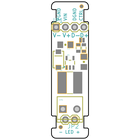
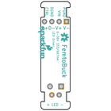
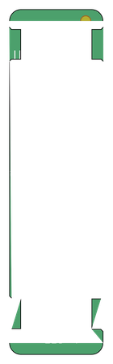

Contents
========

* [PRS13716 > FemtoBuck](#prs13716--femtobuck)
	* [Schematic](#schematic)
	* [PCB](#pcb)
	* [Interactive BOM](#interactive-bom)
	* [OOMP Parts](#oomp-parts)
	* [Images](#images)
	* [Tags](#tags)
  
![][im]
# PRS13716 > FemtoBuck

- ID: PROJ-SPAR-13716-STAN-01
- Hex ID: PRS13716
- Name: Sparkfun
- Description: Sparkfun
- Long Link: [http://oom.lt/PROJ-SPAR-13716-STAN-01](http://oom.lt/PROJ-SPAR-13716-STAN-01)
- Short Link: [http://oom.lt/PRS13716](http://oom.lt/PRS13716)

## Schematic
  

## PCB
  

## Interactive BOM

- Interactive BOM page: [ibom.html](https://htmlpreview.github.io/?https://github.com/oomlout/oomlout_OOMP_projects/blob/main/PROJ-SPAR-13716-STAN-01/kicad/bom/ibom.html)

## OOMP Parts
  

|OOMP ID|Name|Identifier|
| :---: | :---: | :---: |
|CAPC-1206-X-UF1-01||C1|
|CAPC-1206-X-UF22D-01||C2|
|[TERS-35D-L-PI02-01](https://github.com/oomlout/oomlout_OOMP_parts/tree/main/TERS-35D-L-PI02-01/)|[3.5 mm 2 Pin Blue Screw Terminal](https://github.com/oomlout/oomlout_OOMP_parts/tree/main/TERS-35D-L-PI02-01/)|[CH1](https://github.com/oomlout/oomlout_OOMP_parts/tree/main/TERS-35D-L-PI02-01/)|
|DIOD-UNMATCHED-X-UNMATCHED-01||D1|
|[HEAD-I01-X-PI04-01](https://github.com/oomlout/oomlout_OOMP_parts/tree/main/HEAD-I01-X-PI04-01/)|[2.54 mm 4 Pin Header](https://github.com/oomlout/oomlout_OOMP_parts/tree/main/HEAD-I01-X-PI04-01/)|[JP1](https://github.com/oomlout/oomlout_OOMP_parts/tree/main/HEAD-I01-X-PI04-01/)|
|[HEAD-I01-X-PI02-01](https://github.com/oomlout/oomlout_OOMP_parts/tree/main/HEAD-I01-X-PI02-01/)|[2.54 mm 2 Pin Header](https://github.com/oomlout/oomlout_OOMP_parts/tree/main/HEAD-I01-X-PI02-01/)|[JP2](https://github.com/oomlout/oomlout_OOMP_parts/tree/main/HEAD-I01-X-PI02-01/)|
|UNMATCHED-UNMATCHED-X-UNMATCHED-01||L1, SJ2|
|RESE-0805-X-UNMATCHED-01||R1, R2|
|UNMATCHED-SO235-X-UNMATCHED-01||U1|

## Images
  
  

|bominteractivefront|bominteractiveback|kicadPcb3d|kicadPcb3dFront|kicadPcb3dBack|eagleImage|eagleSchemImage|pcbdraw|pcbdrawback|
| :---: | :---: | :---: | :---: | :---: | :---: | :---: | :---: | :---: |
||||||||||

## Tags

- hexID: PRS13716
- oompType: PROJ
- oompSize: SPAR
- oompColor: 13716
- oompDesc: STAN
- oompIndex: 01
- oompName: FemtoBuck
- sources: All source files from https://github.com/sparkfun/FemtoBuck (source licence details in srcLicense.md)
- linkBuyPage: https://www.sparkfun.com/products/13716
- oompID: PROJ-SPAR-13716-STAN-01
- oompParts: C1,CAPC-1206-X-UF1-01
- oompParts: C2,CAPC-1206-X-UF22D-01
- oompParts: CH1,TERS-35D-L-PI02-01
- oompParts: D1,DIOD-UNMATCHED-X-UNMATCHED-01
- oompParts: JP1,HEAD-I01-X-PI04-01
- oompParts: JP2,HEAD-I01-X-PI02-01
- oompParts: L1,UNMATCHED-UNMATCHED-X-UNMATCHED-01
- oompParts: R1,RESE-0805-X-UNMATCHED-01
- oompParts: R2,RESE-0805-X-UNMATCHED-01
- oompParts: SJ2,UNMATCHED-UNMATCHED-X-UNMATCHED-01
- oompParts: U1,UNMATCHED-SO235-X-UNMATCHED-01
- rawParts: C1,1uF,1.0UF50V10%(1206),1206-CAP,CAP-09822,,,,,,
- rawParts: C2,2.2uF,2.2UF50V10%(1206),1206-CAP,CAP-10009,,,,,,
- rawParts: CH1,,CONN_023.5MM_LOCK,SCREWTERMINAL-3.5MM-2_LOCK,Multi connection point. Often used as Generic Header-pin footprint for 0.1 inch spaced/style header connections,,,CONN-08399,,,
- rawParts: D1,MBRA140,DIODE-SCHOTTKY-MBRA140,SMA-DIODE,Schottky diodes in SFEs production catalog,,,DIO-08053,,MBRA140,
- rawParts: FID1,FIDUCIAL1X2,FIDUCIAL1X2,FIDUCIAL-1X2,Fiducial Alignment Points,,,,,,
- rawParts: FID2,FIDUCIAL1X2,FIDUCIAL1X2,FIDUCIAL-1X2,Fiducial Alignment Points,,,,,,
- rawParts: FRAME1,FRAME-LETTER,FRAME-LETTER,CREATIVE_COMMONS,Schematic Frame - Letter,,,,,,
- rawParts: JP1,,M04PTH,1X04,Header 4,,,,,,
- rawParts: JP2,M02PTH,M02PTH,1X02@1,Standard 2-pin 0.1 header. Use with,,,,,,
- rawParts: L1,33µH/±20%/1.4A,INDUCTOR-SRN6045-33UH,SRN6045,Inductors,,,NDUC-11627,,33µH/±20%/1.4A,
- rawParts: LOGO1,OSHW-LOGOS,OSHW-LOGOS,OSHW-LOGO-S,Open-Source Hardware (OSHW) Logo,,,,,,
- rawParts: LOGO2,SFE_LOGO_NAME_FLAME.1_INCH,SFE_LOGO_NAME_FLAME.1_INCH,SFE_LOGO_NAME_FLAME_.1,SparkFun Font Logo w/ Flame,,,,,,
- rawParts: R1,0.3R,0.3OHM-1/8W-1%(0805),0805,RES-11622,,,RES-11622,,0.3,
- rawParts: R2,0.3R,0.3OHM-1/8W-1%(0805),0805,RES-11622,,,RES-11622,,0.3,
- rawParts: SJ2,NO Jumper,JUMPER-SMT_2_NO_NO-SILK,SMT-JUMPER_2_NO_NO-SILK,Normally open jumper,,,,,,
- rawParts: U1,AL8860,AL8860,SOT23-5,,,IC-16593,,,,

[im]: kicadPcb3d_450.png
