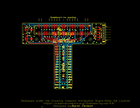
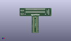
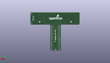
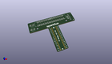

Contents
========

* [PROJ-SPAR-13717-STAN-01>Pi Wedge 40-Pin PreAssembled](#proj-spar-13717-stan-01pi-wedge-40-pin-preassembled)
	* [Images](#images)
	* [Interactive BOM](#interactive-bom)
	* [OOMP Parts](#oomp-parts)
	* [Tags](#tags)
  
![][im]
# PROJ-SPAR-13717-STAN-01>Pi Wedge 40-Pin PreAssembled

- ID: PROJ-SPAR-13717-STAN-01
- Hex ID: PRS13717
- Name: Pi Wedge 40-Pin PreAssembled
- Description: 

## Images
  
  

|eagleImage|kicadPcb3dFront|kicadPcb3dBack|kicadPcb3d|
| :---: | :---: | :---: | :---: |
|||||

## Interactive BOM

- Interactive BOM page: [ibom.html](kicad/bom/ibom.html)

## OOMP Parts
  

|OOMP Parts|
| :---: |
|UNMATCHED-UNMATCHED-X-UNMATCHED-01, C3V, 6.35, 59.181999999999995, 180,C3V, 47uf, PANASONIC_D, SparkFun-Capacitors, (0.25, 2.33), R180|
|UNMATCHED-UNMATCHED-X-UNMATCHED-01, C5V, 6.35, 50.038, 180,C5V, 47uf, PANASONIC_D, SparkFun-Capacitors, (0.25, 1.97), R180|
|ERROR, JP1 FTDI Device, 0, 0, 0,JP1, FTDI, Device, FTDI_DEVICE_RA_SMT, SparkFun-Connectors, (3.17, 2.17874016), R90|
|UNMATCHED-UNMATCHED-X-UNMATCHED-01, JP2, 40.64, 58.92799999999999, 270,JP2, RASPBERRYPI-40-PIN-GPIO-SMT, 2X20-SHROUDED-SMT, SparkFun-Boards, (1.6, 2.32), R270|
|HEAD-I01-X-PI17-01, JP3, 36.83, 1.5239999999999998, M90,JP3, 1x17, 1X17_NO_SILK_KIT, SparkFun-Connectors, (1.45, 0.06), MR90|
|HEAD-I01-X-PI17-01, JP4, 44.449999999999996, 1.5239999999999998, M90,JP4, 1x17, 1X17_NO_SILK_KIT, SparkFun-Connectors, (1.75, 0.06), MR90|

## Tags

- hexID: PRS13717
- oompType: PROJ
- oompSize: SPAR
- oompColor: 13717
- oompDesc: STAN
- oompIndex: 01
- oompName: Pi Wedge 40-Pin PreAssembled
- sources: All source files from https://github.com/sparkfun/Pi_Wedge_40-Pin_PreAssembled (source licence details in srcLicense.md)
- linkBuyPage: https://www.sparkfun.com/products/13717
- oompPart: UNMATCHED-UNMATCHED-X-UNMATCHED-01, C3V, 6.35, 59.181999999999995, 180
- oompPart: UNMATCHED-UNMATCHED-X-UNMATCHED-01, C5V, 6.35, 50.038, 180
- oompPart: SKIP-UNMATCHED-X-UNMATCHED-01, FID1, 74.93, 64.77, 0
- oompPart: SKIP-UNMATCHED-X-UNMATCHED-01, FID2, 2.54, 45.72, 0
- oompPart: ERROR, JP1 FTDI Device, 0, 0, 0
- oompPart: UNMATCHED-UNMATCHED-X-UNMATCHED-01, JP2, 40.64, 58.92799999999999, 270
- oompPart: HEAD-I01-X-PI17-01, JP3, 36.83, 1.5239999999999998, M90
- oompPart: HEAD-I01-X-PI17-01, JP4, 44.449999999999996, 1.5239999999999998, M90
- rawPart: C3V, 47uf, PANASONIC_D, SparkFun-Capacitors, (0.25, 2.33), R180
- rawPart: C5V, 47uf, PANASONIC_D, SparkFun-Capacitors, (0.25, 1.97), R180
- rawPart: FID1, FIDUCIALUFIDUCIAL, MICRO-FIDUCIAL, SparkFun-Aesthetics, (2.95, 2.55), R0
- rawPart: FID2, FIDUCIALUFIDUCIAL, MICRO-FIDUCIAL, SparkFun-Aesthetics, (0.1, 1.8), R0
- rawPart: JP1, FTDI, Device, FTDI_DEVICE_RA_SMT, SparkFun-Connectors, (3.17, 2.17874016), R90
- rawPart: JP2, RASPBERRYPI-40-PIN-GPIO-SMT, 2X20-SHROUDED-SMT, SparkFun-Boards, (1.6, 2.32), R270
- rawPart: JP3, 1x17, 1X17_NO_SILK_KIT, SparkFun-Connectors, (1.45, 0.06), MR90
- rawPart: JP4, 1x17, 1X17_NO_SILK_KIT, SparkFun-Connectors, (1.75, 0.06), MR90
- oompID: PROJ-SPAR-13717-STAN-01

[im]: kicadPcb3d_450.png
