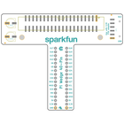
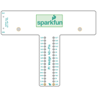
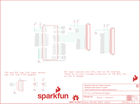

Contents
========

* [PRS13717 > Pi Wedge 40-Pin PreAssembled](#prs13717--pi-wedge-40-pin-preassembled)
	* [Schematic](#schematic)
	* [PCB](#pcb)
	* [Interactive BOM](#interactive-bom)
	* [OOMP Parts](#oomp-parts)
	* [Images](#images)
	* [Tags](#tags)
  
![][im]
# PRS13717 > Pi Wedge 40-Pin PreAssembled

- ID: PROJ-SPAR-13717-STAN-01
- Hex ID: PRS13717
- Name: Sparkfun
- Description: Sparkfun
- Long Link: [http://oom.lt/PROJ-SPAR-13717-STAN-01](http://oom.lt/PROJ-SPAR-13717-STAN-01)
- Short Link: [http://oom.lt/PRS13717](http://oom.lt/PRS13717)

## Schematic
  

## PCB
  

## Interactive BOM

- Interactive BOM page: [ibom.html](https://htmlpreview.github.io/?https://github.com/oomlout/oomlout_OOMP_projects/blob/main/PROJ-SPAR-13717-STAN-01/kicad/bom/ibom.html)

## OOMP Parts
  

|OOMP Parts|
| :---: |
|CAPE-PAND-X-UF47-01 C3V, C5V|
|UNMATCHED-UNMATCHED-X-UNMATCHED-01 JP1, U$2|
|HEAD-I01-X-PI2X20-01 JP2|
|HEAD-I01-X-PI17-01 JP3, JP4|

## Images
  
  

|bominteractivefront|bominteractiveback|kicadPcb3d|kicadPcb3dFront|kicadPcb3dBack|eagleImage|eagleSchemImage|
| :---: | :---: | :---: | :---: | :---: | :---: | :---: |
||||||||

## Tags

- hexID: PRS13717
- oompType: PROJ
- oompSize: SPAR
- oompColor: 13717
- oompDesc: STAN
- oompIndex: 01
- oompName: Pi Wedge 40-Pin PreAssembled
- sources: All source files from https://github.com/sparkfun/Pi_Wedge_40-Pin_PreAssembled (source licence details in srcLicense.md)
- linkBuyPage: https://www.sparkfun.com/products/13717
- oompID: PROJ-SPAR-13717-STAN-01
- oompParts: C3V,CAPE-PAND-X-UF47-01
- oompParts: C5V,CAPE-PAND-X-UF47-01
- oompParts: JP1,UNMATCHED-UNMATCHED-X-UNMATCHED-01
- oompParts: JP2,HEAD-I01-X-PI2X20-01
- oompParts: JP3,HEAD-I01-X-PI17-01
- oompParts: JP4,HEAD-I01-X-PI17-01
- oompParts: U$2,UNMATCHED-UNMATCHED-X-UNMATCHED-01
- rawParts: C3V,47uf,47UF-50V-20%(ELECT),PANASONIC_D,CAP-10547,CAP-10547,
- rawParts: C5V,47uf,47UF-50V-20%(ELECT),PANASONIC_D,CAP-10547,CAP-10547,
- rawParts: FID1,FIDUCIALUFIDUCIAL,FIDUCIALUFIDUCIAL,MICRO-FIDUCIAL,Fiducial Alignment Points,,
- rawParts: FID2,FIDUCIALUFIDUCIAL,FIDUCIALUFIDUCIAL,MICRO-FIDUCIAL,Fiducial Alignment Points,,
- rawParts: FRAME2,FRAME-LETTER,FRAME-LETTER,CREATIVE_COMMONS,Schematic Frame,,
- rawParts: JP1,FTDI Device,FTDI_DEVICERA_SMT,FTDI_DEVICE_RA_SMT,Connector which mates to FTDI basic or FTDI cable.,CONN-08971,
- rawParts: JP2,RASPBERRYPI-40-PIN-GPIO-SMT,RASPBERRYPI-40-PIN-GPIO-SMT,2X20-SHROUDED-SMT,Second Generation Raspberry Pi GPIO Header,CONN-13143,
- rawParts: JP3,1x17,M17KIT,1X17_NO_SILK_KIT,1x17 .1 header,CONN-12294,
- rawParts: JP4,1x17,M17KIT,1X17_NO_SILK_KIT,1x17 .1 header,CONN-12294,
- rawParts: LOGO1,SFE_LOGO_NAME.2_INCH,SFE_LOGO_NAME.2_INCH,SFE_LOGO_NAME_.2,SFE Logo, name only,,
- rawParts: LOGO2,SFE_LOGO_NAME_FLAME.2_INCH,SFE_LOGO_NAME_FLAME.2_INCH,SFE_LOGO_NAME_FLAME_.2,SFE Logo, name and flame,,
- rawParts: LOGO3,SFE_LOGO_FLAME.1_INCH,SFE_LOGO_FLAME.1_INCH,SFE_LOGO_FLAME_.1,SFE Logo, flame only,,
- rawParts: LOGO4,SFE_LOGO_FLAME.1_INCH,SFE_LOGO_FLAME.1_INCH,SFE_LOGO_FLAME_.1,SFE Logo, flame only,,
- rawParts: LOGO5,OSHW-LOGOS,OSHW-LOGOS,OSHW-LOGO-S,Open Source Hardware Logo,,
- rawParts: STANDOFF1,STAND-OFF,STAND-OFF,STAND-OFF,#4 Stand Off,,
- rawParts: STANDOFF2,STAND-OFF,STAND-OFF,STAND-OFF,#4 Stand Off,,
- rawParts: U$2,BREADBOARD_PATTERN,BREADBOARD_PATTERN,BREADBOARD_SPACING,Reference markings that correspond to solderless breadboard row spacing.,,

[im]: kicadPcb3d_450.png
