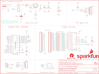

Contents
========

* [PRS13720 > MP3 Trigger](#prs13720--mp3-trigger)
	* [Schematic](#schematic)
	* [PCB](#pcb)
	* [Interactive BOM](#interactive-bom)
	* [OOMP Parts](#oomp-parts)
	* [Images](#images)
	* [Tags](#tags)
  
![][im]
# PRS13720 > MP3 Trigger

- ID: PROJ-SPAR-13720-STAN-01
- Hex ID: PRS13720
- Name: Sparkfun
- Description: Sparkfun
- Long Link: [http://oom.lt/PROJ-SPAR-13720-STAN-01](http://oom.lt/PROJ-SPAR-13720-STAN-01)
- Short Link: [http://oom.lt/PRS13720](http://oom.lt/PRS13720)

## Schematic
  

## PCB
  

## Interactive BOM

- Interactive BOM page: [ibom.html](https://htmlpreview.github.io/?https://github.com/oomlout/oomlout_OOMP_projects/blob/main/PROJ-SPAR-13720-STAN-01/kicad/bom/ibom.html)

## OOMP Parts
  

|OOMP Parts|
| :---: |
|C1 C1,CAPC-0603-X-UF1D-01|
|C2 C2,CAPC-0603-X-UF1D-01|
|C3 C3,CAPX-UNMATCHED-X-UF10-01|
|C4 C4,CAPC-0603-X-UF1D-01|
|C5 C5,CAPX-UNMATCHED-X-UF10-01|
|C6 C6,CAPC-0603-X-UF1D-01|
|C7 C7,CAPX-UNMATCHED-X-UF10-01|
|C8 C8,CAPC-0603-X-UF1D-01|
|C9 C9,CAPC-0603-X-PF22-01|
|C10 C10,CAPC-0603-X-PF22-01|
|C11 C11,CAPC-0603-X-UF1D-01|
|C12 C12,CAPC-0603-X-NF10-01|
|C13 C13,CAPC-0603-X-NF47-01|
|C14 C14,CAPC-0603-X-NF10-01|
|C15 C15,CAPC-0603-X-UF10-01|
|C16 C16,CAPC-0603-X-UF10-01|
|F1 F1,UNMATCHED-1206-X-UNMATCHED-01|
|J1 J1,UNMATCHED-UNMATCHED-X-UNMATCHED-01|
|JP2 JP2,UNMATCHED-UNMATCHED-X-UNMATCHED-01|
|[JP3 HEAD-I01-X-PI06-01 2.54 mm 6 Pin Header](https://github.com/oomlout/oomlout_OOMP_parts/tree/main/HEAD-I01-X-PI06-01/)|
|[JP5 HEAD-I01-X-PI02-01 2.54 mm 2 Pin Header](https://github.com/oomlout/oomlout_OOMP_parts/tree/main/HEAD-I01-X-PI02-01/)|
|[JP9 HEAD-I01-X-PI05-01 2.54 mm 5 Pin Header](https://github.com/oomlout/oomlout_OOMP_parts/tree/main/HEAD-I01-X-PI05-01/)|
|LED1 LED1,LEDS-1206-G-STAN-01|
|LED2 LED2,LEDS-1206-G-STAN-01|
|Q1 Q1,UNMATCHED-UNMATCHED-X-UNMATCHED-01|
|[R1 RESE-0603-X-O102-01 SMD (0603) 1k Ohm Resistor](https://github.com/oomlout/oomlout_OOMP_parts/tree/main/RESE-0603-X-O102-01/)|
|[R2 RESE-0603-X-O331-01 SMD (0603) 330 Ohm Resistor](https://github.com/oomlout/oomlout_OOMP_parts/tree/main/RESE-0603-X-O331-01/)|
|[R3 RESE-0603-X-O105-01 SMD (0603) 1M Ohm Resistor](https://github.com/oomlout/oomlout_OOMP_parts/tree/main/RESE-0603-X-O105-01/)|
|R4 R4,RESE-0603-X-O1003-01|
|[R5 RESE-0603-X-O473-01 SMD (0603) 47k Ohm Resistor](https://github.com/oomlout/oomlout_OOMP_parts/tree/main/RESE-0603-X-O473-01/)|
|[R6 RESE-0603-X-O241-01 SMD (0603) 240 Ohm Resistor](https://github.com/oomlout/oomlout_OOMP_parts/tree/main/RESE-0603-X-O241-01/)|
|R7 R7,RESE-0603-X-O1003-01|
|R8 R8,RESE-0603-X-O1003-01|
|[R9 RESE-0603-X-O200-01 SMD (0603) 20 Ohm Resistor](https://github.com/oomlout/oomlout_OOMP_parts/tree/main/RESE-0603-X-O200-01/)|
|[R10 RESE-0603-X-O200-01 SMD (0603) 20 Ohm Resistor](https://github.com/oomlout/oomlout_OOMP_parts/tree/main/RESE-0603-X-O200-01/)|
|[R11 RESE-0603-X-O200-01 SMD (0603) 20 Ohm Resistor](https://github.com/oomlout/oomlout_OOMP_parts/tree/main/RESE-0603-X-O200-01/)|
|[R12 RESE-0603-X-O102-01 SMD (0603) 1k Ohm Resistor](https://github.com/oomlout/oomlout_OOMP_parts/tree/main/RESE-0603-X-O102-01/)|
|R13 R13,RESE-0603-X-UNMATCHED-01|
|R14 R14,RESE-0603-X-O1003-01|
|R15 R15,RESE-0603-X-O1003-01|
|[R16 RESE-0603-X-O103-01 SMD (0603) 10k Ohm Resistor](https://github.com/oomlout/oomlout_OOMP_parts/tree/main/RESE-0603-X-O103-01/)|
|[R17 RESE-0603-X-O391-01 SMD (0603) 390 Ohm Resistor](https://github.com/oomlout/oomlout_OOMP_parts/tree/main/RESE-0603-X-O391-01/)|
|[R18 RESE-0603-X-O103-01 SMD (0603) 10k Ohm Resistor](https://github.com/oomlout/oomlout_OOMP_parts/tree/main/RESE-0603-X-O103-01/)|
|[R19 RESE-0603-X-O103-01 SMD (0603) 10k Ohm Resistor](https://github.com/oomlout/oomlout_OOMP_parts/tree/main/RESE-0603-X-O103-01/)|
|[R20 RESE-0603-X-O101-01 SMD (0603) 100 Ohm Resistor](https://github.com/oomlout/oomlout_OOMP_parts/tree/main/RESE-0603-X-O101-01/)|
|[R21 RESE-0603-X-O101-01 SMD (0603) 100 Ohm Resistor](https://github.com/oomlout/oomlout_OOMP_parts/tree/main/RESE-0603-X-O101-01/)|
|[R22 RESE-0603-X-O101-01 SMD (0603) 100 Ohm Resistor](https://github.com/oomlout/oomlout_OOMP_parts/tree/main/RESE-0603-X-O101-01/)|
|[R23 RESE-0603-X-O101-01 SMD (0603) 100 Ohm Resistor](https://github.com/oomlout/oomlout_OOMP_parts/tree/main/RESE-0603-X-O101-01/)|
|[R24 RESE-0603-X-O101-01 SMD (0603) 100 Ohm Resistor](https://github.com/oomlout/oomlout_OOMP_parts/tree/main/RESE-0603-X-O101-01/)|
|[R25 RESE-0603-X-O101-01 SMD (0603) 100 Ohm Resistor](https://github.com/oomlout/oomlout_OOMP_parts/tree/main/RESE-0603-X-O101-01/)|
|[R26 RESE-0603-X-O101-01 SMD (0603) 100 Ohm Resistor](https://github.com/oomlout/oomlout_OOMP_parts/tree/main/RESE-0603-X-O101-01/)|
|[R27 RESE-0603-X-O101-01 SMD (0603) 100 Ohm Resistor](https://github.com/oomlout/oomlout_OOMP_parts/tree/main/RESE-0603-X-O101-01/)|
|[R28 RESE-0603-X-O101-01 SMD (0603) 100 Ohm Resistor](https://github.com/oomlout/oomlout_OOMP_parts/tree/main/RESE-0603-X-O101-01/)|
|[R29 RESE-0603-X-O101-01 SMD (0603) 100 Ohm Resistor](https://github.com/oomlout/oomlout_OOMP_parts/tree/main/RESE-0603-X-O101-01/)|
|[R30 RESE-0603-X-O101-01 SMD (0603) 100 Ohm Resistor](https://github.com/oomlout/oomlout_OOMP_parts/tree/main/RESE-0603-X-O101-01/)|
|[R31 RESE-0603-X-O101-01 SMD (0603) 100 Ohm Resistor](https://github.com/oomlout/oomlout_OOMP_parts/tree/main/RESE-0603-X-O101-01/)|
|[R32 RESE-0603-X-O101-01 SMD (0603) 100 Ohm Resistor](https://github.com/oomlout/oomlout_OOMP_parts/tree/main/RESE-0603-X-O101-01/)|
|[R33 RESE-0603-X-O101-01 SMD (0603) 100 Ohm Resistor](https://github.com/oomlout/oomlout_OOMP_parts/tree/main/RESE-0603-X-O101-01/)|
|[R34 RESE-0603-X-O101-01 SMD (0603) 100 Ohm Resistor](https://github.com/oomlout/oomlout_OOMP_parts/tree/main/RESE-0603-X-O101-01/)|
|[R35 RESE-0603-X-O101-01 SMD (0603) 100 Ohm Resistor](https://github.com/oomlout/oomlout_OOMP_parts/tree/main/RESE-0603-X-O101-01/)|
|[R36 RESE-0603-X-O101-01 SMD (0603) 100 Ohm Resistor](https://github.com/oomlout/oomlout_OOMP_parts/tree/main/RESE-0603-X-O101-01/)|
|[R37 RESE-0603-X-O101-01 SMD (0603) 100 Ohm Resistor](https://github.com/oomlout/oomlout_OOMP_parts/tree/main/RESE-0603-X-O101-01/)|
|[R38 RESE-0603-X-O101-01 SMD (0603) 100 Ohm Resistor](https://github.com/oomlout/oomlout_OOMP_parts/tree/main/RESE-0603-X-O101-01/)|
|R39 R39,RESE-0603-X-UNMATCHED-01|
|S1 S1,UNMATCHED-UNMATCHED-X-UNMATCHED-01|
|S2 S2,UNMATCHED-UNMATCHED-X-UNMATCHED-01|
|SJ2 SJ2,UNMATCHED-UNMATCHED-X-UNMATCHED-01|
|SJ3 SJ3,UNMATCHED-UNMATCHED-X-UNMATCHED-01|
|SJ4 SJ4,UNMATCHED-UNMATCHED-X-UNMATCHED-01|
|U1 U1,UNMATCHED-UNMATCHED-X-UNMATCHED-01|
|U2 U2,UNMATCHED-UNMATCHED-X-UNMATCHED-01|
|U3 U3,UNMATCHED-UNMATCHED-X-UNMATCHED-01|
|U4 U4,UNMATCHED-UNMATCHED-X-UNMATCHED-01|
|U5 U5,UNMATCHED-UNMATCHED-X-UNMATCHED-01|
|U7 U7,UNMATCHED-UNMATCHED-X-UNMATCHED-01|
|U9 U9,UNMATCHED-UNMATCHED-X-UNMATCHED-01|
|U10 U10,UNMATCHED-UNMATCHED-X-UNMATCHED-01|

## Images
  
  

|kicadPcb3d|kicadPcb3dFront|kicadPcb3dBack|eagleImage|eagleSchemImage|
| :---: | :---: | :---: | :---: | :---: |
||||||

## Tags

- hexID: PRS13720
- oompType: PROJ
- oompSize: SPAR
- oompColor: 13720
- oompDesc: STAN
- oompIndex: 01
- oompName: MP3 Trigger
- sources: All source files from https://github.com/sparkfun/MP3_Trigger (source licence details in srcLicense.md)
- linkBuyPage: https://www.sparkfun.com/products/13720
- oompID: PROJ-SPAR-13720-STAN-01
- oompParts: C1,CAPC-0603-X-UF1D-01
- oompParts: C2,CAPC-0603-X-UF1D-01
- oompParts: C3,CAPX-UNMATCHED-X-UF10-01
- oompParts: C4,CAPC-0603-X-UF1D-01
- oompParts: C5,CAPX-UNMATCHED-X-UF10-01
- oompParts: C6,CAPC-0603-X-UF1D-01
- oompParts: C7,CAPX-UNMATCHED-X-UF10-01
- oompParts: C8,CAPC-0603-X-UF1D-01
- oompParts: C9,CAPC-0603-X-PF22-01
- oompParts: C10,CAPC-0603-X-PF22-01
- oompParts: C11,CAPC-0603-X-UF1D-01
- oompParts: C12,CAPC-0603-X-NF10-01
- oompParts: C13,CAPC-0603-X-NF47-01
- oompParts: C14,CAPC-0603-X-NF10-01
- oompParts: C15,CAPC-0603-X-UF10-01
- oompParts: C16,CAPC-0603-X-UF10-01
- oompParts: F1,UNMATCHED-1206-X-UNMATCHED-01
- oompParts: J1,UNMATCHED-UNMATCHED-X-UNMATCHED-01
- oompParts: JP2,UNMATCHED-UNMATCHED-X-UNMATCHED-01
- oompParts: JP3,HEAD-I01-X-PI06-01
- oompParts: JP5,HEAD-I01-X-PI02-01
- oompParts: JP9,HEAD-I01-X-PI05-01
- oompParts: LED1,LEDS-1206-G-STAN-01
- oompParts: LED2,LEDS-1206-G-STAN-01
- oompParts: Q1,UNMATCHED-UNMATCHED-X-UNMATCHED-01
- oompParts: R1,RESE-0603-X-O102-01
- oompParts: R2,RESE-0603-X-O331-01
- oompParts: R3,RESE-0603-X-O105-01
- oompParts: R4,RESE-0603-X-O1003-01
- oompParts: R5,RESE-0603-X-O473-01
- oompParts: R6,RESE-0603-X-O241-01
- oompParts: R7,RESE-0603-X-O1003-01
- oompParts: R8,RESE-0603-X-O1003-01
- oompParts: R9,RESE-0603-X-O200-01
- oompParts: R10,RESE-0603-X-O200-01
- oompParts: R11,RESE-0603-X-O200-01
- oompParts: R12,RESE-0603-X-O102-01
- oompParts: R13,RESE-0603-X-UNMATCHED-01
- oompParts: R14,RESE-0603-X-O1003-01
- oompParts: R15,RESE-0603-X-O1003-01
- oompParts: R16,RESE-0603-X-O103-01
- oompParts: R17,RESE-0603-X-O391-01
- oompParts: R18,RESE-0603-X-O103-01
- oompParts: R19,RESE-0603-X-O103-01
- oompParts: R20,RESE-0603-X-O101-01
- oompParts: R21,RESE-0603-X-O101-01
- oompParts: R22,RESE-0603-X-O101-01
- oompParts: R23,RESE-0603-X-O101-01
- oompParts: R24,RESE-0603-X-O101-01
- oompParts: R25,RESE-0603-X-O101-01
- oompParts: R26,RESE-0603-X-O101-01
- oompParts: R27,RESE-0603-X-O101-01
- oompParts: R28,RESE-0603-X-O101-01
- oompParts: R29,RESE-0603-X-O101-01
- oompParts: R30,RESE-0603-X-O101-01
- oompParts: R31,RESE-0603-X-O101-01
- oompParts: R32,RESE-0603-X-O101-01
- oompParts: R33,RESE-0603-X-O101-01
- oompParts: R34,RESE-0603-X-O101-01
- oompParts: R35,RESE-0603-X-O101-01
- oompParts: R36,RESE-0603-X-O101-01
- oompParts: R37,RESE-0603-X-O101-01
- oompParts: R38,RESE-0603-X-O101-01
- oompParts: R39,RESE-0603-X-UNMATCHED-01
- oompParts: S1,UNMATCHED-UNMATCHED-X-UNMATCHED-01
- oompParts: S2,UNMATCHED-UNMATCHED-X-UNMATCHED-01
- oompParts: SJ2,UNMATCHED-UNMATCHED-X-UNMATCHED-01
- oompParts: SJ3,UNMATCHED-UNMATCHED-X-UNMATCHED-01
- oompParts: SJ4,UNMATCHED-UNMATCHED-X-UNMATCHED-01
- oompParts: U1,UNMATCHED-UNMATCHED-X-UNMATCHED-01
- oompParts: U2,UNMATCHED-UNMATCHED-X-UNMATCHED-01
- oompParts: U3,UNMATCHED-UNMATCHED-X-UNMATCHED-01
- oompParts: U4,UNMATCHED-UNMATCHED-X-UNMATCHED-01
- oompParts: U5,UNMATCHED-UNMATCHED-X-UNMATCHED-01
- oompParts: U7,UNMATCHED-UNMATCHED-X-UNMATCHED-01
- oompParts: U9,UNMATCHED-UNMATCHED-X-UNMATCHED-01
- oompParts: U10,UNMATCHED-UNMATCHED-X-UNMATCHED-01
- rawParts: C1,0.1uF,0.1UF-25V(+80/-20%)(0603),0603-CAP,CAP-00810,,CAP-00810,,0.1uF,,
- rawParts: C2,0.1uF,0.1UF-25V(+80/-20%)(0603),0603-CAP,CAP-00810,,CAP-00810,,0.1uF,,
- rawParts: C3,10uF,10UF-16V-10%(TANT),EIA3216,CAP-00811,,CAP-00811,,10uF,,
- rawParts: C4,0.1uF,0.1UF-25V(+80/-20%)(0603),0603-CAP,CAP-00810,,CAP-00810,,0.1uF,,
- rawParts: C5,10uF,10UF-16V-10%(TANT),EIA3216,CAP-00811,,CAP-00811,,10uF,,
- rawParts: C6,0.1uF,0.1UF-25V(+80/-20%)(0603),0603-CAP,CAP-00810,,CAP-00810,,0.1uF,,
- rawParts: C7,10uF,10UF-16V-10%(TANT),EIA3216,CAP-00811,,CAP-00811,,10uF,,
- rawParts: C8,0.1uF,0.1UF-25V(+80/-20%)(0603),0603-CAP,CAP-00810,,CAP-00810,,0.1uF,,
- rawParts: C9,22pF,22PF-50V-5%(0603),0603-CAP,CAP-07876,,CAP-07876,,22pF,,
- rawParts: C10,22pF,22PF-50V-5%(0603),0603-CAP,CAP-07876,,CAP-07876,,22pF,,
- rawParts: C11,0.1uF,0.1UF-25V(+80/-20%)(0603),0603-CAP,CAP-00810,,CAP-00810,,0.1uF,,
- rawParts: C12,10nF,10NF/10000PF-50V-10%(0603),0603-CAP,CAP-00867,,CAP-00867,,10nF,,
- rawParts: C13,47nF,47NF(0.047UF/47000PF)-25V-5%(0603)SMD,0603-CAP,CAP-08605,,CAP-08605,,47nF,,
- rawParts: C14,10nF,10NF/10000PF-50V-10%(0603),0603-CAP,CAP-00867,,CAP-00867,,10nF,,
- rawParts: C15,10uF,10UF-6.3V-20%(0603),0603-CAP,CAP-11015,,CAP-11015,,10uF,,
- rawParts: C16,10uF,10UF-6.3V-20%(0603),0603-CAP,CAP-11015,,CAP-11015,,10uF,,
- rawParts: F1,PTC,PTCTHERMISTOR1206,PTC-1206,Resettable Fuse PTC,,RES-08585,,,,
- rawParts: FRAME1,FRAME-LETTERNO_PACKAGE,FRAME-LETTERNO_PACKAGE,DUMMY,Schematic Frame,Nobody,,,,v01,
- rawParts: FRAME3,FRAME-LETTER,FRAME-LETTER,CREATIVE_COMMONS,Schematic Frame,,,,,,
- rawParts: J1,POWER_JACKTOE,POWER_JACKTOE,POWER_JACK_SMD_OVERPASTE_TOE,Power Jack,,CONN-08106,PRT-12748,,,
- rawParts: JP2,AUDIO-JACK,AUDIO-JACKSMD2,AUDIO-JACK-3.5MM-SMD,3.5mm Audio Jack,,CONN-10353,,,,
- rawParts: JP3,FTDI Basic,M06SIP,1X06,Header 6,,,,,,
- rawParts: JP5,TestPoints,M02PTH,1X02,Header 2,,,,,,
- rawParts: JP6,FIDUCIAL1X2,FIDUCIAL1X2,FIDUCIAL-1X2,Fiducial Alignment Points,,,,,,
- rawParts: JP7,FIDUCIAL1X2,FIDUCIAL1X2,FIDUCIAL-1X2,Fiducial Alignment Points,,,,,,
- rawParts: JP9,ISSP,M05PTH,1X05,Header 5,,,,,,
- rawParts: LED1,RED,LED-RED1206,LED-1206,Assorted Red LEDs,,DIO-09912,,RED,,
- rawParts: LED2,GREEN,LED-GREEN1206,LED-1206,Various green LEDs,,DIO-00862,,GREEN,,
- rawParts: LOGO1,SFE_LOGO_FLAME.3_INCH,SFE_LOGO_FLAME.3_INCH,SFE_LOGO_FLAME_.3,SFE Logo, flame only,,,,,,
- rawParts: LOGO3,OSHW-LOGOM,OSHW-LOGOM,OSHW-LOGO-M,Open Source Hardware Logo,,,,,,
- rawParts: Q1,12.288MHz,CRYSTALCRYSTAL-SMD-5X3-12.288MHZ,CRYSTAL-SMD-5X3,Various standard crystals. Proven footprints.,,XTAL-09653,,,,
- rawParts: R1,1K,1KOHM-1/10W-1%(0603),0603-RES,RES-07856,,RES-07856,,1K,,
- rawParts: R2,330,330OHM1/10W1%(0603),0603-RES,RES-00818,,RES-00818,,330,,
- rawParts: R3,1M,1MOHM-1/10W-1%(0603),0603-RES,RES-07868,,RES-07868,,1M,,
- rawParts: R4,100k,100KOHM-1/10W-1%(0603),0603-RES,RES-07828,,RES-07828,,100k,,
- rawParts: R5,47K,47KOHM1/10W1%(0603),0603-RES,RES-07871,,RES-07871,,47K,,
- rawParts: R6,240,240OHM1/10W1%(0603),0603-RES,RES-07849,,RES-07849,,240,,
- rawParts: R7,100k,100KOHM-1/10W-1%(0603),0603-RES,RES-07828,,RES-07828,,100k,,
- rawParts: R8,100k,100KOHM-1/10W-1%(0603),0603-RES,RES-07828,,RES-07828,,100k,,
- rawParts: R9,20,20OHM1/10W1%(0603)SMD,0603-RES,RES-07862,,RES-07862,,20,,
- rawParts: R10,20,20OHM1/10W1%(0603)SMD,0603-RES,RES-07862,,RES-07862,,20,,
- rawParts: R11,20,20OHM1/10W1%(0603)SMD,0603-RES,RES-07862,,RES-07862,,20,,
- rawParts: R12,1K,1KOHM-1/10W-1%(0603),0603-RES,RES-07856,,RES-07856,,1K,,
- rawParts: R13,100/.25W,100OHM-1/4W-5%(0603),0603-RES,,,RES-12438,,100/.25W,,
- rawParts: R14,100k,100KOHM-1/10W-1%(0603),0603-RES,RES-07828,,RES-07828,,100k,,
- rawParts: R15,100k,100KOHM-1/10W-1%(0603),0603-RES,RES-07828,,RES-07828,,100k,,
- rawParts: R16,10K,10KOHM-1/10W-1%(0603)0603,0603-RES,RES-00824,,RES-00824,,10K,,
- rawParts: R17,390,390OHM1/10W1%(0603),0603-RES,RES-07864,,RES-07864,,390,,
- rawParts: R18,10K,10KOHM-1/10W-1%(0603)0603,0603-RES,RES-00824,,RES-00824,,10K,,
- rawParts: R19,10K,10KOHM-1/10W-1%(0603)0603,0603-RES,RES-00824,,RES-00824,,10K,,
- rawParts: R20,100,100OHM-1/10W-1%(0603),0603-RES,RES-07863,,RES-07863,,100,,
- rawParts: R21,100,100OHM-1/10W-1%(0603),0603-RES,RES-07863,,RES-07863,,100,,
- rawParts: R22,100,100OHM-1/10W-1%(0603),0603-RES,RES-07863,,RES-07863,,100,,
- rawParts: R23,100,100OHM-1/10W-1%(0603),0603-RES,RES-07863,,RES-07863,,100,,
- rawParts: R24,100,100OHM-1/10W-1%(0603),0603-RES,RES-07863,,RES-07863,,100,,
- rawParts: R25,100,100OHM-1/10W-1%(0603),0603-RES,RES-07863,,RES-07863,,100,,
- rawParts: R26,100,100OHM-1/10W-1%(0603),0603-RES,RES-07863,,RES-07863,,100,,
- rawParts: R27,100,100OHM-1/10W-1%(0603),0603-RES,RES-07863,,RES-07863,,100,,
- rawParts: R28,100,100OHM-1/10W-1%(0603),0603-RES,RES-07863,,RES-07863,,100,,
- rawParts: R29,100,100OHM-1/10W-1%(0603),0603-RES,RES-07863,,RES-07863,,100,,
- rawParts: R30,100,100OHM-1/10W-1%(0603),0603-RES,RES-07863,,RES-07863,,100,,
- rawParts: R31,100,100OHM-1/10W-1%(0603),0603-RES,RES-07863,,RES-07863,,100,,
- rawParts: R32,100,100OHM-1/10W-1%(0603),0603-RES,RES-07863,,RES-07863,,100,,
- rawParts: R33,100,100OHM-1/10W-1%(0603),0603-RES,RES-07863,,RES-07863,,100,,
- rawParts: R34,100,100OHM-1/10W-1%(0603),0603-RES,RES-07863,,RES-07863,,100,,
- rawParts: R35,100,100OHM-1/10W-1%(0603),0603-RES,RES-07863,,RES-07863,,100,,
- rawParts: R36,100,100OHM-1/10W-1%(0603),0603-RES,RES-07863,,RES-07863,,100,,
- rawParts: R37,100,100OHM-1/10W-1%(0603),0603-RES,RES-07863,,RES-07863,,100,,
- rawParts: R38,100,100OHM-1/10W-1%(0603),0603-RES,RES-07863,,RES-07863,,100,,
- rawParts: R39,100/.25W,100OHM-1/4W-5%(0603),0603-RES,,,RES-12438,,100/.25W,,
- rawParts: S1,NAV_SWITCHSMD,NAV_SWITCHSMD,NAV_SWITCH,Navigation Switch,,SWCH-08301,,,,
- rawParts: S2,DPDT,SWITCH-DPDTAYZ0202,AYZ0202,DPDT Version of the COM-00597,,SWCH-08179,,DPDT,,
- rawParts: SJ1,UART Power,JUMPER-PAD-3-2OF3_NC_BY_PASTE,PAD-JUMPER-3-2OF3_NC_BY_PASTE_YES_SILK_FULL_BOX,,,,,,,
- rawParts: SJ2,AudioLeft,JUMPER_PAD-3-1&2_NC_BY_PASTE,PAD-HUMPER-3-1&2_NC_BY_PASTE_YES_SILK_FULL_BOX,,,,,,,
- rawParts: SJ3,AudioRight,JUMPER_PAD-3-1&2_NC_BY_PASTE,PAD-HUMPER-3-1&2_NC_BY_PASTE_YES_SILK_FULL_BOX,,,,,,,
- rawParts: SJ4,AudioGND,JUMPER_PAD-3-1&2_NC_BY_PASTE,PAD-HUMPER-3-1&2_NC_BY_PASTE_YES_SILK_FULL_BOX,,,,,,,
- rawParts: U$1,SFE_LOGO_NAME_FLAME.2_INCH,SFE_LOGO_NAME_FLAME.2_INCH,SFE_LOGO_NAME_FLAME_.2,SFE Logo, name and flame,,,,,,
- rawParts: U$4,REVISION,REVISION,REVISION,,,,,,,
- rawParts: U$12,STAND-OFF,STAND-OFF,STAND-OFF,#4 Stand Off,,,,,,
- rawParts: U$13,STAND-OFF,STAND-OFF,STAND-OFF,#4 Stand Off,,,,,,
- rawParts: U$14,STAND-OFF,STAND-OFF,STAND-OFF,#4 Stand Off,,,,,,
- rawParts: U$15,STAND-OFF,STAND-OFF,STAND-OFF,#4 Stand Off,,,,,,
- rawParts: U1,CY8C29466,CY8C29466-24,SOIC-28,CYPRESS MCU 32K FLASH 2K SRAM 28-SOIC,,IC-08972,,,,
- rawParts: U2,USD-SOCKET,USD-SOCKET,MICROSD_1:1,microSD Socket,,CONN-07820,,,,
- rawParts: U3,MUX-74HC4067SMD,MUX-74HC4067SMD,SSOP24,16-channel analog MUX,,IC-08252,,,,
- rawParts: U4,LM1117,V_REG_LM1117SOT223,SOT223,Voltage Regulator LM1117,,VREG-08170,,,,
- rawParts: U5,1.8V Reg,V_REG_LDOSMD2,SC70,Voltage Regulator LDO,,VREG-08428,,,,
- rawParts: U7,VS1063,VS1063SMD,LQFP-48,,,IC-10870,,,,
- rawParts: U9,M18_,M18_,1X18,,,,,,,
- rawParts: U10,M18_,M18_,1X18,,,,,,,

[im]: kicadPcb3d_450.png
