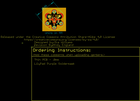
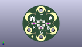
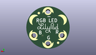
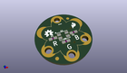

Contents
========

* [PROJ-SPAR-13735-STAN-01>LilyPad Tri-Color LED](#proj-spar-13735-stan-01lilypad-tri-color-led)
	* [Images](#images)
	* [Interactive BOM](#interactive-bom)
	* [OOMP Parts](#oomp-parts)
	* [Tags](#tags)
  
![][im]
# PROJ-SPAR-13735-STAN-01>LilyPad Tri-Color LED

- ID: PROJ-SPAR-13735-STAN-01
- Hex ID: PRS13735
- Name: LilyPad Tri-Color LED
- Description: 

## Images
  
  

|eagleImage|kicadPcb3dFront|kicadPcb3dBack|kicadPcb3d|
| :---: | :---: | :---: | :---: |
|||||

## Interactive BOM

- Interactive BOM page: [ibom.html](kicad/bom/ibom.html)

## OOMP Parts
  

|OOMP Parts|
| :---: |
|UNMATCHED-UNMATCHED-X-UNMATCHED-01, D2, 11.0109, 10.998199999999999, 0,D2, XZM2CRKM2DGFBB45SCCB, PLCC4SMDLED, SparkFun-LED, (0.4335, 0.433), R0|
|RESE-0603-X-UNMATCHED-01, R1, 7.200899999999999, 10.998199999999999, 0,R1, 200, 0603, SparkFun-Resistors, (0.2835, 0.433), R0|
|RESE-0603-X-UNMATCHED-01, R2, 14.8209, 10.998199999999999, 180,R2, 100, 0603, SparkFun-Resistors, (0.5835, 0.433), R180|
|RESE-0603-X-UNMATCHED-01, R3, 11.0109, 8.4582, 0,R3, 100, 0603, SparkFun-Resistors, (0.4335, 0.333), R0|
|UNMATCHED-UNMATCHED-X-UNMATCHED-01, U$7, 4.5085, 7.238999999999999, 300,U$7, SEWTAP6, PETAL-SMALL-2SIDE, LilyPad-Wearables, (0.1775, 0.285), R300|
|UNMATCHED-UNMATCHED-X-UNMATCHED-01, U$8, 11.0109, 3.3782, 0,U$8, SEWTAP6, PETAL-SMALL-2SIDE, LilyPad-Wearables, (0.4335, 0.133), R0|
|UNMATCHED-UNMATCHED-X-UNMATCHED-01, U$9, 17.513299999999997, 7.238999999999999, 60,U$9, SEWTAP6, PETAL-SMALL-2SIDE, LilyPad-Wearables, (0.6895, 0.285), R60|
|UNMATCHED-UNMATCHED-X-UNMATCHED-01, U$10, 11.0109, 18.4912, 180,U$10, SEWTAP6, PETAL-SMALL-2SIDE, LilyPad-Wearables, (0.4335, 0.728), R180|

## Tags

- hexID: PRS13735
- oompType: PROJ
- oompSize: SPAR
- oompColor: 13735
- oompDesc: STAN
- oompIndex: 01
- oompName: LilyPad Tri-Color LED
- sources: All source files from https://github.com/sparkfun/LilyPad_Tri-Color_LED (source licence details in srcLicense.md)
- linkBuyPage: https://www.sparkfun.com/products/13735
- oompPart: UNMATCHED-UNMATCHED-X-UNMATCHED-01, D2, 11.0109, 10.998199999999999, 0
- oompPart: SKIP-UNMATCHED-X-UNMATCHED-01, FD1, 6.35, 3.8099999999999996, 0
- oompPart: SKIP-UNMATCHED-X-UNMATCHED-01, FD2, 6.35, 3.8099999999999996, M0
- oompPart: SKIP-UNMATCHED-X-UNMATCHED-01, FD3, 15.239999999999998, 17.779999999999998, 0
- oompPart: SKIP-UNMATCHED-X-UNMATCHED-01, FD4, 15.239999999999998, 17.779999999999998, M0
- oompPart: RESE-0603-X-UNMATCHED-01, R1, 7.200899999999999, 10.998199999999999, 0
- oompPart: RESE-0603-X-UNMATCHED-01, R2, 14.8209, 10.998199999999999, 180
- oompPart: RESE-0603-X-UNMATCHED-01, R3, 11.0109, 8.4582, 0
- oompPart: UNMATCHED-UNMATCHED-X-UNMATCHED-01, U$7, 4.5085, 7.238999999999999, 300
- oompPart: UNMATCHED-UNMATCHED-X-UNMATCHED-01, U$8, 11.0109, 3.3782, 0
- oompPart: UNMATCHED-UNMATCHED-X-UNMATCHED-01, U$9, 17.513299999999997, 7.238999999999999, 60
- oompPart: UNMATCHED-UNMATCHED-X-UNMATCHED-01, U$10, 11.0109, 18.4912, 180
- rawPart: D2, XZM2CRKM2DGFBB45SCCB, PLCC4SMDLED, SparkFun-LED, (0.4335, 0.433), R0
- rawPart: FD1, FIDUCIAL1X2, FIDUCIAL-1X2, SparkFun-Aesthetics, (0.25, 0.15), R0
- rawPart: FD2, FIDUCIAL1X2, FIDUCIAL-1X2, SparkFun-Aesthetics, (0.25, 0.15), MR0
- rawPart: FD3, FIDUCIAL1X2, FIDUCIAL-1X2, SparkFun-Aesthetics, (0.6, 0.7), R0
- rawPart: FD4, FIDUCIAL1X2, FIDUCIAL-1X2, SparkFun-Aesthetics, (0.6, 0.7), MR0
- rawPart: R1, 200, 0603, SparkFun-Resistors, (0.2835, 0.433), R0
- rawPart: R2, 100, 0603, SparkFun-Resistors, (0.5835, 0.433), R180
- rawPart: R3, 100, 0603, SparkFun-Resistors, (0.4335, 0.333), R0
- rawPart: U$7, SEWTAP6, PETAL-SMALL-2SIDE, LilyPad-Wearables, (0.1775, 0.285), R300
- rawPart: U$8, SEWTAP6, PETAL-SMALL-2SIDE, LilyPad-Wearables, (0.4335, 0.133), R0
- rawPart: U$9, SEWTAP6, PETAL-SMALL-2SIDE, LilyPad-Wearables, (0.6895, 0.285), R60
- rawPart: U$10, SEWTAP6, PETAL-SMALL-2SIDE, LilyPad-Wearables, (0.4335, 0.728), R180
- oompID: PROJ-SPAR-13735-STAN-01

[im]: kicadPcb3d_450.png
