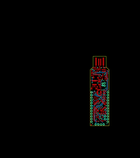
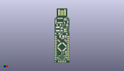
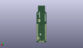
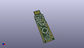

Contents
========

* [PROJ-SPAR-13741-STAN-01>RedStick](#proj-spar-13741-stan-01redstick)
	* [Images](#images)
	* [Interactive BOM](#interactive-bom)
	* [Tags](#tags)
  
![][im]
# PROJ-SPAR-13741-STAN-01>RedStick

- ID: PROJ-SPAR-13741-STAN-01
- Hex ID: PRS13741
- Name: RedStick
- Description: 

## Images
  
  

|eagleImage|kicadPcb3dFront|kicadPcb3dBack|kicadPcb3d|
| :---: | :---: | :---: | :---: |
|||||

## Interactive BOM

- Interactive BOM page: [ibom.html](kicad/bom/ibom.html)

## Tags

- hexID: PRS13741
- oompType: PROJ
- oompSize: SPAR
- oompColor: 13741
- oompDesc: STAN
- oompIndex: 01
- oompName: RedStick
- sources: All source files from https://github.com/sparkfun/RedStick (source licence details in srcLicense.md)
- linkBuyPage: https://www.sparkfun.com/products/13741
- oompID: PROJ-SPAR-13741-STAN-01
- oompParts: C3,UNMATCHED-UNMATCHED-UNMATCHED-UNMATCHED-UNMATCHED
- oompParts: C4,UNMATCHED-UNMATCHED-UNMATCHED-UNMATCHED-UNMATCHED
- oompParts: C5,UNMATCHED-UNMATCHED-UNMATCHED-UNMATCHED-UNMATCHED
- oompParts: C6,UNMATCHED-UNMATCHED-UNMATCHED-UNMATCHED-UNMATCHED
- oompParts: C7,UNMATCHED-UNMATCHED-UNMATCHED-UNMATCHED-UNMATCHED
- oompParts: C8,UNMATCHED-UNMATCHED-UNMATCHED-UNMATCHED-UNMATCHED
- oompParts: C9,UNMATCHED-UNMATCHED-UNMATCHED-UNMATCHED-UNMATCHED
- oompParts: C10,UNMATCHED-UNMATCHED-UNMATCHED-UNMATCHED-UNMATCHED
- oompParts: C11,UNMATCHED-UNMATCHED-UNMATCHED-UNMATCHED-UNMATCHED
- oompParts: D1,UNMATCHED-UNMATCHED-UNMATCHED-UNMATCHED-UNMATCHED
- oompParts: D2,UNMATCHED-UNMATCHED-UNMATCHED-UNMATCHED-UNMATCHED
- oompParts: D3,UNMATCHED-UNMATCHED-UNMATCHED-UNMATCHED-UNMATCHED
- oompParts: D4,UNMATCHED-UNMATCHED-UNMATCHED-UNMATCHED-UNMATCHED
- oompParts: FRAME2,UNMATCHED-UNMATCHED-UNMATCHED-UNMATCHED-UNMATCHED
- oompParts: JP1,UNMATCHED-UNMATCHED-UNMATCHED-UNMATCHED-UNMATCHED
- oompParts: JP2,UNMATCHED-UNMATCHED-UNMATCHED-UNMATCHED-UNMATCHED
- oompParts: JP3,UNMATCHED-UNMATCHED-UNMATCHED-UNMATCHED-UNMATCHED
- oompParts: JP5,UNMATCHED-UNMATCHED-UNMATCHED-UNMATCHED-UNMATCHED
- oompParts: JP6,UNMATCHED-UNMATCHED-UNMATCHED-UNMATCHED-UNMATCHED
- oompParts: JP7,UNMATCHED-UNMATCHED-UNMATCHED-UNMATCHED-UNMATCHED
- oompParts: JP8,UNMATCHED-UNMATCHED-UNMATCHED-UNMATCHED-UNMATCHED
- oompParts: L1,UNMATCHED-UNMATCHED-UNMATCHED-UNMATCHED-UNMATCHED
- oompParts: LOGO1,UNMATCHED-UNMATCHED-UNMATCHED-UNMATCHED-UNMATCHED
- oompParts: LOGO2,UNMATCHED-UNMATCHED-UNMATCHED-UNMATCHED-UNMATCHED
- oompParts: Q1,UNMATCHED-UNMATCHED-UNMATCHED-UNMATCHED-UNMATCHED
- oompParts: Q2,UNMATCHED-UNMATCHED-UNMATCHED-UNMATCHED-UNMATCHED
- oompParts: R1,UNMATCHED-UNMATCHED-UNMATCHED-UNMATCHED-UNMATCHED
- oompParts: R2,UNMATCHED-UNMATCHED-UNMATCHED-UNMATCHED-UNMATCHED
- oompParts: R3,UNMATCHED-UNMATCHED-UNMATCHED-UNMATCHED-UNMATCHED
- oompParts: R4,UNMATCHED-UNMATCHED-UNMATCHED-UNMATCHED-UNMATCHED
- oompParts: R5,UNMATCHED-UNMATCHED-UNMATCHED-UNMATCHED-UNMATCHED
- oompParts: R6,UNMATCHED-UNMATCHED-UNMATCHED-UNMATCHED-UNMATCHED
- oompParts: R7,UNMATCHED-UNMATCHED-UNMATCHED-UNMATCHED-UNMATCHED
- oompParts: R8,UNMATCHED-UNMATCHED-UNMATCHED-UNMATCHED-UNMATCHED
- oompParts: S1,UNMATCHED-UNMATCHED-UNMATCHED-UNMATCHED-UNMATCHED
- oompParts: U$1,UNMATCHED-UNMATCHED-UNMATCHED-UNMATCHED-UNMATCHED
- oompParts: U1,UNMATCHED-UNMATCHED-UNMATCHED-UNMATCHED-UNMATCHED
- oompParts: U2,UNMATCHED-UNMATCHED-UNMATCHED-UNMATCHED-UNMATCHED
- oompParts: U3,UNMATCHED-UNMATCHED-UNMATCHED-UNMATCHED-UNMATCHED
- oompParts: Y1,UNMATCHED-UNMATCHED-UNMATCHED-UNMATCHED-UNMATCHED
- rawParts: C3,0.1uF,0.1UF-25V(+80/-20%)(0603),0603-CAP,CAP-00810,,CAP-00810,,0.1uF,
- rawParts: C4,0.1uF,0.1UF-25V(+80/-20%)(0603),0603-CAP,CAP-00810,,CAP-00810,,0.1uF,
- rawParts: C5,0.1uF,0.1UF-25V(+80/-20%)(0603),0603-CAP,CAP-00810,,CAP-00810,,0.1uF,
- rawParts: C6,0.1uF,0.1UF-25V(+80/-20%)(0603),0603-CAP,CAP-00810,,CAP-00810,,0.1uF,
- rawParts: C7,0.1uF,0.1UF-25V(+80/-20%)(0603),0603-CAP,CAP-00810,,CAP-00810,,0.1uF,
- rawParts: C8,0.1uF,0.1UF-25V(+80/-20%)(0603),0603-CAP,CAP-00810,,CAP-00810,,0.1uF,
- rawParts: C9,10uF,10UF-16V-10%(TANT),EIA3216,CAP-00811,,CAP-00811,,10uF,
- rawParts: C10,68uF,68UF-10V-10%(TANT),EIA3528,CAP-10790,,CAP-10790,,68uF,
- rawParts: C11,0.1uF,0.1UF-25V(+80/-20%)(0603),0603-CAP,CAP-00810,,CAP-00810,,0.1uF,
- rawParts: D1,MBRA140,DIODE-SCHOTTKY-MBRA140,SMA-DIODE,Schottky diodes in SFEs production catalog,,DIO-08053,,MBRA140,
- rawParts: D2,RED,LED-RED0603,LED-0603,Assorted Red LEDs,,DIO-00819,,RED,
- rawParts: D3,GREEN,LED-GREEN0603,LED-0603,Various green LEDs,,DIO-00821,,GREEN,
- rawParts: D4,MBRA140,DIODE-SCHOTTKY-MBRA140,SMA-DIODE,Schottky diodes in SFEs production catalog,,DIO-08053,,MBRA140,
- rawParts: FID1,FIDUCIAL1X2,FIDUCIAL1X2,FIDUCIAL-1X2,Fiducial Alignment Points,,,,,
- rawParts: FID2,FIDUCIAL1X2,FIDUCIAL1X2,FIDUCIAL-1X2,Fiducial Alignment Points,,,,,
- rawParts: FRAME2,FRAME-LEDGER,FRAME-LEDGER,CREATIVE_COMMONS,Schematic Frame,,,,,
- rawParts: JP1,USBPCB_NOPASTE,USBPCB_NOPASTE,USB-A-PCB-NOPASTE,USB Connectors,,,,,
- rawParts: JP2,DNP,M12NO_SILK,1X12_NO_SILK,Header 12,,,,,
- rawParts: JP3,DNP,M12NO_SILK,1X12_NO_SILK,Header 12,,,,,
- rawParts: JP5,M021X02_NO_SILK,M021X02_NO_SILK,1X02_NO_SILK,Standard 2-pin 0.1 header. Use with,,,,,
- rawParts: JP6,M021X02_NO_SILK,M021X02_NO_SILK,1X02_NO_SILK,Standard 2-pin 0.1 header. Use with,,,,,
- rawParts: JP7,DNP,M02JST-PTH-2,JST-2-PTH,Standard 2-pin 0.1 header. Use with,,CONN-09863,PRT-09914,,
- rawParts: JP8,DNP,M04NO_SILK_ALL_ROUND,1X04_NO_SILK_ALL_ROUND,Header 4,,,,,
- rawParts: L1,47uH,INDUCTORCR54-47UH,CR54,Inductors,,NDUC-10789,,47uH,
- rawParts: LOGO1,SFE_LOGO_FLAME.1_INCH,SFE_LOGO_FLAME.1_INCH,SFE_LOGO_FLAME_.1,SFE Logo, flame only,,,,,
- rawParts: LOGO2,OSHW-LOGOS,OSHW-LOGOS,OSHW-LOGO-S,Open Source Hardware Logo,,,,,
- rawParts: Q1,DMG2307L,MOSFET-PCHANNELDMG2307L,SOT23-3,Generic PMOSFET,,TRANS-11308,,2.5A/30V,
- rawParts: Q2,MOSFET-NCHANNEL2N7002PW,MOSFET-NCHANNEL2N7002PW,SOT323,Common NMOSFET Parts,,TRANS-11151,,,
- rawParts: R1,100k,100KOHM-1/10W-1%(0603),0603-RES,RES-07828,,RES-07828,,100k,
- rawParts: R2,6.8K,6.8KOHM1/10W1%(0603),0603-RES,RES-08597,,RES-08597,,6.8K,
- rawParts: R3,10K,10KOHM-1/10W-1%(0603)0603,0603-RES,RES-00824,,RES-00824,,10K,
- rawParts: R4,2.2k,2.2KOHM-1/10W-1%(0603),0603-RES,RES-08272,,RES-08272,,2.2k,
- rawParts: R5,1K,1KOHM-1/10W-1%(0603),0603-RES,RES-07856,,RES-07856,,1K,
- rawParts: R6,1K,1KOHM-1/10W-1%(0603),0603-RES,RES-07856,,RES-07856,,1K,
- rawParts: R7,10K,10KOHM-1/10W-1%(0603)0603,0603-RES,RES-00824,,RES-00824,,10K,
- rawParts: R8,10K,10KOHM-1/10W-1%(0603)0603,0603-RES,RES-00824,,RES-00824,,10K,
- rawParts: S1,SWITCH-MOMENTARY-2SMD-REDUNDANT,SWITCH-MOMENTARY-2SMD-REDUNDANT,TACTILE-SWITCH-SMD,Various NO switches- pushbuttons, reed, etc,Reset,SWCH-08247,,,
- rawParts: U$1,SFE_LOGO_NAME_FLAME.1_INCH,SFE_LOGO_NAME_FLAME.1_INCH,SFE_LOGO_NAME_FLAME_.1,SFE Logo, name and flame,,,,,
- rawParts: U1,FTS31XS-U,FT231XS,SSOP20_L,FTDI FT231X Full Speed USB to Full-handshake UART,,IC-11524,,FTS31XS-U,
- rawParts: U2,ATMEGA328P_TQFP,ATMEGA328P_TQFP,TQFP32-08,,,IC-09069,,ATMEGA328P_TQFP,
- rawParts: U3,5.0v,V_REG_NCP1400_5V,SOT23-5,Switching step-up voltage regulator,,IC-10787,,5.0v,
- rawParts: Y1,16MHZ,RESONATOR16MHZ,RESONATOR-SMD,Resonator,,XTAL-08900,,16MHZ,

[im]: kicadPcb3d_450.png
