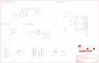

Contents
========

* [PRS13741 > RedStick](#prs13741--redstick)
	* [Schematic](#schematic)
	* [PCB](#pcb)
	* [Interactive BOM](#interactive-bom)
	* [OOMP Parts](#oomp-parts)
	* [Images](#images)
	* [Tags](#tags)
  
![][im]
# PRS13741 > RedStick

- ID: PROJ-SPAR-13741-STAN-01
- Hex ID: PRS13741
- Name: Sparkfun
- Description: Sparkfun
- Long Link: [http://oom.lt/PROJ-SPAR-13741-STAN-01](http://oom.lt/PROJ-SPAR-13741-STAN-01)
- Short Link: [http://oom.lt/PRS13741](http://oom.lt/PRS13741)

## Schematic
  

## PCB
  

## Interactive BOM

- Interactive BOM page: [ibom.html](https://htmlpreview.github.io/?https://github.com/oomlout/oomlout_OOMP_projects/blob/main/PROJ-SPAR-13741-STAN-01/kicad/bom/ibom.html)

## OOMP Parts
  

|OOMP Parts|
| :---: |
|[CAPC-0603-X-NF100-V50  SMD (0603) 100 nF Capacitor (Ceramic) 50v  C3, C4, C5, C6, C7, C8, C11](https://github.com/oomlout/oomlout_OOMP_parts/tree/main/CAPC-0603-X-NF100-V50/)|
|CAPT-3216-X-UF10-01 C9|
|CAPX-3528-X-UF68-01 C10|
|DIOD-UNMATCHED-X-UNMATCHED-01 D1, D4|
|[LEDS-0603-R-STAN-01  SMD (0603) Red LED  D2](https://github.com/oomlout/oomlout_OOMP_parts/tree/main/LEDS-0603-R-STAN-01/)|
|[LEDS-0603-G-STAN-01  SMD (0603) Green LED  D3](https://github.com/oomlout/oomlout_OOMP_parts/tree/main/LEDS-0603-G-STAN-01/)|
|UNMATCHED-UNMATCHED-X-UNMATCHED-01 JP1, L1, Q2, S1, U1, U2, Y1|
|[HEAD-I01-X-PI02-01  2.54 mm 2 Pin Header  JP5, JP6](https://github.com/oomlout/oomlout_OOMP_parts/tree/main/HEAD-I01-X-PI02-01/)|
|UNMATCHED-SO23-X-UNMATCHED-01 Q1|
|RESE-0603-X-O1003-01 R1|
|RESE-0603-X-UNMATCHED-01 R2|
|[RESE-0603-X-O103-01  SMD (0603) 10k Ohm Resistor  R3, R7, R8](https://github.com/oomlout/oomlout_OOMP_parts/tree/main/RESE-0603-X-O103-01/)|
|[RESE-0603-X-O222-01  SMD (0603) 2.2k Ohm Resistor  R4](https://github.com/oomlout/oomlout_OOMP_parts/tree/main/RESE-0603-X-O222-01/)|
|[RESE-0603-X-O102-01  SMD (0603) 1k Ohm Resistor  R5, R6](https://github.com/oomlout/oomlout_OOMP_parts/tree/main/RESE-0603-X-O102-01/)|
|UNMATCHED-SO235-X-UNMATCHED-01 U3|

## Images
  
  

|bominteractivefront|bominteractiveback|kicadPcb3d|kicadPcb3dFront|kicadPcb3dBack|eagleImage|eagleSchemImage|
| :---: | :---: | :---: | :---: | :---: | :---: | :---: |
||||||||

## Tags

- hexID: PRS13741
- oompType: PROJ
- oompSize: SPAR
- oompColor: 13741
- oompDesc: STAN
- oompIndex: 01
- oompName: RedStick
- sources: All source files from https://github.com/sparkfun/RedStick (source licence details in srcLicense.md)
- linkBuyPage: https://www.sparkfun.com/products/13741
- oompID: PROJ-SPAR-13741-STAN-01
- oompParts: C3,CAPC-0603-X-NF100-V50
- oompParts: C4,CAPC-0603-X-NF100-V50
- oompParts: C5,CAPC-0603-X-NF100-V50
- oompParts: C6,CAPC-0603-X-NF100-V50
- oompParts: C7,CAPC-0603-X-NF100-V50
- oompParts: C8,CAPC-0603-X-NF100-V50
- oompParts: C9,CAPT-3216-X-UF10-01
- oompParts: C10,CAPX-3528-X-UF68-01
- oompParts: C11,CAPC-0603-X-NF100-V50
- oompParts: D1,DIOD-UNMATCHED-X-UNMATCHED-01
- oompParts: D2,LEDS-0603-R-STAN-01
- oompParts: D3,LEDS-0603-G-STAN-01
- oompParts: D4,DIOD-UNMATCHED-X-UNMATCHED-01
- oompParts: JP1,UNMATCHED-UNMATCHED-X-UNMATCHED-01
- oompParts: JP5,HEAD-I01-X-PI02-01
- oompParts: JP6,HEAD-I01-X-PI02-01
- oompParts: L1,UNMATCHED-UNMATCHED-X-UNMATCHED-01
- oompParts: Q1,UNMATCHED-SO23-X-UNMATCHED-01
- oompParts: Q2,UNMATCHED-UNMATCHED-X-UNMATCHED-01
- oompParts: R1,RESE-0603-X-O1003-01
- oompParts: R2,RESE-0603-X-UNMATCHED-01
- oompParts: R3,RESE-0603-X-O103-01
- oompParts: R4,RESE-0603-X-O222-01
- oompParts: R5,RESE-0603-X-O102-01
- oompParts: R6,RESE-0603-X-O102-01
- oompParts: R7,RESE-0603-X-O103-01
- oompParts: R8,RESE-0603-X-O103-01
- oompParts: S1,UNMATCHED-UNMATCHED-X-UNMATCHED-01
- oompParts: U1,UNMATCHED-UNMATCHED-X-UNMATCHED-01
- oompParts: U2,UNMATCHED-UNMATCHED-X-UNMATCHED-01
- oompParts: U3,UNMATCHED-SO235-X-UNMATCHED-01
- oompParts: Y1,UNMATCHED-UNMATCHED-X-UNMATCHED-01
- rawParts: C3,0.1uF,0.1UF-25V(+80/-20%)(0603),0603-CAP,CAP-00810,,CAP-00810,,0.1uF,
- rawParts: C4,0.1uF,0.1UF-25V(+80/-20%)(0603),0603-CAP,CAP-00810,,CAP-00810,,0.1uF,
- rawParts: C5,0.1uF,0.1UF-25V(+80/-20%)(0603),0603-CAP,CAP-00810,,CAP-00810,,0.1uF,
- rawParts: C6,0.1uF,0.1UF-25V(+80/-20%)(0603),0603-CAP,CAP-00810,,CAP-00810,,0.1uF,
- rawParts: C7,0.1uF,0.1UF-25V(+80/-20%)(0603),0603-CAP,CAP-00810,,CAP-00810,,0.1uF,
- rawParts: C8,0.1uF,0.1UF-25V(+80/-20%)(0603),0603-CAP,CAP-00810,,CAP-00810,,0.1uF,
- rawParts: C9,10uF,10UF-16V-10%(TANT),EIA3216,CAP-00811,,CAP-00811,,10uF,
- rawParts: C10,68uF,68UF-10V-10%(TANT),EIA3528,CAP-10790,,CAP-10790,,68uF,
- rawParts: C11,0.1uF,0.1UF-25V(+80/-20%)(0603),0603-CAP,CAP-00810,,CAP-00810,,0.1uF,
- rawParts: D1,MBRA140,DIODE-SCHOTTKY-MBRA140,SMA-DIODE,Schottky diodes in SFEs production catalog,,DIO-08053,,MBRA140,
- rawParts: D2,RED,LED-RED0603,LED-0603,Assorted Red LEDs,,DIO-00819,,RED,
- rawParts: D3,GREEN,LED-GREEN0603,LED-0603,Various green LEDs,,DIO-00821,,GREEN,
- rawParts: D4,MBRA140,DIODE-SCHOTTKY-MBRA140,SMA-DIODE,Schottky diodes in SFEs production catalog,,DIO-08053,,MBRA140,
- rawParts: FID1,FIDUCIAL1X2,FIDUCIAL1X2,FIDUCIAL-1X2,Fiducial Alignment Points,,,,,
- rawParts: FID2,FIDUCIAL1X2,FIDUCIAL1X2,FIDUCIAL-1X2,Fiducial Alignment Points,,,,,
- rawParts: FRAME2,FRAME-LEDGER,FRAME-LEDGER,CREATIVE_COMMONS,Schematic Frame,,,,,
- rawParts: JP1,USBPCB_NOPASTE,USBPCB_NOPASTE,USB-A-PCB-NOPASTE,USB Connectors,,,,,
- rawParts: JP2,DNP,M12NO_SILK,1X12_NO_SILK,Header 12,,,,,
- rawParts: JP3,DNP,M12NO_SILK,1X12_NO_SILK,Header 12,,,,,
- rawParts: JP5,M021X02_NO_SILK,M021X02_NO_SILK,1X02_NO_SILK,Standard 2-pin 0.1 header. Use with,,,,,
- rawParts: JP6,M021X02_NO_SILK,M021X02_NO_SILK,1X02_NO_SILK,Standard 2-pin 0.1 header. Use with,,,,,
- rawParts: JP7,DNP,M02JST-PTH-2,JST-2-PTH,Standard 2-pin 0.1 header. Use with,,CONN-09863,PRT-09914,,
- rawParts: JP8,DNP,M04NO_SILK_ALL_ROUND,1X04_NO_SILK_ALL_ROUND,Header 4,,,,,
- rawParts: L1,47uH,INDUCTORCR54-47UH,CR54,Inductors,,NDUC-10789,,47uH,
- rawParts: LOGO1,SFE_LOGO_FLAME.1_INCH,SFE_LOGO_FLAME.1_INCH,SFE_LOGO_FLAME_.1,SFE Logo, flame only,,,,,
- rawParts: LOGO2,OSHW-LOGOS,OSHW-LOGOS,OSHW-LOGO-S,Open Source Hardware Logo,,,,,
- rawParts: Q1,DMG2307L,MOSFET-PCHANNELDMG2307L,SOT23-3,Generic PMOSFET,,TRANS-11308,,2.5A/30V,
- rawParts: Q2,MOSFET-NCHANNEL2N7002PW,MOSFET-NCHANNEL2N7002PW,SOT323,Common NMOSFET Parts,,TRANS-11151,,,
- rawParts: R1,100k,100KOHM-1/10W-1%(0603),0603-RES,RES-07828,,RES-07828,,100k,
- rawParts: R2,6.8K,6.8KOHM1/10W1%(0603),0603-RES,RES-08597,,RES-08597,,6.8K,
- rawParts: R3,10K,10KOHM-1/10W-1%(0603)0603,0603-RES,RES-00824,,RES-00824,,10K,
- rawParts: R4,2.2k,2.2KOHM-1/10W-1%(0603),0603-RES,RES-08272,,RES-08272,,2.2k,
- rawParts: R5,1K,1KOHM-1/10W-1%(0603),0603-RES,RES-07856,,RES-07856,,1K,
- rawParts: R6,1K,1KOHM-1/10W-1%(0603),0603-RES,RES-07856,,RES-07856,,1K,
- rawParts: R7,10K,10KOHM-1/10W-1%(0603)0603,0603-RES,RES-00824,,RES-00824,,10K,
- rawParts: R8,10K,10KOHM-1/10W-1%(0603)0603,0603-RES,RES-00824,,RES-00824,,10K,
- rawParts: S1,SWITCH-MOMENTARY-2SMD-REDUNDANT,SWITCH-MOMENTARY-2SMD-REDUNDANT,TACTILE-SWITCH-SMD,Various NO switches- pushbuttons, reed, etc,Reset,SWCH-08247,,,
- rawParts: U$1,SFE_LOGO_NAME_FLAME.1_INCH,SFE_LOGO_NAME_FLAME.1_INCH,SFE_LOGO_NAME_FLAME_.1,SFE Logo, name and flame,,,,,
- rawParts: U1,FTS31XS-U,FT231XS,SSOP20_L,FTDI FT231X Full Speed USB to Full-handshake UART,,IC-11524,,FTS31XS-U,
- rawParts: U2,ATMEGA328P_TQFP,ATMEGA328P_TQFP,TQFP32-08,,,IC-09069,,ATMEGA328P_TQFP,
- rawParts: U3,5.0v,V_REG_NCP1400_5V,SOT23-5,Switching step-up voltage regulator,,IC-10787,,5.0v,
- rawParts: Y1,16MHZ,RESONATOR16MHZ,RESONATOR-SMD,Resonator,,XTAL-08900,,16MHZ,

[im]: kicadPcb3d_450.png
