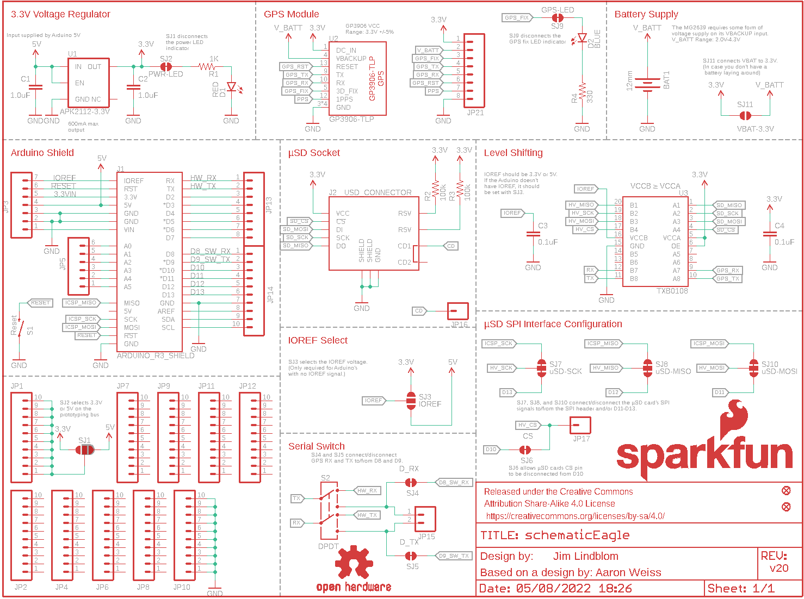
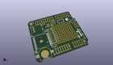
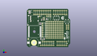
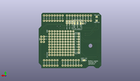
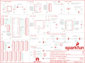

Contents
========

* [PRS13750 > GPS Shield](#prs13750--gps-shield)
	* [Schematic](#schematic)
	* [Interactive BOM](#interactive-bom)
	* [OOMP Parts](#oomp-parts)
	* [Images](#images)
	* [Tags](#tags)
  
![][im]
# PRS13750 > GPS Shield

- ID: PROJ-SPAR-13750-STAN-01
- Hex ID: PRS13750
- Name: Sparkfun
- Description: Sparkfun
- Long Link: [http://oom.lt/PROJ-SPAR-13750-STAN-01](http://oom.lt/PROJ-SPAR-13750-STAN-01)
- Short Link: [http://oom.lt/PRS13750](http://oom.lt/PRS13750)

## Schematic
  

## Interactive BOM

- Interactive BOM page: [ibom.html](https://htmlpreview.github.io/?https://github.com/oomlout/oomlout_OOMP_projects/blob/main/PROJ-SPAR-13750-STAN-01/kicad/bom/ibom.html)

## OOMP Parts
  

|OOMP Parts|
| :---: |
|BAT1 BAT1,UNMATCHED-UNMATCHED-X-UNMATCHED-01|
|C1 C1,CAPC-0603-X-UF1-01|
|C2 C2,CAPC-0603-X-UF1-01|
|C3 C3,CAPC-0603-X-UF1D-01|
|C4 C4,CAPC-0603-X-UF1D-01|
|[D1 LEDS-0603-G-STAN-01 SMD (0603) Green LED](https://github.com/oomlout/oomlout_OOMP_parts/tree/main/LEDS-0603-G-STAN-01/)|
|[D2 LEDS-0603-G-STAN-01 SMD (0603) Green LED](https://github.com/oomlout/oomlout_OOMP_parts/tree/main/LEDS-0603-G-STAN-01/)|
|J1 J1,UNMATCHED-UNMATCHED-X-UNMATCHED-01|
|J2 J2,UNMATCHED-UNMATCHED-X-UNMATCHED-01|
|[JP1 HEAD-I01-X-PI10-01 2.54 mm 10 Pin Header](https://github.com/oomlout/oomlout_OOMP_parts/tree/main/HEAD-I01-X-PI10-01/)|
|[JP2 HEAD-I01-X-PI10-01 2.54 mm 10 Pin Header](https://github.com/oomlout/oomlout_OOMP_parts/tree/main/HEAD-I01-X-PI10-01/)|
|[JP3 HEAD-I01-X-PI07-01 2.54 mm 7 Pin Header](https://github.com/oomlout/oomlout_OOMP_parts/tree/main/HEAD-I01-X-PI07-01/)|
|[JP4 HEAD-I01-X-PI10-01 2.54 mm 10 Pin Header](https://github.com/oomlout/oomlout_OOMP_parts/tree/main/HEAD-I01-X-PI10-01/)|
|[JP5 HEAD-I01-X-PI06-01 2.54 mm 6 Pin Header](https://github.com/oomlout/oomlout_OOMP_parts/tree/main/HEAD-I01-X-PI06-01/)|
|[JP6 HEAD-I01-X-PI10-01 2.54 mm 10 Pin Header](https://github.com/oomlout/oomlout_OOMP_parts/tree/main/HEAD-I01-X-PI10-01/)|
|[JP7 HEAD-I01-X-PI10-01 2.54 mm 10 Pin Header](https://github.com/oomlout/oomlout_OOMP_parts/tree/main/HEAD-I01-X-PI10-01/)|
|[JP8 HEAD-I01-X-PI10-01 2.54 mm 10 Pin Header](https://github.com/oomlout/oomlout_OOMP_parts/tree/main/HEAD-I01-X-PI10-01/)|
|[JP9 HEAD-I01-X-PI10-01 2.54 mm 10 Pin Header](https://github.com/oomlout/oomlout_OOMP_parts/tree/main/HEAD-I01-X-PI10-01/)|
|[JP10 HEAD-I01-X-PI10-01 2.54 mm 10 Pin Header](https://github.com/oomlout/oomlout_OOMP_parts/tree/main/HEAD-I01-X-PI10-01/)|
|[JP11 HEAD-I01-X-PI10-01 2.54 mm 10 Pin Header](https://github.com/oomlout/oomlout_OOMP_parts/tree/main/HEAD-I01-X-PI10-01/)|
|[JP12 HEAD-I01-X-PI10-01 2.54 mm 10 Pin Header](https://github.com/oomlout/oomlout_OOMP_parts/tree/main/HEAD-I01-X-PI10-01/)|
|[JP13 HEAD-I01-X-PI08-01 2.54 mm 8 Pin Header](https://github.com/oomlout/oomlout_OOMP_parts/tree/main/HEAD-I01-X-PI08-01/)|
|[JP14 HEAD-I01-X-PI10-01 2.54 mm 10 Pin Header](https://github.com/oomlout/oomlout_OOMP_parts/tree/main/HEAD-I01-X-PI10-01/)|
|[JP15 HEAD-I01-X-PI02-01 2.54 mm 2 Pin Header](https://github.com/oomlout/oomlout_OOMP_parts/tree/main/HEAD-I01-X-PI02-01/)|
|JP16 JP16,HEAD-I01-X-PI01-01|
|JP17 JP17,HEAD-I01-X-PI01-01|
|[JP21 HEAD-I01-X-PI08-01 2.54 mm 8 Pin Header](https://github.com/oomlout/oomlout_OOMP_parts/tree/main/HEAD-I01-X-PI08-01/)|
|[R1 RESE-0603-X-O102-01 SMD (0603) 1k Ohm Resistor](https://github.com/oomlout/oomlout_OOMP_parts/tree/main/RESE-0603-X-O102-01/)|
|R2 R2,RESE-0603-X-O1003-01|
|R3 R3,RESE-0603-X-O1003-01|
|[R4 RESE-0603-X-O331-01 SMD (0603) 330 Ohm Resistor](https://github.com/oomlout/oomlout_OOMP_parts/tree/main/RESE-0603-X-O331-01/)|
|S1 S1,UNMATCHED-UNMATCHED-X-UNMATCHED-01|
|S2 S2,UNMATCHED-UNMATCHED-X-UNMATCHED-01|
|U1 U1,VREG-SO235-X-KAP2112K-V33D|
|U2 U2,UNMATCHED-UNMATCHED-X-UNMATCHED-01|
|U3 U3,UNMATCHED-UNMATCHED-X-UNMATCHED-01|

## Images
  
  

|kicadPcb3d|kicadPcb3dFront|kicadPcb3dBack|eagleSchemImage|
| :---: | :---: | :---: | :---: |
|||||

## Tags

- hexID: PRS13750
- oompType: PROJ
- oompSize: SPAR
- oompColor: 13750
- oompDesc: STAN
- oompIndex: 01
- oompName: GPS Shield
- sources: All source files from https://github.com/sparkfun/GPS_Shield (source licence details in srcLicense.md)
- linkBuyPage: https://www.sparkfun.com/products/13750
- oompID: PROJ-SPAR-13750-STAN-01
- oompParts: BAT1,UNMATCHED-UNMATCHED-X-UNMATCHED-01
- oompParts: C1,CAPC-0603-X-UF1-01
- oompParts: C2,CAPC-0603-X-UF1-01
- oompParts: C3,CAPC-0603-X-UF1D-01
- oompParts: C4,CAPC-0603-X-UF1D-01
- oompParts: D1,LEDS-0603-G-STAN-01
- oompParts: D2,LEDS-0603-G-STAN-01
- oompParts: J1,UNMATCHED-UNMATCHED-X-UNMATCHED-01
- oompParts: J2,UNMATCHED-UNMATCHED-X-UNMATCHED-01
- oompParts: JP1,HEAD-I01-X-PI10-01
- oompParts: JP2,HEAD-I01-X-PI10-01
- oompParts: JP3,HEAD-I01-X-PI07-01
- oompParts: JP4,HEAD-I01-X-PI10-01
- oompParts: JP5,HEAD-I01-X-PI06-01
- oompParts: JP6,HEAD-I01-X-PI10-01
- oompParts: JP7,HEAD-I01-X-PI10-01
- oompParts: JP8,HEAD-I01-X-PI10-01
- oompParts: JP9,HEAD-I01-X-PI10-01
- oompParts: JP10,HEAD-I01-X-PI10-01
- oompParts: JP11,HEAD-I01-X-PI10-01
- oompParts: JP12,HEAD-I01-X-PI10-01
- oompParts: JP13,HEAD-I01-X-PI08-01
- oompParts: JP14,HEAD-I01-X-PI10-01
- oompParts: JP15,HEAD-I01-X-PI02-01
- oompParts: JP16,HEAD-I01-X-PI01-01
- oompParts: JP17,HEAD-I01-X-PI01-01
- oompParts: JP21,HEAD-I01-X-PI08-01
- oompParts: R1,RESE-0603-X-O102-01
- oompParts: R2,RESE-0603-X-O1003-01
- oompParts: R3,RESE-0603-X-O1003-01
- oompParts: R4,RESE-0603-X-O331-01
- oompParts: S1,UNMATCHED-UNMATCHED-X-UNMATCHED-01
- oompParts: S2,UNMATCHED-UNMATCHED-X-UNMATCHED-01
- oompParts: U1,VREG-SO235-X-KAP2112K-V33D
- oompParts: U2,UNMATCHED-UNMATCHED-X-UNMATCHED-01
- oompParts: U3,UNMATCHED-UNMATCHED-X-UNMATCHED-01
- rawParts: BAT1,12mm,BATTERY12MM,BATTCON_12MM,Battery Holders,BATT-08044,,
- rawParts: C1,1.0uF,1.0UF-16V-10%(0603),0603-CAP,CAP-00868,CAP-00868,1.0uF,
- rawParts: C2,1.0uF,1.0UF-16V-10%(0603),0603-CAP,CAP-00868,CAP-00868,1.0uF,
- rawParts: C3,0.1uF,0.1UF-25V(+80/-20%)(0603),0603-CAP,CAP-00810,CAP-00810,0.1uF,
- rawParts: C4,0.1uF,0.1UF-25V(+80/-20%)(0603),0603-CAP,CAP-00810,CAP-00810,0.1uF,
- rawParts: D1,RED,LED-RED0603,LED-0603,Assorted Red LEDs,DIO-00819,RED,
- rawParts: D2,BLUE,LED-BLUE0603,LED-0603,Blue LEDs for production use,DIO-08575,BLUE,
- rawParts: FRAME1,FRAME-LETTER,FRAME-LETTER,CREATIVE_COMMONS,Schematic Frame,,,
- rawParts: J1,ARDUINO_R3_SHIELD,ARDUINO_R3_SHIELD_ICSP-NO_LABELS,UNO_R3_SHIELD_ICSP_NOLABELS,Arduino R3 Shield Footprint w/ 6-pin (2x3) ICSP Header,,,
- rawParts: J2,USD_CONNECTOR,USD_CONNECTOR,MICRO-SD-SOCKET-PP,microSD Socket,CONN-07820,,
- rawParts: JP1,,M10NO_SILK_PTH_FEMALE,1X10_NO_SILK,Header 10,CONN-11563,,
- rawParts: JP2,,M10NO_SILK_PTH_FEMALE,1X10_NO_SILK,Header 10,CONN-11563,,
- rawParts: JP3,,M07NO_SILK,1X07_NO_SILK,Header 7,,,
- rawParts: JP4,,M10NO_SILK_PTH_FEMALE,1X10_NO_SILK,Header 10,CONN-11563,,
- rawParts: JP5,,M06NO_SILK_FEMALE_PTH,1X06_NO_SILK,Header 6,CONN-08437,,
- rawParts: JP6,,M10NO_SILK_PTH_FEMALE,1X10_NO_SILK,Header 10,CONN-11563,,
- rawParts: JP7,,M10NO_SILK_PTH_FEMALE,1X10_NO_SILK,Header 10,CONN-11563,,
- rawParts: JP8,,M10NO_SILK_PTH_FEMALE,1X10_NO_SILK,Header 10,CONN-11563,,
- rawParts: JP9,,M10NO_SILK_PTH_FEMALE,1X10_NO_SILK,Header 10,CONN-11563,,
- rawParts: JP10,,M10NO_SILK_PTH_FEMALE,1X10_NO_SILK,Header 10,CONN-11563,,
- rawParts: JP11,,M10NO_SILK_PTH_FEMALE,1X10_NO_SILK,Header 10,CONN-11563,,
- rawParts: JP12,,M10NO_SILK_PTH_FEMALE,1X10_NO_SILK,Header 10,CONN-11563,,
- rawParts: JP13,,M08NO_SILK_FEMALE_PTH,1X08_NO_SILK,Header 8,CONN-08438,,
- rawParts: JP14,,M10NO_SILK_PTH_FEMALE,1X10_NO_SILK,Header 10,CONN-11563,,
- rawParts: JP15,,M021X02_NO_SILK,1X02_NO_SILK,Standard 2-pin 0.1 header. Use with,,,
- rawParts: JP16,,M01PTH_NO_SILK_YES_STOP,1X01_NO_SILK,Header 1,,,
- rawParts: JP17,,M01PTH_NO_SILK_YES_STOP,1X01_NO_SILK,Header 1,,,
- rawParts: JP19,FIDUCIAL1X2,FIDUCIAL1X2,FIDUCIAL-1X2,Fiducial Alignment Points,,,
- rawParts: JP20,FIDUCIAL1X2,FIDUCIAL1X2,FIDUCIAL-1X2,Fiducial Alignment Points,,,
- rawParts: JP21,,M08NO_SILK_FEMALE_PTH,1X08_NO_SILK,Header 8,CONN-08438,,
- rawParts: LOGO1,OSHW-LOGOM,OSHW-LOGOM,OSHW-LOGO-M,Open Source Hardware Logo,,,
- rawParts: LOGO2,SFE_LOGO_NAME_FLAME.1_INCH,SFE_LOGO_NAME_FLAME.1_INCH,SFE_LOGO_NAME_FLAME_.1,SFE Logo, name and flame,,,
- rawParts: R1,1K,1KOHM-1/10W-1%(0603),0603-RES,RES-07856,RES-07856,1K,
- rawParts: R2,100k,100KOHM-1/10W-1%(0603),0603-RES,RES-07828,RES-07828,100k,
- rawParts: R3,100k,100KOHM-1/10W-1%(0603),0603-RES,RES-07828,RES-07828,100k,
- rawParts: R4,330,330OHM1/10W1%(0603),0603-RES,RES-00818,RES-00818,330,
- rawParts: S1,Reset,SWITCH-MOMENTARY-2SMD,TACTILE-SWITCH-SMD,Various NO switches- pushbuttons, reed, etc,SWCH-08247,,
- rawParts: S2,DPDT,SWITCH-DPDTAYZ0202,AYZ0202,DPDT Version of the COM-00597,SWCH-08179,DPDT,
- rawParts: SJ1,,JUMPER-PAD-3-2OF3_NC_BY_PASTE,PAD-JUMPER-3-2OF3_NC_BY_PASTE_YES_SILK_FULL_BOX,,,,
- rawParts: SJ2,PWR-LED,JUMPER-PAD-2-NC_BY_TRACE,PAD-JUMPER-2-NC_BY_TRACE_YES_SILK,,,,
- rawParts: SJ3,IOREF,JUMPER-PAD-3-NOYES_SILK,PAD-JUMPER-3-NO_YES_SILK,,,,
- rawParts: SJ4,D_RX,JUMPER-PAD-2-NC_BY_TRACE,PAD-JUMPER-2-NC_BY_TRACE_YES_SILK,,,,
- rawParts: SJ5,D_TX,JUMPER-PAD-2-NC_BY_TRACE,PAD-JUMPER-2-NC_BY_TRACE_YES_SILK,,,,
- rawParts: SJ6,CS,JUMPER-PAD-2-NC_BY_TRACE,PAD-JUMPER-2-NC_BY_TRACE_YES_SILK,,,,
- rawParts: SJ7,uSD-SCK,JUMPER-PAD-3-NC_BY_TRACE,PAD-JUMPER-3-3OF3_NC_BY_TRACE_YES_SILK_FULL_BOX,,,,
- rawParts: SJ8,uSD-MISO,JUMPER-PAD-3-NC_BY_TRACE,PAD-JUMPER-3-3OF3_NC_BY_TRACE_YES_SILK_FULL_BOX,,,,
- rawParts: SJ9,GPS-LED,JUMPER-PAD-2-NC_BY_TRACE,PAD-JUMPER-2-NC_BY_TRACE_YES_SILK,,,,
- rawParts: SJ10,uSD-MOSI,JUMPER-PAD-3-NC_BY_TRACE,PAD-JUMPER-3-3OF3_NC_BY_TRACE_YES_SILK_FULL_BOX,,,,
- rawParts: SJ11,VBAT-3.3V,JUMPER-PAD-2-NOYES_SILK,PAD-JUMPER-2-NO_YES_SILK,,,,
- rawParts: U1,APK2112-3.3V,V_REG_AP2112K-3.3V,SOT23-5,AP2112 - 600mA CMOS LDO Regulator w/ Enable,VREG-12457,3.3V,
- rawParts: U2,GP3906-TLP,GP3906-TLP,GP3906-TLP,GP3906-TLP PoT GPS Module,GPS-13174,,
- rawParts: U3,TXB0108,TXB0108,UFDFN-20,8-Bit Bi-Directional Level Shifter,IC-12292,,

[im]: kicadPcb3d_450.png
