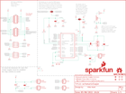

Contents
========

* [PRS13752 > Sparkfun](#prs13752--sparkfun)
	* [Images](#images)
	* [Tags](#tags)
  
![][im]
# PRS13752 > Sparkfun

- ID: PROJ-SPAR-13752-STAN-01
- Hex ID: PRS13752
- Name: Sparkfun
- Description: Sparkfun

## Images
  
  

|kicadPcb3d|kicadPcb3dFront|kicadPcb3dBack|eagleImage|eagleSchemImage|
| :---: | :---: | :---: | :---: | :---: |
||||||

## Tags

- hexID: PRS13752
- oompType: PROJ
- oompSize: SPAR
- oompColor: 13752
- oompDesc: STAN
- oompIndex: 01
- oompName: L6470-AutoDriver
- sources: All source files from https://github.com/sparkfun/L6470-AutoDriver (source licence details in srcLicense.md)
- linkBuyPage: https://www.sparkfun.com/products/13752
- oompID: PROJ-SPAR-13752-STAN-01
- oompParts: C1,UNMATCHED-UNMATCHED-UNMATCHED-UNMATCHED-UNMATCHED
- oompParts: C2,UNMATCHED-UNMATCHED-UNMATCHED-UNMATCHED-UNMATCHED
- oompParts: C3,UNMATCHED-UNMATCHED-UNMATCHED-UNMATCHED-UNMATCHED
- oompParts: C4,UNMATCHED-UNMATCHED-UNMATCHED-UNMATCHED-UNMATCHED
- oompParts: C5,UNMATCHED-UNMATCHED-UNMATCHED-UNMATCHED-UNMATCHED
- oompParts: C6,UNMATCHED-UNMATCHED-UNMATCHED-UNMATCHED-UNMATCHED
- oompParts: C7,UNMATCHED-UNMATCHED-UNMATCHED-UNMATCHED-UNMATCHED
- oompParts: C8,UNMATCHED-UNMATCHED-UNMATCHED-UNMATCHED-UNMATCHED
- oompParts: D1,UNMATCHED-UNMATCHED-UNMATCHED-UNMATCHED-UNMATCHED
- oompParts: FRAME1,UNMATCHED-UNMATCHED-UNMATCHED-UNMATCHED-UNMATCHED
- oompParts: JP1,UNMATCHED-UNMATCHED-UNMATCHED-UNMATCHED-UNMATCHED
- oompParts: JP2,UNMATCHED-UNMATCHED-UNMATCHED-UNMATCHED-UNMATCHED
- oompParts: JP3,UNMATCHED-UNMATCHED-UNMATCHED-UNMATCHED-UNMATCHED
- oompParts: JP4,UNMATCHED-UNMATCHED-UNMATCHED-UNMATCHED-UNMATCHED
- oompParts: JP5,UNMATCHED-UNMATCHED-UNMATCHED-UNMATCHED-UNMATCHED
- oompParts: JP6,UNMATCHED-UNMATCHED-UNMATCHED-UNMATCHED-UNMATCHED
- oompParts: JP7,UNMATCHED-UNMATCHED-UNMATCHED-UNMATCHED-UNMATCHED
- oompParts: JP8,UNMATCHED-UNMATCHED-UNMATCHED-UNMATCHED-UNMATCHED
- oompParts: JP9,UNMATCHED-UNMATCHED-UNMATCHED-UNMATCHED-UNMATCHED
- oompParts: LOGO1,UNMATCHED-UNMATCHED-UNMATCHED-UNMATCHED-UNMATCHED
- oompParts: LOGO2,UNMATCHED-UNMATCHED-UNMATCHED-UNMATCHED-UNMATCHED
- oompParts: R1,UNMATCHED-UNMATCHED-UNMATCHED-UNMATCHED-UNMATCHED
- oompParts: R2,UNMATCHED-UNMATCHED-UNMATCHED-UNMATCHED-UNMATCHED
- oompParts: R3,UNMATCHED-UNMATCHED-UNMATCHED-UNMATCHED-UNMATCHED
- oompParts: R4,UNMATCHED-UNMATCHED-UNMATCHED-UNMATCHED-UNMATCHED
- oompParts: R5,UNMATCHED-UNMATCHED-UNMATCHED-UNMATCHED-UNMATCHED
- oompParts: R6,UNMATCHED-UNMATCHED-UNMATCHED-UNMATCHED-UNMATCHED
- oompParts: SJ1,UNMATCHED-UNMATCHED-UNMATCHED-UNMATCHED-UNMATCHED
- oompParts: SJ2,UNMATCHED-UNMATCHED-UNMATCHED-UNMATCHED-UNMATCHED
- oompParts: SJ3,UNMATCHED-UNMATCHED-UNMATCHED-UNMATCHED-UNMATCHED
- oompParts: STANDOFF1,UNMATCHED-UNMATCHED-UNMATCHED-UNMATCHED-UNMATCHED
- oompParts: STANDOFF2,UNMATCHED-UNMATCHED-UNMATCHED-UNMATCHED-UNMATCHED
- oompParts: STANDOFF3,UNMATCHED-UNMATCHED-UNMATCHED-UNMATCHED-UNMATCHED
- oompParts: STANDOFF4,UNMATCHED-UNMATCHED-UNMATCHED-UNMATCHED-UNMATCHED
- oompParts: TP1,UNMATCHED-UNMATCHED-UNMATCHED-UNMATCHED-UNMATCHED
- oompParts: U$4,UNMATCHED-UNMATCHED-UNMATCHED-UNMATCHED-UNMATCHED
- oompParts: U1,UNMATCHED-UNMATCHED-UNMATCHED-UNMATCHED-UNMATCHED
- rawParts: C1,0.1uF,0.1UF-25V(+80/-20%)(0603),0603-CAP,CAP-00810,CAP-00810,0.1uF,
- rawParts: C2,10uF,10UF-TANT,EIA3216,10uF Tantalum SMT,CAP-00811,10uF,
- rawParts: C3,100uF,100UF-63V-20%(ELECT),NIC_10X10.5_CAP,CAP-08362,CAP-08362,100uF,
- rawParts: C4,0.22uF,0.22UF50V-20%,+80%(0603),0603-CAP,CAP-09885,CAP-09885,0.22uF,
- rawParts: C5,0.22uF,0.22UF50V-20%,+80%(0603),0603-CAP,CAP-09885,CAP-09885,0.22uF,
- rawParts: C6,10nF,10NF/10000PF-50V-10%(0603),0603-CAP,CAP-00867,CAP-00867,10nF,
- rawParts: C7,10nF,10NF/10000PF-50V-10%(0603),0603-CAP,CAP-00867,CAP-00867,10nF,
- rawParts: C8,47uF,47UF-TANT,EIA3528,47uF Tantalum SMT,CAP-08310,47uF,
- rawParts: D1,BAV99,BAV99,SOT23-3,Two small signal silicon diodes connected anode to cathode.,DIO-10647,,
- rawParts: FID1,FIDUCIALUFIDUCIAL,FIDUCIALUFIDUCIAL,MICRO-FIDUCIAL,Fiducial Alignment Points,,,
- rawParts: FID2,FIDUCIALUFIDUCIAL,FIDUCIALUFIDUCIAL,MICRO-FIDUCIAL,Fiducial Alignment Points,,,
- rawParts: FRAME1,FRAME-LETTER,FRAME-LETTER,CREATIVE_COMMONS,Schematic Frame,,,
- rawParts: JP1,M05X2SHD,M05X2SHD,2X5-SHROUDED,Header 5x2,,,
- rawParts: JP2,M05X2SHD,M05X2SHD,2X5-SHROUDED,Header 5x2,,,
- rawParts: JP3,,M03X2SHROUD,2X3-SHROUDED,2x3 .1 header.,CONN-10681,,
- rawParts: JP4,,M03X2SHROUD,2X3-SHROUDED,2x3 .1 header.,CONN-10681,,
- rawParts: JP5,,M023.5MM,SCREWTERMINAL-3.5MM-2,Header 2,,,
- rawParts: JP6,,M023.5MM,SCREWTERMINAL-3.5MM-2,Header 2,,,
- rawParts: JP7,,M023.5MM,SCREWTERMINAL-3.5MM-2,Header 2,,,
- rawParts: JP8,,M023.5MM,SCREWTERMINAL-3.5MM-2,Header 2,,,
- rawParts: JP9,,M023.5MM,SCREWTERMINAL-3.5MM-2,Header 2,,,
- rawParts: LOGO1,OSHW-LOGOM,OSHW-LOGOM,OSHW-LOGO-M,Open Source Hardware Logo,,,
- rawParts: LOGO2,SFE_LOGO_NAME_FLAME.2_INCH,SFE_LOGO_NAME_FLAME.2_INCH,SFE_LOGO_NAME_FLAME_.2,SFE Logo, name and flame,,,
- rawParts: R1,10k,10KOHM1/10W1%(0603)0603,0603-RES,RES-00824,RES-00824,10K,
- rawParts: R2,10k,10KOHM1/10W1%(0603)0603,0603-RES,RES-00824,RES-00824,10K,
- rawParts: R3,100,100OHM1/10W1%(0603),0603-RES,RES-07863,RES-07863,100,
- rawParts: R4,200k,POT100K_3362U,3362U,,,,
- rawParts: R5,8.2k,8.2KOHM-1/10W-5%(0603),0603-RES,RES-10646,RES-10646,,
- rawParts: R6,33k,33KOHM1/10W1%(0603),0603-RES,RES-08416,RES-08416,,
- rawParts: SJ1,JUMPER-PAD-3-2OF3_NC_BY_PASTE,JUMPER-PAD-3-2OF3_NC_BY_PASTE,PAD-JUMPER-3-2OF3_NC_BY_PASTE_YES_SILK_FULL_BOX,,,,
- rawParts: SJ2,2PT_GND_TIE,2PT_GND_TIE,2PT_GND_TIE,Package for connecting two ground nets in one place.,,,
- rawParts: SJ3,JUMPER-PAD-3-2OF3_NC_BY_PASTE,JUMPER-PAD-3-2OF3_NC_BY_PASTE,PAD-JUMPER-3-2OF3_NC_BY_PASTE_YES_SILK_FULL_BOX,,,,
- rawParts: STANDOFF1,STAND-OFF,STAND-OFF,STAND-OFF,Stand Off,,,
- rawParts: STANDOFF2,STAND-OFF,STAND-OFF,STAND-OFF,Stand Off,,,
- rawParts: STANDOFF3,STAND-OFF,STAND-OFF,STAND-OFF,Stand Off,,,
- rawParts: STANDOFF4,STAND-OFF,STAND-OFF,STAND-OFF,Stand Off,,,
- rawParts: TP1,TEST-POINTTP_15TH_THRU,TEST-POINTTP_15TH_THRU,TP_15TH,Bare copper test points for troubleshooting or ICT,,,
- rawParts: U$4,FOUR_LAYER_WARNING,FOUR_LAYER_WARNING,FOUR_LAYER_WARNING,Warning text which will appear on both the schematic,,,
- rawParts: U1,L6470 ,L6470,HTSSOP28,3A RMS/7A peak bipolar stepper motor driver with SPI control,IC-10648,,

[im]: kicadPcb3d_450.png
