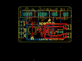
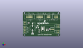
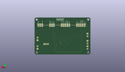
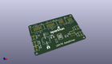

Contents
========

* [PROJ-SPAR-13752-STAN-01>L6470-AutoDriver](#proj-spar-13752-stan-01l6470-autodriver)
	* [Images](#images)
	* [Interactive BOM](#interactive-bom)
	* [OOMP Parts](#oomp-parts)
	* [Tags](#tags)
  
![][im]
# PROJ-SPAR-13752-STAN-01>L6470-AutoDriver

- ID: PROJ-SPAR-13752-STAN-01
- Hex ID: PRS13752
- Name: L6470-AutoDriver
- Description: 

## Images
  
  

|eagleImage|kicadPcb3dFront|kicadPcb3dBack|kicadPcb3d|
| :---: | :---: | :---: | :---: |
|||||

## Interactive BOM

- Interactive BOM page: [ibom.html](kicad/bom/ibom.html)

## OOMP Parts
  

|OOMP Parts|
| :---: |
|<table><tr><td></td><td> C1</td><td>[CAPC-0603-X-NF100-V50 SMD (0603) 100 nF Capacitor (Ceramic) 50v](https://github.com/oomlout/oomlout_OOMP_parts/tree/main/CAPC-0603-X-NF100-V50/)</td><td>[C6N100](https://github.com/oomlout/oomlout_OOMP_parts/tree/main/CAPC-0603-X-NF100-V50/)</td></tr></table>|
|CAPC-UNMATCHED-X-UNMATCHED-01, C2, 48.387, 12.318999999999999, 180,C2, 10uF, EIA3216, SparkFun-Capacitors, (1.905, 0.485), R180|
|CAPE-UNMATCHED-X-UNMATCHED-01, C3, 19.049999999999997, 16.509999999999998, 90,C3, 100uF, NIC_10X10.5_CAP, SparkFun-Capacitors, (0.75, 0.65), R90|
|CAPC-0603-X-NF220-V50, C4, 19.049999999999997, 8.254999999999999, 0,C4, 0.22uF, 0603-CAP, SparkFun-Capacitors, (0.75, 0.325), R0|
|CAPC-0603-X-NF220-V50, C5, 32.385, 8.382, 180,C5, 0.22uF, 0603-CAP, SparkFun-Capacitors, (1.275, 0.33), R180|
|CAPC-0603-X-UNMATCHED-01, C6, 32.257999999999996, 13.334999999999999, 0,C6, 10nF, 0603-CAP, SparkFun-Capacitors, (1.27, 0.525), R0|
|CAPC-0603-X-UNMATCHED-01, C7, 11.43, 27.94, 0,C7, 10nF, 0603-CAP, SparkFun-Capacitors, (0.45, 1.1), R0|
|CAPE-UNMATCHED-X-UNMATCHED-01, C8, 29.209999999999997, 17.779999999999998, 0,C8, 47uF, EIA3528, SparkFun-Capacitors, (1.15, 0.7), R0|
|UNMATCHED-UNMATCHED-X-UNMATCHED-01, D1, 32.385, 10.795, 0,D1, BAV99, SOT23-3, SparkFun-DiscreteSemi, (1.275, 0.425), R0|
|UNMATCHED-UNMATCHED-X-UNMATCHED-01, JP1, 33.019999999999996, 39.37, 90,JP1, M05X2SHD, 2X5-SHROUDED, SparkFun-Connectors, (1.3, 1.55), R90|
|UNMATCHED-UNMATCHED-X-UNMATCHED-01, JP2, 12.7, 39.37, 270,JP2, M05X2SHD, 2X5-SHROUDED, SparkFun-Connectors, (0.5, 1.55), R270|
|UNMATCHED-UNMATCHED-X-UNMATCHED-01, JP3, 50.8, 39.37, 270,JP3, 2X3-SHROUDED, SparkFun-Connectors, (2, 1.55), R270|
|UNMATCHED-UNMATCHED-X-UNMATCHED-01, JP4, 66.03999999999999, 39.37, 90,JP4, 2X3-SHROUDED, SparkFun-Connectors, (2.6, 1.55), R90|
|UNMATCHED-UNMATCHED-X-UNMATCHED-01, JP5, 3.8099999999999996, 27.94, 270,JP5, SCREWTERMINAL-3.5MM-2, SparkFun, (0.15, 1.1), R270|
|UNMATCHED-UNMATCHED-X-UNMATCHED-01, JP6, 3.8099999999999996, 18.287999999999997, 270,JP6, SCREWTERMINAL-3.5MM-2, SparkFun, (0.15, 0.72), R270|
|UNMATCHED-UNMATCHED-X-UNMATCHED-01, JP7, 3.8099999999999996, 11.049, 270,JP7, SCREWTERMINAL-3.5MM-2, SparkFun, (0.15, 0.435), R270|
|UNMATCHED-UNMATCHED-X-UNMATCHED-01, JP8, 69.85, 19.049999999999997, 90,JP8, SCREWTERMINAL-3.5MM-2, SparkFun, (2.75, 0.75), R90|
|UNMATCHED-UNMATCHED-X-UNMATCHED-01, JP9, 69.85, 7.619999999999999, 90,JP9, SCREWTERMINAL-3.5MM-2, SparkFun, (2.75, 0.3), R90|
|<table><tr><td></td><td> R1</td><td>[RESE-0603-X-O103-01 SMD (0603) 10k Ohm Resistor](https://github.com/oomlout/oomlout_OOMP_parts/tree/main/RESE-0603-X-O103-01/)</td><td>[R6103](https://github.com/oomlout/oomlout_OOMP_parts/tree/main/RESE-0603-X-O103-01/)</td></tr></table>|
|<table><tr><td></td><td> R2</td><td>[RESE-0603-X-O103-01 SMD (0603) 10k Ohm Resistor](https://github.com/oomlout/oomlout_OOMP_parts/tree/main/RESE-0603-X-O103-01/)</td><td>[R6103](https://github.com/oomlout/oomlout_OOMP_parts/tree/main/RESE-0603-X-O103-01/)</td></tr></table>|
|RESE-0603-X-UNMATCHED-01, R3, 11.43, 26.416, 180,R3, 100, 0603-RES, SparkFun-Resistors, (0.45, 1.04), R180|
|RESE-UNMATCHED-X-O204-01, R4, 60.959999999999994, 16.509999999999998, 180,R4, 200k, 3362U, SparkFun-Electromechanical, (2.4, 0.65), R180|
|RESE-0603-X-UNMATCHED-01, R5, 52.832, 13.97, 0,R5, 8.2k, 0603-RES, SparkFun-Resistors, (2.08, 0.55), R0|
|RESE-0603-X-O333-01, R6, 52.832, 15.620999999999999, 180,R6, 33k, 0603-RES, SparkFun-Resistors, (2.08, 0.615), R180|
|UNMATCHED-UNMATCHED-X-UNMATCHED-01, U1, 39.37, 15.239999999999998, 270,U1, L6470, HTSSOP28, SparkFun-PowerIC, (1.55, 0.6), R270|

## Tags

- hexID: PRS13752
- oompType: PROJ
- oompSize: SPAR
- oompColor: 13752
- oompDesc: STAN
- oompIndex: 01
- oompName: L6470-AutoDriver
- sources: All source files from https://github.com/sparkfun/L6470-AutoDriver (source licence details in srcLicense.md)
- linkBuyPage: https://www.sparkfun.com/products/13752
- oompPart: CAPC-0603-X-NF100-V50, C1, 47.625, 14.477999999999998, 0
- oompPart: CAPC-UNMATCHED-X-UNMATCHED-01, C2, 48.387, 12.318999999999999, 180
- oompPart: CAPE-UNMATCHED-X-UNMATCHED-01, C3, 19.049999999999997, 16.509999999999998, 90
- oompPart: CAPC-0603-X-NF220-V50, C4, 19.049999999999997, 8.254999999999999, 0
- oompPart: CAPC-0603-X-NF220-V50, C5, 32.385, 8.382, 180
- oompPart: CAPC-0603-X-UNMATCHED-01, C6, 32.257999999999996, 13.334999999999999, 0
- oompPart: CAPC-0603-X-UNMATCHED-01, C7, 11.43, 27.94, 0
- oompPart: CAPE-UNMATCHED-X-UNMATCHED-01, C8, 29.209999999999997, 17.779999999999998, 0
- oompPart: UNMATCHED-UNMATCHED-X-UNMATCHED-01, D1, 32.385, 10.795, 0
- oompPart: SKIP-UNMATCHED-X-UNMATCHED-01, FID1, 67.30999999999999, 2.54, 0
- oompPart: SKIP-UNMATCHED-X-UNMATCHED-01, FID2, 1.27, 43.18, 0
- oompPart: UNMATCHED-UNMATCHED-X-UNMATCHED-01, JP1, 33.019999999999996, 39.37, 90
- oompPart: UNMATCHED-UNMATCHED-X-UNMATCHED-01, JP2, 12.7, 39.37, 270
- oompPart: UNMATCHED-UNMATCHED-X-UNMATCHED-01, JP3, 50.8, 39.37, 270
- oompPart: UNMATCHED-UNMATCHED-X-UNMATCHED-01, JP4, 66.03999999999999, 39.37, 90
- oompPart: UNMATCHED-UNMATCHED-X-UNMATCHED-01, JP5, 3.8099999999999996, 27.94, 270
- oompPart: UNMATCHED-UNMATCHED-X-UNMATCHED-01, JP6, 3.8099999999999996, 18.287999999999997, 270
- oompPart: UNMATCHED-UNMATCHED-X-UNMATCHED-01, JP7, 3.8099999999999996, 11.049, 270
- oompPart: UNMATCHED-UNMATCHED-X-UNMATCHED-01, JP8, 69.85, 19.049999999999997, 90
- oompPart: UNMATCHED-UNMATCHED-X-UNMATCHED-01, JP9, 69.85, 7.619999999999999, 90
- oompPart: RESE-0603-X-O103-01, R1, 61.08699999999999, 33.019999999999996, 180
- oompPart: RESE-0603-X-O103-01, R2, 57.022999999999996, 33.019999999999996, 0
- oompPart: RESE-0603-X-UNMATCHED-01, R3, 11.43, 26.416, 180
- oompPart: RESE-UNMATCHED-X-O204-01, R4, 60.959999999999994, 16.509999999999998, 180
- oompPart: RESE-0603-X-UNMATCHED-01, R5, 52.832, 13.97, 0
- oompPart: RESE-0603-X-O333-01, R6, 52.832, 15.620999999999999, 180
- oompPart: SKIP-UNMATCHED-X-UNMATCHED-01, SJ1, 29.209999999999997, 21.081999999999997, 180
- oompPart: SKIP-UNMATCHED-X-UNMATCHED-01, SJ2, 39.37, 21.59, 0
- oompPart: SKIP-UNMATCHED-X-UNMATCHED-01, SJ3, 19.049999999999997, 25.4, 90
- oompPart: SKIP-UNMATCHED-X-UNMATCHED-01, TP1, 29.209999999999997, 15.239999999999998, 0
- oompPart: UNMATCHED-UNMATCHED-X-UNMATCHED-01, U1, 39.37, 15.239999999999998, 270
- rawPart: C1, 0.1uF, 0603-CAP, SparkFun-Capacitors, (1.875, 0.57), R0
- rawPart: C2, 10uF, EIA3216, SparkFun-Capacitors, (1.905, 0.485), R180
- rawPart: C3, 100uF, NIC_10X10.5_CAP, SparkFun-Capacitors, (0.75, 0.65), R90
- rawPart: C4, 0.22uF, 0603-CAP, SparkFun-Capacitors, (0.75, 0.325), R0
- rawPart: C5, 0.22uF, 0603-CAP, SparkFun-Capacitors, (1.275, 0.33), R180
- rawPart: C6, 10nF, 0603-CAP, SparkFun-Capacitors, (1.27, 0.525), R0
- rawPart: C7, 10nF, 0603-CAP, SparkFun-Capacitors, (0.45, 1.1), R0
- rawPart: C8, 47uF, EIA3528, SparkFun-Capacitors, (1.15, 0.7), R0
- rawPart: D1, BAV99, SOT23-3, SparkFun-DiscreteSemi, (1.275, 0.425), R0
- rawPart: FID1, FIDUCIALUFIDUCIAL, MICRO-FIDUCIAL, SparkFun-Aesthetics, (2.65, 0.1), R0
- rawPart: FID2, FIDUCIALUFIDUCIAL, MICRO-FIDUCIAL, SparkFun-Aesthetics, (0.05, 1.7), R0
- rawPart: JP1, M05X2SHD, 2X5-SHROUDED, SparkFun-Connectors, (1.3, 1.55), R90
- rawPart: JP2, M05X2SHD, 2X5-SHROUDED, SparkFun-Connectors, (0.5, 1.55), R270
- rawPart: JP3, 2X3-SHROUDED, SparkFun-Connectors, (2, 1.55), R270
- rawPart: JP4, 2X3-SHROUDED, SparkFun-Connectors, (2.6, 1.55), R90
- rawPart: JP5, SCREWTERMINAL-3.5MM-2, SparkFun, (0.15, 1.1), R270
- rawPart: JP6, SCREWTERMINAL-3.5MM-2, SparkFun, (0.15, 0.72), R270
- rawPart: JP7, SCREWTERMINAL-3.5MM-2, SparkFun, (0.15, 0.435), R270
- rawPart: JP8, SCREWTERMINAL-3.5MM-2, SparkFun, (2.75, 0.75), R90
- rawPart: JP9, SCREWTERMINAL-3.5MM-2, SparkFun, (2.75, 0.3), R90
- rawPart: R1, 10k, 0603-RES, SparkFun-Resistors, (2.405, 1.3), R180
- rawPart: R2, 10k, 0603-RES, SparkFun-Resistors, (2.245, 1.3), R0
- rawPart: R3, 100, 0603-RES, SparkFun-Resistors, (0.45, 1.04), R180
- rawPart: R4, 200k, 3362U, SparkFun-Electromechanical, (2.4, 0.65), R180
- rawPart: R5, 8.2k, 0603-RES, SparkFun-Resistors, (2.08, 0.55), R0
- rawPart: R6, 33k, 0603-RES, SparkFun-Resistors, (2.08, 0.615), R180
- rawPart: SJ1, JUMPER-PAD-3-2OF3_NC_BY_PASTE, PAD-JUMPER-3-2OF3_NC_BY_PASTE_YES_SILK_FULL_BOX, SparkFun-Passives, (1.15, 0.83), R180
- rawPart: SJ2, 2PT_GND_TIE, 2PT_GND_TIE, SparkFun-Passives, (1.55, 0.85), R0
- rawPart: SJ3, JUMPER-PAD-3-2OF3_NC_BY_PASTE, PAD-JUMPER-3-2OF3_NC_BY_PASTE_YES_SILK_FULL_BOX, SparkFun-Passives, (0.75, 1), R90
- rawPart: TP1, TEST-POINTTP_15TH_THRU, TP_15TH, SparkFun-Passives, (1.15, 0.6), R0
- rawPart: U1, L6470, HTSSOP28, SparkFun-PowerIC, (1.55, 0.6), R270
- oompID: PROJ-SPAR-13752-STAN-01

[im]: kicadPcb3d_450.png
