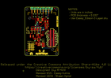
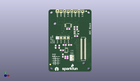
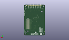
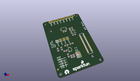

Contents
========

* [PROJ-SPAR-13770-STAN-01>Edison ADC Block](#proj-spar-13770-stan-01edison-adc-block)
	* [Images](#images)
	* [Interactive BOM](#interactive-bom)
	* [OOMP Parts](#oomp-parts)
	* [Tags](#tags)
  
![][im]
# PROJ-SPAR-13770-STAN-01>Edison ADC Block

- ID: PROJ-SPAR-13770-STAN-01
- Hex ID: PRS13770
- Name: Edison ADC Block
- Description: 

## Images
  
  

|eagleImage|kicadPcb3dFront|kicadPcb3dBack|kicadPcb3d|
| :---: | :---: | :---: | :---: |
|||||

## Interactive BOM

- Interactive BOM page: [ibom.html](kicad/bom/ibom.html)

## OOMP Parts
  

|OOMP Parts|
| :---: |
|<table><tr><td></td><td> C1</td><td>[CAPC-0603-X-NF100-V50 SMD (0603) 100 nF Capacitor (Ceramic) 50v](https://github.com/oomlout/oomlout_OOMP_parts/tree/main/CAPC-0603-X-NF100-V50/)</td><td>[C6N100](https://github.com/oomlout/oomlout_OOMP_parts/tree/main/CAPC-0603-X-NF100-V50/)</td></tr></table>|
|<table><tr><td></td><td> C2</td><td>[CAPC-0603-X-NF100-V50 SMD (0603) 100 nF Capacitor (Ceramic) 50v](https://github.com/oomlout/oomlout_OOMP_parts/tree/main/CAPC-0603-X-NF100-V50/)</td><td>[C6N100](https://github.com/oomlout/oomlout_OOMP_parts/tree/main/CAPC-0603-X-NF100-V50/)</td></tr></table>|
|<table><tr><td></td><td> C3</td><td>[CAPC-0603-X-NF100-V50 SMD (0603) 100 nF Capacitor (Ceramic) 50v](https://github.com/oomlout/oomlout_OOMP_parts/tree/main/CAPC-0603-X-NF100-V50/)</td><td>[C6N100](https://github.com/oomlout/oomlout_OOMP_parts/tree/main/CAPC-0603-X-NF100-V50/)</td></tr></table>|
|<table><tr><td></td><td> C4</td><td>[CAPC-0603-X-NF100-V50 SMD (0603) 100 nF Capacitor (Ceramic) 50v](https://github.com/oomlout/oomlout_OOMP_parts/tree/main/CAPC-0603-X-NF100-V50/)</td><td>[C6N100](https://github.com/oomlout/oomlout_OOMP_parts/tree/main/CAPC-0603-X-NF100-V50/)</td></tr></table>|
|CAPC-0805-X-UNMATCHED-01, C5, 18.415, 31.115000000000002, 270,C5, 10uF, 0805-CAP, SparkFun-Capacitors, (0.725, 1.225), R270|
|<table><tr><td></td><td> JP1</td><td>[HEAD-I01-X-PI08-01 2.54 mm 8 Pin Header](https://github.com/oomlout/oomlout_OOMP_parts/tree/main/HEAD-I01-X-PI08-01/)</td><td>[H08](https://github.com/oomlout/oomlout_OOMP_parts/tree/main/HEAD-I01-X-PI08-01/)</td></tr></table>|
|UNMATCHED-UNMATCHED-X-UNMATCHED-01, JP2, 27.94, 3.8099999999999996, M0,JP2, EDISON_CONNECTOR_FULLMOUNTING_HOLES, EDISON_DAUGHTER, SparkFun-Boards, (1.1, 0.15), MR0|
|UNMATCHED-UNMATCHED-X-UNMATCHED-01, JP3, 24.639999996, 16.1798, M90,JP3, EDISON_CONNECTOR_FULLHEADER, DF40C-70DP-0.4(51), SparkFun-Boards, (0.97007874, 0.637), MR90|
|<table><tr><td></td><td> R1</td><td>[RESE-0603-X-O103-01 SMD (0603) 10k Ohm Resistor](https://github.com/oomlout/oomlout_OOMP_parts/tree/main/RESE-0603-X-O103-01/)</td><td>[R6103](https://github.com/oomlout/oomlout_OOMP_parts/tree/main/RESE-0603-X-O103-01/)</td></tr></table>|
|<table><tr><td></td><td> R2</td><td>[RESE-0603-X-O103-01 SMD (0603) 10k Ohm Resistor](https://github.com/oomlout/oomlout_OOMP_parts/tree/main/RESE-0603-X-O103-01/)</td><td>[R6103](https://github.com/oomlout/oomlout_OOMP_parts/tree/main/RESE-0603-X-O103-01/)</td></tr></table>|
|<table><tr><td></td><td> R3</td><td>[RESE-0603-X-O204-01 SMD (0603) 200k Ohm Resistor](https://github.com/oomlout/oomlout_OOMP_parts/tree/main/RESE-0603-X-O204-01/)</td><td>[R6204](https://github.com/oomlout/oomlout_OOMP_parts/tree/main/RESE-0603-X-O204-01/)</td></tr></table>|
|RESE-0603-X-UNMATCHED-01, R4, 12.7, 10.795, 180,R4, DNP, 0603-RES, SparkFun-Resistors, (0.5, 0.425), R180|
|RESE-0603-X-UNMATCHED-01, R5, 12.7, 9.524999999999999, 180,R5, DNP, 0603-RES, SparkFun-Resistors, (0.5, 0.375), R180|
|RESE-0603-X-UNMATCHED-01, R6, 5.08, 17.779999999999998, 90,R6, 2.2k, 0603-RES, SparkFun-Resistors, (0.2, 0.7), R90|
|RESE-0603-X-UNMATCHED-01, R7, 20.32, 31.115000000000002, 270,R7, 0.27, 0603-RES, SparkFun-Resistors, (0.8, 1.225), R270|
|UNMATCHED-UNMATCHED-X-UNMATCHED-01, U1, 13.97, 33.019999999999996, 90,U1, ADS1015, MSOP10, SparkFun-AnalogIC, (0.55, 1.3), R90|
|UNMATCHED-UNMATCHED-X-UNMATCHED-01, U2, 12.7, 15.239999999999998, 0,U2, PCA9306, PCA9306DC-1:1, SparkFun-DigitalIC, (0.5, 0.6), R0|
|UNMATCHED-UNMATCHED-X-UNMATCHED-01, U3, 19.812, 27.94, 270,U3, 3.3V, SOT23-5, SparkFun-PowerIC, (0.78, 1.1), R270|

## Tags

- hexID: PRS13770
- oompType: PROJ
- oompSize: SPAR
- oompColor: 13770
- oompDesc: STAN
- oompIndex: 01
- oompName: Edison ADC Block
- sources: All source files from https://github.com/sparkfun/Edison_ADC_Block (source licence details in srcLicense.md)
- linkBuyPage: https://www.sparkfun.com/products/13770
- oompID: PROJ-SPAR-13770-STAN-01
- oompPart: CAPC-0603-X-NF100-V50, C1, 13.97, 30.479999999999997, 0
- oompPart: CAPC-0603-X-NF100-V50, C2, 7.619999999999999, 17.779999999999998, 90
- oompPart: CAPC-0603-X-NF100-V50, C3, 10.16, 11.43, 270
- oompPart: CAPC-0603-X-NF100-V50, C4, 19.558, 25.4, 0
- oompPart: CAPC-0805-X-UNMATCHED-01, C5, 18.415, 31.115000000000002, 270
- oompPart: SKIP-UNMATCHED-X-UNMATCHED-01, FID1, 1.27, 5.08, 0
- oompPart: SKIP-UNMATCHED-X-UNMATCHED-01, FID2, 26.669999999999998, 43.18, 0
- oompPart: SKIP-UNMATCHED-X-UNMATCHED-01, FID3, 26.669999999999998, 43.18, M0
- oompPart: SKIP-UNMATCHED-X-UNMATCHED-01, FID4, 1.27, 5.08, M0
- oompPart: HEAD-I01-X-PI08-01, JP1, 6.35, 43.18, 0
- oompPart: UNMATCHED-UNMATCHED-X-UNMATCHED-01, JP2, 27.94, 3.8099999999999996, M0
- oompPart: UNMATCHED-UNMATCHED-X-UNMATCHED-01, JP3, 24.639999996, 16.1798, M90
- oompPart: RESE-0603-X-O103-01, R1, 15.239999999999998, 19.049999999999997, 0
- oompPart: RESE-0603-X-O103-01, R2, 11.43, 19.049999999999997, 180
- oompPart: RESE-0603-X-O204-01, R3, 9.524999999999999, 15.239999999999998, 180
- oompPart: RESE-0603-X-UNMATCHED-01, R4, 12.7, 10.795, 180
- oompPart: RESE-0603-X-UNMATCHED-01, R5, 12.7, 9.524999999999999, 180
- oompPart: RESE-0603-X-UNMATCHED-01, R6, 5.08, 17.779999999999998, 90
- oompPart: RESE-0603-X-UNMATCHED-01, R7, 20.32, 31.115000000000002, 270
- oompPart: SKIP-UNMATCHED-X-UNMATCHED-01, SJ1, 6.35, 24.13, 0
- oompPart: SKIP-UNMATCHED-X-UNMATCHED-01, SJ2, 8.889999999999999, 24.13, 0
- oompPart: SKIP-UNMATCHED-X-UNMATCHED-01, SJ3, 11.43, 24.13, 0
- oompPart: SKIP-UNMATCHED-X-UNMATCHED-01, SJ4, 13.97, 24.13, 0
- oompPart: SKIP-UNMATCHED-X-UNMATCHED-01, SJ5, 16.637, 8.762999999999998, 180
- oompPart: SKIP-UNMATCHED-X-UNMATCHED-01, SJ6, 16.637, 10.921999999999999, 180
- oompPart: UNMATCHED-UNMATCHED-X-UNMATCHED-01, U1, 13.97, 33.019999999999996, 90
- oompPart: UNMATCHED-UNMATCHED-X-UNMATCHED-01, U2, 12.7, 15.239999999999998, 0
- oompPart: UNMATCHED-UNMATCHED-X-UNMATCHED-01, U3, 19.812, 27.94, 270
- rawPart: C1, 0.1uF, 0603-CAP, SparkFun-Capacitors, (0.55, 1.2), R0
- rawPart: C2, 0.1uF, 0603-CAP, SparkFun-Capacitors, (0.3, 0.7), R90
- rawPart: C3, 0.1uF, 0603-CAP, SparkFun-Capacitors, (0.4, 0.45), R270
- rawPart: C4, 0.1uF, 0603-CAP, SparkFun-Capacitors, (0.77, 1), R0
- rawPart: C5, 10uF, 0805-CAP, SparkFun-Capacitors, (0.725, 1.225), R270
- rawPart: FID1, FIDUCIAL1X2, FIDUCIAL-1X2, SparkFun-Aesthetics, (0.05, 0.2), R0
- rawPart: FID2, FIDUCIAL1X2, FIDUCIAL-1X2, SparkFun-Aesthetics, (1.05, 1.7), R0
- rawPart: FID3, FIDUCIAL1X2, FIDUCIAL-1X2, SparkFun-Aesthetics, (1.05, 1.7), MR0
- rawPart: FID4, FIDUCIAL1X2, FIDUCIAL-1X2, SparkFun-Aesthetics, (0.05, 0.2), MR0
- rawPart: JP1, 1X08_LOCK, SparkFun-Connectors, (0.25, 1.7), R0
- rawPart: JP2, EDISON_CONNECTOR_FULLMOUNTING_HOLES, EDISON_DAUGHTER, SparkFun-Boards, (1.1, 0.15), MR0
- rawPart: JP3, EDISON_CONNECTOR_FULLHEADER, DF40C-70DP-0.4(51), SparkFun-Boards, (0.97007874, 0.637), MR90
- rawPart: R1, 10K, 0603-RES, SparkFun-Resistors, (0.6, 0.75), R0
- rawPart: R2, 10K, 0603-RES, SparkFun-Resistors, (0.45, 0.75), R180
- rawPart: R3, 200k, 0603-RES, SparkFun-Resistors, (0.375, 0.6), R180
- rawPart: R4, DNP, 0603-RES, SparkFun-Resistors, (0.5, 0.425), R180
- rawPart: R5, DNP, 0603-RES, SparkFun-Resistors, (0.5, 0.375), R180
- rawPart: R6, 2.2k, 0603-RES, SparkFun-Resistors, (0.2, 0.7), R90
- rawPart: R7, 0.27, 0603-RES, SparkFun-Resistors, (0.8, 1.225), R270
- rawPart: SJ1, JUMPER-PAD-2-NC_BY_PASTE, PAD-JUMPER-2-NC_BY_PASTE_YES_SILK, SparkFun-Passives, (0.25, 0.95), R0
- rawPart: SJ2, JUMPER-PAD-2-NOYES_SILK, PAD-JUMPER-2-NO_YES_SILK, SparkFun-Passives, (0.35, 0.95), R0
- rawPart: SJ3, JUMPER-PAD-2-NOYES_SILK, PAD-JUMPER-2-NO_YES_SILK, SparkFun-Passives, (0.45, 0.95), R0
- rawPart: SJ4, JUMPER-PAD-2-NOYES_SILK, PAD-JUMPER-2-NO_YES_SILK, SparkFun-Passives, (0.55, 0.95), R0
- rawPart: SJ5, SDA_SEL, PAD-JUMPER-3-2OF3_NC_BY_PASTE_YES_SILK_FULL_BOX, SparkFun-Passives, (0.655, 0.345), R180
- rawPart: SJ6, SCL_SEL, PAD-JUMPER-3-2OF3_NC_BY_PASTE_YES_SILK_FULL_BOX, SparkFun-Passives, (0.655, 0.43), R180
- rawPart: U1, ADS1015, MSOP10, SparkFun-AnalogIC, (0.55, 1.3), R90
- rawPart: U2, PCA9306, PCA9306DC-1:1, SparkFun-DigitalIC, (0.5, 0.6), R0
- rawPart: U3, 3.3V, SOT23-5, SparkFun-PowerIC, (0.78, 1.1), R270

[im]: kicadPcb3d_450.png
