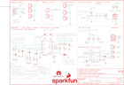

Contents
========

* [PRS13777 > Battery Babysitter](#prs13777--battery-babysitter)
	* [Schematic](#schematic)
	* [PCB](#pcb)
	* [Interactive BOM](#interactive-bom)
	* [OOMP Parts](#oomp-parts)
	* [Images](#images)
	* [Tags](#tags)
  
![][im]
# PRS13777 > Battery Babysitter

- ID: PROJ-SPAR-13777-STAN-01
- Hex ID: PRS13777
- Name: Sparkfun
- Description: Sparkfun
- Long Link: [http://oom.lt/PROJ-SPAR-13777-STAN-01](http://oom.lt/PROJ-SPAR-13777-STAN-01)
- Short Link: [http://oom.lt/PRS13777](http://oom.lt/PRS13777)

## Schematic
  

## PCB
  

## Interactive BOM

- Interactive BOM page: [ibom.html](https://htmlpreview.github.io/?https://github.com/oomlout/oomlout_OOMP_projects/blob/main/PROJ-SPAR-13777-STAN-01/kicad/bom/ibom.html)

## OOMP Parts
  

|OOMP ID|Name|Identifier|
| :---: | :---: | :---: |
|CAPC-1206-X-UNMATCHED-01||C1|
|[CAPC-0805-X-UF10-V10](https://github.com/oomlout/oomlout_OOMP_parts/tree/main/CAPC-0805-X-UF10-V10/)|[SMD (0805) 10 uF Capacitor (Ceramic) 10v](https://github.com/oomlout/oomlout_OOMP_parts/tree/main/CAPC-0805-X-UF10-V10/)|[C2, C3](https://github.com/oomlout/oomlout_OOMP_parts/tree/main/CAPC-0805-X-UF10-V10/)|
|CAPC-0603-X-UF47-01||C4|
|CAPC-0603-X-UNMATCHED-01||C5|
|[LEDS-0603-L-STAN-01](https://github.com/oomlout/oomlout_OOMP_parts/tree/main/LEDS-0603-L-STAN-01/)|[SMD (0603) Blue LED](https://github.com/oomlout/oomlout_OOMP_parts/tree/main/LEDS-0603-L-STAN-01/)|[D1](https://github.com/oomlout/oomlout_OOMP_parts/tree/main/LEDS-0603-L-STAN-01/)|
|[LEDS-0603-R-STAN-01](https://github.com/oomlout/oomlout_OOMP_parts/tree/main/LEDS-0603-R-STAN-01/)|[SMD (0603) Red LED](https://github.com/oomlout/oomlout_OOMP_parts/tree/main/LEDS-0603-R-STAN-01/)|[D2](https://github.com/oomlout/oomlout_OOMP_parts/tree/main/LEDS-0603-R-STAN-01/)|
|UNMATCHED-UNMATCHED-X-UNMATCHED-01||JP1, JP6, S1, S2, TP1, TP2, U1, U2|
|[HEAD-I01-X-PI02-01](https://github.com/oomlout/oomlout_OOMP_parts/tree/main/HEAD-I01-X-PI02-01/)|[2.54 mm 2 Pin Header](https://github.com/oomlout/oomlout_OOMP_parts/tree/main/HEAD-I01-X-PI02-01/)|[JP2, JP4, JP5, JP8, JP11](https://github.com/oomlout/oomlout_OOMP_parts/tree/main/HEAD-I01-X-PI02-01/)|
|[TERS-35D-L-PI02-01](https://github.com/oomlout/oomlout_OOMP_parts/tree/main/TERS-35D-L-PI02-01/)|[3.5 mm 2 Pin Blue Screw Terminal](https://github.com/oomlout/oomlout_OOMP_parts/tree/main/TERS-35D-L-PI02-01/)|[JP3, JP7](https://github.com/oomlout/oomlout_OOMP_parts/tree/main/TERS-35D-L-PI02-01/)|
|HEAD-I01-X-UNMATCHED-01||JP9|
|[HEAD-I01-X-PI04-01](https://github.com/oomlout/oomlout_OOMP_parts/tree/main/HEAD-I01-X-PI04-01/)|[2.54 mm 4 Pin Header](https://github.com/oomlout/oomlout_OOMP_parts/tree/main/HEAD-I01-X-PI04-01/)|[JP10](https://github.com/oomlout/oomlout_OOMP_parts/tree/main/HEAD-I01-X-PI04-01/)|
|HEAD-I01-X-PI01-01||JP12, JP13|
|RESE-UNMATCHED-X-UNMATCHED-01||R1, R3, R4, R6|
|[RESE-0603-X-O103-01](https://github.com/oomlout/oomlout_OOMP_parts/tree/main/RESE-0603-X-O103-01/)|[SMD (0603) 10k Ohm Resistor](https://github.com/oomlout/oomlout_OOMP_parts/tree/main/RESE-0603-X-O103-01/)|[R2, R15, R16, R17](https://github.com/oomlout/oomlout_OOMP_parts/tree/main/RESE-0603-X-O103-01/)|
|RESE-0603-X-O591-01||R5|
|RESE-0603-X-UNMATCHED-01||R7|
|RESE-0603-X-O1003-01||R8, R12|
|RESE-0603-X-O181-01||R9|
|[RESE-0603-X-O102-01](https://github.com/oomlout/oomlout_OOMP_parts/tree/main/RESE-0603-X-O102-01/)|[SMD (0603) 1k Ohm Resistor](https://github.com/oomlout/oomlout_OOMP_parts/tree/main/RESE-0603-X-O102-01/)|[R10](https://github.com/oomlout/oomlout_OOMP_parts/tree/main/RESE-0603-X-O102-01/)|
|RESE-1206-X-UNMATCHED-01||R11|
|[RESE-0603-X-O472-01](https://github.com/oomlout/oomlout_OOMP_parts/tree/main/RESE-0603-X-O472-01/)|[SMD (0603) 4.7k Ohm Resistor](https://github.com/oomlout/oomlout_OOMP_parts/tree/main/RESE-0603-X-O472-01/)|[R13, R14](https://github.com/oomlout/oomlout_OOMP_parts/tree/main/RESE-0603-X-O472-01/)|

## Images
  
  

|bominteractivefront|bominteractiveback|kicadPcb3d|kicadPcb3dFront|kicadPcb3dBack|eagleImage|eagleSchemImage|pcbdraw|pcbdrawback|
| :---: | :---: | :---: | :---: | :---: | :---: | :---: | :---: | :---: |
||||||||||

## Tags

- hexID: PRS13777
- oompType: PROJ
- oompSize: SPAR
- oompColor: 13777
- oompDesc: STAN
- oompIndex: 01
- oompName: Battery Babysitter
- sources: All source files from https://github.com/sparkfun/Battery_Babysitter (source licence details in srcLicense.md)
- linkBuyPage: https://www.sparkfun.com/products/13777
- oompID: PROJ-SPAR-13777-STAN-01
- oompParts: C1,CAPC-1206-X-UNMATCHED-01
- oompParts: C2,CAPC-0805-X-UF10-V10
- oompParts: C3,CAPC-0805-X-UF10-V10
- oompParts: C4,CAPC-0603-X-UF47-01
- oompParts: C5,CAPC-0603-X-UNMATCHED-01
- oompParts: D1,LEDS-0603-L-STAN-01
- oompParts: D2,LEDS-0603-R-STAN-01
- oompParts: JP1,UNMATCHED-UNMATCHED-X-UNMATCHED-01
- oompParts: JP2,HEAD-I01-X-PI02-01
- oompParts: JP3,TERS-35D-L-PI02-01
- oompParts: JP4,HEAD-I01-X-PI02-01
- oompParts: JP5,HEAD-I01-X-PI02-01
- oompParts: JP6,UNMATCHED-UNMATCHED-X-UNMATCHED-01
- oompParts: JP7,TERS-35D-L-PI02-01
- oompParts: JP8,HEAD-I01-X-PI02-01
- oompParts: JP9,HEAD-I01-X-UNMATCHED-01
- oompParts: JP10,HEAD-I01-X-PI04-01
- oompParts: JP11,HEAD-I01-X-PI02-01
- oompParts: JP12,HEAD-I01-X-PI01-01
- oompParts: JP13,HEAD-I01-X-PI01-01
- oompParts: R1,RESE-UNMATCHED-X-UNMATCHED-01
- oompParts: R2,RESE-0603-X-O103-01
- oompParts: R3,RESE-UNMATCHED-X-UNMATCHED-01
- oompParts: R4,RESE-UNMATCHED-X-UNMATCHED-01
- oompParts: R5,RESE-0603-X-O591-01
- oompParts: R6,RESE-UNMATCHED-X-UNMATCHED-01
- oompParts: R7,RESE-0603-X-UNMATCHED-01
- oompParts: R8,RESE-0603-X-O1003-01
- oompParts: R9,RESE-0603-X-O181-01
- oompParts: R10,RESE-0603-X-O102-01
- oompParts: R11,RESE-1206-X-UNMATCHED-01
- oompParts: R12,RESE-0603-X-O1003-01
- oompParts: R13,RESE-0603-X-O472-01
- oompParts: R14,RESE-0603-X-O472-01
- oompParts: R15,RESE-0603-X-O103-01
- oompParts: R16,RESE-0603-X-O103-01
- oompParts: R17,RESE-0603-X-O103-01
- oompParts: S1,UNMATCHED-UNMATCHED-X-UNMATCHED-01
- oompParts: S2,UNMATCHED-UNMATCHED-X-UNMATCHED-01
- oompParts: TP1,UNMATCHED-UNMATCHED-X-UNMATCHED-01
- oompParts: TP2,UNMATCHED-UNMATCHED-X-UNMATCHED-01
- oompParts: U1,UNMATCHED-UNMATCHED-X-UNMATCHED-01
- oompParts: U2,UNMATCHED-UNMATCHED-X-UNMATCHED-01
- rawParts: C1,1.0uF,1.0UF50V10%(1206),1206-CAP,CAP-09822,,,CAP-09822,,,1.0uF,
- rawParts: C2,10uF,10UF10V10%(0805),0805-CAP,CAP-11330,,,CAP-11330,,,,
- rawParts: C3,10uF,10UF10V10%(0805),0805-CAP,CAP-11330,,,CAP-11330,,,,
- rawParts: C4,0.47uF,CAP0603-CAP,0603-CAP,Capacitor,,,CAP-13216,,,,
- rawParts: C5,1.0uF,1.0UF-16V-10%(0603),0603-CAP,CAP-00868,,,CAP-00868,,,1.0uF,
- rawParts: D1,BLUE,LED-BLUE0603,LED-0603,Blue LEDs for production use,,,DIO-08575,,,BLUE,
- rawParts: D2,RED,LED-RED0603,LED-0603,Assorted Red LEDs,,,DIO-00819,,,RED,
- rawParts: FID1,FIDUCIAL1X2,FIDUCIAL1X2,FIDUCIAL-1X2,Fiducial Alignment Points,,,,,,,
- rawParts: FID2,FIDUCIAL1X2,FIDUCIAL1X2,FIDUCIAL-1X2,Fiducial Alignment Points,,,,,,,
- rawParts: FRAME1,FRAME-LETTER,FRAME-LETTER,CREATIVE_COMMONS,Schematic Frame,,,,,,,
- rawParts: JP1,USB-AB-MICRO-SMD_V03,USB-ABCONN-11794,USB-AB-MICRO-SMD_V03,This is a USB AB connector that is compatible with USB OTG. i.e. this connector can serve as a host or device,,,CONN-11794,,,,
- rawParts: JP2,,M021X02_NO_SILK,1X02_NO_SILK,Standard 2-pin 0.1 header. Use with,,,,,,,
- rawParts: JP3,,M023.5MM-NO_SILK,SCREWTERMINAL-3.5MM-2-NS,Standard 2-pin 0.1 header. Use with,,,CONN-08399,,,,
- rawParts: JP4,,M021X02_NO_SILK,1X02_NO_SILK,Standard 2-pin 0.1 header. Use with,,,,,,,
- rawParts: JP5,,M021X02_NO_SILK,1X02_NO_SILK,Standard 2-pin 0.1 header. Use with,,,,,,,
- rawParts: JP6,,JST_2MM_MALE,JST-2-SMD,Mates to single-cell LiPo batteries.,-,+,CONN-11443,-,+,,
- rawParts: JP7,,M023.5MM-NO_SILK,SCREWTERMINAL-3.5MM-2-NS,Standard 2-pin 0.1 header. Use with,,,CONN-08399,,,,
- rawParts: JP8,,M021X02_NO_SILK,1X02_NO_SILK,Standard 2-pin 0.1 header. Use with,,,,,,,
- rawParts: JP9,,M02-JST-2-PTH-NO_SILK,JST-2-PTH-NS,Standard 2-pin 0.1 header. Use with,,,,,,,
- rawParts: JP10,,I2C_STANDARD_NO_SILK,1X04_NO_SILK,SparkFun has standardized on a pinout for all I2C based sensor breakouts.,,,,,,,
- rawParts: JP11,,M021X02_NO_SILK,1X02_NO_SILK,Standard 2-pin 0.1 header. Use with,,,,,,,
- rawParts: JP12,,M01PTH_NO_SILK_YES_STOP,1X01_NO_SILK,Header 1,,,,,,,
- rawParts: JP13,,M01PTH_NO_SILK_YES_STOP,1X01_NO_SILK,Header 1,,,,,,,
- rawParts: LOGO1,SFE_LOGO_NAME.1_INCH,SFE_LOGO_NAME.1_INCH,SFE_LOGO_NAME_.1,SFE Logo, name only,,,,,,,
- rawParts: LOGO2,SFE_LOGO_NAME_FLAME.1_INCH,SFE_LOGO_NAME_FLAME.1_INCH,SFE_LOGO_NAME_FLAME_.1,SFE Logo, name and flame,,,,,,,
- rawParts: LOGO3,OSHW-LOGOS,OSHW-LOGOS,OSHW-LOGO-S,Open Source Hardware Logo,,,,,,,
- rawParts: R1,TS,RESISTORPTH-1/6W,1/6W-RES,Resistor,,,,,,,
- rawParts: R2,10K,10KOHM-1/10W-1%(0603)0603,0603-RES,RES-00824,,,RES-00824,,,10K,
- rawParts: R3,TMR,RESISTORPTH-1/6W,1/6W-RES,Resistor,,,,,,,
- rawParts: R4,ISET,RESISTORPTH-1/6W,1/6W-RES,Resistor,,,,,,,
- rawParts: R5,590,RESISTOR0603-RES,0603-RES,Resistor,,,RES-13217,,,,
- rawParts: R6,ILIM,RESISTORPTH-1/6W,1/6W-RES,Resistor,,,,,,,
- rawParts: R7,1.1k,RESISTOR0603-RES,0603-RES,Resistor,,,RES-10447,,,,
- rawParts: R8,100k,100KOHM-1/10W-1%(0603),0603-RES,RES-07828,,,RES-07828,,,100k,
- rawParts: R9,180,180OHM1/10W1%(0603),0603-RES,RES-08788,,,RES-08788,,,180,
- rawParts: R10,1K,1KOHM-1/10W-1%(0603),0603-RES,RES-07856,,,RES-07856,,,1K,
- rawParts: R11,0.01,RESISTOR1206,1206,Resistor,,,RES-13218,,,,
- rawParts: R12,100k,100KOHM-1/10W-1%(0603),0603-RES,RES-07828,,,RES-07828,,,100k,
- rawParts: R13,4.7K,4.7KOHM-1/10W-1%(0603),0603-RES,RES-07857,,,RES-07857,,,4.7K,
- rawParts: R14,4.7K,4.7KOHM-1/10W-1%(0603),0603-RES,RES-07857,,,RES-07857,,,4.7K,
- rawParts: R15,10K,10KOHM-1/10W-1%(0603)0603,0603-RES,RES-00824,,,RES-00824,,,10K,
- rawParts: R16,10K,10KOHM-1/10W-1%(0603)0603,0603-RES,RES-00824,,,RES-00824,,,10K,
- rawParts: R17,10K,10KOHM-1/10W-1%(0603)0603,0603-RES,RES-00824,,,RES-00824,,,10K,
- rawParts: S1,RIGHT_ANGLE_SLIDE_SWITCH_SMD,SWITCH-SPDT-SMD-A,SWITCH-SPST-SMD-A,SPDT Switch,,,SWCH-10651,,,,
- rawParts: S2,SW_DIP-2_SMD,SW_DIP-2-SMT-HALFSIZE,DIPSWITCH-02-50MIL,DIP SWITCH,,,SWCH-13215,,,,
- rawParts: SJ1,,JUMPER-PAD-2-NC_BY_TRACE,PAD-JUMPER-2-NC_BY_TRACE_YES_SILK,,,,,,,,
- rawParts: SJ2,,JUMPER-PAD-2-NC_BY_TRACE,PAD-JUMPER-2-NC_BY_TRACE_YES_SILK,,,,,,,,
- rawParts: SJ3,,JUMPER-PAD-2-NC_BY_TRACE,PAD-JUMPER-2-NC_BY_TRACE_YES_SILK,,,,,,,,
- rawParts: SJ4,,JUMPER-PAD-2-NC_BY_TRACE,PAD-JUMPER-2-NC_BY_TRACE_YES_SILK,,,,,,,,
- rawParts: SJ5,,JUMPER-PAD-3-2OF3_NC_BY_TRACE_SMALL,PAD-JUMPER-3-2OF3_NC_BY_TRACE_YES_SILK_FULL_BOX,,,,,,,,
- rawParts: STANDOFF1,STAND-OFF,STAND-OFF,STAND-OFF,#4 Stand Off,,,,,,,
- rawParts: STANDOFF2,STAND-OFF,STAND-OFF,STAND-OFF,#4 Stand Off,,,,,,,
- rawParts: STANDOFF3,STAND-OFF,STAND-OFF,STAND-OFF,#4 Stand Off,,,,,,,
- rawParts: STANDOFF4,STAND-OFF,STAND-OFF,STAND-OFF,#4 Stand Off,,,,,,,
- rawParts: TP1,,TEST-POINT3X4,PAD.03X.04,Bare copper test points for troubleshooting or ICT,,,,,,,
- rawParts: TP2,,TEST-POINT3X4,PAD.03X.04,Bare copper test points for troubleshooting or ICT,,,,,,,
- rawParts: U1,BQ24075,BQ24075,PVQFN-N16,Texas Instruments BQ24075 LiPo Battery Chargerand Power-Path Management IC,,,IC-13219,,,,
- rawParts: U2,BQ27441-G1,BQ27441-G1,PDSO-N12,Texas Instruments BQ27441-G1 LiPo Battery Fuel Gauge,,,IC-13220,,,,

[im]: kicadPcb3d_450.png
