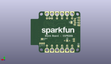
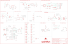

Contents
========

* [PRS13794 > Blynk Board ESP8266](#prs13794--blynk-board-esp8266)
	* [Schematic](#schematic)
	* [Interactive BOM](#interactive-bom)
	* [OOMP Parts](#oomp-parts)
	* [Images](#images)
	* [Tags](#tags)
  
![][im]
# PRS13794 > Blynk Board ESP8266

- ID: PROJ-SPAR-13794-STAN-01
- Hex ID: PRS13794
- Name: Sparkfun
- Description: Sparkfun
- Long Link: [http://oom.lt/PROJ-SPAR-13794-STAN-01](http://oom.lt/PROJ-SPAR-13794-STAN-01)
- Short Link: [http://oom.lt/PRS13794](http://oom.lt/PRS13794)

## Schematic
  

## Interactive BOM

- Interactive BOM page: [ibom.html](https://htmlpreview.github.io/?https://github.com/oomlout/oomlout_OOMP_projects/blob/main/PROJ-SPAR-13794-STAN-01/kicad/bom/ibom.html)

## OOMP Parts
  

|OOMP Parts|
| :---: |
|[CAPC-0603-X-UF10-V63D  SMD (0603) 10 uF Capacitor (Ceramic) 6.3v  C1](https://github.com/oomlout/oomlout_OOMP_parts/tree/main/CAPC-0603-X-UF10-V63D/)|
|[CAPC-0603-X-NF100-V50  SMD (0603) 100 nF Capacitor (Ceramic) 50v  C2, C5, C9, C11, C14, C16, C17, C18](https://github.com/oomlout/oomlout_OOMP_parts/tree/main/CAPC-0603-X-NF100-V50/)|
|[CAPC-0603-X-PF10-V50  SMD (0603) 10 pF Capacitor (Ceramic) 50v  C3, C4](https://github.com/oomlout/oomlout_OOMP_parts/tree/main/CAPC-0603-X-PF10-V50/)|
|[CAPC-0603-X-UF47D-V10  SMD (0603) 4.7 uF Capacitor (Ceramic) 10v  C6, C15, C19](https://github.com/oomlout/oomlout_OOMP_parts/tree/main/CAPC-0603-X-UF47D-V10/)|
|CAPC-0805-X-UNMATCHED-01 C7|
|CAPC-0603-X-PF56D-01 C8|
|[CAPC-0603-X-UF22D-V10  SMD (0603) 2.2 uF Capacitor (Ceramic) 10v  C10](https://github.com/oomlout/oomlout_OOMP_parts/tree/main/CAPC-0603-X-UF22D-V10/)|
|CAPC-0603-X-PF47-01 C12, C13|
|[LEDS-0603-Y-STAN-01  SMD (0603) Yellow LED  D1](https://github.com/oomlout/oomlout_OOMP_parts/tree/main/LEDS-0603-Y-STAN-01/)|
|DIOD-S323-X-UNMATCHED-01 D2|
|[LEDS-0603-L-STAN-01  SMD (0603) Blue LED  D3](https://github.com/oomlout/oomlout_OOMP_parts/tree/main/LEDS-0603-L-STAN-01/)|
|DIOD-UNMATCHED-X-K2812-01 D4|
|[LEDS-0603-R-STAN-01  SMD (0603) Red LED  D5](https://github.com/oomlout/oomlout_OOMP_parts/tree/main/LEDS-0603-R-STAN-01/)|
|UNMATCHED-UNMATCHED-X-UNMATCHED-01 E1, IC1, JP15, S1, U2, U4, U5, U6, Y1|
|REFU-1206-X-UNMATCHED-01 F1|
|HEAD-I01-X-UNMATCHED-01 JP1, JP14, JP29|
|UNMATCHED-SO23-X-UNMATCHED-01 Q1, Q2, Q3|
|[RESE-0603-X-O123-01  SMD (0603) 12k Ohm Resistor  R1](https://github.com/oomlout/oomlout_OOMP_parts/tree/main/RESE-0603-X-O123-01/)|
|[RESE-0603-X-O102-01  SMD (0603) 1k Ohm Resistor  R2, R12](https://github.com/oomlout/oomlout_OOMP_parts/tree/main/RESE-0603-X-O102-01/)|
|[RESE-0603-X-O223-01  SMD (0603) 22k Ohm Resistor  R3](https://github.com/oomlout/oomlout_OOMP_parts/tree/main/RESE-0603-X-O223-01/)|
|[RESE-0603-X-O103-01  SMD (0603) 10k Ohm Resistor  R4](https://github.com/oomlout/oomlout_OOMP_parts/tree/main/RESE-0603-X-O103-01/)|
|RESE-UNMATCHED-X-UNMATCHED-01 R5|
|RESE-0603-X-UNMATCHED-01 R6|
|RESE-UNMATCHED-X-O103-01 R7, R8, R10, R17, R18, R19, R20|
|[RESE-0603-X-O201-01  SMD (0603) 200 Ohm Resistor  R9](https://github.com/oomlout/oomlout_OOMP_parts/tree/main/RESE-0603-X-O201-01/)|
|[RESE-0603-X-O331-01  SMD (0603) 330 Ohm Resistor  R11](https://github.com/oomlout/oomlout_OOMP_parts/tree/main/RESE-0603-X-O331-01/)|
|RESE-0603-X-O270-01 R13, R14|
|[RESE-0603-X-O472-01  SMD (0603) 4.7k Ohm Resistor  R15, R16](https://github.com/oomlout/oomlout_OOMP_parts/tree/main/RESE-0603-X-O472-01/)|
|UNMATCHED-SO235-X-UNMATCHED-01 U1|
|VREG-SO235-X-KAP2112K-V33D U3|

## Images
  
  

|bominteractivefront|bominteractiveback|kicadPcb3d|kicadPcb3dFront|kicadPcb3dBack|eagleSchemImage|
| :---: | :---: | :---: | :---: | :---: | :---: |
|||||||

## Tags

- hexID: PRS13794
- oompType: PROJ
- oompSize: SPAR
- oompColor: 13794
- oompDesc: STAN
- oompIndex: 01
- oompName: Blynk Board ESP8266
- sources: All source files from https://github.com/sparkfun/Blynk_Board_ESP8266 (source licence details in srcLicense.md)
- linkBuyPage: https://www.sparkfun.com/products/13794
- oompID: PROJ-SPAR-13794-STAN-01
- oompParts: C1,CAPC-0603-X-UF10-V63D
- oompParts: C2,CAPC-0603-X-NF100-V50
- oompParts: C3,CAPC-0603-X-PF10-V50
- oompParts: C4,CAPC-0603-X-PF10-V50
- oompParts: C5,CAPC-0603-X-NF100-V50
- oompParts: C6,CAPC-0603-X-UF47D-V10
- oompParts: C7,CAPC-0805-X-UNMATCHED-01
- oompParts: C8,CAPC-0603-X-PF56D-01
- oompParts: C9,CAPC-0603-X-NF100-V50
- oompParts: C10,CAPC-0603-X-UF22D-V10
- oompParts: C11,CAPC-0603-X-NF100-V50
- oompParts: C12,CAPC-0603-X-PF47-01
- oompParts: C13,CAPC-0603-X-PF47-01
- oompParts: C14,CAPC-0603-X-NF100-V50
- oompParts: C15,CAPC-0603-X-UF47D-V10
- oompParts: C16,CAPC-0603-X-NF100-V50
- oompParts: C17,CAPC-0603-X-NF100-V50
- oompParts: C18,CAPC-0603-X-NF100-V50
- oompParts: C19,CAPC-0603-X-UF47D-V10
- oompParts: D1,LEDS-0603-Y-STAN-01
- oompParts: D2,DIOD-S323-X-UNMATCHED-01
- oompParts: D3,LEDS-0603-L-STAN-01
- oompParts: D4,DIOD-UNMATCHED-X-K2812-01
- oompParts: D5,LEDS-0603-R-STAN-01
- oompParts: E1,UNMATCHED-UNMATCHED-X-UNMATCHED-01
- oompParts: F1,REFU-1206-X-UNMATCHED-01
- oompParts: IC1,UNMATCHED-UNMATCHED-X-UNMATCHED-01
- oompParts: JP1,HEAD-I01-X-UNMATCHED-01
- oompParts: JP14,HEAD-I01-X-UNMATCHED-01
- oompParts: JP15,UNMATCHED-UNMATCHED-X-UNMATCHED-01
- oompParts: JP29,HEAD-I01-X-UNMATCHED-01
- oompParts: Q1,UNMATCHED-SO23-X-UNMATCHED-01
- oompParts: Q2,UNMATCHED-SO23-X-UNMATCHED-01
- oompParts: Q3,UNMATCHED-SO23-X-UNMATCHED-01
- oompParts: R1,RESE-0603-X-O123-01
- oompParts: R2,RESE-0603-X-O102-01
- oompParts: R3,RESE-0603-X-O223-01
- oompParts: R4,RESE-0603-X-O103-01
- oompParts: R5,RESE-UNMATCHED-X-UNMATCHED-01
- oompParts: R6,RESE-0603-X-UNMATCHED-01
- oompParts: R7,RESE-UNMATCHED-X-O103-01
- oompParts: R8,RESE-UNMATCHED-X-O103-01
- oompParts: R9,RESE-0603-X-O201-01
- oompParts: R10,RESE-UNMATCHED-X-O103-01
- oompParts: R11,RESE-0603-X-O331-01
- oompParts: R12,RESE-0603-X-O102-01
- oompParts: R13,RESE-0603-X-O270-01
- oompParts: R14,RESE-0603-X-O270-01
- oompParts: R15,RESE-0603-X-O472-01
- oompParts: R16,RESE-0603-X-O472-01
- oompParts: R17,RESE-UNMATCHED-X-O103-01
- oompParts: R18,RESE-UNMATCHED-X-O103-01
- oompParts: R19,RESE-UNMATCHED-X-O103-01
- oompParts: R20,RESE-UNMATCHED-X-O103-01
- oompParts: S1,UNMATCHED-UNMATCHED-X-UNMATCHED-01
- oompParts: U1,UNMATCHED-SO235-X-UNMATCHED-01
- oompParts: U2,UNMATCHED-UNMATCHED-X-UNMATCHED-01
- oompParts: U3,VREG-SO235-X-KAP2112K-V33D
- oompParts: U4,UNMATCHED-UNMATCHED-X-UNMATCHED-01
- oompParts: U5,UNMATCHED-UNMATCHED-X-UNMATCHED-01
- oompParts: U6,UNMATCHED-UNMATCHED-X-UNMATCHED-01
- oompParts: Y1,UNMATCHED-UNMATCHED-X-UNMATCHED-01
- rawParts: C1,10uF,10UF-6.3V-20%(0603),0603-CAP,CAP-11015,CAP-11015,,10uF,
- rawParts: C2,0.1uF,0.1UF-25V(+80/-20%)(0603),0603-CAP,CAP-00810,CAP-00810,,0.1uF,
- rawParts: C3,10pF,10PF-50V-5%(0603),0603-CAP,CAP-11812,CAP-11812,,10pF,
- rawParts: C4,10pF,10PF-50V-5%(0603),0603-CAP,CAP-11812,CAP-11812,,10pF,
- rawParts: C5,0.1uF,0.1UF-25V(+80/-20%)(0603),0603-CAP,CAP-00810,CAP-00810,,0.1uF,
- rawParts: C6,4.7uF,4.7UF-6.3V-10%(0603)0603,0603-CAP,CAP-08280,CAP-08280,,4.7uF,
- rawParts: C7,1.0uF,1.0UF-25V-+80/-20(0805),0805-CAP,CAP-11625,CAP-11625,,1.0uF,
- rawParts: C8,5.6pF,CAP0603-CAP,0603-CAP,Capacitor,CAP-12456,,,
- rawParts: C9,0.1uF,0.1UF-25V(+80/-20%)(0603),0603-CAP,CAP-00810,CAP-00810,,0.1uF,
- rawParts: C10,2.2uF,2.2UF-10V-20%(0603),0603-CAP,CAP-07888,CAP-07888,,2.2uF,
- rawParts: C11,0.1uF,0.1UF-25V(+80/-20%)(0603),0603-CAP,CAP-00810,CAP-00810,,0.1uF,
- rawParts: C12,47pF,47PF-50V-5%(0603),0603-CAP,CAP-08913,CAP-08913,,47pF,
- rawParts: C13,47pF,47PF-50V-5%(0603),0603-CAP,CAP-08913,CAP-08913,,47pF,
- rawParts: C14,0.1uF,0.1UF-25V(+80/-20%)(0603),0603-CAP,CAP-00810,CAP-00810,,0.1uF,
- rawParts: C15,4.7uF,4.7UF-6.3V-10%(0603)0603,0603-CAP,CAP-08280,CAP-08280,,4.7uF,
- rawParts: C16,0.1uF,0.1UF-25V(+80/-20%)(0603),0603-CAP,CAP-00810,CAP-00810,,0.1uF,
- rawParts: C17,0.1uF,0.1UF-25V(+80/-20%)(0603),0603-CAP,CAP-00810,CAP-00810,,0.1uF,
- rawParts: C18,0.1uF,0.1UF-25V(+80/-20%)(0603),0603-CAP,CAP-00810,CAP-00810,,0.1uF,
- rawParts: C19,4.7uF,4.7UF-6.3V-10%(0603)0603,0603-CAP,CAP-08280,CAP-08280,,4.7uF,
- rawParts: D1,Yellow,LED-YELLOW0603,LED-0603,Yellow SMD LEDs,DIO-09003,,Yellow,
- rawParts: D2,BAT20J,DIODE-SCHOTTKY-BAT20J,SOD-323,Schottky diodes in SFEs production catalog,DIO-11623,,BAT20J,
- rawParts: D3,BLUE,LED-BLUE0603,LED-0603,Blue LEDs for production use,DIO-08575,,BLUE,
- rawParts: D4,WS2812,WS2812B,WS2812B,WS2812B - Intelligent control LED integrated light source,DIO-12503,,,
- rawParts: D5,RED,LED-RED0603,LED-0603,Assorted Red LEDs,DIO-00819,,RED,
- rawParts: E1,ANTENNATRACE,ANTENNATRACE,TRACE_ANTENNA_2.4GHZ_25.7MM,Chip antenna,,,,
- rawParts: F1,500mA,PTCSMD,PTC-1206,Resettable Fuse PTC,RES-11150,,,
- rawParts: FID1,FIDUCIAL1X2,FIDUCIAL1X2,FIDUCIAL-1X2,Fiducial Alignment Points,,,,
- rawParts: FID2,FIDUCIAL1X2,FIDUCIAL1X2,FIDUCIAL-1X2,Fiducial Alignment Points,,,,
- rawParts: FRAME1,FRAME-LEDGER,FRAME-LEDGER,CREATIVE_COMMONS,Schematic Frame,,,,
- rawParts: IC1,LMV358,OPAMP-DUALU,SO08,Generic op-amp footprint,IC-09657,,,
- rawParts: JP1,JST_2,M02JST-PTH-2,JST-2-PTH,Standard 2-pin 0.1 header. Use with,CONN-09863,PRT-09914,,
- rawParts: JP2,DNP,M01ALLIGATOR_HALF,1X01_ALLIGATOR_3MM_HALF,Header 1,,,,
- rawParts: JP3,DNP,M01PTH_NO_SILK_YES_STOP,1X01_NO_SILK,Header 1,,,,
- rawParts: JP4,DNP,M01ALLIGATOR_HALF,1X01_ALLIGATOR_3MM_HALF,Header 1,,,,
- rawParts: JP5,DNP,M01PTH_NO_SILK_YES_STOP,1X01_NO_SILK,Header 1,,,,
- rawParts: JP6,DNP,M01ALLIGATOR_HALF,1X01_ALLIGATOR_3MM_HALF,Header 1,,,,
- rawParts: JP7,DNP,M01PTH_NO_SILK_YES_STOP,1X01_NO_SILK,Header 1,,,,
- rawParts: JP8,DNP,M01ALLIGATOR_HALF,1X01_ALLIGATOR_3MM_HALF,Header 1,,,,
- rawParts: JP9,DNP,M01PTH_NO_SILK_YES_STOP,1X01_NO_SILK,Header 1,,,,
- rawParts: JP10,DNP,M01ALLIGATOR_HALF,1X01_ALLIGATOR_3MM_HALF,Header 1,,,,
- rawParts: JP11,DNP,M01PTH_NO_SILK_YES_STOP,1X01_NO_SILK,Header 1,,,,
- rawParts: JP12,DNP,M01ALLIGATOR_HALF,1X01_ALLIGATOR_3MM_HALF,Header 1,,,,
- rawParts: JP13,DNP,M01PTH_NO_SILK_YES_STOP,1X01_NO_SILK,Header 1,,,,
- rawParts: JP14,JST-3,M03JST-PTH-VERT,JST-3-PTH-VERT,Header 3,CONN-13230,,,
- rawParts: JP15,USB,USB_MICROB_PLUGCONN-11752,USB-B-MICRO-SMD_V03,USB Micro-B connectors,CONN-11752,,,
- rawParts: JP16,DNP,M01ALLIGATOR_HALF,1X01_ALLIGATOR_3MM_HALF,Header 1,,,,
- rawParts: JP17,DNP,M01PTH_NO_SILK_YES_STOP,1X01_NO_SILK,Header 1,,,,
- rawParts: JP18,DNP,M01ALLIGATOR_HALF,1X01_ALLIGATOR_3MM_HALF,Header 1,,,,
- rawParts: JP19,DNP,M01PTH_NO_SILK_YES_STOP,1X01_NO_SILK,Header 1,,,,
- rawParts: JP20,DNP,M01ALLIGATOR_HALF,1X01_ALLIGATOR_3MM_HALF,Header 1,,,,
- rawParts: JP21,DNP,M01PTH_NO_SILK_YES_STOP,1X01_NO_SILK,Header 1,,,,
- rawParts: JP22,DNP,M01ALLIGATOR_HALF,1X01_ALLIGATOR_3MM_HALF,Header 1,,,,
- rawParts: JP23,DNP,M01PTH_NO_SILK_YES_STOP,1X01_NO_SILK,Header 1,,,,
- rawParts: JP24,DNP,M01ALLIGATOR_HALF,1X01_ALLIGATOR_3MM_HALF,Header 1,,,,
- rawParts: JP25,DNP,M01PTH_NO_SILK_YES_STOP,1X01_NO_SILK,Header 1,,,,
- rawParts: JP26,DNP,M01ALLIGATOR_HALF,1X01_ALLIGATOR_3MM_HALF,Header 1,,,,
- rawParts: JP27,DNP,M01PTH_NO_SILK_YES_STOP,1X01_NO_SILK,Header 1,,,,
- rawParts: JP28,DNP,M01PTH_NO_SILK_YES_STOP,1X01_NO_SILK,Header 1,,,,
- rawParts: JP29,JST-4,M04JST-PTH-VERT,JST-4-PTH-VERT,Header 4,CONN-13251,,,
- rawParts: JP30,DNP,I2C_STANDARD_NO_SILK,1X04_NO_SILK,SparkFun has standardized on a pinout for all I2C based sensor breakouts.,,,,
- rawParts: L1,DNP,INDUCTOR0603,0603,Inductors,,,,
- rawParts: L2,DNP,INDUCTOR0603,0603,Inductors,,,,
- rawParts: LOGO1,SFE_LOGO_NAME.2_INCH,SFE_LOGO_NAME.2_INCH,SFE_LOGO_NAME_.2,SFE Logo, name only,,,,
- rawParts: LOGO2,OSHW-LOGOS,OSHW-LOGOS,OSHW-LOGO-S,Open Source Hardware Logo,,,,
- rawParts: LOGO3,SFE_LOGO_NAME.3_INCH,SFE_LOGO_NAME.3_INCH,SFE_LOGO_NAME_.3,SFE Logo, name only,,,,
- rawParts: Q1,2.5A/30V,MOSFET-PCHANNELDMG2307L,SOT23-3,Generic PMOSFET,TRANS-11308,,2.5A/30V,
- rawParts: Q2,MMBT2222A,TRANSISTOR_NPNMMBT2222A,SOT23-3@1,Generic NPN BJT,TRANS-08049,,MMBT2222A,
- rawParts: Q3,MMBT2222A,TRANSISTOR_NPNMMBT2222A,SOT23-3@1,Generic NPN BJT,TRANS-08049,,MMBT2222A,
- rawParts: R1,12k,12KOHM-1/10W-1%(0603),0603-RES,RES-10327,RES-10327,,12k,
- rawParts: R2,1K,1KOHM-1/10W-1%(0603),0603-RES,RES-07856,RES-07856,,1K,
- rawParts: R3,22K,22KOHM1/10W1%(0603),0603-RES,RES-07853,RES-07853,,22K,
- rawParts: R4,10K,10KOHM-1/10W-1%(0603)0603,0603-RES,RES-00824,RES-00824,,10K,
- rawParts: R5,DNP,RESISTORPTH-1/6W,1/6W-RES,Resistor,,,,
- rawParts: R6,2.0k,2.0KOHM1/10W5%(0603),0603-RES,RES-08296,RES-08296,,2.0k,
- rawParts: R7,10K,10KOHM1/10W1%(0603)0603,0603-RES@1,RES-00824,RES-00824,,10K,
- rawParts: R8,10K,10KOHM1/10W1%(0603)0603,0603-RES@1,RES-00824,RES-00824,,10K,
- rawParts: R9,200,200OHM1/10W1%(0603),0603-RES,RES-08220,RES-08220,,200,
- rawParts: R10,10K,10KOHM1/10W1%(0603)0603,0603-RES@1,RES-00824,RES-00824,,10K,
- rawParts: R11,330,330OHM1/10W1%(0603),0603-RES,RES-00818,RES-00818,,330,
- rawParts: R12,1K,1KOHM-1/10W-1%(0603),0603-RES,RES-07856,RES-07856,,1K,
- rawParts: R13,27,27OHM1/10W1%(0603)0603-RES,0603-RES,RES-09334,RES-09334,,,
- rawParts: R14,27,27OHM1/10W1%(0603)0603-RES,0603-RES,RES-09334,RES-09334,,,
- rawParts: R15,4.7K,4.7KOHM-1/10W-1%(0603),0603-RES,RES-07857,RES-07857,,4.7K,
- rawParts: R16,4.7K,4.7KOHM-1/10W-1%(0603),0603-RES,RES-07857,RES-07857,,4.7K,
- rawParts: R17,10K,10KOHM1/10W1%(0603)0603,0603-RES@1,RES-00824,RES-00824,,10K,
- rawParts: R18,10K,10KOHM1/10W1%(0603)0603,0603-RES@1,RES-00824,RES-00824,,10K,
- rawParts: R19,10K,10KOHM1/10W1%(0603)0603,0603-RES@1,RES-00824,RES-00824,,10K,
- rawParts: R20,10K,10KOHM1/10W1%(0603)0603,0603-RES@1,RES-00824,RES-00824,,10K,
- rawParts: S1,GP0,SWITCH-MOMENTARY-2SMD-REDUNDANT,TACTILE-SWITCH-SMD,Various NO switches- pushbuttons, reed, etc,SWCH-08247,,,
- rawParts: SJ1,DNP,JUMPER-PAD-2-NC_BY_TRACE,PAD-JUMPER-2-NC_BY_TRACE_YES_SILK,,,,,
- rawParts: SJ2,PWRLED,JUMPER-PAD-2-NC_BY_TRACE,PAD-JUMPER-2-NC_BY_TRACE_YES_SILK,,,,,
- rawParts: SJ3,WS2812-VCC,JUMPER-PAD-2-NC_BY_TRACE,PAD-JUMPER-2-NC_BY_TRACE_YES_SILK,,,,,
- rawParts: SJ4,DNP,JUMPER-PAD-3-NC_BY_TRACE,PAD-JUMPER-3-3OF3_NC_BY_TRACE_YES_SILK_FULL_BOX,,,,,
- rawParts: STANDOFF1,STAND-OFF,STAND-OFF,STAND-OFF,#4 Stand Off,,,,
- rawParts: STANDOFF2,STAND-OFF,STAND-OFF,STAND-OFF,#4 Stand Off,,,,
- rawParts: STANDOFF3,STAND-OFF,STAND-OFF,STAND-OFF,#4 Stand Off,,,,
- rawParts: STANDOFF4,STAND-OFF,STAND-OFF,STAND-OFF,#4 Stand Off,,,,
- rawParts: U1,MCP73831,MCP73831,SOT23-5,Miniature single cell, fully integrated Li-Ion, Li-polymer charge management controller,IC-09995,,,
- rawParts: U2,ESP8266,ESP8266,QFN32,Espressif ESP8266,IC-12452,,,
- rawParts: U3,AP2112K-3.3V,V_REG_LDOSMD,SOT23-5,Voltage Regulator LDO,VREG-12457,,,
- rawParts: U4,FT231XS-U,FT231XS,SSOP20_L,FTDI FT231X Full Speed USB to Full-handshake UART,IC-11524,,FTS31XS-U,
- rawParts: U5,W25Q32FVSS,W25Q32FVSS,SOIC-8,,IC-13229,,,
- rawParts: U6,SI7021,SI7021,SI7021,The Si7021 is an I2C Humidity and Temperature Sensor,IC-13093,,,
- rawParts: Y1,26MHz,CRYSTAL-GROUNDED3.2X2.5,CRYSTAL-SMD-3.2X2.5,,XTAL-12454,,,

[im]: kicadPcb3d_450.png
