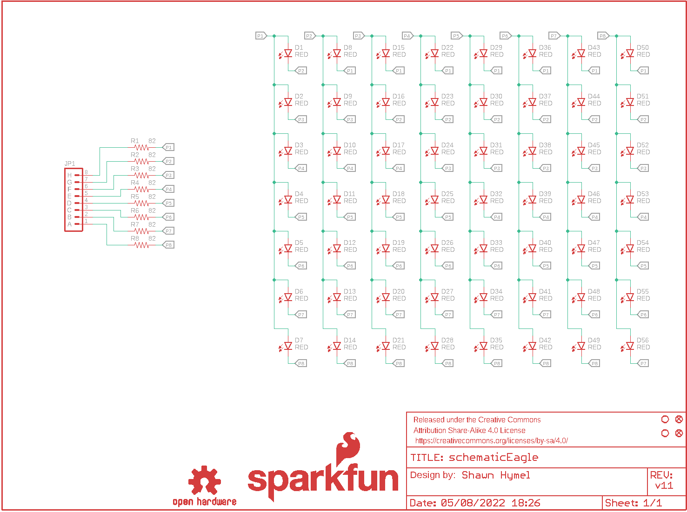
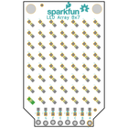
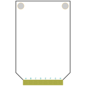
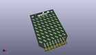
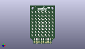
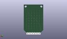
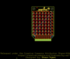
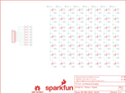
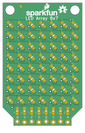
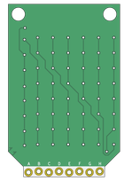

Contents
========

* [PRS13795 > LED Array 8x7](#prs13795--led-array-8x7)
	* [Schematic](#schematic)
	* [PCB](#pcb)
	* [Interactive BOM](#interactive-bom)
	* [OOMP Parts](#oomp-parts)
	* [Images](#images)
	* [Tags](#tags)
  
![][im]
# PRS13795 > LED Array 8x7

- ID: PROJ-SPAR-13795-STAN-01
- Hex ID: PRS13795
- Name: Sparkfun
- Description: Sparkfun
- Long Link: [http://oom.lt/PROJ-SPAR-13795-STAN-01](http://oom.lt/PROJ-SPAR-13795-STAN-01)
- Short Link: [http://oom.lt/PRS13795](http://oom.lt/PRS13795)

## Schematic
  

## PCB
  

## Interactive BOM

- Interactive BOM page: [ibom.html](https://htmlpreview.github.io/?https://github.com/oomlout/oomlout_OOMP_projects/blob/main/PROJ-SPAR-13795-STAN-01/kicad/bom/ibom.html)

## OOMP Parts
  

|OOMP ID|Name|Identifier|
| :---: | :---: | :---: |
|[LEDS-0603-R-STAN-01](https://github.com/oomlout/oomlout_OOMP_parts/tree/main/LEDS-0603-R-STAN-01/)|[SMD (0603) Red LED](https://github.com/oomlout/oomlout_OOMP_parts/tree/main/LEDS-0603-R-STAN-01/)|[D1, D2, D3, D4, D5, D6, D7, D8, D9, D10, D11, D12, D13, D14, D15, D16, D17, D18, D19, D20, D21, D22, D23, D24, D25, D26, D27, D28, D29, D30, D31, D32, D33, D34, D35, D36, D37, D38, D39, D40, D41, D42, D43, D44, D45, D46, D47, D48, D49, D50, D51, D52, D53, D54, D55, D56](https://github.com/oomlout/oomlout_OOMP_parts/tree/main/LEDS-0603-R-STAN-01/)|
|[HEAD-I01-X-PI08-01](https://github.com/oomlout/oomlout_OOMP_parts/tree/main/HEAD-I01-X-PI08-01/)|[2.54 mm 8 Pin Header](https://github.com/oomlout/oomlout_OOMP_parts/tree/main/HEAD-I01-X-PI08-01/)|[JP1](https://github.com/oomlout/oomlout_OOMP_parts/tree/main/HEAD-I01-X-PI08-01/)|
|RESE-0603-X-O820-01||R1, R2, R3, R4, R5, R6, R7, R8|

## Images
  
  

|bominteractivefront|bominteractiveback|kicadPcb3d|kicadPcb3dFront|kicadPcb3dBack|eagleImage|eagleSchemImage|pcbdraw|pcbdrawback|
| :---: | :---: | :---: | :---: | :---: | :---: | :---: | :---: | :---: |
||||||||||

## Tags

- hexID: PRS13795
- oompType: PROJ
- oompSize: SPAR
- oompColor: 13795
- oompDesc: STAN
- oompIndex: 01
- oompName: LED Array 8x7
- sources: All source files from https://github.com/sparkfun/LED_Array_8x7 (source licence details in srcLicense.md)
- linkBuyPage: https://www.sparkfun.com/products/13795
- oompID: PROJ-SPAR-13795-STAN-01
- oompParts: D1,LEDS-0603-R-STAN-01
- oompParts: D2,LEDS-0603-R-STAN-01
- oompParts: D3,LEDS-0603-R-STAN-01
- oompParts: D4,LEDS-0603-R-STAN-01
- oompParts: D5,LEDS-0603-R-STAN-01
- oompParts: D6,LEDS-0603-R-STAN-01
- oompParts: D7,LEDS-0603-R-STAN-01
- oompParts: D8,LEDS-0603-R-STAN-01
- oompParts: D9,LEDS-0603-R-STAN-01
- oompParts: D10,LEDS-0603-R-STAN-01
- oompParts: D11,LEDS-0603-R-STAN-01
- oompParts: D12,LEDS-0603-R-STAN-01
- oompParts: D13,LEDS-0603-R-STAN-01
- oompParts: D14,LEDS-0603-R-STAN-01
- oompParts: D15,LEDS-0603-R-STAN-01
- oompParts: D16,LEDS-0603-R-STAN-01
- oompParts: D17,LEDS-0603-R-STAN-01
- oompParts: D18,LEDS-0603-R-STAN-01
- oompParts: D19,LEDS-0603-R-STAN-01
- oompParts: D20,LEDS-0603-R-STAN-01
- oompParts: D21,LEDS-0603-R-STAN-01
- oompParts: D22,LEDS-0603-R-STAN-01
- oompParts: D23,LEDS-0603-R-STAN-01
- oompParts: D24,LEDS-0603-R-STAN-01
- oompParts: D25,LEDS-0603-R-STAN-01
- oompParts: D26,LEDS-0603-R-STAN-01
- oompParts: D27,LEDS-0603-R-STAN-01
- oompParts: D28,LEDS-0603-R-STAN-01
- oompParts: D29,LEDS-0603-R-STAN-01
- oompParts: D30,LEDS-0603-R-STAN-01
- oompParts: D31,LEDS-0603-R-STAN-01
- oompParts: D32,LEDS-0603-R-STAN-01
- oompParts: D33,LEDS-0603-R-STAN-01
- oompParts: D34,LEDS-0603-R-STAN-01
- oompParts: D35,LEDS-0603-R-STAN-01
- oompParts: D36,LEDS-0603-R-STAN-01
- oompParts: D37,LEDS-0603-R-STAN-01
- oompParts: D38,LEDS-0603-R-STAN-01
- oompParts: D39,LEDS-0603-R-STAN-01
- oompParts: D40,LEDS-0603-R-STAN-01
- oompParts: D41,LEDS-0603-R-STAN-01
- oompParts: D42,LEDS-0603-R-STAN-01
- oompParts: D43,LEDS-0603-R-STAN-01
- oompParts: D44,LEDS-0603-R-STAN-01
- oompParts: D45,LEDS-0603-R-STAN-01
- oompParts: D46,LEDS-0603-R-STAN-01
- oompParts: D47,LEDS-0603-R-STAN-01
- oompParts: D48,LEDS-0603-R-STAN-01
- oompParts: D49,LEDS-0603-R-STAN-01
- oompParts: D50,LEDS-0603-R-STAN-01
- oompParts: D51,LEDS-0603-R-STAN-01
- oompParts: D52,LEDS-0603-R-STAN-01
- oompParts: D53,LEDS-0603-R-STAN-01
- oompParts: D54,LEDS-0603-R-STAN-01
- oompParts: D55,LEDS-0603-R-STAN-01
- oompParts: D56,LEDS-0603-R-STAN-01
- oompParts: JP1,HEAD-I01-X-PI08-01
- oompParts: R1,RESE-0603-X-O820-01
- oompParts: R2,RESE-0603-X-O820-01
- oompParts: R3,RESE-0603-X-O820-01
- oompParts: R4,RESE-0603-X-O820-01
- oompParts: R5,RESE-0603-X-O820-01
- oompParts: R6,RESE-0603-X-O820-01
- oompParts: R7,RESE-0603-X-O820-01
- oompParts: R8,RESE-0603-X-O820-01
- rawParts: D1,RED,LED-RED0603,LED-0603,Assorted Red LEDs,DIO-00819,RED,
- rawParts: D2,RED,LED-RED0603,LED-0603,Assorted Red LEDs,DIO-00819,RED,
- rawParts: D3,RED,LED-RED0603,LED-0603,Assorted Red LEDs,DIO-00819,RED,
- rawParts: D4,RED,LED-RED0603,LED-0603,Assorted Red LEDs,DIO-00819,RED,
- rawParts: D5,RED,LED-RED0603,LED-0603,Assorted Red LEDs,DIO-00819,RED,
- rawParts: D6,RED,LED-RED0603,LED-0603,Assorted Red LEDs,DIO-00819,RED,
- rawParts: D7,RED,LED-RED0603,LED-0603,Assorted Red LEDs,DIO-00819,RED,
- rawParts: D8,RED,LED-RED0603,LED-0603,Assorted Red LEDs,DIO-00819,RED,
- rawParts: D9,RED,LED-RED0603,LED-0603,Assorted Red LEDs,DIO-00819,RED,
- rawParts: D10,RED,LED-RED0603,LED-0603,Assorted Red LEDs,DIO-00819,RED,
- rawParts: D11,RED,LED-RED0603,LED-0603,Assorted Red LEDs,DIO-00819,RED,
- rawParts: D12,RED,LED-RED0603,LED-0603,Assorted Red LEDs,DIO-00819,RED,
- rawParts: D13,RED,LED-RED0603,LED-0603,Assorted Red LEDs,DIO-00819,RED,
- rawParts: D14,RED,LED-RED0603,LED-0603,Assorted Red LEDs,DIO-00819,RED,
- rawParts: D15,RED,LED-RED0603,LED-0603,Assorted Red LEDs,DIO-00819,RED,
- rawParts: D16,RED,LED-RED0603,LED-0603,Assorted Red LEDs,DIO-00819,RED,
- rawParts: D17,RED,LED-RED0603,LED-0603,Assorted Red LEDs,DIO-00819,RED,
- rawParts: D18,RED,LED-RED0603,LED-0603,Assorted Red LEDs,DIO-00819,RED,
- rawParts: D19,RED,LED-RED0603,LED-0603,Assorted Red LEDs,DIO-00819,RED,
- rawParts: D20,RED,LED-RED0603,LED-0603,Assorted Red LEDs,DIO-00819,RED,
- rawParts: D21,RED,LED-RED0603,LED-0603,Assorted Red LEDs,DIO-00819,RED,
- rawParts: D22,RED,LED-RED0603,LED-0603,Assorted Red LEDs,DIO-00819,RED,
- rawParts: D23,RED,LED-RED0603,LED-0603,Assorted Red LEDs,DIO-00819,RED,
- rawParts: D24,RED,LED-RED0603,LED-0603,Assorted Red LEDs,DIO-00819,RED,
- rawParts: D25,RED,LED-RED0603,LED-0603,Assorted Red LEDs,DIO-00819,RED,
- rawParts: D26,RED,LED-RED0603,LED-0603,Assorted Red LEDs,DIO-00819,RED,
- rawParts: D27,RED,LED-RED0603,LED-0603,Assorted Red LEDs,DIO-00819,RED,
- rawParts: D28,RED,LED-RED0603,LED-0603,Assorted Red LEDs,DIO-00819,RED,
- rawParts: D29,RED,LED-RED0603,LED-0603,Assorted Red LEDs,DIO-00819,RED,
- rawParts: D30,RED,LED-RED0603,LED-0603,Assorted Red LEDs,DIO-00819,RED,
- rawParts: D31,RED,LED-RED0603,LED-0603,Assorted Red LEDs,DIO-00819,RED,
- rawParts: D32,RED,LED-RED0603,LED-0603,Assorted Red LEDs,DIO-00819,RED,
- rawParts: D33,RED,LED-RED0603,LED-0603,Assorted Red LEDs,DIO-00819,RED,
- rawParts: D34,RED,LED-RED0603,LED-0603,Assorted Red LEDs,DIO-00819,RED,
- rawParts: D35,RED,LED-RED0603,LED-0603,Assorted Red LEDs,DIO-00819,RED,
- rawParts: D36,RED,LED-RED0603,LED-0603,Assorted Red LEDs,DIO-00819,RED,
- rawParts: D37,RED,LED-RED0603,LED-0603,Assorted Red LEDs,DIO-00819,RED,
- rawParts: D38,RED,LED-RED0603,LED-0603,Assorted Red LEDs,DIO-00819,RED,
- rawParts: D39,RED,LED-RED0603,LED-0603,Assorted Red LEDs,DIO-00819,RED,
- rawParts: D40,RED,LED-RED0603,LED-0603,Assorted Red LEDs,DIO-00819,RED,
- rawParts: D41,RED,LED-RED0603,LED-0603,Assorted Red LEDs,DIO-00819,RED,
- rawParts: D42,RED,LED-RED0603,LED-0603,Assorted Red LEDs,DIO-00819,RED,
- rawParts: D43,RED,LED-RED0603,LED-0603,Assorted Red LEDs,DIO-00819,RED,
- rawParts: D44,RED,LED-RED0603,LED-0603,Assorted Red LEDs,DIO-00819,RED,
- rawParts: D45,RED,LED-RED0603,LED-0603,Assorted Red LEDs,DIO-00819,RED,
- rawParts: D46,RED,LED-RED0603,LED-0603,Assorted Red LEDs,DIO-00819,RED,
- rawParts: D47,RED,LED-RED0603,LED-0603,Assorted Red LEDs,DIO-00819,RED,
- rawParts: D48,RED,LED-RED0603,LED-0603,Assorted Red LEDs,DIO-00819,RED,
- rawParts: D49,RED,LED-RED0603,LED-0603,Assorted Red LEDs,DIO-00819,RED,
- rawParts: D50,RED,LED-RED0603,LED-0603,Assorted Red LEDs,DIO-00819,RED,
- rawParts: D51,RED,LED-RED0603,LED-0603,Assorted Red LEDs,DIO-00819,RED,
- rawParts: D52,RED,LED-RED0603,LED-0603,Assorted Red LEDs,DIO-00819,RED,
- rawParts: D53,RED,LED-RED0603,LED-0603,Assorted Red LEDs,DIO-00819,RED,
- rawParts: D54,RED,LED-RED0603,LED-0603,Assorted Red LEDs,DIO-00819,RED,
- rawParts: D55,RED,LED-RED0603,LED-0603,Assorted Red LEDs,DIO-00819,RED,
- rawParts: D56,RED,LED-RED0603,LED-0603,Assorted Red LEDs,DIO-00819,RED,
- rawParts: FID1,FIDUCIAL1X2,FIDUCIAL1X2,FIDUCIAL-1X2,Fiducial Alignment Points,,,
- rawParts: FID2,FIDUCIAL1X2,FIDUCIAL1X2,FIDUCIAL-1X2,Fiducial Alignment Points,,,
- rawParts: FRAME1,FRAME-LETTER,FRAME-LETTER,CREATIVE_COMMONS,Schematic Frame,,,
- rawParts: JP1,,M08LOCK_NO_SILK,1X08_LOCK_NO_SILK,Header 8,,,
- rawParts: LOGO2,OSHW-LOGOS,OSHW-LOGOS,OSHW-LOGO-S,Open Source Hardware Logo,,,
- rawParts: R1,82,82OHM-1/10W-1%(0603)SMD,0603-RES,RES-12311,RES-12311,820K,
- rawParts: R2,82,82OHM-1/10W-1%(0603)SMD,0603-RES,RES-12311,RES-12311,820K,
- rawParts: R3,82,82OHM-1/10W-1%(0603)SMD,0603-RES,RES-12311,RES-12311,820K,
- rawParts: R4,82,82OHM-1/10W-1%(0603)SMD,0603-RES,RES-12311,RES-12311,820K,
- rawParts: R5,82,82OHM-1/10W-1%(0603)SMD,0603-RES,RES-12311,RES-12311,820K,
- rawParts: R6,82,82OHM-1/10W-1%(0603)SMD,0603-RES,RES-12311,RES-12311,820K,
- rawParts: R7,82,82OHM-1/10W-1%(0603)SMD,0603-RES,RES-12311,RES-12311,820K,
- rawParts: R8,82,82OHM-1/10W-1%(0603)SMD,0603-RES,RES-12311,RES-12311,820K,
- rawParts: STANDOFF1,STAND-OFF,STAND-OFF,STAND-OFF,#4 Stand Off,,,
- rawParts: STANDOFF2,STAND-OFF,STAND-OFF,STAND-OFF,#4 Stand Off,,,
- rawParts: U$1,SFE_LOGO_NAME_FLAME.1_INCH,SFE_LOGO_NAME_FLAME.1_INCH,SFE_LOGO_NAME_FLAME_.1,SFE Logo, name and flame,,,

[im]: kicadPcb3d_450.png
