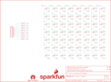

Contents
========

* [PRS13795 > Sparkfun](#prs13795--sparkfun)
	* [Schematic](#schematic)
	* [Interactive BOM](#interactive-bom)
	* [OOMP Parts](#oomp-parts)
	* [Images](#images)
	* [Tags](#tags)
  
![][im]
# PRS13795 > Sparkfun

- ID: PROJ-SPAR-13795-STAN-01
- Hex ID: PRS13795
- Name: Sparkfun
- Description: Sparkfun
- Long Link: [http://oom.lt/PROJ-SPAR-13795-STAN-01](http://oom.lt/PROJ-SPAR-13795-STAN-01)
- Short Link: [http://oom.lt/PRS13795](http://oom.lt/PRS13795)

## Schematic
  

## Interactive BOM

- Interactive BOM page: [ibom.html](https://htmlpreview.github.io/?https://github.com/oomlout/oomlout_OOMP_projects/blob/main/PROJ-SPAR-13795-STAN-01/kicad/bom/ibom.html)

## OOMP Parts
  

|OOMP Parts|
| :---: |
|D1,LEDS-0603-G-STAN-01,D1,RED,LED-RED0603,LED-0603,Assorted Red LEDs,DIO-00819,RED,|
|D2,LEDS-0603-G-STAN-01,D2,RED,LED-RED0603,LED-0603,Assorted Red LEDs,DIO-00819,RED,|
|D3,LEDS-0603-G-STAN-01,D3,RED,LED-RED0603,LED-0603,Assorted Red LEDs,DIO-00819,RED,|
|D4,LEDS-0603-G-STAN-01,D4,RED,LED-RED0603,LED-0603,Assorted Red LEDs,DIO-00819,RED,|
|D5,LEDS-0603-G-STAN-01,D5,RED,LED-RED0603,LED-0603,Assorted Red LEDs,DIO-00819,RED,|
|D6,LEDS-0603-G-STAN-01,D6,RED,LED-RED0603,LED-0603,Assorted Red LEDs,DIO-00819,RED,|
|D7,LEDS-0603-G-STAN-01,D7,RED,LED-RED0603,LED-0603,Assorted Red LEDs,DIO-00819,RED,|
|D8,LEDS-0603-G-STAN-01,D8,RED,LED-RED0603,LED-0603,Assorted Red LEDs,DIO-00819,RED,|
|D9,LEDS-0603-G-STAN-01,D9,RED,LED-RED0603,LED-0603,Assorted Red LEDs,DIO-00819,RED,|
|D10,LEDS-0603-G-STAN-01,D10,RED,LED-RED0603,LED-0603,Assorted Red LEDs,DIO-00819,RED,|
|D11,LEDS-0603-G-STAN-01,D11,RED,LED-RED0603,LED-0603,Assorted Red LEDs,DIO-00819,RED,|
|D12,LEDS-0603-G-STAN-01,D12,RED,LED-RED0603,LED-0603,Assorted Red LEDs,DIO-00819,RED,|
|D13,LEDS-0603-G-STAN-01,D13,RED,LED-RED0603,LED-0603,Assorted Red LEDs,DIO-00819,RED,|
|D14,LEDS-0603-G-STAN-01,D14,RED,LED-RED0603,LED-0603,Assorted Red LEDs,DIO-00819,RED,|
|D15,LEDS-0603-G-STAN-01,D15,RED,LED-RED0603,LED-0603,Assorted Red LEDs,DIO-00819,RED,|
|D16,LEDS-0603-G-STAN-01,D16,RED,LED-RED0603,LED-0603,Assorted Red LEDs,DIO-00819,RED,|
|D17,LEDS-0603-G-STAN-01,D17,RED,LED-RED0603,LED-0603,Assorted Red LEDs,DIO-00819,RED,|
|D18,LEDS-0603-G-STAN-01,D18,RED,LED-RED0603,LED-0603,Assorted Red LEDs,DIO-00819,RED,|
|D19,LEDS-0603-G-STAN-01,D19,RED,LED-RED0603,LED-0603,Assorted Red LEDs,DIO-00819,RED,|
|D20,LEDS-0603-G-STAN-01,D20,RED,LED-RED0603,LED-0603,Assorted Red LEDs,DIO-00819,RED,|
|D21,LEDS-0603-G-STAN-01,D21,RED,LED-RED0603,LED-0603,Assorted Red LEDs,DIO-00819,RED,|
|D22,LEDS-0603-G-STAN-01,D22,RED,LED-RED0603,LED-0603,Assorted Red LEDs,DIO-00819,RED,|
|D23,LEDS-0603-G-STAN-01,D23,RED,LED-RED0603,LED-0603,Assorted Red LEDs,DIO-00819,RED,|
|D24,LEDS-0603-G-STAN-01,D24,RED,LED-RED0603,LED-0603,Assorted Red LEDs,DIO-00819,RED,|
|D25,LEDS-0603-G-STAN-01,D25,RED,LED-RED0603,LED-0603,Assorted Red LEDs,DIO-00819,RED,|
|D26,LEDS-0603-G-STAN-01,D26,RED,LED-RED0603,LED-0603,Assorted Red LEDs,DIO-00819,RED,|
|D27,LEDS-0603-G-STAN-01,D27,RED,LED-RED0603,LED-0603,Assorted Red LEDs,DIO-00819,RED,|
|D28,LEDS-0603-G-STAN-01,D28,RED,LED-RED0603,LED-0603,Assorted Red LEDs,DIO-00819,RED,|
|D29,LEDS-0603-G-STAN-01,D29,RED,LED-RED0603,LED-0603,Assorted Red LEDs,DIO-00819,RED,|
|D30,LEDS-0603-G-STAN-01,D30,RED,LED-RED0603,LED-0603,Assorted Red LEDs,DIO-00819,RED,|
|D31,LEDS-0603-G-STAN-01,D31,RED,LED-RED0603,LED-0603,Assorted Red LEDs,DIO-00819,RED,|
|D32,LEDS-0603-G-STAN-01,D32,RED,LED-RED0603,LED-0603,Assorted Red LEDs,DIO-00819,RED,|
|D33,LEDS-0603-G-STAN-01,D33,RED,LED-RED0603,LED-0603,Assorted Red LEDs,DIO-00819,RED,|
|D34,LEDS-0603-G-STAN-01,D34,RED,LED-RED0603,LED-0603,Assorted Red LEDs,DIO-00819,RED,|
|D35,LEDS-0603-G-STAN-01,D35,RED,LED-RED0603,LED-0603,Assorted Red LEDs,DIO-00819,RED,|
|D36,LEDS-0603-G-STAN-01,D36,RED,LED-RED0603,LED-0603,Assorted Red LEDs,DIO-00819,RED,|
|D37,LEDS-0603-G-STAN-01,D37,RED,LED-RED0603,LED-0603,Assorted Red LEDs,DIO-00819,RED,|
|D38,LEDS-0603-G-STAN-01,D38,RED,LED-RED0603,LED-0603,Assorted Red LEDs,DIO-00819,RED,|
|D39,LEDS-0603-G-STAN-01,D39,RED,LED-RED0603,LED-0603,Assorted Red LEDs,DIO-00819,RED,|
|D40,LEDS-0603-G-STAN-01,D40,RED,LED-RED0603,LED-0603,Assorted Red LEDs,DIO-00819,RED,|
|D41,LEDS-0603-G-STAN-01,D41,RED,LED-RED0603,LED-0603,Assorted Red LEDs,DIO-00819,RED,|
|D42,LEDS-0603-G-STAN-01,D42,RED,LED-RED0603,LED-0603,Assorted Red LEDs,DIO-00819,RED,|
|D43,LEDS-0603-G-STAN-01,D43,RED,LED-RED0603,LED-0603,Assorted Red LEDs,DIO-00819,RED,|
|D44,LEDS-0603-G-STAN-01,D44,RED,LED-RED0603,LED-0603,Assorted Red LEDs,DIO-00819,RED,|
|D45,LEDS-0603-G-STAN-01,D45,RED,LED-RED0603,LED-0603,Assorted Red LEDs,DIO-00819,RED,|
|D46,LEDS-0603-G-STAN-01,D46,RED,LED-RED0603,LED-0603,Assorted Red LEDs,DIO-00819,RED,|
|D47,LEDS-0603-G-STAN-01,D47,RED,LED-RED0603,LED-0603,Assorted Red LEDs,DIO-00819,RED,|
|D48,LEDS-0603-G-STAN-01,D48,RED,LED-RED0603,LED-0603,Assorted Red LEDs,DIO-00819,RED,|
|D49,LEDS-0603-G-STAN-01,D49,RED,LED-RED0603,LED-0603,Assorted Red LEDs,DIO-00819,RED,|
|D50,LEDS-0603-G-STAN-01,D50,RED,LED-RED0603,LED-0603,Assorted Red LEDs,DIO-00819,RED,|
|D51,LEDS-0603-G-STAN-01,D51,RED,LED-RED0603,LED-0603,Assorted Red LEDs,DIO-00819,RED,|
|D52,LEDS-0603-G-STAN-01,D52,RED,LED-RED0603,LED-0603,Assorted Red LEDs,DIO-00819,RED,|
|D53,LEDS-0603-G-STAN-01,D53,RED,LED-RED0603,LED-0603,Assorted Red LEDs,DIO-00819,RED,|
|D54,LEDS-0603-G-STAN-01,D54,RED,LED-RED0603,LED-0603,Assorted Red LEDs,DIO-00819,RED,|
|D55,LEDS-0603-G-STAN-01,D55,RED,LED-RED0603,LED-0603,Assorted Red LEDs,DIO-00819,RED,|
|D56,LEDS-0603-G-STAN-01,D56,RED,LED-RED0603,LED-0603,Assorted Red LEDs,DIO-00819,RED,|
|JP1,HEAD-I01-X-PI08-01,FID1,FIDUCIAL1X2,FIDUCIAL1X2,FIDUCIAL-1X2,Fiducial Alignment Points,,,|
|R1,RESE-0603-X-O81-01,FID2,FIDUCIAL1X2,FIDUCIAL1X2,FIDUCIAL-1X2,Fiducial Alignment Points,,,|
|R2,RESE-0603-X-O81-01,FRAME1,FRAME-LETTER,FRAME-LETTER,CREATIVE_COMMONS,Schematic Frame,,,|
|R3,RESE-0603-X-O81-01,JP1,,M08LOCK_NO_SILK,1X08_LOCK_NO_SILK,Header 8,,,|
|R4,RESE-0603-X-O81-01,LOGO2,OSHW-LOGOS,OSHW-LOGOS,OSHW-LOGO-S,Open Source Hardware Logo,,,|
|R5,RESE-0603-X-O81-01,R1,82,82OHM-1/10W-1%(0603)SMD,0603-RES,RES-12311,RES-12311,820K,|
|R6,RESE-0603-X-O81-01,R2,82,82OHM-1/10W-1%(0603)SMD,0603-RES,RES-12311,RES-12311,820K,|
|R7,RESE-0603-X-O81-01,R3,82,82OHM-1/10W-1%(0603)SMD,0603-RES,RES-12311,RES-12311,820K,|
|R8,RESE-0603-X-O81-01,R4,82,82OHM-1/10W-1%(0603)SMD,0603-RES,RES-12311,RES-12311,820K,|

## Images
  
  

|kicadPcb3d|kicadPcb3dFront|kicadPcb3dBack|eagleImage|eagleSchemImage|
| :---: | :---: | :---: | :---: | :---: |
||||||

## Tags

- hexID: PRS13795
- oompType: PROJ
- oompSize: SPAR
- oompColor: 13795
- oompDesc: STAN
- oompIndex: 01
- oompName: LED Array 8x7
- sources: All source files from https://github.com/sparkfun/LED_Array_8x7 (source licence details in srcLicense.md)
- linkBuyPage: https://www.sparkfun.com/products/13795
- oompID: PROJ-SPAR-13795-STAN-01
- oompParts: D1,LEDS-0603-G-STAN-01
- oompParts: D2,LEDS-0603-G-STAN-01
- oompParts: D3,LEDS-0603-G-STAN-01
- oompParts: D4,LEDS-0603-G-STAN-01
- oompParts: D5,LEDS-0603-G-STAN-01
- oompParts: D6,LEDS-0603-G-STAN-01
- oompParts: D7,LEDS-0603-G-STAN-01
- oompParts: D8,LEDS-0603-G-STAN-01
- oompParts: D9,LEDS-0603-G-STAN-01
- oompParts: D10,LEDS-0603-G-STAN-01
- oompParts: D11,LEDS-0603-G-STAN-01
- oompParts: D12,LEDS-0603-G-STAN-01
- oompParts: D13,LEDS-0603-G-STAN-01
- oompParts: D14,LEDS-0603-G-STAN-01
- oompParts: D15,LEDS-0603-G-STAN-01
- oompParts: D16,LEDS-0603-G-STAN-01
- oompParts: D17,LEDS-0603-G-STAN-01
- oompParts: D18,LEDS-0603-G-STAN-01
- oompParts: D19,LEDS-0603-G-STAN-01
- oompParts: D20,LEDS-0603-G-STAN-01
- oompParts: D21,LEDS-0603-G-STAN-01
- oompParts: D22,LEDS-0603-G-STAN-01
- oompParts: D23,LEDS-0603-G-STAN-01
- oompParts: D24,LEDS-0603-G-STAN-01
- oompParts: D25,LEDS-0603-G-STAN-01
- oompParts: D26,LEDS-0603-G-STAN-01
- oompParts: D27,LEDS-0603-G-STAN-01
- oompParts: D28,LEDS-0603-G-STAN-01
- oompParts: D29,LEDS-0603-G-STAN-01
- oompParts: D30,LEDS-0603-G-STAN-01
- oompParts: D31,LEDS-0603-G-STAN-01
- oompParts: D32,LEDS-0603-G-STAN-01
- oompParts: D33,LEDS-0603-G-STAN-01
- oompParts: D34,LEDS-0603-G-STAN-01
- oompParts: D35,LEDS-0603-G-STAN-01
- oompParts: D36,LEDS-0603-G-STAN-01
- oompParts: D37,LEDS-0603-G-STAN-01
- oompParts: D38,LEDS-0603-G-STAN-01
- oompParts: D39,LEDS-0603-G-STAN-01
- oompParts: D40,LEDS-0603-G-STAN-01
- oompParts: D41,LEDS-0603-G-STAN-01
- oompParts: D42,LEDS-0603-G-STAN-01
- oompParts: D43,LEDS-0603-G-STAN-01
- oompParts: D44,LEDS-0603-G-STAN-01
- oompParts: D45,LEDS-0603-G-STAN-01
- oompParts: D46,LEDS-0603-G-STAN-01
- oompParts: D47,LEDS-0603-G-STAN-01
- oompParts: D48,LEDS-0603-G-STAN-01
- oompParts: D49,LEDS-0603-G-STAN-01
- oompParts: D50,LEDS-0603-G-STAN-01
- oompParts: D51,LEDS-0603-G-STAN-01
- oompParts: D52,LEDS-0603-G-STAN-01
- oompParts: D53,LEDS-0603-G-STAN-01
- oompParts: D54,LEDS-0603-G-STAN-01
- oompParts: D55,LEDS-0603-G-STAN-01
- oompParts: D56,LEDS-0603-G-STAN-01
- oompParts: JP1,HEAD-I01-X-PI08-01
- oompParts: R1,RESE-0603-X-O81-01
- oompParts: R2,RESE-0603-X-O81-01
- oompParts: R3,RESE-0603-X-O81-01
- oompParts: R4,RESE-0603-X-O81-01
- oompParts: R5,RESE-0603-X-O81-01
- oompParts: R6,RESE-0603-X-O81-01
- oompParts: R7,RESE-0603-X-O81-01
- oompParts: R8,RESE-0603-X-O81-01
- rawParts: D1,RED,LED-RED0603,LED-0603,Assorted Red LEDs,DIO-00819,RED,
- rawParts: D2,RED,LED-RED0603,LED-0603,Assorted Red LEDs,DIO-00819,RED,
- rawParts: D3,RED,LED-RED0603,LED-0603,Assorted Red LEDs,DIO-00819,RED,
- rawParts: D4,RED,LED-RED0603,LED-0603,Assorted Red LEDs,DIO-00819,RED,
- rawParts: D5,RED,LED-RED0603,LED-0603,Assorted Red LEDs,DIO-00819,RED,
- rawParts: D6,RED,LED-RED0603,LED-0603,Assorted Red LEDs,DIO-00819,RED,
- rawParts: D7,RED,LED-RED0603,LED-0603,Assorted Red LEDs,DIO-00819,RED,
- rawParts: D8,RED,LED-RED0603,LED-0603,Assorted Red LEDs,DIO-00819,RED,
- rawParts: D9,RED,LED-RED0603,LED-0603,Assorted Red LEDs,DIO-00819,RED,
- rawParts: D10,RED,LED-RED0603,LED-0603,Assorted Red LEDs,DIO-00819,RED,
- rawParts: D11,RED,LED-RED0603,LED-0603,Assorted Red LEDs,DIO-00819,RED,
- rawParts: D12,RED,LED-RED0603,LED-0603,Assorted Red LEDs,DIO-00819,RED,
- rawParts: D13,RED,LED-RED0603,LED-0603,Assorted Red LEDs,DIO-00819,RED,
- rawParts: D14,RED,LED-RED0603,LED-0603,Assorted Red LEDs,DIO-00819,RED,
- rawParts: D15,RED,LED-RED0603,LED-0603,Assorted Red LEDs,DIO-00819,RED,
- rawParts: D16,RED,LED-RED0603,LED-0603,Assorted Red LEDs,DIO-00819,RED,
- rawParts: D17,RED,LED-RED0603,LED-0603,Assorted Red LEDs,DIO-00819,RED,
- rawParts: D18,RED,LED-RED0603,LED-0603,Assorted Red LEDs,DIO-00819,RED,
- rawParts: D19,RED,LED-RED0603,LED-0603,Assorted Red LEDs,DIO-00819,RED,
- rawParts: D20,RED,LED-RED0603,LED-0603,Assorted Red LEDs,DIO-00819,RED,
- rawParts: D21,RED,LED-RED0603,LED-0603,Assorted Red LEDs,DIO-00819,RED,
- rawParts: D22,RED,LED-RED0603,LED-0603,Assorted Red LEDs,DIO-00819,RED,
- rawParts: D23,RED,LED-RED0603,LED-0603,Assorted Red LEDs,DIO-00819,RED,
- rawParts: D24,RED,LED-RED0603,LED-0603,Assorted Red LEDs,DIO-00819,RED,
- rawParts: D25,RED,LED-RED0603,LED-0603,Assorted Red LEDs,DIO-00819,RED,
- rawParts: D26,RED,LED-RED0603,LED-0603,Assorted Red LEDs,DIO-00819,RED,
- rawParts: D27,RED,LED-RED0603,LED-0603,Assorted Red LEDs,DIO-00819,RED,
- rawParts: D28,RED,LED-RED0603,LED-0603,Assorted Red LEDs,DIO-00819,RED,
- rawParts: D29,RED,LED-RED0603,LED-0603,Assorted Red LEDs,DIO-00819,RED,
- rawParts: D30,RED,LED-RED0603,LED-0603,Assorted Red LEDs,DIO-00819,RED,
- rawParts: D31,RED,LED-RED0603,LED-0603,Assorted Red LEDs,DIO-00819,RED,
- rawParts: D32,RED,LED-RED0603,LED-0603,Assorted Red LEDs,DIO-00819,RED,
- rawParts: D33,RED,LED-RED0603,LED-0603,Assorted Red LEDs,DIO-00819,RED,
- rawParts: D34,RED,LED-RED0603,LED-0603,Assorted Red LEDs,DIO-00819,RED,
- rawParts: D35,RED,LED-RED0603,LED-0603,Assorted Red LEDs,DIO-00819,RED,
- rawParts: D36,RED,LED-RED0603,LED-0603,Assorted Red LEDs,DIO-00819,RED,
- rawParts: D37,RED,LED-RED0603,LED-0603,Assorted Red LEDs,DIO-00819,RED,
- rawParts: D38,RED,LED-RED0603,LED-0603,Assorted Red LEDs,DIO-00819,RED,
- rawParts: D39,RED,LED-RED0603,LED-0603,Assorted Red LEDs,DIO-00819,RED,
- rawParts: D40,RED,LED-RED0603,LED-0603,Assorted Red LEDs,DIO-00819,RED,
- rawParts: D41,RED,LED-RED0603,LED-0603,Assorted Red LEDs,DIO-00819,RED,
- rawParts: D42,RED,LED-RED0603,LED-0603,Assorted Red LEDs,DIO-00819,RED,
- rawParts: D43,RED,LED-RED0603,LED-0603,Assorted Red LEDs,DIO-00819,RED,
- rawParts: D44,RED,LED-RED0603,LED-0603,Assorted Red LEDs,DIO-00819,RED,
- rawParts: D45,RED,LED-RED0603,LED-0603,Assorted Red LEDs,DIO-00819,RED,
- rawParts: D46,RED,LED-RED0603,LED-0603,Assorted Red LEDs,DIO-00819,RED,
- rawParts: D47,RED,LED-RED0603,LED-0603,Assorted Red LEDs,DIO-00819,RED,
- rawParts: D48,RED,LED-RED0603,LED-0603,Assorted Red LEDs,DIO-00819,RED,
- rawParts: D49,RED,LED-RED0603,LED-0603,Assorted Red LEDs,DIO-00819,RED,
- rawParts: D50,RED,LED-RED0603,LED-0603,Assorted Red LEDs,DIO-00819,RED,
- rawParts: D51,RED,LED-RED0603,LED-0603,Assorted Red LEDs,DIO-00819,RED,
- rawParts: D52,RED,LED-RED0603,LED-0603,Assorted Red LEDs,DIO-00819,RED,
- rawParts: D53,RED,LED-RED0603,LED-0603,Assorted Red LEDs,DIO-00819,RED,
- rawParts: D54,RED,LED-RED0603,LED-0603,Assorted Red LEDs,DIO-00819,RED,
- rawParts: D55,RED,LED-RED0603,LED-0603,Assorted Red LEDs,DIO-00819,RED,
- rawParts: D56,RED,LED-RED0603,LED-0603,Assorted Red LEDs,DIO-00819,RED,
- rawParts: FID1,FIDUCIAL1X2,FIDUCIAL1X2,FIDUCIAL-1X2,Fiducial Alignment Points,,,
- rawParts: FID2,FIDUCIAL1X2,FIDUCIAL1X2,FIDUCIAL-1X2,Fiducial Alignment Points,,,
- rawParts: FRAME1,FRAME-LETTER,FRAME-LETTER,CREATIVE_COMMONS,Schematic Frame,,,
- rawParts: JP1,,M08LOCK_NO_SILK,1X08_LOCK_NO_SILK,Header 8,,,
- rawParts: LOGO2,OSHW-LOGOS,OSHW-LOGOS,OSHW-LOGO-S,Open Source Hardware Logo,,,
- rawParts: R1,82,82OHM-1/10W-1%(0603)SMD,0603-RES,RES-12311,RES-12311,820K,
- rawParts: R2,82,82OHM-1/10W-1%(0603)SMD,0603-RES,RES-12311,RES-12311,820K,
- rawParts: R3,82,82OHM-1/10W-1%(0603)SMD,0603-RES,RES-12311,RES-12311,820K,
- rawParts: R4,82,82OHM-1/10W-1%(0603)SMD,0603-RES,RES-12311,RES-12311,820K,
- rawParts: R5,82,82OHM-1/10W-1%(0603)SMD,0603-RES,RES-12311,RES-12311,820K,
- rawParts: R6,82,82OHM-1/10W-1%(0603)SMD,0603-RES,RES-12311,RES-12311,820K,
- rawParts: R7,82,82OHM-1/10W-1%(0603)SMD,0603-RES,RES-12311,RES-12311,820K,
- rawParts: R8,82,82OHM-1/10W-1%(0603)SMD,0603-RES,RES-12311,RES-12311,820K,
- rawParts: STANDOFF1,STAND-OFF,STAND-OFF,STAND-OFF,#4 Stand Off,,,
- rawParts: STANDOFF2,STAND-OFF,STAND-OFF,STAND-OFF,#4 Stand Off,,,
- rawParts: U$1,SFE_LOGO_NAME_FLAME.1_INCH,SFE_LOGO_NAME_FLAME.1_INCH,SFE_LOGO_NAME_FLAME_.1,SFE Logo, name and flame,,,

[im]: kicadPcb3d_450.png
