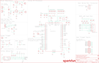

Contents
========

* [PRS13810 > Sparkfun](#prs13810--sparkfun)
	* [Schematic](#schematic)
	* [Interactive BOM](#interactive-bom)
	* [OOMP Parts](#oomp-parts)
	* [Images](#images)
	* [Tags](#tags)
  
![][im]
# PRS13810 > Sparkfun

- ID: PROJ-SPAR-13810-STAN-01
- Hex ID: PRS13810
- Name: Sparkfun
- Description: Sparkfun
- Long Link: [http://oom.lt/PROJ-SPAR-13810-STAN-01](http://oom.lt/PROJ-SPAR-13810-STAN-01)
- Short Link: [http://oom.lt/PRS13810](http://oom.lt/PRS13810)

## Schematic
  

## Interactive BOM

- Interactive BOM page: [ibom.html](https://htmlpreview.github.io/?https://github.com/oomlout/oomlout_OOMP_projects/blob/main/PROJ-SPAR-13810-STAN-01/kicad/bom/ibom.html)

## OOMP Parts
  

|OOMP Parts|
| :---: |
|C1,CAPC-0603-X-UNMATCHED-01,C1,10nF,10NF/10000PF-50V-10%(0603),0603-CAP,CAP-00867,,,,CAP-00867,10nF,|
|C2,CAPC-0603-X-UF10-01,C2,10uF,10UF-6.3V-20%(0603),0603-CAP,CAP-11015,,,,CAP-11015,10uF,|
|C3,CAPC-0603-X-NF100-V50,C3,0.1uF,0.1UF-25V(+80/-20%)(0603),0603-CAP,CAP-00810,,,,CAP-00810,0.1uF,|
|C4,CAPC-0603-X-NF100-V50,C4,0.1uF,0.1UF-25V(+80/-20%)(0603),0603-CAP,CAP-00810,,,,CAP-00810,0.1uF,|
|C5,CAPC-0603-X-UF10-01,C5,10uF,10UF-6.3V-20%(0603),0603-CAP,CAP-11015,,,,CAP-11015,10uF,|
|C6,CAPC-0603-X-UF10-01,C6,10uF,10UF-6.3V-20%(0603),0603-CAP,CAP-11015,,,,CAP-11015,10uF,|
|C7,CAPC-0603-X-UNMATCHED-01,C7,12pF,12PF-50V-5%(0603),0603-CAP,CAP-09137,,,,CAP-09137,12pF,|
|C8,CAPC-0603-X-NF100-V50,C8,0.1uF,0.1UF-25V(+80/-20%)(0603),0603-CAP,CAP-00810,,,,CAP-00810,0.1uF,|
|C9,CAPC-0603-X-UNMATCHED-01,C9,12pF,12PF-50V-5%(0603),0603-CAP,CAP-09137,,,,CAP-09137,12pF,|
|C10,CAPC-0603-X-NF100-V50,C10,0.1uF,0.1UF-25V(+80/-20%)(0603),0603-CAP,CAP-00810,,,,CAP-00810,0.1uF,|
|C11,CAPC-0603-X-UF10-01,C11,10uF,10UF-6.3V-20%(0603),0603-CAP,CAP-11015,,,,CAP-11015,10uF,|
|C12,CAPC-0603-X-NF100-V50,C12,0.1uF,0.1UF-25V(+80/-20%)(0603),0603-CAP,CAP-00810,,,,CAP-00810,0.1uF,|
|C13,CAPC-0603-X-NF100-V50,C13,0.1uF,0.1UF-25V(+80/-20%)(0603),0603-CAP,CAP-00810,,,,CAP-00810,0.1uF,|
|C14,CAPC-0603-X-UNMATCHED-01,C14,4.7uF,4.7UF-6.3V-10%(0603)0603,0603-CAP,CAP-08280,,,,CAP-08280,4.7uF,|
|C15,CAPC-0603-X-NF100-V50,C15,0.1uF,0.1UF-25V(+80/-20%)(0603),0603-CAP,CAP-00810,,,,CAP-00810,0.1uF,|
|C16,CAPC-0603-X-NF100-V50,C16,0.1uF,0.1UF-25V(+80/-20%)(0603),0603-CAP,CAP-00810,,,,CAP-00810,0.1uF,|
|C17,CAPC-0603-X-NF100-V50,C17,0.1uF,0.1UF-25V(+80/-20%)(0603),0603-CAP,CAP-00810,,,,CAP-00810,0.1uF,|
|C18,CAPC-0603-X-NF100-V50,C18,0.1uF,0.1UF-25V(+80/-20%)(0603),0603-CAP,CAP-00810,,,,CAP-00810,0.1uF,|
|C19,CAPC-0603-X-NF100-V50,C19,0.1uF,0.1UF-25V(+80/-20%)(0603),0603-CAP,CAP-00810,,,,CAP-00810,0.1uF,|
|C20,CAPC-0603-X-UNMATCHED-01,C20,10pF,10PF-50V-5%(0603),0603-CAP,CAP-11812,,,,CAP-11812,10pF,|
|C21,CAPC-0603-X-NF100-V50,C21,0.1uF,0.1UF-25V(+80/-20%)(0603),0603-CAP,CAP-00810,,,,CAP-00810,0.1uF,|
|C22,CAPC-0603-X-NF100-V50,C22,0.1uF,0.1UF-25V(+80/-20%)(0603),0603-CAP,CAP-00810,,,,CAP-00810,0.1uF,|
|C23,CAPC-0603-X-NF100-V50,C23,0.1uF,0.1UF-25V(+80/-20%)(0603),0603-CAP,CAP-00810,,,,CAP-00810,0.1uF,|
|C24,CAPC-0603-X-NF100-V50,C24,0.1uF,0.1UF-25V(+80/-20%)(0603),0603-CAP,CAP-00810,,,,CAP-00810,0.1uF,|
|C25,CAPC-0603-X-UNMATCHED-01,C25,2.2uF,2.2UF-10V-20%(0603),0603-CAP,CAP-07888,,,,CAP-07888,2.2uF,|
|C26,CAPC-0603-X-NF100-V50,C26,0.1uF,0.1UF-25V(+80/-20%)(0603),0603-CAP,CAP-00810,,,,CAP-00810,0.1uF,|
|C27,CAPC-0603-X-UF10-01,C27,10uF,10UF-6.3V-20%(0603),0603-CAP,CAP-11015,,,,CAP-11015,10uF,|
|C28,CAPC-0603-X-NF100-V50,C28,0.1uF,0.1UF-25V(+80/-20%)(0603),0603-CAP,CAP-00810,,,,CAP-00810,0.1uF,|
|C29,CAPC-0603-X-UNMATCHED-01,C29,1.0uF,1.0UF-16V-10%(0603),0603-CAP,CAP-00868,,,,CAP-00868,1.0uF,|
|C30,CAPC-0603-X-UNMATCHED-01,C30,1.0uF,1.0UF-16V-10%(0603),0603-CAP,CAP-00868,,,,CAP-00868,1.0uF,|
|C31,CAPC-0603-X-NF100-V50,C31,0.1uF,0.1UF-25V(+80/-20%)(0603),0603-CAP,CAP-00810,,,,CAP-00810,0.1uF,|
|C32,CAPC-0603-X-UNMATCHED-01,C32,1.0uF,1.0UF-16V-10%(0603),0603-CAP,CAP-00868,,,,CAP-00868,1.0uF,|
|C33,CAPC-0603-X-UNMATCHED-01,C33,1.0uF,1.0UF-16V-10%(0603),0603-CAP,CAP-00868,,,,CAP-00868,1.0uF,|
|C34,CAPC-0603-X-UNMATCHED-01,C34,1.0uF,1.0UF-16V-10%(0603),0603-CAP,CAP-00868,,,,CAP-00868,1.0uF,|
|C35,CAPC-0603-X-NF100-V50,C35,0.1uF,0.1UF-25V(+80/-20%)(0603),0603-CAP,CAP-00810,,,,CAP-00810,0.1uF,|
|C36,CAPC-0603-X-UNMATCHED-01,C36,1.0uF,1.0UF-16V-10%(0603),0603-CAP,CAP-00868,,,,CAP-00868,1.0uF,|
|C37,CAPC-0603-X-NF100-V50,C37,0.1uF,0.1UF-25V(+80/-20%)(0603),0603-CAP,CAP-00810,,,,CAP-00810,0.1uF,|
|C38,CAPC-0603-X-UNMATCHED-01,C38,1.0uF,1.0UF-16V-10%(0603),0603-CAP,CAP-00868,,,,CAP-00868,1.0uF,|
|C39,CAPC-0603-X-UNMATCHED-01,C39,1.0uF,1.0UF-16V-10%(0603),0603-CAP,CAP-00868,,,,CAP-00868,1.0uF,|
|C40,CAPC-0603-X-UNMATCHED-01,C40,1.0uF,1.0UF-16V-10%(0603),0603-CAP,CAP-00868,,,,CAP-00868,1.0uF,|
|C41,CAPC-0603-X-UNMATCHED-01,C41,1.0uF,1.0UF-16V-10%(0603),0603-CAP,CAP-00868,,,,CAP-00868,1.0uF,|
|C42,CAPC-0603-X-UNMATCHED-01,C42,1.0uF,1.0UF-16V-10%(0603),0603-CAP,CAP-00868,,,,CAP-00868,1.0uF,|
|C43,CAPC-0603-X-UNMATCHED-01,C43,1.0uF,1.0UF-16V-10%(0603),0603-CAP,CAP-00868,,,,CAP-00868,1.0uF,|
|C44,CAPC-0603-X-UNMATCHED-01,C44,1.0uF,1.0UF-16V-10%(0603),0603-CAP,CAP-00868,,,,CAP-00868,1.0uF,|
|C45,CAPC-0603-X-UNMATCHED-01,C45,1.0uF,1.0UF-16V-10%(0603),0603-CAP,CAP-00868,,,,CAP-00868,1.0uF,|
|C46,CAPC-0603-X-UNMATCHED-01,C46,1.0uF,1.0UF-16V-10%(0603),0603-CAP,CAP-00868,,,,CAP-00868,1.0uF,|
|C47,CAPC-0603-X-NF100-V50,C47,0.1uF,0.1UF-25V-5%(0603),0603-CAP,CAP-08604,,,,CAP-08604,0.1uF,|
|C48,CAPC-0603-X-NF100-V50,C48,0.1uF,0.1UF-25V-5%(0603),0603-CAP,CAP-08604,,,,CAP-08604,0.1uF,|
|C49,CAPC-0603-X-NF100-V50,C49,0.1uF,0.1UF-25V-5%(0603),0603-CAP,CAP-08604,,,,CAP-08604,0.1uF,|
|C50,CAPC-0603-X-NF100-V50,C50,0.1uF,0.1UF-25V-5%(0603),0603-CAP,CAP-08604,,,,CAP-08604,0.1uF,|
|C51,CAPC-0603-X-NF100-V50,C51,0.1uF,0.1UF-25V-5%(0603),0603-CAP,CAP-08604,,,,CAP-08604,0.1uF,|
|C52,CAPC-0603-X-NF100-V50,C52,0.1uF,0.1UF-25V-5%(0603),0603-CAP,CAP-08604,,,,CAP-08604,0.1uF,|
|C53,CAPC-0603-X-NF100-V50,C53,0.1uF,0.1UF-25V-5%(0603),0603-CAP,CAP-08604,,,,CAP-08604,0.1uF,|
|C54,CAPC-0603-X-NF100-V50,C54,0.1uF,0.1UF-25V-5%(0603),0603-CAP,CAP-08604,,,,CAP-08604,0.1uF,|
|D1,DIOD-UNMATCHED-X-UNMATCHED-01,D1,MBRA140,DIODE-SCHOTTKY-MBRA140,SMA-DIODE,Schottky diodes in SFEs production catalog,,,,DIO-08053,MBRA140,|
|D2,LEDS-0603-G-STAN-01,D2,BLUE,LED-BLUE0603,LED-0603,Blue LEDs for production use,,,,DIO-08575,BLUE,|
|D3,DIOD-UNMATCHED-X-UNMATCHED-01,D3,MBRA140,MBRA140,SMA-DIODE,40V, 1A Schottky rectifier,,,,DIO-08053,,|
|FB1,UNMATCHED-0603-X-UNMATCHED-01,FB1,470,INDUCTOR0603,0603,Inductors,,,,NDUC-12579,,|
|FB2,UNMATCHED-0603-X-UNMATCHED-01,FB2,470,INDUCTOR0603,0603,Inductors,,,,NDUC-12579,,|
|FB3,UNMATCHED-0603-X-UNMATCHED-01,FB3,470,INDUCTOR0603,0603,Inductors,,,,NDUC-12579,,|
|J1,UNMATCHED-UNMATCHED-X-UNMATCHED-01,FD1,FIDUCIALUFIDUCIAL,FIDUCIALUFIDUCIAL,MICRO-FIDUCIAL,Fiducial Alignment Points,,,,,,|
|J2,UNMATCHED-UNMATCHED-X-UNMATCHED-01,FD2,FIDUCIALUFIDUCIAL,FIDUCIALUFIDUCIAL,MICRO-FIDUCIAL,Fiducial Alignment Points,,,,,,|
|J3,UNMATCHED-UNMATCHED-X-UNMATCHED-01,FRAME1,FRAME-LEDGER,FRAME-LEDGER,CREATIVE_COMMONS,Schematic Frame,,,,,,|
|J4,UNMATCHED-UNMATCHED-X-UNMATCHED-01,FRAME2,FRAME-LEDGER,FRAME-LEDGER,CREATIVE_COMMONS,Schematic Frame,,,,,,|
|J5,UNMATCHED-UNMATCHED-X-UNMATCHED-01,H1,STAND-OFF,STAND-OFF,STAND-OFF,#4 Stand Off,,,,,,|
|J6,UNMATCHED-UNMATCHED-X-UNMATCHED-01,H2,STAND-OFF,STAND-OFF,STAND-OFF,#4 Stand Off,,,,,,|
|J7,UNMATCHED-UNMATCHED-X-UNMATCHED-01,H3,STAND-OFF,STAND-OFF,STAND-OFF,#4 Stand Off,,,,,,|
|J8,UNMATCHED-UNMATCHED-X-UNMATCHED-01,H4,STAND-OFF,STAND-OFF,STAND-OFF,#4 Stand Off,,,,,,|
|J9,UNMATCHED-UNMATCHED-X-UNMATCHED-01,J1,VDC-IN,M02PTH,1X02,Standard 2-pin 0.1 header. Use with,,,,,,|
|J10,UNMATCHED-UNMATCHED-X-UNMATCHED-01,J2,GND-IN,M02PTH,1X02,Standard 2-pin 0.1 header. Use with,,,,,,|
|J11,UNMATCHED-UNMATCHED-X-UNMATCHED-01,J3,DEBUG,M01PTH_NO_SILK_YES_STOP,1X01_NO_SILK,Header 1,,,,,,|
|J12,UNMATCHED-UNMATCHED-X-UNMATCHED-01,J4,USB-MICROB,USB-MICROB,USB-B-MICRO-SMD_V03,,,,,CONN-11752,,|
|J13,UNMATCHED-UNMATCHED-X-UNMATCHED-01,J5,CORTEX_DEBUGPTH,CORTEX_DEBUGPTH,2X5-PTH-1.27MM,Cortex Debug Connector,,,,,,|
|J14,UNMATCHED-UNMATCHED-X-UNMATCHED-01,J6,3.3VA,M01PTH_NO_SILK_YES_STOP,1X01_NO_SILK,Header 1,,,,,,|
|J15,UNMATCHED-UNMATCHED-X-UNMATCHED-01,J7,3.3V,M01PTH_NO_SILK_YES_STOP,1X01_NO_SILK,Header 1,,,,,,|
|L1,UNMATCHED-0805-X-UNMATCHED-01,J8,PLAYING,M01PTH_NO_SILK_YES_STOP,1X01_NO_SILK,Header 1,,,,,,|
|Q1,UNMATCHED-SO23-X-UNMATCHED-01,J9,FTDI_DEVICE,FTDI_DEVICE,FTDI_DEVICE_SIDE,Connector which mates to FTDI basic or FTDI cable.,,,,,,|
|R1,RESE-0603-X-O31-01,J10,TRIG2,M08X2,2X8,.1 headers, two rows of 8 each,,,,,,|
|R2,RESE-0603-X-O105-01,J11,TRIG1,M08X2,2X8,.1 headers, two rows of 8 each,,,,,,|
|R3,RESE-0603-X-O103-01,J12,USD-SDIO-SOCKET,USD-SDIO-SOCKET,MICRO-SD-SOCKET-SDIO,microSD Socket,,,,CONN-07820,,|
|R4,RESE-0603-X-O153-01,J13,GND,M01PTH_NO_SILK_YES_STOP,1X01_NO_SILK,Header 1,,,,,,|
|R5,RESE-0603-X-O223-01,J14,AUDIO I/O,M10X2,2X10,This was SPECIALLY designed to be used with our Graphic LCD Backpack.  Be sure you want to use this!  It is not only staggered on each line of header holes, but IT IS ALSO offset of the center point of the top and bottom lines by 5 mil.  This causes the headers to lock into place on the standard footprint on the LCD screen.  The extra squares on the tdocu layer are there simply to reference other pins (if you were to actually populate a longer header than ten long - this is what we do with the backpacks).,,,,,,|
|R6,RESE-0603-X-O1003-01,J15,MIDI,M05NO_SILK,1X05_NO_SILK,Header 5,,,,,,|
|R7,RESE-0603-X-O391-01,JP1,JUMPER-PAD-2-NC_BY_TRACENO_SILK,JUMPER-PAD-2-NC_BY_TRACENO_SILK,PAD-JUMPER-2-NC_BY_TRACE_NO_SILK,,,,,,,|
|R8,RESE-0603-X-O391-01,JP2,JUMPER-PAD-2-NC_BY_TRACENO_SILK,JUMPER-PAD-2-NC_BY_TRACENO_SILK,PAD-JUMPER-2-NC_BY_TRACE_NO_SILK,,,,,,,|
|R9,RESE-0603-X-O1003-01,JP3,JUMPER-PAD-2-NC_BY_TRACENO_SILK,JUMPER-PAD-2-NC_BY_TRACENO_SILK,PAD-JUMPER-2-NC_BY_TRACE_NO_SILK,,,,,,,|
|R10,RESE-0603-X-O1003-01,L1,10uH,INDUCTOR0805,0805,Inductors,,,,NDUC-13231,,|
|R11,RESE-0603-X-O241-01,LOGO1,SFE_LOGO_NAME.2_INCH,SFE_LOGO_NAME.2_INCH,SFE_LOGO_NAME_.2,SFE Logo, name only,,,,,,|
|R12,RESE-0603-X-O241-01,Q1,2.5A/30V,MOSFET-PCHANNELDMG2307L,SOT23-3,Generic PMOSFET,,,,TRANS-11308,2.5A/30V,|
|R13,RESE-0603-X-O331-01,R1,33,33OHM1/10W1%(0603),0603-RES,RES-08270,,,,RES-08270,33,|
|R14,RESE-0603-X-O472-01,R2,1M,1MOHM-1/10W-1%(0603),0603-RES,RES-07868,,,,RES-07868,1M,|
|R15,RESE-0603-X-O472-01,R3,10K,10KOHM-1/10W-1%(0603)0603,0603-RES,RES-00824,,,,RES-00824,10K,|
|R16,RESE-0603-X-UNMATCHED-01,R4,15K,15KOHM1/10W1%(0603)0603,0603-RES,RES-07854,,,,RES-07854,15K,|
|R17,RESE-0603-X-UNMATCHED-01,R5,22K,22KOHM1/10W1%(0603),0603-RES,RES-07853,,,,RES-07853,22K,|
|R18,RESE-0603-X-O103-01,R6,100k,100KOHM-1/10W-1%(0603),0603-RES,RES-07828,,,,RES-07828,100k,|
|R19,RESE-0603-X-O1003-01,R7,390,390OHM1/10W1%(0603),0603-RES,RES-07864,,,,RES-07864,390,|
|R20,RESE-0603-X-O1003-01,R8,390,390OHM1/10W1%(0603),0603-RES,RES-07864,,,,RES-07864,390,|
|R21,RESE-0603-X-O1003-01,R9,100k,100KOHM-1/10W-1%(0603),0603-RES,RES-07828,,,,RES-07828,100k,|
|R22,RESE-0603-X-O1003-01,R10,100k,100KOHM-1/10W-1%(0603),0603-RES,RES-07828,,,,RES-07828,100k,|
|R23,RESE-0603-X-O103-01,R11,240,240OHM1/10W1%(0603),0603-RES,RES-07849,,,,RES-07849,240,|
|R24,RESE-0603-X-O101-01,R12,240,240OHM1/10W1%(0603),0603-RES,RES-07849,,,,RES-07849,240,|
|R25,RESE-0603-X-O101-01,R13,330,330OHM1/10W1%(0603),0603-RES,RES-00818,,,,RES-00818,330,|
|R26,RESE-0603-X-O101-01,R14,4.7K,4.7KOHM-1/10W-1%(0603),0603-RES,RES-07857,,,,RES-07857,4.7K,|
|R27,RESE-0603-X-O101-01,R15,4.7K,4.7KOHM-1/10W-1%(0603),0603-RES,RES-07857,,,,RES-07857,4.7K,|
|R28,RESE-0603-X-O101-01,R16,2.2,2.2OHM-1/10W-5%(0603),0603-RES,RES-07823,,,,RES-07823,2.2,|
|R29,RESE-0603-X-O1003-01,R17,5.62k,5.62KOHM1/10W1%(0603),0603-RES,RES-09823,,,,RES-09823,5.62k,|
|R30,RESE-0603-X-O1003-01,R18,10K,10KOHM-1/10W-1%(0603)0603,0603-RES,RES-00824,,,,RES-00824,10K,|
|R31,RESE-0603-X-O1003-01,R19,100k,100KOHM-1/10W-1%(0603),0603-RES,RES-07828,,,,RES-07828,100k,|
|R32,RESE-0603-X-O1003-01,R20,100k,100KOHM-1/10W-1%(0603),0603-RES,RES-07828,,,,RES-07828,100k,|
|R33,RESE-0603-X-O1003-01,R21,100k,100KOHM-1/10W-1%(0603),0603-RES,RES-07828,,,,RES-07828,100k,|
|R34,RESE-0603-X-O1003-01,R22,100k,100KOHM-1/10W-1%(0603),0603-RES,RES-07828,,,,RES-07828,100k,|
|R35,RESE-0603-X-O1003-01,R23,10K,10KOHM-1/10W-1%(0603)0603,0603-RES,RES-00824,,,,RES-00824,10K,|
|R36,RESE-0603-X-O1003-01,R24,100,100OHM-1/10W-1%(0603),0603-RES,RES-07863,,,,RES-07863,100,|
|R37,RESE-0603-X-O11-01,R25,100,100OHM-1/10W-1%(0603),0603-RES,RES-07863,,,,RES-07863,100,|
|R38,RESE-0603-X-O11-01,R26,100,100OHM-1/10W-1%(0603),0603-RES,RES-07863,,,,RES-07863,100,|
|R39,RESE-0603-X-O11-01,R27,100,100OHM-1/10W-1%(0603),0603-RES,RES-07863,,,,RES-07863,100,|
|R40,RESE-0603-X-O11-01,R28,100,100OHM-1/10W-1%(0603),0603-RES,RES-07863,,,,RES-07863,100,|
|R41,RESE-0603-X-O11-01,R29,100k,100KOHM-1/10W-1%(0603),0603-RES,RES-07828,,,,RES-07828,100k,|
|R42,RESE-0603-X-O11-01,R30,100k,100KOHM-1/10W-1%(0603),0603-RES,RES-07828,,,,RES-07828,100k,|
|R43,RESE-0603-X-O11-01,R31,100k,100KOHM-1/10W-1%(0603),0603-RES,RES-07828,,,,RES-07828,100k,|
|R44,RESE-0603-X-O11-01,R32,100k,100KOHM-1/10W-1%(0603),0603-RES,RES-07828,,,,RES-07828,100k,|
|R45,RESE-0603-X-O221-01,R33,100k,100KOHM-1/10W-1%(0603),0603-RES,RES-07828,,,,RES-07828,100k,|
|R46,RESE-0603-X-O221-01,R34,100k,100KOHM-1/10W-1%(0603),0603-RES,RES-07828,,,,RES-07828,100k,|
|R47,RESE-0603-X-O221-01,R35,100k,100KOHM-1/10W-1%(0603),0603-RES,RES-07828,,,,RES-07828,100k,|
|R48,RESE-0603-X-O221-01,R36,100k,100KOHM-1/10W-1%(0603),0603-RES,RES-07828,,,,RES-07828,100k,|
|S1,UNMATCHED-UNMATCHED-X-UNMATCHED-01,R37,10,10OHM-1/10W-1%(0603)SMD,0603-RES,RES-12581,,,,RES-12581,10,|
|S2,UNMATCHED-UNMATCHED-X-UNMATCHED-01,R38,10,10OHM-1/10W-1%(0603)SMD,0603-RES,RES-12581,,,,RES-12581,10,|
|S3,UNMATCHED-UNMATCHED-X-UNMATCHED-01,R39,10,10OHM-1/10W-1%(0603)SMD,0603-RES,RES-12581,,,,RES-12581,10,|
|S4,UNMATCHED-UNMATCHED-X-UNMATCHED-01,R40,10,10OHM-1/10W-1%(0603)SMD,0603-RES,RES-12581,,,,RES-12581,10,|
|TP1,UNMATCHED-UNMATCHED-X-UNMATCHED-01,R41,10,10OHM-1/10W-1%(0603)SMD,0603-RES,RES-12581,,,,RES-12581,10,|
|TP2,UNMATCHED-UNMATCHED-X-UNMATCHED-01,R42,10,10OHM-1/10W-1%(0603)SMD,0603-RES,RES-12581,,,,RES-12581,10,|
|TP3,UNMATCHED-UNMATCHED-X-UNMATCHED-01,R43,10,10OHM-1/10W-1%(0603)SMD,0603-RES,RES-12581,,,,RES-12581,10,|
|TP4,UNMATCHED-UNMATCHED-X-UNMATCHED-01,R44,10,10OHM-1/10W-1%(0603)SMD,0603-RES,RES-12581,,,,RES-12581,10,|
|TP5,UNMATCHED-UNMATCHED-X-UNMATCHED-01,R45,220,220OHM-1/10W-1%(0603),0603-RES,RES-07861,,,,RES-07861,220,|
|TP6,UNMATCHED-UNMATCHED-X-UNMATCHED-01,R46,220,220OHM-1/10W-1%(0603),0603-RES,RES-07861,,,,RES-07861,220,|
|TP7,UNMATCHED-UNMATCHED-X-UNMATCHED-01,R47,220,220OHM-1/10W-1%(0603),0603-RES,RES-07861,,,,RES-07861,220,|
|TP8,UNMATCHED-UNMATCHED-X-UNMATCHED-01,R48,220,220OHM-1/10W-1%(0603),0603-RES,RES-07861,,,,RES-07861,220,|
|TP9,UNMATCHED-UNMATCHED-X-UNMATCHED-01,S1,Reset,SWITCH-MOMENTARY-2SMD,TACTILE-SWITCH-SMD,Various NO switches- pushbuttons, reed, etc,,,,SWCH-08247,,|
|U1,UNMATCHED-UNMATCHED-X-UNMATCHED-01,S2,DNS,SWITCH-MOMENTARY-2SIDE_EZ,TACTILE-PTH-SIDEEZ,Various NO switches- pushbuttons, reed, etc,,,,,,|
|U2,UNMATCHED-UNMATCHED-X-UNMATCHED-01,S3,User,SWITCH-MOMENTARY-2SMD,TACTILE-SWITCH-SMD,Various NO switches- pushbuttons, reed, etc,,,,SWCH-08247,,|
|U3,UNMATCHED-UNMATCHED-X-UNMATCHED-01,S4,DNS,SWITCH-MOMENTARY-2SIDE_EZ,TACTILE-PTH-SIDEEZ,Various NO switches- pushbuttons, reed, etc,,,,,,|
|U4,UNMATCHED-UNMATCHED-X-UNMATCHED-01,TP1,AIN2L,TEST-POINTTP_15TH_THRU,TP_15TH,Bare copper test points for troubleshooting or ICT,,,,,,|
|U5,UNMATCHED-SO235-X-UNMATCHED-01,TP2,AIN2R,TEST-POINTTP_15TH_THRU,TP_15TH,Bare copper test points for troubleshooting or ICT,,,,,,|
|U6,UNMATCHED-UNMATCHED-X-UNMATCHED-01,TP3,AOUT5L,TEST-POINTTP_15TH_THRU,TP_15TH,Bare copper test points for troubleshooting or ICT,,,,,,|
|Y1,UNMATCHED-UNMATCHED-X-UNMATCHED-01,TP4,AOUT5R,TEST-POINTTP_15TH_THRU,TP_15TH,Bare copper test points for troubleshooting or ICT,,,,,,|

## Images
  
  

|kicadPcb3d|kicadPcb3dFront|kicadPcb3dBack|eagleImage|eagleSchemImage|
| :---: | :---: | :---: | :---: | :---: |
||||||

## Tags

- hexID: PRS13810
- oompType: PROJ
- oompSize: SPAR
- oompColor: 13810
- oompDesc: STAN
- oompIndex: 01
- oompName: tsunami
- sources: All source files from https://github.com/sparkfun/tsunami (source licence details in srcLicense.md)
- linkBuyPage: https://www.sparkfun.com/products/13810
- oompID: PROJ-SPAR-13810-STAN-01
- oompParts: C1,CAPC-0603-X-UNMATCHED-01
- oompParts: C2,CAPC-0603-X-UF10-01
- oompParts: C3,CAPC-0603-X-NF100-V50
- oompParts: C4,CAPC-0603-X-NF100-V50
- oompParts: C5,CAPC-0603-X-UF10-01
- oompParts: C6,CAPC-0603-X-UF10-01
- oompParts: C7,CAPC-0603-X-UNMATCHED-01
- oompParts: C8,CAPC-0603-X-NF100-V50
- oompParts: C9,CAPC-0603-X-UNMATCHED-01
- oompParts: C10,CAPC-0603-X-NF100-V50
- oompParts: C11,CAPC-0603-X-UF10-01
- oompParts: C12,CAPC-0603-X-NF100-V50
- oompParts: C13,CAPC-0603-X-NF100-V50
- oompParts: C14,CAPC-0603-X-UNMATCHED-01
- oompParts: C15,CAPC-0603-X-NF100-V50
- oompParts: C16,CAPC-0603-X-NF100-V50
- oompParts: C17,CAPC-0603-X-NF100-V50
- oompParts: C18,CAPC-0603-X-NF100-V50
- oompParts: C19,CAPC-0603-X-NF100-V50
- oompParts: C20,CAPC-0603-X-UNMATCHED-01
- oompParts: C21,CAPC-0603-X-NF100-V50
- oompParts: C22,CAPC-0603-X-NF100-V50
- oompParts: C23,CAPC-0603-X-NF100-V50
- oompParts: C24,CAPC-0603-X-NF100-V50
- oompParts: C25,CAPC-0603-X-UNMATCHED-01
- oompParts: C26,CAPC-0603-X-NF100-V50
- oompParts: C27,CAPC-0603-X-UF10-01
- oompParts: C28,CAPC-0603-X-NF100-V50
- oompParts: C29,CAPC-0603-X-UNMATCHED-01
- oompParts: C30,CAPC-0603-X-UNMATCHED-01
- oompParts: C31,CAPC-0603-X-NF100-V50
- oompParts: C32,CAPC-0603-X-UNMATCHED-01
- oompParts: C33,CAPC-0603-X-UNMATCHED-01
- oompParts: C34,CAPC-0603-X-UNMATCHED-01
- oompParts: C35,CAPC-0603-X-NF100-V50
- oompParts: C36,CAPC-0603-X-UNMATCHED-01
- oompParts: C37,CAPC-0603-X-NF100-V50
- oompParts: C38,CAPC-0603-X-UNMATCHED-01
- oompParts: C39,CAPC-0603-X-UNMATCHED-01
- oompParts: C40,CAPC-0603-X-UNMATCHED-01
- oompParts: C41,CAPC-0603-X-UNMATCHED-01
- oompParts: C42,CAPC-0603-X-UNMATCHED-01
- oompParts: C43,CAPC-0603-X-UNMATCHED-01
- oompParts: C44,CAPC-0603-X-UNMATCHED-01
- oompParts: C45,CAPC-0603-X-UNMATCHED-01
- oompParts: C46,CAPC-0603-X-UNMATCHED-01
- oompParts: C47,CAPC-0603-X-NF100-V50
- oompParts: C48,CAPC-0603-X-NF100-V50
- oompParts: C49,CAPC-0603-X-NF100-V50
- oompParts: C50,CAPC-0603-X-NF100-V50
- oompParts: C51,CAPC-0603-X-NF100-V50
- oompParts: C52,CAPC-0603-X-NF100-V50
- oompParts: C53,CAPC-0603-X-NF100-V50
- oompParts: C54,CAPC-0603-X-NF100-V50
- oompParts: D1,DIOD-UNMATCHED-X-UNMATCHED-01
- oompParts: D2,LEDS-0603-G-STAN-01
- oompParts: D3,DIOD-UNMATCHED-X-UNMATCHED-01
- oompParts: FB1,UNMATCHED-0603-X-UNMATCHED-01
- oompParts: FB2,UNMATCHED-0603-X-UNMATCHED-01
- oompParts: FB3,UNMATCHED-0603-X-UNMATCHED-01
- oompParts: J1,UNMATCHED-UNMATCHED-X-UNMATCHED-01
- oompParts: J2,UNMATCHED-UNMATCHED-X-UNMATCHED-01
- oompParts: J3,UNMATCHED-UNMATCHED-X-UNMATCHED-01
- oompParts: J4,UNMATCHED-UNMATCHED-X-UNMATCHED-01
- oompParts: J5,UNMATCHED-UNMATCHED-X-UNMATCHED-01
- oompParts: J6,UNMATCHED-UNMATCHED-X-UNMATCHED-01
- oompParts: J7,UNMATCHED-UNMATCHED-X-UNMATCHED-01
- oompParts: J8,UNMATCHED-UNMATCHED-X-UNMATCHED-01
- oompParts: J9,UNMATCHED-UNMATCHED-X-UNMATCHED-01
- oompParts: J10,UNMATCHED-UNMATCHED-X-UNMATCHED-01
- oompParts: J11,UNMATCHED-UNMATCHED-X-UNMATCHED-01
- oompParts: J12,UNMATCHED-UNMATCHED-X-UNMATCHED-01
- oompParts: J13,UNMATCHED-UNMATCHED-X-UNMATCHED-01
- oompParts: J14,UNMATCHED-UNMATCHED-X-UNMATCHED-01
- oompParts: J15,UNMATCHED-UNMATCHED-X-UNMATCHED-01
- oompParts: L1,UNMATCHED-0805-X-UNMATCHED-01
- oompParts: Q1,UNMATCHED-SO23-X-UNMATCHED-01
- oompParts: R1,RESE-0603-X-O31-01
- oompParts: R2,RESE-0603-X-O105-01
- oompParts: R3,RESE-0603-X-O103-01
- oompParts: R4,RESE-0603-X-O153-01
- oompParts: R5,RESE-0603-X-O223-01
- oompParts: R6,RESE-0603-X-O1003-01
- oompParts: R7,RESE-0603-X-O391-01
- oompParts: R8,RESE-0603-X-O391-01
- oompParts: R9,RESE-0603-X-O1003-01
- oompParts: R10,RESE-0603-X-O1003-01
- oompParts: R11,RESE-0603-X-O241-01
- oompParts: R12,RESE-0603-X-O241-01
- oompParts: R13,RESE-0603-X-O331-01
- oompParts: R14,RESE-0603-X-O472-01
- oompParts: R15,RESE-0603-X-O472-01
- oompParts: R16,RESE-0603-X-UNMATCHED-01
- oompParts: R17,RESE-0603-X-UNMATCHED-01
- oompParts: R18,RESE-0603-X-O103-01
- oompParts: R19,RESE-0603-X-O1003-01
- oompParts: R20,RESE-0603-X-O1003-01
- oompParts: R21,RESE-0603-X-O1003-01
- oompParts: R22,RESE-0603-X-O1003-01
- oompParts: R23,RESE-0603-X-O103-01
- oompParts: R24,RESE-0603-X-O101-01
- oompParts: R25,RESE-0603-X-O101-01
- oompParts: R26,RESE-0603-X-O101-01
- oompParts: R27,RESE-0603-X-O101-01
- oompParts: R28,RESE-0603-X-O101-01
- oompParts: R29,RESE-0603-X-O1003-01
- oompParts: R30,RESE-0603-X-O1003-01
- oompParts: R31,RESE-0603-X-O1003-01
- oompParts: R32,RESE-0603-X-O1003-01
- oompParts: R33,RESE-0603-X-O1003-01
- oompParts: R34,RESE-0603-X-O1003-01
- oompParts: R35,RESE-0603-X-O1003-01
- oompParts: R36,RESE-0603-X-O1003-01
- oompParts: R37,RESE-0603-X-O11-01
- oompParts: R38,RESE-0603-X-O11-01
- oompParts: R39,RESE-0603-X-O11-01
- oompParts: R40,RESE-0603-X-O11-01
- oompParts: R41,RESE-0603-X-O11-01
- oompParts: R42,RESE-0603-X-O11-01
- oompParts: R43,RESE-0603-X-O11-01
- oompParts: R44,RESE-0603-X-O11-01
- oompParts: R45,RESE-0603-X-O221-01
- oompParts: R46,RESE-0603-X-O221-01
- oompParts: R47,RESE-0603-X-O221-01
- oompParts: R48,RESE-0603-X-O221-01
- oompParts: S1,UNMATCHED-UNMATCHED-X-UNMATCHED-01
- oompParts: S2,UNMATCHED-UNMATCHED-X-UNMATCHED-01
- oompParts: S3,UNMATCHED-UNMATCHED-X-UNMATCHED-01
- oompParts: S4,UNMATCHED-UNMATCHED-X-UNMATCHED-01
- oompParts: TP1,UNMATCHED-UNMATCHED-X-UNMATCHED-01
- oompParts: TP2,UNMATCHED-UNMATCHED-X-UNMATCHED-01
- oompParts: TP3,UNMATCHED-UNMATCHED-X-UNMATCHED-01
- oompParts: TP4,UNMATCHED-UNMATCHED-X-UNMATCHED-01
- oompParts: TP5,UNMATCHED-UNMATCHED-X-UNMATCHED-01
- oompParts: TP6,UNMATCHED-UNMATCHED-X-UNMATCHED-01
- oompParts: TP7,UNMATCHED-UNMATCHED-X-UNMATCHED-01
- oompParts: TP8,UNMATCHED-UNMATCHED-X-UNMATCHED-01
- oompParts: TP9,UNMATCHED-UNMATCHED-X-UNMATCHED-01
- oompParts: U1,UNMATCHED-UNMATCHED-X-UNMATCHED-01
- oompParts: U2,UNMATCHED-UNMATCHED-X-UNMATCHED-01
- oompParts: U3,UNMATCHED-UNMATCHED-X-UNMATCHED-01
- oompParts: U4,UNMATCHED-UNMATCHED-X-UNMATCHED-01
- oompParts: U5,UNMATCHED-SO235-X-UNMATCHED-01
- oompParts: U6,UNMATCHED-UNMATCHED-X-UNMATCHED-01
- oompParts: Y1,UNMATCHED-UNMATCHED-X-UNMATCHED-01
- rawParts: C1,10nF,10NF/10000PF-50V-10%(0603),0603-CAP,CAP-00867,,,,CAP-00867,10nF,
- rawParts: C2,10uF,10UF-6.3V-20%(0603),0603-CAP,CAP-11015,,,,CAP-11015,10uF,
- rawParts: C3,0.1uF,0.1UF-25V(+80/-20%)(0603),0603-CAP,CAP-00810,,,,CAP-00810,0.1uF,
- rawParts: C4,0.1uF,0.1UF-25V(+80/-20%)(0603),0603-CAP,CAP-00810,,,,CAP-00810,0.1uF,
- rawParts: C5,10uF,10UF-6.3V-20%(0603),0603-CAP,CAP-11015,,,,CAP-11015,10uF,
- rawParts: C6,10uF,10UF-6.3V-20%(0603),0603-CAP,CAP-11015,,,,CAP-11015,10uF,
- rawParts: C7,12pF,12PF-50V-5%(0603),0603-CAP,CAP-09137,,,,CAP-09137,12pF,
- rawParts: C8,0.1uF,0.1UF-25V(+80/-20%)(0603),0603-CAP,CAP-00810,,,,CAP-00810,0.1uF,
- rawParts: C9,12pF,12PF-50V-5%(0603),0603-CAP,CAP-09137,,,,CAP-09137,12pF,
- rawParts: C10,0.1uF,0.1UF-25V(+80/-20%)(0603),0603-CAP,CAP-00810,,,,CAP-00810,0.1uF,
- rawParts: C11,10uF,10UF-6.3V-20%(0603),0603-CAP,CAP-11015,,,,CAP-11015,10uF,
- rawParts: C12,0.1uF,0.1UF-25V(+80/-20%)(0603),0603-CAP,CAP-00810,,,,CAP-00810,0.1uF,
- rawParts: C13,0.1uF,0.1UF-25V(+80/-20%)(0603),0603-CAP,CAP-00810,,,,CAP-00810,0.1uF,
- rawParts: C14,4.7uF,4.7UF-6.3V-10%(0603)0603,0603-CAP,CAP-08280,,,,CAP-08280,4.7uF,
- rawParts: C15,0.1uF,0.1UF-25V(+80/-20%)(0603),0603-CAP,CAP-00810,,,,CAP-00810,0.1uF,
- rawParts: C16,0.1uF,0.1UF-25V(+80/-20%)(0603),0603-CAP,CAP-00810,,,,CAP-00810,0.1uF,
- rawParts: C17,0.1uF,0.1UF-25V(+80/-20%)(0603),0603-CAP,CAP-00810,,,,CAP-00810,0.1uF,
- rawParts: C18,0.1uF,0.1UF-25V(+80/-20%)(0603),0603-CAP,CAP-00810,,,,CAP-00810,0.1uF,
- rawParts: C19,0.1uF,0.1UF-25V(+80/-20%)(0603),0603-CAP,CAP-00810,,,,CAP-00810,0.1uF,
- rawParts: C20,10pF,10PF-50V-5%(0603),0603-CAP,CAP-11812,,,,CAP-11812,10pF,
- rawParts: C21,0.1uF,0.1UF-25V(+80/-20%)(0603),0603-CAP,CAP-00810,,,,CAP-00810,0.1uF,
- rawParts: C22,0.1uF,0.1UF-25V(+80/-20%)(0603),0603-CAP,CAP-00810,,,,CAP-00810,0.1uF,
- rawParts: C23,0.1uF,0.1UF-25V(+80/-20%)(0603),0603-CAP,CAP-00810,,,,CAP-00810,0.1uF,
- rawParts: C24,0.1uF,0.1UF-25V(+80/-20%)(0603),0603-CAP,CAP-00810,,,,CAP-00810,0.1uF,
- rawParts: C25,2.2uF,2.2UF-10V-20%(0603),0603-CAP,CAP-07888,,,,CAP-07888,2.2uF,
- rawParts: C26,0.1uF,0.1UF-25V(+80/-20%)(0603),0603-CAP,CAP-00810,,,,CAP-00810,0.1uF,
- rawParts: C27,10uF,10UF-6.3V-20%(0603),0603-CAP,CAP-11015,,,,CAP-11015,10uF,
- rawParts: C28,0.1uF,0.1UF-25V(+80/-20%)(0603),0603-CAP,CAP-00810,,,,CAP-00810,0.1uF,
- rawParts: C29,1.0uF,1.0UF-16V-10%(0603),0603-CAP,CAP-00868,,,,CAP-00868,1.0uF,
- rawParts: C30,1.0uF,1.0UF-16V-10%(0603),0603-CAP,CAP-00868,,,,CAP-00868,1.0uF,
- rawParts: C31,0.1uF,0.1UF-25V(+80/-20%)(0603),0603-CAP,CAP-00810,,,,CAP-00810,0.1uF,
- rawParts: C32,1.0uF,1.0UF-16V-10%(0603),0603-CAP,CAP-00868,,,,CAP-00868,1.0uF,
- rawParts: C33,1.0uF,1.0UF-16V-10%(0603),0603-CAP,CAP-00868,,,,CAP-00868,1.0uF,
- rawParts: C34,1.0uF,1.0UF-16V-10%(0603),0603-CAP,CAP-00868,,,,CAP-00868,1.0uF,
- rawParts: C35,0.1uF,0.1UF-25V(+80/-20%)(0603),0603-CAP,CAP-00810,,,,CAP-00810,0.1uF,
- rawParts: C36,1.0uF,1.0UF-16V-10%(0603),0603-CAP,CAP-00868,,,,CAP-00868,1.0uF,
- rawParts: C37,0.1uF,0.1UF-25V(+80/-20%)(0603),0603-CAP,CAP-00810,,,,CAP-00810,0.1uF,
- rawParts: C38,1.0uF,1.0UF-16V-10%(0603),0603-CAP,CAP-00868,,,,CAP-00868,1.0uF,
- rawParts: C39,1.0uF,1.0UF-16V-10%(0603),0603-CAP,CAP-00868,,,,CAP-00868,1.0uF,
- rawParts: C40,1.0uF,1.0UF-16V-10%(0603),0603-CAP,CAP-00868,,,,CAP-00868,1.0uF,
- rawParts: C41,1.0uF,1.0UF-16V-10%(0603),0603-CAP,CAP-00868,,,,CAP-00868,1.0uF,
- rawParts: C42,1.0uF,1.0UF-16V-10%(0603),0603-CAP,CAP-00868,,,,CAP-00868,1.0uF,
- rawParts: C43,1.0uF,1.0UF-16V-10%(0603),0603-CAP,CAP-00868,,,,CAP-00868,1.0uF,
- rawParts: C44,1.0uF,1.0UF-16V-10%(0603),0603-CAP,CAP-00868,,,,CAP-00868,1.0uF,
- rawParts: C45,1.0uF,1.0UF-16V-10%(0603),0603-CAP,CAP-00868,,,,CAP-00868,1.0uF,
- rawParts: C46,1.0uF,1.0UF-16V-10%(0603),0603-CAP,CAP-00868,,,,CAP-00868,1.0uF,
- rawParts: C47,0.1uF,0.1UF-25V-5%(0603),0603-CAP,CAP-08604,,,,CAP-08604,0.1uF,
- rawParts: C48,0.1uF,0.1UF-25V-5%(0603),0603-CAP,CAP-08604,,,,CAP-08604,0.1uF,
- rawParts: C49,0.1uF,0.1UF-25V-5%(0603),0603-CAP,CAP-08604,,,,CAP-08604,0.1uF,
- rawParts: C50,0.1uF,0.1UF-25V-5%(0603),0603-CAP,CAP-08604,,,,CAP-08604,0.1uF,
- rawParts: C51,0.1uF,0.1UF-25V-5%(0603),0603-CAP,CAP-08604,,,,CAP-08604,0.1uF,
- rawParts: C52,0.1uF,0.1UF-25V-5%(0603),0603-CAP,CAP-08604,,,,CAP-08604,0.1uF,
- rawParts: C53,0.1uF,0.1UF-25V-5%(0603),0603-CAP,CAP-08604,,,,CAP-08604,0.1uF,
- rawParts: C54,0.1uF,0.1UF-25V-5%(0603),0603-CAP,CAP-08604,,,,CAP-08604,0.1uF,
- rawParts: D1,MBRA140,DIODE-SCHOTTKY-MBRA140,SMA-DIODE,Schottky diodes in SFEs production catalog,,,,DIO-08053,MBRA140,
- rawParts: D2,BLUE,LED-BLUE0603,LED-0603,Blue LEDs for production use,,,,DIO-08575,BLUE,
- rawParts: D3,MBRA140,MBRA140,SMA-DIODE,40V, 1A Schottky rectifier,,,,DIO-08053,,
- rawParts: FB1,470,INDUCTOR0603,0603,Inductors,,,,NDUC-12579,,
- rawParts: FB2,470,INDUCTOR0603,0603,Inductors,,,,NDUC-12579,,
- rawParts: FB3,470,INDUCTOR0603,0603,Inductors,,,,NDUC-12579,,
- rawParts: FD1,FIDUCIALUFIDUCIAL,FIDUCIALUFIDUCIAL,MICRO-FIDUCIAL,Fiducial Alignment Points,,,,,,
- rawParts: FD2,FIDUCIALUFIDUCIAL,FIDUCIALUFIDUCIAL,MICRO-FIDUCIAL,Fiducial Alignment Points,,,,,,
- rawParts: FRAME1,FRAME-LEDGER,FRAME-LEDGER,CREATIVE_COMMONS,Schematic Frame,,,,,,
- rawParts: FRAME2,FRAME-LEDGER,FRAME-LEDGER,CREATIVE_COMMONS,Schematic Frame,,,,,,
- rawParts: H1,STAND-OFF,STAND-OFF,STAND-OFF,#4 Stand Off,,,,,,
- rawParts: H2,STAND-OFF,STAND-OFF,STAND-OFF,#4 Stand Off,,,,,,
- rawParts: H3,STAND-OFF,STAND-OFF,STAND-OFF,#4 Stand Off,,,,,,
- rawParts: H4,STAND-OFF,STAND-OFF,STAND-OFF,#4 Stand Off,,,,,,
- rawParts: J1,VDC-IN,M02PTH,1X02,Standard 2-pin 0.1 header. Use with,,,,,,
- rawParts: J2,GND-IN,M02PTH,1X02,Standard 2-pin 0.1 header. Use with,,,,,,
- rawParts: J3,DEBUG,M01PTH_NO_SILK_YES_STOP,1X01_NO_SILK,Header 1,,,,,,
- rawParts: J4,USB-MICROB,USB-MICROB,USB-B-MICRO-SMD_V03,,,,,CONN-11752,,
- rawParts: J5,CORTEX_DEBUGPTH,CORTEX_DEBUGPTH,2X5-PTH-1.27MM,Cortex Debug Connector,,,,,,
- rawParts: J6,3.3VA,M01PTH_NO_SILK_YES_STOP,1X01_NO_SILK,Header 1,,,,,,
- rawParts: J7,3.3V,M01PTH_NO_SILK_YES_STOP,1X01_NO_SILK,Header 1,,,,,,
- rawParts: J8,PLAYING,M01PTH_NO_SILK_YES_STOP,1X01_NO_SILK,Header 1,,,,,,
- rawParts: J9,FTDI_DEVICE,FTDI_DEVICE,FTDI_DEVICE_SIDE,Connector which mates to FTDI basic or FTDI cable.,,,,,,
- rawParts: J10,TRIG2,M08X2,2X8,.1 headers, two rows of 8 each,,,,,,
- rawParts: J11,TRIG1,M08X2,2X8,.1 headers, two rows of 8 each,,,,,,
- rawParts: J12,USD-SDIO-SOCKET,USD-SDIO-SOCKET,MICRO-SD-SOCKET-SDIO,microSD Socket,,,,CONN-07820,,
- rawParts: J13,GND,M01PTH_NO_SILK_YES_STOP,1X01_NO_SILK,Header 1,,,,,,
- rawParts: J14,AUDIO I/O,M10X2,2X10,This was SPECIALLY designed to be used with our Graphic LCD Backpack.  Be sure you want to use this!  It is not only staggered on each line of header holes, but IT IS ALSO offset of the center point of the top and bottom lines by 5 mil.  This causes the headers to lock into place on the standard footprint on the LCD screen.  The extra squares on the tdocu layer are there simply to reference other pins (if you were to actually populate a longer header than ten long - this is what we do with the backpacks).,,,,,,
- rawParts: J15,MIDI,M05NO_SILK,1X05_NO_SILK,Header 5,,,,,,
- rawParts: JP1,JUMPER-PAD-2-NC_BY_TRACENO_SILK,JUMPER-PAD-2-NC_BY_TRACENO_SILK,PAD-JUMPER-2-NC_BY_TRACE_NO_SILK,,,,,,,
- rawParts: JP2,JUMPER-PAD-2-NC_BY_TRACENO_SILK,JUMPER-PAD-2-NC_BY_TRACENO_SILK,PAD-JUMPER-2-NC_BY_TRACE_NO_SILK,,,,,,,
- rawParts: JP3,JUMPER-PAD-2-NC_BY_TRACENO_SILK,JUMPER-PAD-2-NC_BY_TRACENO_SILK,PAD-JUMPER-2-NC_BY_TRACE_NO_SILK,,,,,,,
- rawParts: L1,10uH,INDUCTOR0805,0805,Inductors,,,,NDUC-13231,,
- rawParts: LOGO1,SFE_LOGO_NAME.2_INCH,SFE_LOGO_NAME.2_INCH,SFE_LOGO_NAME_.2,SFE Logo, name only,,,,,,
- rawParts: Q1,2.5A/30V,MOSFET-PCHANNELDMG2307L,SOT23-3,Generic PMOSFET,,,,TRANS-11308,2.5A/30V,
- rawParts: R1,33,33OHM1/10W1%(0603),0603-RES,RES-08270,,,,RES-08270,33,
- rawParts: R2,1M,1MOHM-1/10W-1%(0603),0603-RES,RES-07868,,,,RES-07868,1M,
- rawParts: R3,10K,10KOHM-1/10W-1%(0603)0603,0603-RES,RES-00824,,,,RES-00824,10K,
- rawParts: R4,15K,15KOHM1/10W1%(0603)0603,0603-RES,RES-07854,,,,RES-07854,15K,
- rawParts: R5,22K,22KOHM1/10W1%(0603),0603-RES,RES-07853,,,,RES-07853,22K,
- rawParts: R6,100k,100KOHM-1/10W-1%(0603),0603-RES,RES-07828,,,,RES-07828,100k,
- rawParts: R7,390,390OHM1/10W1%(0603),0603-RES,RES-07864,,,,RES-07864,390,
- rawParts: R8,390,390OHM1/10W1%(0603),0603-RES,RES-07864,,,,RES-07864,390,
- rawParts: R9,100k,100KOHM-1/10W-1%(0603),0603-RES,RES-07828,,,,RES-07828,100k,
- rawParts: R10,100k,100KOHM-1/10W-1%(0603),0603-RES,RES-07828,,,,RES-07828,100k,
- rawParts: R11,240,240OHM1/10W1%(0603),0603-RES,RES-07849,,,,RES-07849,240,
- rawParts: R12,240,240OHM1/10W1%(0603),0603-RES,RES-07849,,,,RES-07849,240,
- rawParts: R13,330,330OHM1/10W1%(0603),0603-RES,RES-00818,,,,RES-00818,330,
- rawParts: R14,4.7K,4.7KOHM-1/10W-1%(0603),0603-RES,RES-07857,,,,RES-07857,4.7K,
- rawParts: R15,4.7K,4.7KOHM-1/10W-1%(0603),0603-RES,RES-07857,,,,RES-07857,4.7K,
- rawParts: R16,2.2,2.2OHM-1/10W-5%(0603),0603-RES,RES-07823,,,,RES-07823,2.2,
- rawParts: R17,5.62k,5.62KOHM1/10W1%(0603),0603-RES,RES-09823,,,,RES-09823,5.62k,
- rawParts: R18,10K,10KOHM-1/10W-1%(0603)0603,0603-RES,RES-00824,,,,RES-00824,10K,
- rawParts: R19,100k,100KOHM-1/10W-1%(0603),0603-RES,RES-07828,,,,RES-07828,100k,
- rawParts: R20,100k,100KOHM-1/10W-1%(0603),0603-RES,RES-07828,,,,RES-07828,100k,
- rawParts: R21,100k,100KOHM-1/10W-1%(0603),0603-RES,RES-07828,,,,RES-07828,100k,
- rawParts: R22,100k,100KOHM-1/10W-1%(0603),0603-RES,RES-07828,,,,RES-07828,100k,
- rawParts: R23,10K,10KOHM-1/10W-1%(0603)0603,0603-RES,RES-00824,,,,RES-00824,10K,
- rawParts: R24,100,100OHM-1/10W-1%(0603),0603-RES,RES-07863,,,,RES-07863,100,
- rawParts: R25,100,100OHM-1/10W-1%(0603),0603-RES,RES-07863,,,,RES-07863,100,
- rawParts: R26,100,100OHM-1/10W-1%(0603),0603-RES,RES-07863,,,,RES-07863,100,
- rawParts: R27,100,100OHM-1/10W-1%(0603),0603-RES,RES-07863,,,,RES-07863,100,
- rawParts: R28,100,100OHM-1/10W-1%(0603),0603-RES,RES-07863,,,,RES-07863,100,
- rawParts: R29,100k,100KOHM-1/10W-1%(0603),0603-RES,RES-07828,,,,RES-07828,100k,
- rawParts: R30,100k,100KOHM-1/10W-1%(0603),0603-RES,RES-07828,,,,RES-07828,100k,
- rawParts: R31,100k,100KOHM-1/10W-1%(0603),0603-RES,RES-07828,,,,RES-07828,100k,
- rawParts: R32,100k,100KOHM-1/10W-1%(0603),0603-RES,RES-07828,,,,RES-07828,100k,
- rawParts: R33,100k,100KOHM-1/10W-1%(0603),0603-RES,RES-07828,,,,RES-07828,100k,
- rawParts: R34,100k,100KOHM-1/10W-1%(0603),0603-RES,RES-07828,,,,RES-07828,100k,
- rawParts: R35,100k,100KOHM-1/10W-1%(0603),0603-RES,RES-07828,,,,RES-07828,100k,
- rawParts: R36,100k,100KOHM-1/10W-1%(0603),0603-RES,RES-07828,,,,RES-07828,100k,
- rawParts: R37,10,10OHM-1/10W-1%(0603)SMD,0603-RES,RES-12581,,,,RES-12581,10,
- rawParts: R38,10,10OHM-1/10W-1%(0603)SMD,0603-RES,RES-12581,,,,RES-12581,10,
- rawParts: R39,10,10OHM-1/10W-1%(0603)SMD,0603-RES,RES-12581,,,,RES-12581,10,
- rawParts: R40,10,10OHM-1/10W-1%(0603)SMD,0603-RES,RES-12581,,,,RES-12581,10,
- rawParts: R41,10,10OHM-1/10W-1%(0603)SMD,0603-RES,RES-12581,,,,RES-12581,10,
- rawParts: R42,10,10OHM-1/10W-1%(0603)SMD,0603-RES,RES-12581,,,,RES-12581,10,
- rawParts: R43,10,10OHM-1/10W-1%(0603)SMD,0603-RES,RES-12581,,,,RES-12581,10,
- rawParts: R44,10,10OHM-1/10W-1%(0603)SMD,0603-RES,RES-12581,,,,RES-12581,10,
- rawParts: R45,220,220OHM-1/10W-1%(0603),0603-RES,RES-07861,,,,RES-07861,220,
- rawParts: R46,220,220OHM-1/10W-1%(0603),0603-RES,RES-07861,,,,RES-07861,220,
- rawParts: R47,220,220OHM-1/10W-1%(0603),0603-RES,RES-07861,,,,RES-07861,220,
- rawParts: R48,220,220OHM-1/10W-1%(0603),0603-RES,RES-07861,,,,RES-07861,220,
- rawParts: S1,Reset,SWITCH-MOMENTARY-2SMD,TACTILE-SWITCH-SMD,Various NO switches- pushbuttons, reed, etc,,,,SWCH-08247,,
- rawParts: S2,DNS,SWITCH-MOMENTARY-2SIDE_EZ,TACTILE-PTH-SIDEEZ,Various NO switches- pushbuttons, reed, etc,,,,,,
- rawParts: S3,User,SWITCH-MOMENTARY-2SMD,TACTILE-SWITCH-SMD,Various NO switches- pushbuttons, reed, etc,,,,SWCH-08247,,
- rawParts: S4,DNS,SWITCH-MOMENTARY-2SIDE_EZ,TACTILE-PTH-SIDEEZ,Various NO switches- pushbuttons, reed, etc,,,,,,
- rawParts: TP1,AIN2L,TEST-POINTTP_15TH_THRU,TP_15TH,Bare copper test points for troubleshooting or ICT,,,,,,
- rawParts: TP2,AIN2R,TEST-POINTTP_15TH_THRU,TP_15TH,Bare copper test points for troubleshooting or ICT,,,,,,
- rawParts: TP3,AOUT5L,TEST-POINTTP_15TH_THRU,TP_15TH,Bare copper test points for troubleshooting or ICT,,,,,,
- rawParts: TP4,AOUT5R,TEST-POINTTP_15TH_THRU,TP_15TH,Bare copper test points for troubleshooting or ICT,,,,,,
- rawParts: TP5,SWDIO/TMS,TEST-POINTTP_15TH_THRU,TP_15TH,Bare copper test points for troubleshooting or ICT,,,,,,
- rawParts: TP6,SWCK/TCK,TEST-POINTTP_15TH_THRU,TP_15TH,Bare copper test points for troubleshooting or ICT,,,,,,
- rawParts: TP7,TDO,TEST-POINTTP_15TH_THRU,TP_15TH,Bare copper test points for troubleshooting or ICT,,,,,,
- rawParts: TP8,TDI,TEST-POINTTP_15TH_THRU,TP_15TH,Bare copper test points for troubleshooting or ICT,,,,,,
- rawParts: TP9,NRESET,TEST-POINTTP_15TH_THRU,TP_15TH,Bare copper test points for troubleshooting or ICT,,,,,,
- rawParts: U1,LM1117,V_REG_LM1117SOT223,SOT223,Voltage Regulator LM1117,,,,VREG-08170,,
- rawParts: U2,LM1117,V_REG_LM1117SOT223,SOT223,Voltage Regulator LM1117,,,,VREG-08170,,
- rawParts: U3,ATSAMS70N20A-AN,ATSAMS70NXXA-AN,LQFP100,,,,,IC-13238,,
- rawParts: U4,AK4618VQ,AK4618VQSFE-PACKAGE,LQFP-48,,,,,IC-13239,,
- rawParts: U5,74AHC1G125,74AHC1G125,SOT23-5,Single bus buffer gate with 3-state output,,,,IC-11920,,
- rawParts: U6,6N138M,OPTO_DARL_6N138S,8-SMD,Optoisolator, darlington pair output,,,,IC-09482,6N138M,
- rawParts: Y1,11.2896 MHz,CRYSTAL-11.2896,CRYSTAL-OSC-SMD-5X3,,887-2353-1-ND,txc,7B-11.2896MAAE-T,XTAL-13463,11.2896 MHz,

[im]: kicadPcb3d_450.png
