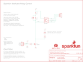

Contents
========

* [PRS13815 > Sparkfun](#prs13815--sparkfun)
	* [Schematic](#schematic)
	* [Interactive BOM](#interactive-bom)
	* [OOMP Parts](#oomp-parts)
	* [Images](#images)
	* [Tags](#tags)
  
![][im]
# PRS13815 > Sparkfun

- ID: PROJ-SPAR-13815-STAN-01
- Hex ID: PRS13815
- Name: Sparkfun
- Description: Sparkfun
- Long Link: [http://oom.lt/PROJ-SPAR-13815-STAN-01](http://oom.lt/PROJ-SPAR-13815-STAN-01)
- Short Link: [http://oom.lt/PRS13815](http://oom.lt/PRS13815)

## Schematic
  

## Interactive BOM

- Interactive BOM page: [ibom.html](https://htmlpreview.github.io/?https://github.com/oomlout/oomlout_OOMP_projects/blob/main/PROJ-SPAR-13815-STAN-01/kicad/bom/ibom.html)

## OOMP Parts
  

|OOMP Parts|
| :---: |
|D1,DIOD-UNMATCHED-X-K4148-01,D1,1N4148,DIODEKIT,DIODE-1N4148-KIT,Diode,DIO-08378,,,|
|D2,DIOD-UNMATCHED-X-UNMATCHED-01,D2,Zener,DIODE-ZENER,DIODE-1N4148-KIT,Zener Diode,DIO-13313,,Zener,|
|J1,TERS-UNMATCHED-X-UNMATCHED-01,FRAME2,FRAME-LETTER,FRAME-LETTER,CREATIVE_COMMONS,Schematic Frame,,,,|
|J2,TERS-35D-L-PI03-01,J1,,M03-SCREW-5MM,SCREWTERMINAL-5MM-3,Header 3,CONN-10134,PRT-08433,,|
|K1,UNMATCHED-UNMATCHED-X-UNMATCHED-01,J2,,M03SCREW,SCREWTERMINAL-3.5MM-3,Header 3,CONN-08288,,,|
|LED1,LEDS-UNMATCHED-G-STAN-01,JP1,JUMPER-PAD-2-NOYES_SILK,JUMPER-PAD-2-NOYES_SILK,PAD-JUMPER-2-NO_YES_SILK,,,,,|
|Q1,UNMATCHED-UNMATCHED-X-UNMATCHED-01,K1,JQX-15F,RELAYPTH5,RELAY-T90,SPDT relay (COM-00101),COMP-10736,,JQX-15F,|
|R1,RESE-UNMATCHED-X-O102-01,LED1,,LED5MM-KIT,LED5MM-KIT,LEDs,DIO-09529,,,|
|R2,RESE-UNMATCHED-X-O102-01,LOGO1,SFE_LOGO_NAME_FLAME.1_INCH,SFE_LOGO_NAME_FLAME.1_INCH,SFE_LOGO_NAME_FLAME_.1,SFE Logo, name and flame,,,,|

## Images
  
  

|kicadPcb3d|kicadPcb3dFront|kicadPcb3dBack|eagleImage|eagleSchemImage|
| :---: | :---: | :---: | :---: | :---: |
||||||

## Tags

- hexID: PRS13815
- oompType: PROJ
- oompSize: SPAR
- oompColor: 13815
- oompDesc: STAN
- oompIndex: 01
- oompName: Beefcake Relay Control Kit
- sources: All source files from https://github.com/sparkfun/Beefcake_Relay_Control_Kit (source licence details in srcLicense.md)
- linkBuyPage: https://www.sparkfun.com/products/13815
- oompID: PROJ-SPAR-13815-STAN-01
- oompParts: D1,DIOD-UNMATCHED-X-K4148-01
- oompParts: D2,DIOD-UNMATCHED-X-UNMATCHED-01
- oompParts: J1,TERS-UNMATCHED-X-UNMATCHED-01
- oompParts: J2,TERS-35D-L-PI03-01
- oompParts: K1,UNMATCHED-UNMATCHED-X-UNMATCHED-01
- oompParts: LED1,LEDS-UNMATCHED-G-STAN-01
- oompParts: Q1,UNMATCHED-UNMATCHED-X-UNMATCHED-01
- oompParts: R1,RESE-UNMATCHED-X-O102-01
- oompParts: R2,RESE-UNMATCHED-X-O102-01
- rawParts: D1,1N4148,DIODEKIT,DIODE-1N4148-KIT,Diode,DIO-08378,,,
- rawParts: D2,Zener,DIODE-ZENER,DIODE-1N4148-KIT,Zener Diode,DIO-13313,,Zener,
- rawParts: FRAME2,FRAME-LETTER,FRAME-LETTER,CREATIVE_COMMONS,Schematic Frame,,,,
- rawParts: J1,,M03-SCREW-5MM,SCREWTERMINAL-5MM-3,Header 3,CONN-10134,PRT-08433,,
- rawParts: J2,,M03SCREW,SCREWTERMINAL-3.5MM-3,Header 3,CONN-08288,,,
- rawParts: JP1,JUMPER-PAD-2-NOYES_SILK,JUMPER-PAD-2-NOYES_SILK,PAD-JUMPER-2-NO_YES_SILK,,,,,
- rawParts: K1,JQX-15F,RELAYPTH5,RELAY-T90,SPDT relay (COM-00101),COMP-10736,,JQX-15F,
- rawParts: LED1,,LED5MM-KIT,LED5MM-KIT,LEDs,DIO-09529,,,
- rawParts: LOGO1,SFE_LOGO_NAME_FLAME.1_INCH,SFE_LOGO_NAME_FLAME.1_INCH,SFE_LOGO_NAME_FLAME_.1,SFE Logo, name and flame,,,,
- rawParts: Q1,2N3904,TRANSISTOR_NPN2N3904-EZ,TO-92-EZ,Generic NPN BJT,TRANS-08447,,,
- rawParts: R1,1K,1KOHM-1/4W-1%(PTH)HORIZ-KIT,AXIAL-0.3EZ,RES-12182,RES-12182,,1K,
- rawParts: R2,1K,1KOHM-1/4W-1%(PTH)HORIZ-KIT,AXIAL-0.3EZ,RES-12182,RES-12182,,1K,
- rawParts: U$3,STAND-OFF,STAND-OFF,STAND-OFF,Stand Off,,,,
- rawParts: U$4,STAND-OFF,STAND-OFF,STAND-OFF,Stand Off,,,,
- rawParts: U$5,STAND-OFF,STAND-OFF,STAND-OFF,Stand Off,,,,
- rawParts: U$7,STAND-OFF,STAND-OFF,STAND-OFF,Stand Off,,,,
- rawParts: U$12,OSHW-LOGOS,OSHW-LOGOS,OSHW-LOGO-S,Open Source Hardware Logo This logo indicates the piece of hardware it is found on incorporates a OSHW license and/or adheres to the definition of open source hardware found here: http://freedomdefined.org/OSHW,,,,

[im]: kicadPcb3d_450.png
